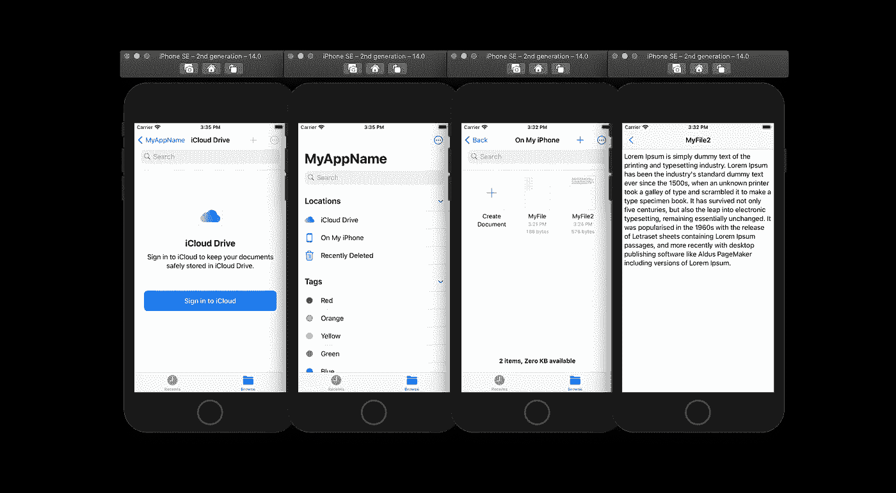
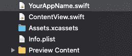
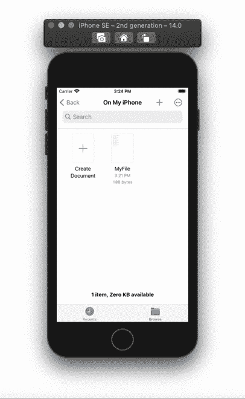

# 在 SwiftUI 中构建一个文本文档应用程序

> 原文：<https://betterprogramming.pub/build-a-text-documents-app-in-swiftui-857411f30fde>

## 使用 DocumentGroup 和 FileDocument 创建基于文本文档的应用程序

作者照片。

# 文件文档

创建一个类型为`FileDocument`的结构。您将收到一条错误消息，要求您添加协议的存根。单击“修复”添加所需数据。正如你在下面看到的，协议允许我们通过它的`read`初始化器和`write`函数来读写文档。您还将拥有`readableContentTypes`静态变量，它将帮助我们确定和限制我们希望在应用程序中允许的文件类型。

接下来我们要做的是将我们的`readableContentTypes`分配给`UTType.plainText`，并创建一个新的字符串变量来保存用户的文本输入。在初始化器中，获取文件的内容，然后尝试将其值赋给我们的文本变量。

要写入文件，使用`file wrapper`功能。在函数中，将文本变量中的字符串转换成数据。最后，创建一个初始化器来创建一个新的空文档文件。

# 内容视图

在我们的`ContentView`中，创建一个绑定`TextDocument`变量。在主体内部，添加一个`TextEditor`并传递给它`TextDocument`的文本变量。

# 文档组

当您查看项目导航器时，您会发现第二个包含您的项目/应用程序名称的 Swift 文件。

打开文件，将场景从`WindowGroup`更改为`DocumentGroup`。将上面创建的`TextDocument`传递给`DocumentGroup`，然后将`ContentView`添加到它的闭包中。

全部完成！感谢阅读。