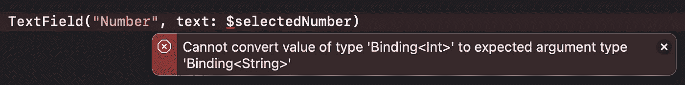
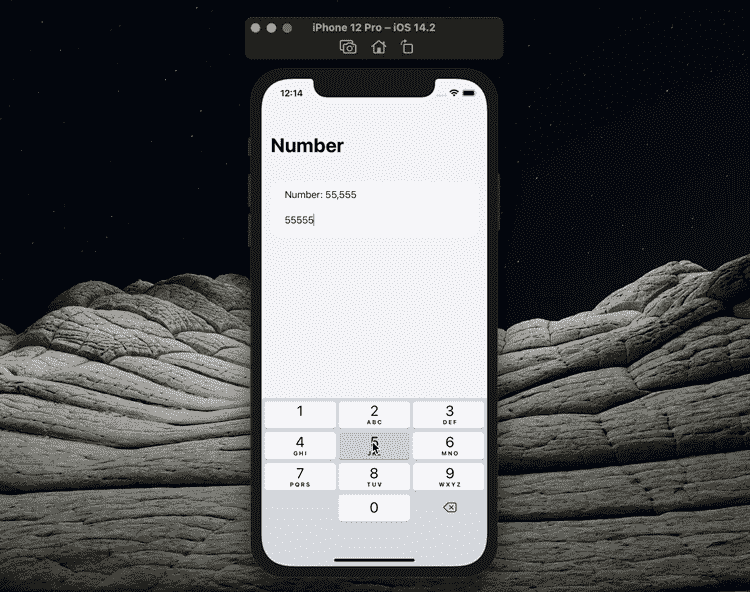

# 在 SwiftUI 中为数字构建一个文本字段

> 原文：<https://betterprogramming.pub/build-a-textfield-for-numbers-in-swiftui-21030b58a41>

## SwiftUI 没有专门用于数字的 TextField，所以让我们用 UIViewRepresentable 来构建一个


作者照片。

在 SwiftUI 中，我们通常没有选择在`TextField`对象中正确使用数字。例如，如果您试图在一个`TextField`元素上使用`Int`变量，您将在代码中看到一个错误，如下所示。



这就是为什么你必须为一个普通的`TextField`元素使用`String`变量。这很成问题，因为你必须转换这个值，因为你通常使用一个`String`值而不是一个`Int`值。幸运的是，这里有一个解决方案:`UIViewRepresentable`。

在本文中，我将向您展示如何在 SwiftUI 中使用数字值制作一个可用的`TextField`。开始吧！

# 入门指南

首先，让我们创建一个名为`NumberTextField`的 Swift 文件，并编写以下代码:

```
**struct** NumberTextField<V>: UIViewRepresentable **where** V: Numeric **&** LosslessStringConvertible {

    **typealias** UIViewType = UITextField
}
```

`UIViewRepresentable`希望我们使用`updateUIView`函数，这样我们正在创建的对象可以被更新。为此，我们定义了一个名为`value`的通用值。

```
**struct** NumberTextField<V>: UIViewRepresentable **where** V: Numeric **&** LosslessStringConvertible {

    **typealias** UIViewType = UITextField

    // MARK: - Properties
    **@Binding var** value: V

    // MARK: - Functions
    **func** updateUIView(_ editField: UITextField, context: UIViewRepresentableContext<NumberTextField>) {
        editField.text = String(value)
    }
}
```

为了让我们的`TextField`基于数字工作，我们将创建一个名为`Coordinator`的对象。这样，我们就可以在`TextField`中直接使用数字。同样，对于这个对象，我们确保`TextField`默认为零，这样当`TextField`中没有值时，我们的应用程序就不会出错。

```
**struct** NumberTextField<V>: UIViewRepresentable **where** V: Numeric **&** LosslessStringConvertible {

    **typealias** UIViewType = UITextField

    // MARK: - Properties
 **@Binding var** value: V

    // MARK: - Functions
    **func** updateUIView(_ editField: UITextField, context: UIViewRepresentableContext<NumberTextField>) {
        editField.text = String(value)
    }

    **class** Coordinator: NSObject, UITextFieldDelegate { // MARK: - Properties
        **var** value: Binding<V> // MARK: - Life Cycle
        **init**(value: Binding<V>) {
            **self**.value = value
        } // MARK: - Functions
        **func** textField(_ textField: UITextField, shouldChangeCharactersIn range: NSRange, replacementString string: String) -> Bool {
            **let** text = textField.text as NSString?
            **let** newValue = text?.replacingCharacters(in: range, with: string) **if** **let** number = V(newValue ?? "0") {
                **self**.value.wrappedValue = number **return true**
            } **else** {
                **if** **nil** == newValue || newValue!.isEmpty {
                    **self**.value.wrappedValue = 0
                } **return** **false**
            }
        } **func** textFieldDidEndEditing(_ textField: UITextField, reason: UITextField.DidEndEditingReason) {
            **if** reason == .committed {
                textField.resignFirstResponder()
            }
        }
    }
}
```

然后我们使用这个`Coordinator`对象定义`makeUIView`和`makeCoordinator`函数的输出。

```
**struct** NumberTextField<V>: UIViewRepresentable **where** V: Numeric **&** LosslessStringConvertible {

    **typealias** UIViewType = UITextField

    // MARK: - Properties
    **@Binding var** value: V

    // MARK: - Functions
    **func** updateUIView(_ editField: UITextField, context: UIViewRepresentableContext<NumberTextField>) {
        editField.text = String(value)
    }

    **func** makeUIView(context: UIViewRepresentableContext<NumberTextField>) -> UITextField {
        **let** editField = UITextField()
        editField.delegate = context.coordinator
        editField.keyboardType = .numberPad **return** editField
    }

    **func** makeCoordinator() -> NumberTextField.Coordinator {
        Coordinator(value: $value)
    }

    **class** Coordinator: NSObject, UITextFieldDelegate { // MARK: - Properties
        **var** value: Binding<V> // MARK: - Life Cycle
        **init**(value: Binding<V>) {
            **self**.value = value
        } // MARK: - Functions
        **func** textField(_ textField: UITextField, shouldChangeCharactersIn range: NSRange, replacementString string: String) -> Bool {
            **let** text = textField.text as NSString?
            **let** newValue = text?.replacingCharacters(in: range, with: string) **if let** number = V(newValue ?? "0") {
                **self**.value.wrappedValue = number **return true**
            } **else** {
                **if** **nil** == newValue || newValue!.isEmpty {
                    **self**.value.wrappedValue = 0
                } **return false**
            }
        } **func** textFieldDidEndEditing(_ textField: UITextField, reason: UITextField.DidEndEditingReason) {
            **if** reason == .committed {
                textField.resignFirstResponder()
            }
        }
    }
}
```

`NumberTextField`的对象已经准备好了。现在就用在一个 app 里吧！

让我们更改一个经典 SwiftUI 项目中的`ContentView`元素，如下所示。您将会看到，即使值`selectedNumber`是一个`Int`值，您也不会得到一个错误。

```
**struct** ContentView: View {

    // MARK: - Properties
    **@State var** selectedNumber = 0

    // MARK: - UI Elements
    **var** body: **some** View {
        NavigationView {
            Form {
                Text("Number: \(selectedNumber)")
                NumberTextField(value: $selectedNumber)
            }
            .navigationTitle("NumberTextField Example")
        }
    }
}
```

实际上，示例已经完成，但我想告诉您如何解决这个问题，因为您无法关闭单击`TextField`后打开的键盘。我们唯一需要的是延期。

```
**extension** View {

    // MARK: - Functions
    **func** hideKeyboard() {
       UIApplication.shared.sendAction(**#selector**(UIResponder.resignFirstResponder), to: **nil**, from: **nil**, for: **nil**)
    }
}
```

现在让我们在`ContentView`中使用我们在`View`扩展中编写的函数。

```
// MARK: - UI Elements
**var** body: **some** View {
    NavigationView {
        Form {
            Text("Number: \(selectedNumber)")
            NumberTextField(value: $selectedNumber)
        }
        .navigationTitle("NumberTextField Example")
    }
    .onTapGesture {
        **self**.hideKeyboard()
    }
}
```

现在当你运行应用程序时，你会注意到触摸`TextField`后出现的键盘会在你触摸屏幕的任何部分时消失。



您可以通过下面的链接访问我们在本文中创建的项目。

[](https://github.com/canbalkya/TextField-for-Numbers-in-SwiftUI) [## canbalkya/TextField-for-Numbers-in-swift ui

### 这个项目是为我的文章创建的。你可以在这里看我的文章…

github.com](https://github.com/canbalkya/TextField-for-Numbers-in-SwiftUI) 

# 结论

通过用`UIViewRepresentable`修改 SwiftUI 元素，可以用 SwiftUI 开发应用程序。本文中的例子也很好地说明了这一点。

```
**My Other Articles** -[What’s New in Swift 5.4?](/whats-new-in-swift-5-4-88949071d538)
- [Animation in SwiftUI: Get to Know Transactions](/animation-in-swiftui-get-to-know-transactions-7cd57cfb299f)
- [Get to Know SwiftUI’s GroupBox](/get-to-know-swiftuis-groupbox-c33ee71ff895)
```

如果你想见我或有关于 iOS 开发等问题。你可以在这里和我[进行一对一的会谈。](https://superpeer.com/canbalkya)