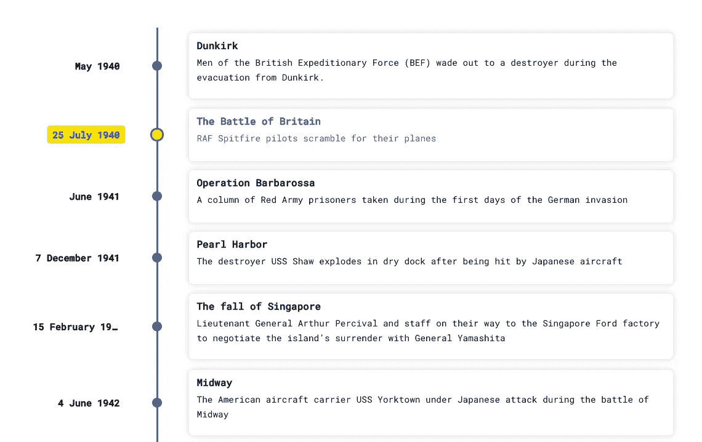
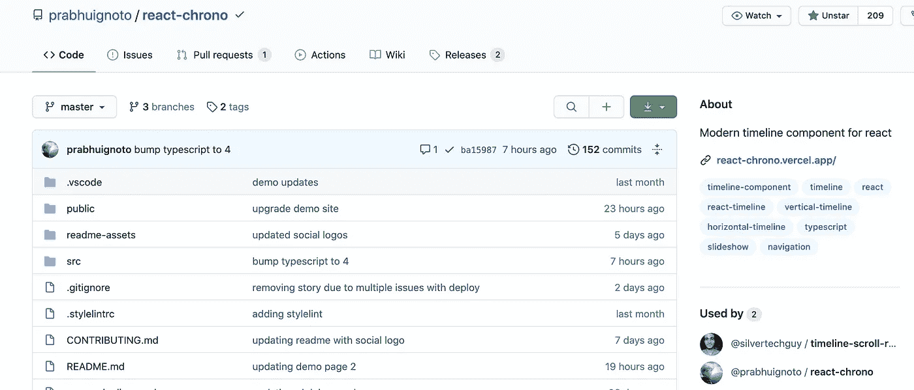
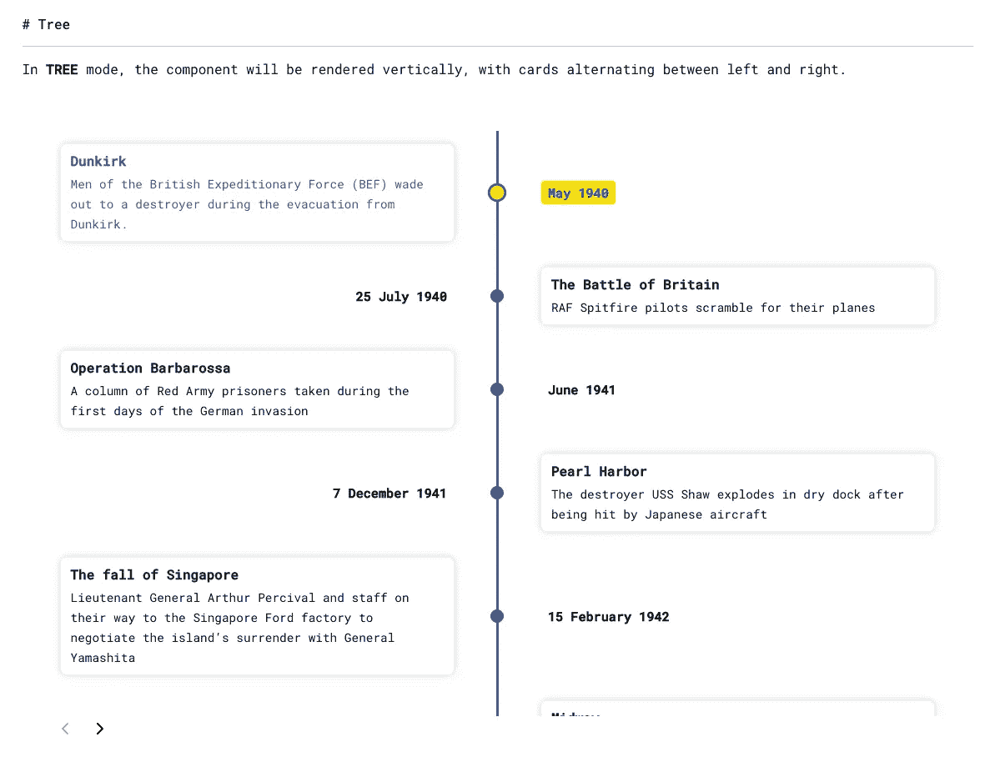
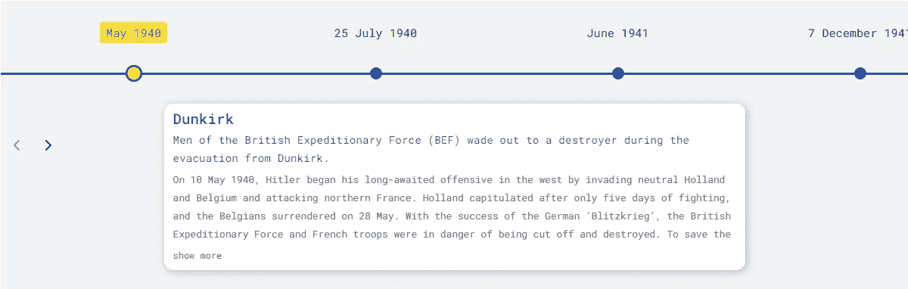
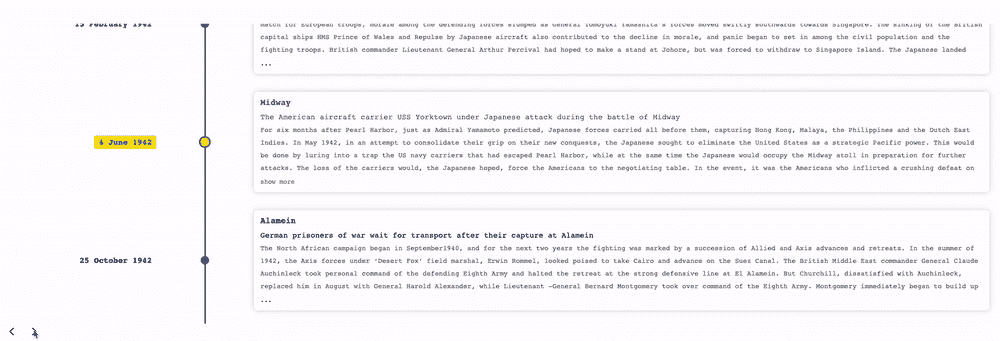

# 用 React 和 React-Chrono 构建时间轴组件

> 原文：<https://betterprogramming.pub/build-a-timeline-component-with-react-and-react-chrono-fb1b962b020e>

## 每个人都喜欢好的时间线



https://react-chrono.vercel.app/[时间轴组件](https://react-chrono.vercel.app/)时间轴组件

如果你曾经被要求建立一个按时间顺序显示事件的公司时间表，你已经找到了正确的文章。

本文向您展示了如何使用 React 和 [React-Chrono](https://github.com/prabhuignoto/react-chrono) 构建时间轴组件。

如果您不确定，时间轴组件会按时间顺序显示事件列表。这有助于显示事件，也有助于说明。

开源最大的好处是你可以通过重用社区提供的组件和包来节省时间。

你省去了麻烦和时间，而不是重新发明轮子。专注于重要的事情，构建产品或应用程序。

# React-Chrono 包括以下开箱即用的功能

这里列出了 React-Chrono 软件包可以做什么以及它所基于的关键技术。



React-Chrono Github —来源:[https://github.com/prabhuignoto/react-chrono](https://github.com/prabhuignoto/react-chrono)

*   以三种不同的模式(水平、垂直、树状)渲染时间线—向下滚动查看示例。
*   使用[树形模式](https://react-chrono.vercel.app/#tree-mode)以树形方式垂直布局时间线卡片。



在树模式中，组件将垂直呈现，卡片在左右之间交替。

*   使用[幻灯片放映](https://react-chrono.vercel.app/#slideshow)模式自动播放时间线。
*   您可以通过键盘浏览 React-Chrono 时间轴。
*   您可以使用`HOME`或`END`键快速跳转到时间线的开头或结尾。
*   React-Chrono 是使用[类型脚本](https://www.typescriptlang.org/)构建的。
*   React-Chrono 由[风格组件](https://styled-components.com/)在幕后驱动。

# 入门指南

您可以通过 npm 或纱线包管理器安装 React-Chrono 包。

```
yarn install react-chrono
```

# 使用

React-Chrono 的用法非常简单。将组件包装在有`width`和`height`的容器中。

当没有指定`mode`时，组件默认为`horizontal`模式。

使用`items`道具建立时间轴。每个时间轴项目具有以下四个属性:`title`、`contentTitle`、`contentText`和`contentDetailedText`。

# 时间轴示例

这里有一个如何使用 React-Chrono 的快速运行。

这是浏览器中呈现的内容。



# 反应-计时与反应

这里演示了如何将 React-Chrono 与 React 组件结合起来。

接下来，我们需要一些虚拟数据来展示我们的时间线。现在，您可以简单地复制下面的代码。

React-Chrono 组件的默认布局模式是水平的。

# 垂直方式



要垂直呈现时间轴，请向`mode`属性传递`vertical`值。

反应计时的垂直模式

# 这是 CodeSandBox 演示

如果你想尝试一下这个演示，请看下面的互动演示。

# 以下是你如何通过贡献使它变得更好

以下是你回报社区的方式。请记住，大多数(如果不是全部)套餐都是免费的。

如果你想提供帮助和贡献，这里有一些官方的指导方针。

1.  分叉项目—在这里找到:[prabhuignoto/react-chrono/fork](https://github.com/prabhuignoto/react-chrono/fork)。
2.  接下来，创建您的特性分支:`git checkout -b new-feature`。
3.  然后提交您的更改:`git commit -am 'Add feature'`。
4.  推到分支:`git push origin new-feature`。
5.  创建新的拉式请求。
6.  等待反馈。

# 结论

感谢阅读！希望你发现这有用，快乐的编码！