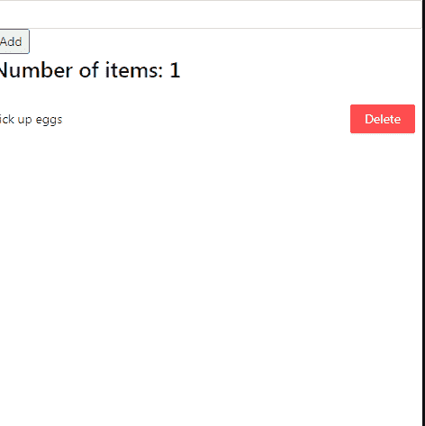
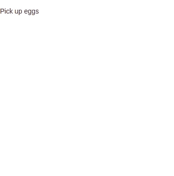
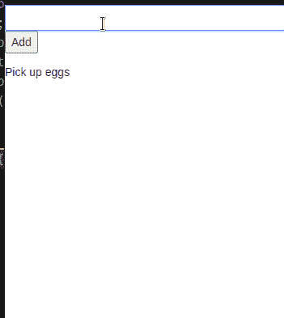
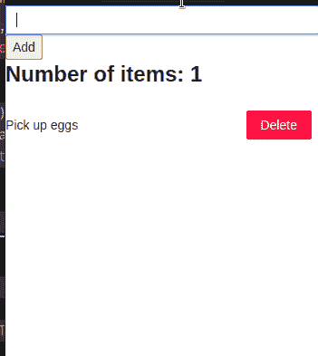

# 用简单易用的设计创建一个待办事项应用程序

> 原文：<https://betterprogramming.pub/build-a-to-do-app-in-react-with-easy-peasy-and-ant-design-2725dc7d1cf6>

## 如何将 Easy Peasy 集成到 React 应用程序中


来源:[Solen Feyissa](https://unsplash.com/@solenfeyissa)on[Unsplash](http://unsplash.com)

待办应用在我们身边随处可见。它们帮助我们记录任务，并在一天中完成任务。

在本指南中，您将学习如何使用 React 构建待办事项列表 web 应用程序。为了在多个组件之间存储和共享数据，我们将利用 [Easy Peasy 状态管理库](http://easy-peasy.dev)。此外，为了让我们的 UI 看起来更有吸引力，该项目将从 [Ant 设计库](https://ant.design/)中获取组件。

要学习简单易行的基础知识，请看这篇文章。

这将是本文的结果:



最终结果

我们开始吧！

# 入门指南

## 项目设置

要创建空白 React 存储库，请运行以下终端命令:

```
npx create-react-app todo-easy-peasy
```

## 模块安装

我们的项目需要以下依赖关系:

*   这将允许我们存储用户数据，并在应用程序的各个部分进行共享。
*   `antd`:本模块将帮助我们使用 Ant 设计包中的组件。
*   `nanoid`:给我们的物品分配 ID 字段。

要安装这些包，运行以下 bash 命令:

```
npm i easy-peasy antd nanoid
```

## 项目文件夹结构

在本节中，我们将在项目中创建一些文件夹。这将鼓励代码组织，因此，清洁。

在您的存储库中找到`src`目录。在这里，创建以下文件夹:

*   `components`:这个文件夹将保存我们的定制组件。
*   将保留我们的 Easy Peasy 商店。这是我们存储状态和动作的地方。

要创建这些目录，请运行以下 bash 指令:

```
cd src #go to directory
mkdir components store
```

完成后，您的项目应该如下所示:


项目文件夹结构

# 创建我们的 Todo 应用程序

## 待办事项组件

在本文的这一部分中，我们的计划是编写一个自定义组件来表示待办事项列表中的每一项。

在您的`components`文件夹中，创建一个名为`TodoItem.js`的文件。这里，从编写以下代码开始:

*   第 4 行:`TodoItem`模块将接受一个`todo`道具。这对应于列表中的一个项目。
*   第 8 行:显示`todo`对象的`task`字段。

## 创建我们的商店

在您的`store`文件夹中，创建一个名为`todoStore.js`的文件。这个文件将包含我们的状态变量和它们的动作。

在`store/todoStore.js`中，写下这段代码:

*   第 4 行:定义`todos`状态。
*   第 9 行:创建我们的商店并导出它。这将使我们能够将我们的商店与项目联系起来。

## 展示我们的待办事项

现在我们已经创建了我们的商店，是时候构建一个 React 组件，它将负责在列表中显示用户的商品。

在你的`components`文件夹中，创建一个名为`TodoList.js`的文件。在这里，编写以下代码块:

*   第 5 行:从我们的存储中提取`todos`状态。
*   第 9–12 行:使用`List`组件列出所有待办事项。每个列表项将通过`TodoItem`组件呈现。

完成后，我们剩下的工作就是将我们的商店与项目联系起来。为此，用以下代码替换`src/App.js`中的所有代码:

*   用`StoreProvider`标签包装我们的`TodoList`组件。`store`道具指向我们想要使用的商店。
    我们现在已经将我们的商店与这个应用程序连接起来。

这将是代码的输出:



代码的输出

## 添加待办事项

在这一节中，我们将编写一个函数，帮助用户将任务添加到待办事项列表中。

在`store/todoStore.js`中，找到您的`todoModel`对象，并添加`addTodo`属性，如下所示:

*   第 4 行:创建我们的`addTodo`动作。
*   第 5 行:使用`nanoid`模块分配新项目的`id`。
*   第 6 行:最后，将新任务追加到`todos`数组中。

接下来，进入你的`components`文件夹。在这里，创建一个名为`AddTodo.js`的文件。该组件将允许用户向商店输入数据。

在`components/AddTodo.js`中，写下这段代码:

*   第 6 行:从商店中检索`addTodo`函数。
*   第 13 行:`onSubmit`方法是这个表单的处理程序。这意味着如果用户提交表单，程序将调用`addTodo`方法。因此，这将向列表中添加一个新项目。
*   第 14–19 行:`Controller`组件允许我们捕获用户输入。

我们剩下的工作就是向 DOM 显示`AddTodo`组件。为此，转到`App.js`并像这样改变`return`块:

*   第 4 行:将`AddTodo`组件呈现为`StoreProvider`的子组件。这意味着`AddTodo`现在可以进入我们的商店。

运行代码。这将是输出:



代码的输出

## 删除待办事项

在本节中，我们将编写一些代码，让用户从列表中删除条目。

为此，请转至`store/todoStore.js`。在这里，添加这段代码:

*   第 2 行:声明我们的`removeTodo`动作。
*   第 3 行:在数组中搜索指定的项并删除它。
    要了解 JavaScript 的`filter`方法，[看看布兰登·莫雷利](https://codeburst.io/learn-understand-javascripts-filter-function-bde87bce206)的这篇文章。

让我们来测试一下！

作为最后一步，转到`components/TodoItem.js`并添加以下代码片段:

*   第 3 行:从商店获得我们的`removeTodo`方法。
*   第 7 行:`actions` prop 接受一组组件，允许我们与列表项交互。这里，我们传入一个`Button`元素。当用户点击按钮时，app 会调用`removeTodo`方法。这将从列表中删除所需的项目。

这将是结果:


代码的输出

## 通过计算的属性显示项目的数量

简而言之，计算属性是从其他状态派生的状态。在这个项目中，我们将使用计算状态来显示待办事项列表中的任务数量。

导航至`store/todoStore.js`。在这里，找到您的`todoModel`对象并添加一个`numberOfItems`属性，如下所示:

*   第 4 行:`numberOfItems`状态将从`todos`数组中导出。这里，我们存储了`todos`状态的长度，并将其分配给`numberOfItems`。

现在就用这个状态吧！为此，转到`components/TodoList.js`并添加这段代码:

*   第 3 行:从商店获取`numberOfItems`状态。
*   第 6 行:向用户界面显示`numberOfItems`的值。

结果:



代码的输出

我们完事了。

# 更多资源

[这里是这个项目的 CodeSandbox 储存库。](https://codesandbox.io/s/easy-peasy-to-do-tutorial-jzow7)

*   [简而言之很简单——德夫林的博客](https://devlinduldulao.pro/easy-peasy-in-a-nutshell-with-react-easy-peasy-code-sample/)。
*   [易反应状态管理库— Flavio Copes](https://flaviocopes.com/react-easy-peasy/)
*   [使用 Easy Peasy 和 React 挂钩实现 Redux Store—Mark Shust](https://egghead.io/lessons/egghead-implement-a-redux-store-with-easy-peasy-react-hooks)

# 结论

在本文中，您了解了如何轻松构建一个待办事项应用程序作为数据存储解决方案。如果你想要一个很棒的状态管理库，那么 Easy Peasy 将非常适合你的项目。此外，由于它易于使用，它有助于开发人员在短时间内启动并运行。

非常感谢您的阅读！