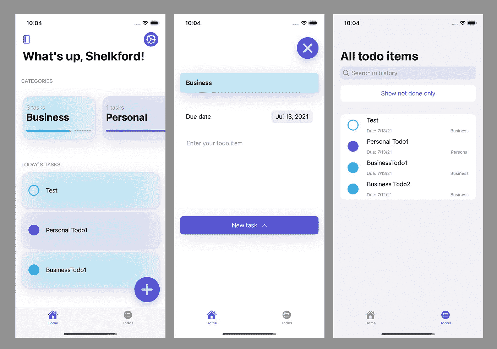
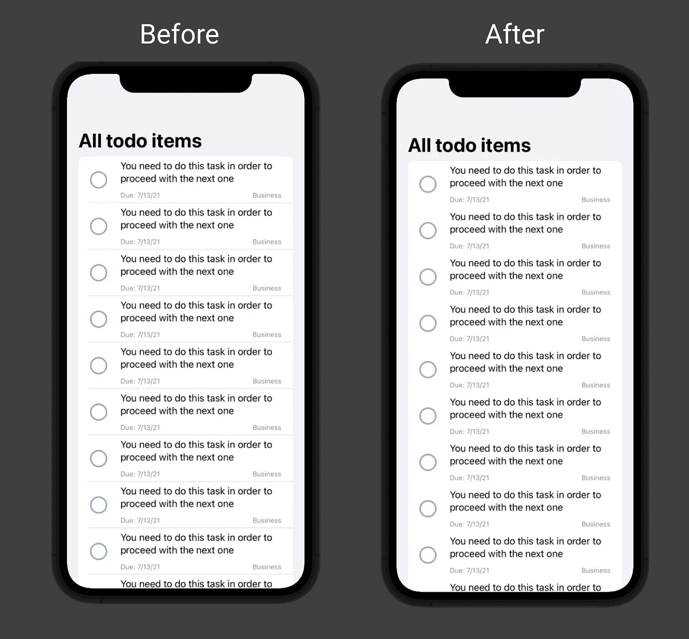
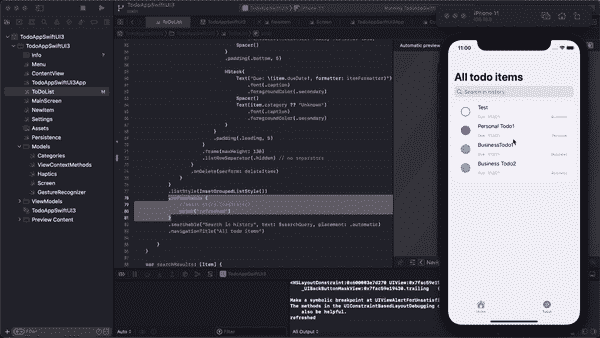
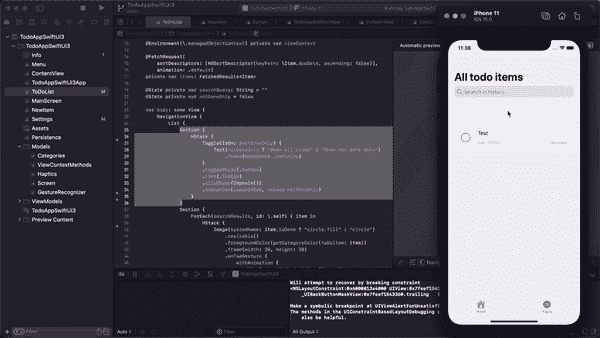
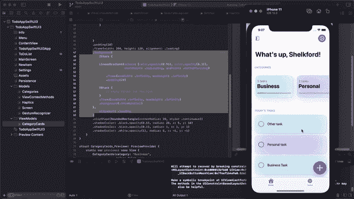
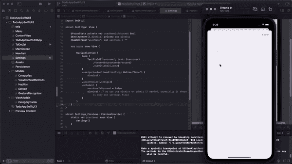
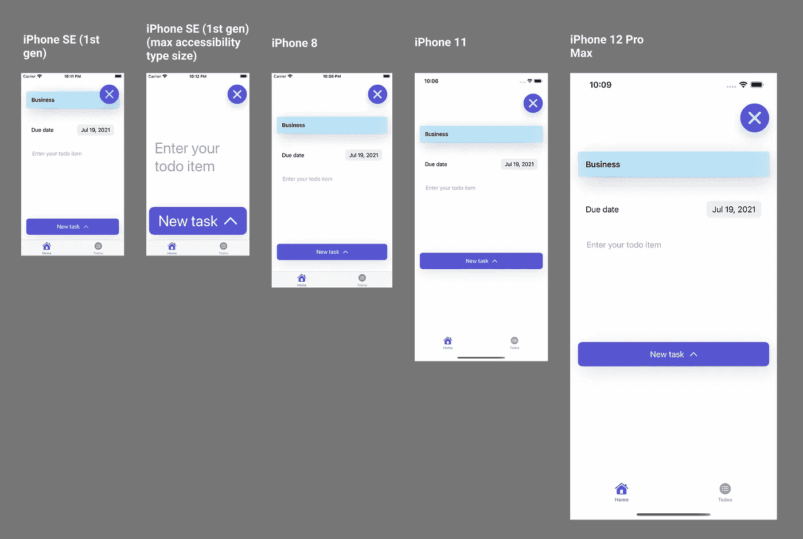

# 使用 iOS 15 新功能在 SwiftUI 中构建待办事项应用

> 原文：<https://betterprogramming.pub/build-a-to-do-app-in-swiftui-using-the-new-ios-15-features-afe5650a24a9>

## 实践中的 9 项新 SwiftUI 3 功能

图片由作者提供。

最近的 WWDC 会议标志着苹果推出 SwiftUI 两年了，和往常一样，框架背后的团队实现了大量新的特性和功能。

由于学习新工具的最佳方式之一是用它们来构建一些东西，所以我创建并外包了一个完全用 SwiftUI 3 编写的简单的待办事项应用程序，使用了许多新功能。

# **先决条件**

为了启动项目，需要采取以下步骤:

*   下载 Xcode 13+(目前[为 beta](https://developer.apple.com/download/) )。
*   创建一个新的 SwiftUI 项目(我们将使用 CoreData 进行持久性管理)。
*   在项目设置中选择 iOS 部署目标 15.0。

## GitHub 知识库

或者，您也可以从 GitHub 下载完成的项目[。](https://github.com/roman-luzgin/TodoAppSwiftUI3)

# 很酷的新功能

## 新的列表功能—本机搜索、可定制的分隔符、拉至刷新

SwiftUI 3 最大的改进之一是新的原生`List`功能。

我们要做的第一件事是删除列表行之间的分隔符。为此，我们首先用一个`HStack`样式化一个待办事项行，然后在这个`HStack`上使用`.listRowSeparator(.hidden)` 修饰符。

使用。listRowSeparator(。隐藏)

你可能已经注意到我们在`ForEach`语句中使用了`searchResults`。这是我们为我们的列表引入本地搜索栏的地方。

实现`.searchable()`修饰符需要两个元素:用简单的`@State`变量实现的实际查询和结果逻辑。构建搜索逻辑最简单的方法是只过滤包含搜索查询(用户输入)的结果。

最后，您还可以通过使用`.refreshable()`修饰符来启用刷新列表的 pull。只要内部代码完成运行，iOS [将](https://www.hackingwithswift.com/quick-start/swiftui/how-to-enable-pull-to-refresh)自动显示活动指示器。要了解更多关于使用`.refreshable()`的信息，我建议直接去查看关于 SwiftUI `List`的[苹果文档](https://developer.apple.com/documentation/swiftui/list/)。

结果如下:

使用。可刷新{ action }

## 新的切换样式

接下来我们将使用新的`Toggle`样式。最有趣的一个是`.toggleStyle(.button)` 修改器，它创建了一个类似按钮的开关来改变状态。在我们的例子中，我们可以使用切换来过滤列表，只显示尚未完成的项目。在上一节中，您可以找到实现这一点的实际搜索查询。

使用。toggleStyle(。按钮)

## 材料(背景模糊)和新颜色

对于主屏幕，我们将使用新的材质效果在卡片和菜单上创建背景模糊。以前，创建材质效果的唯一方法是使用自定义 UIKit 解决方案，这有点混乱。在 iOS 15 中，只需几行代码就可以实现。

作为顶上的小樱桃，我们现在可以使用几个新的原生色，包括`.indigo`、`.mint`和`.teal`。不可否认，它们与新的材质效果结合起来看起来特别有趣。

使用材料(背景模糊)

## 一个新的简单的方法来关闭一个表单/全屏封面——@ focus state 和 submitLabel on TextField

有几种不同的方法来消除原生表或全屏封面，在 iOS 15 中，我们又有了一种方法。您现在可以使用一个简单的`dismiss()`动作和一个`@Environment` `dismiss`变量。该方法与表单上的`.onSubmit`修饰符配合使用效果很好，这意味着您现在只需在完成键入后按“Done”*即可关闭表单。*

*请注意，我们还使用了一个新的`@FocusState`来确保键盘在我们按下“完成”后自动消失我们还可以在任何其他动作上切换`@FocusState`为文本字段，比如按下屏幕上的另一个按钮或点击背景(你可以使用`onTapGesture{}`来实现)。不幸的是，在文本编辑器中仍然没有简单的本地方法来做到这一点。*

**

*使用解散和@FocusState*

## *可定制的按钮*

*最后，还有一种新的本机方式来设计按钮。对于我们的应用程序，我们选择了带有靛蓝色彩的`.roundedRectangle`形状，增加了突出度和大控件尺寸。注意，通过这种方式，我们不需要指定确切的框架大小，这意味着按钮将自动适应屏幕大小和动态类型(对于更大的可访问性大小)。*

**

# *结论*

*总的来说，SwiftUI 每年都在继续改进，在 2021 年，它获得了许多急需的原生功能。请注意，通过这个应用程序，我们只使用了 WWDC 2021 上展示的一小部分新功能，但它仍然产生了巨大的影响。*

*以下是最终结果:*

**

*决赛成绩*

*感谢阅读！*