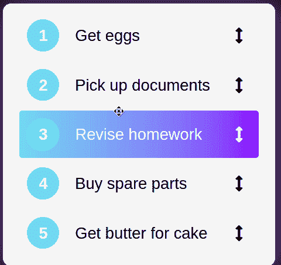
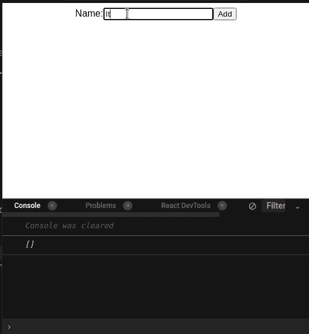
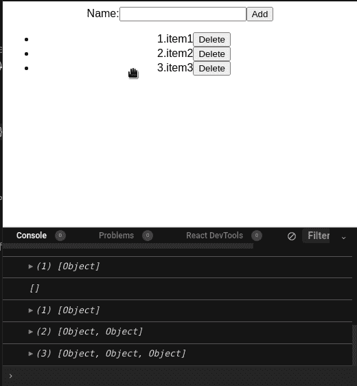
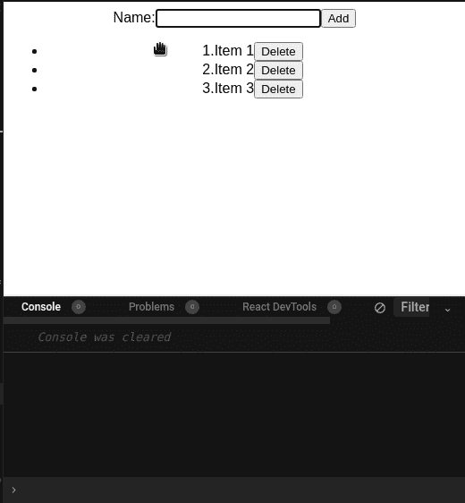
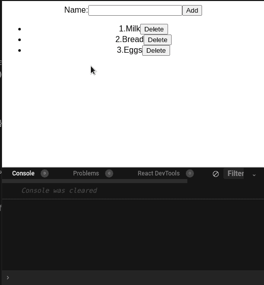
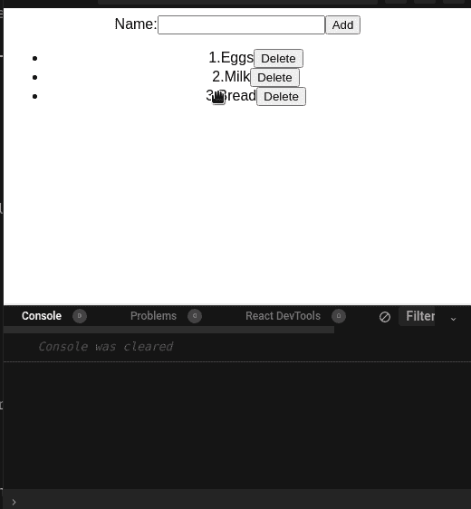
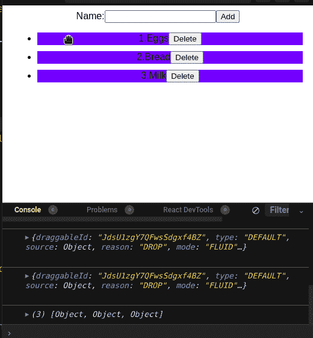

# 使用带有拖放功能的 React 创建待办事项应用程序

> 原文：<https://betterprogramming.pub/build-a-to-do-app-using-react-with-drag-and-drop-functionality-954080ee9644>

## 如何在 react 应用程序中集成 react-beautiful-dnd


来源:[安内特 Lūsiņa](https://unsplash.com/@anete_lusina) on [Unsplash](http://unsplash.com)

待办应用无处不在。它们帮助人们变得有条理，并记录他们一天中的任务。这些应用程序也很容易构建。正因为如此，大量的教程可以帮助你使用 React 库来构建它们。

然而，更高级的待办事项应用程序允许您重新排列列表中的项目。这使得用户可以按照重要性来组织他们的任务。



来源:[带 React 挂钩的拖放列表](https://codepen.io/florantara/pen/jjyJrZ)

要实现这一点，您需要做的是:

*   使用 [HTML 拖放 API](https://developer.mozilla.org/en-US/docs/Web/API/HTML_Drag_and_Drop_API) 使我们的列表可拖动。
*   检测用户何时拖动并显示适当的动画。
*   检查用户是否已经停止拖动。如果是这样，也在这里显示一个动画。
*   如果客户已经重新排列了他们的列表，将项目的位置更新到新的位置。

正如你所看到的，这不是一个小壮举。此外， [HTML 的拖放也是不一致的](https://www.quirksmode.org/blog/archives/2009/09/the_html5_drag.html)，因此让你的应用程序感觉很简单。

这就是`react-beautiful-dnd`的用武之地。这是一个开源库，可以帮助开发人员在很短的时间内构建流畅的可拖动列表。此外，它有内置的动画，使拖动事件感觉更自然，几乎没有性能成本。

既然说了它的优点，那就开始吧！

在本文中，我们将构建一个具有拖放功能的待办事项列表项目。这将是结果:


本文的结果

# 项目设置

## 创建 React 存储库

要搭建 React 项目，请运行以下终端命令:

```
npx create-react-app todo-list-tutorial
```

## 安装依赖项

对于我们的项目，我们需要以下模块:

*   `react-beautiful-dnd`:我们节目的主旨。这个软件包将把我们枯燥的列表变成一个更好看的具有拖放功能的列表。
*   `react-hook-form`:我们将使用一个表单来获取用户的输入。`react-hook-form`包将帮助我们做到这一点。
*   `nanoid`:这个模块会给列表项分配 id。

要安装这些软件包，请运行以下终端命令:

```
npm i react-beautiful-dnd react-hook-form nanoid
```

完成这些后，就该构建我们的应用程序了。

# 构建我们的待办事项列表

## 创建上下文提供者

在本文中，我们将使用 React 钩子来存储待办事项列表的数据。因为我们希望在多个组件之间共享这个钩子，所以我们将使用 [React 的上下文 API](/reacts-context-api-explained-baebcee39d2f) 。这样可以防止 React 的道具钻问题。

如果你想了解更多关于支柱钻探的知识，[看看这篇由](https://codeburst.io/react-anti-pattern-prop-drilling-54474d5236bd)[provided](https://medium.com/u/f3735d32c677#1-provided-droppableprovided) [对象](https://github.com/atlassian/react-beautiful-dnd/blob/master/docs/api/droppable.md#1-provided-droppableprovided)包含用于样式和查找的道具。

*   第 8 行和第 27 行:`Draggable`元素通知 React 用户可以拖动`li`元素。*   第 20 行:如果用户正在拖动元素，将`className`属性更改为`selected`。稍后我们将使用它来应用样式。*   第 29 行:`placeholder`属性在列表中创建了一个空白区域。这样会让拖拽操作感觉很自然。

运行代码。这将是结果:



代码的输出

这就是我们启用拖动功能所需要的一切！但是请注意，我们有一个小问题:即使我们重新排列项目，数组也会恢复到原来的顺序。我们将在下一节中解决这个问题。



当前问题

## 任务顺序的持久性

为了缓解这个问题，我们可以使用`[onDragEnd](https://github.com/atlassian/react-beautiful-dnd/blob/master/docs/guides/responders.md#ondragend-required)` [处理程序](https://github.com/atlassian/react-beautiful-dnd/blob/master/docs/guides/responders.md#ondragend-required)。使用这个方法，我们将告诉`react-beautiful-dnd`保存刷新的订单。

转到`ToDoList.js`，添加以下代码:

*   第 1 行:`result`参数包含关于拖动事件的信息，比如源项及其目标位置。
*   第 7 行:将我们的`handleEnd`方法传递给`onDragEnd` prop。



代码的输出

这里，我们只关心`source`和`destination`对象。

接下来，像这样改变`handleEnd`处理器:

*   第 2 行:将`data`钩子转换成数组形式。
*   第 3 行:找到用户拖动的项目。这是源项目。
*   第 4 行:将源项的位置更改为它的目标。
*   第 5 行:最后，将这个变异后的数组传递给`data`钩子。



代码的输出

但是还有一个问题，如果用户拖动元素但是把它放回原来的位置怎么办？


按照`react-beautiful-dnd`的说法，这是一个`CANCEL`事件。此外，由于`destination`属性是`null`，我们的程序崩溃了。

为了防止这个错误，将`handleEnd`方法修改如下:

*   第 3 行:检查`destination`属性是否为空(发生了一个`CANCEL`事件)。如果是，退出该功能。
    这将是代码的输出:



代码的输出

瞧啊。我们有一个功能性的待办事项列表应用程序，具有拖放功能。请注意，我们需要最少的代码来实现这一点。

## 应用样式

在指南的这一部分，我们将通过编写一些 CSS 代码来使我们的列表看起来更好。

在您的`styles.css`文件中，添加以下代码:

*   第 5–8 行:如果元素的类是`not-selected`(用户没有拖动项目)，背景颜色将是蓝色。否则颜色会是红色。



代码的输出

我们完事了。我们的应用程序现在看起来不错！

# 额外资源

[这里是这个项目](https://github.com/HussainArif12/dnd-tutorial/tree/main/)的 GitHub 库。

*   [通过](https://blog.bitsrc.io/implement-better-drag-and-drop-in-your-react-app-beafc4451599) [Rajat S](https://medium.com/u/ae259dddfc25?source=post_page-----954080ee9644--------------------------------) 在 React 应用中实现更好的拖放
*   [如何使用 React 添加拖放功能](https://www.youtube.com/watch?v=aYZRRyukuIw)
*   [构建一个漂亮的、可拖动的看板——log rocket](https://www.youtube.com/watch?v=Vqa9NMzF3wc)

# 结论

如果您想用拖放功能构建漂亮的列表，不用再找了。会非常适合你的兵工厂。它易于使用，并在引擎盖下进行了性能优化。这确保了你的应用保持可靠和快捷。

非常感谢您的阅读！编码快乐！