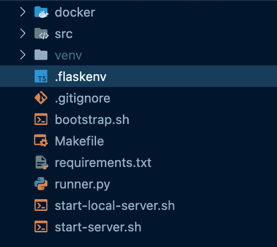
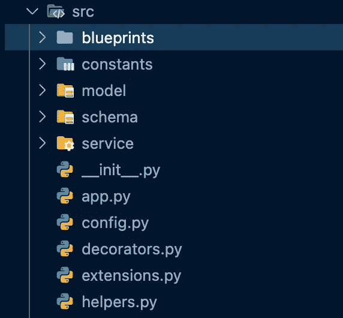
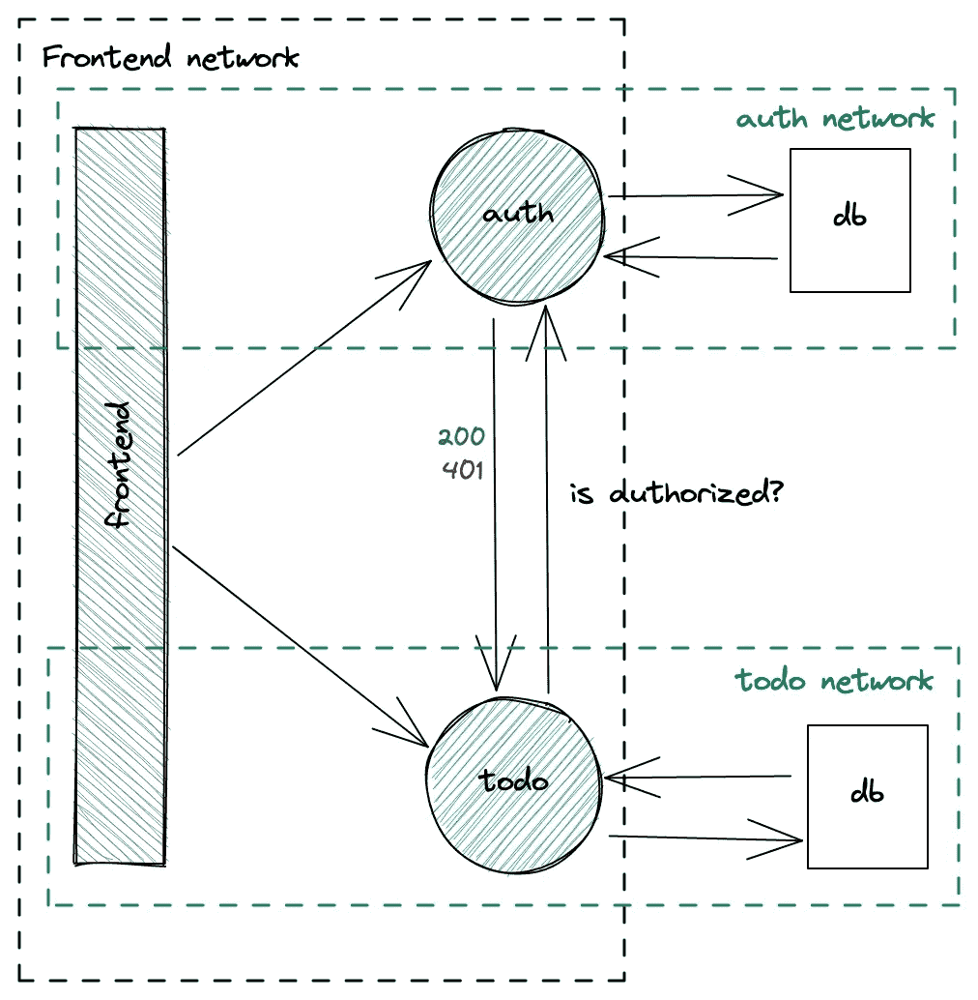
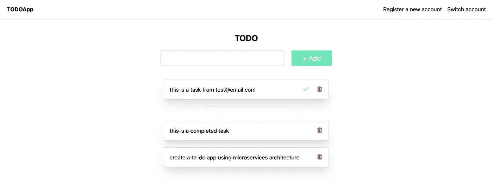

# 使用微服务架构构建 Todo 应用程序，并使用授权服务来保护其路线

> 原文：<https://betterprogramming.pub/build-a-todo-app-using-a-microservices-architecture-and-use-auth-service-to-protect-its-routes-f8f0d2ad6669>

## 使用身份验证服务来验证 JWT 令牌并保护您的其他微服务(实验 01 —第 2 部分)


[国王教会国际](https://unsplash.com/@kingschurchinternational?utm_source=unsplash&utm_medium=referral&utm_content=creditCopyText)在 [Unsplash](https://unsplash.com/s/photos/security-guard?utm_source=unsplash&utm_medium=referral&utm_content=creditCopyText) 拍摄的照片

# 我们离开的地方

在第一部分中，我展示了如何使用 Django 构建一个 auth 微服务，用一个装饰器来保护他的路由，以验证用户是否被授权与他的视图进行交互。如果你错过了，看看这里的[](/how-to-protect-your-microservices-8d74045061c1)*。*

*现在终于到了继续实施我们的待办应用程序开发的时候了。*

*正如第一部分所预期的，在这里我将展示我如何开发 *todo 微服务*以及我如何使用 auth 服务来保护它的路由。*

*最后，我将展示如何使用 docker-compose 连接所有微服务。*

*这里 *可以找到 *Github 项目* [*。*](https://github.com/anotherbuginthecode/microservices-labs)**

*文章组织如下:*

***第一部**:*

*   *整体情况*
*   *授权服务*

*第二部分:*

*   *待办服务*
*   *用 docker-compose 运行所有服务*

*跟我来，让我们开始这最后一部分吧！*

# *待办服务*

**

*用 [Excalidraw](https://excalidraw.com/) 制作的草图*

*正如上面的草图所解释的，我们想要使用 auth 服务来告诉我们当前用户是否被授权(200)使用待办服务(401)。*

*要做到这一点，我们希望每个请求在发送时在头中带有`Authorization`字段，并带有由 auth service 生成的承载令牌。否则，该请求将被拒绝，并显示一个`401`状态代码。*

*该服务是用 Flask 实现的，Flask 是一个用 Python 编写的 web 框架，可以让您轻松开发 web 应用程序。*

*让我们看一下项目结构。*

**

*待办服务项目结构*

*与授权服务一样，我创建了 bash 脚本和 Makefile 来自动化繁琐的过程。
你也可以用它们来加快整个进程，做好玩的准备。*

*`.**flaskenv**` 让您定义一系列参数，这些参数将在您运行应用程序时对您有所帮助。*

*此外，它允许您在*开发、测试、*和*生产*之间对环境类型进行分类。每种类型都会基于`src/config.py`文件触发不同的应用程序设置，我将进一步向您展示。*

*在我的例子中，我在*开发环境*中使用 SQLite DB，在*生产模式*中使用 docker 时切换到 PostgreSQL DB。*

*烧瓶环境变量*

*当您使用命令`flask run`(它将根据 FLASK_APP 参数检查哪个文件执行)或`python runner.py`启动应用程序时，python 文件 **runner.py** 将被启动。*

*现在，让我们看看 src 文件夹的内部，解释一下最有趣的文件。*

# *Src 文件夹*

*让我们看看 *src* 文件夹里面有什么。这里，有描述我们的待办服务的核心逻辑和交互。*

**

*src 文件夹中的文件和文件夹*

*`app.py` —它包含所有配置、所有扩展和在应用程序中注册的所有路线。*

*尽管你可以找到 app.py 的所有其他示例，但我认为这种结构更加灵活和有组织。无论是延伸还是新路线，每样东西都有它的位置。*

*正如您将看到的，相同的方法是将核心操作(服务)与路由定义(蓝图)分开。这让我保持所有的路线小，干净和可维护的。*

*如果你感兴趣，我会向你详细展示我通常如何构建我的 flask 项目，请在评论部分告诉我。*

*`extensions.py`*

*在这个文件中，我保存了我的 flask 应用程序中需要的所有必要的扩展。这样，我就可以轻松地在我的蓝图或服务文件中导入 DB，例如，不使用 app.py。我相信它更容易，更清晰。*

*`config.py`*

*在这里，我们可以找到我之前讨论过的配置。它们是根据环境动态调用的。*

*我们可以看到，当我们在开发环境下运行 app 时，会生成一个本地`todo.db`。测试也一样。当应用程序在生产环境下运行时(在本例中是我们的 docker 容器),会发生不同的情况，在生产环境中将建立与 PostgreSQL 数据库的连接。*

*`decorators.py`*

*`decorators.py`文件是奇迹发生的地方！*

*至于 auth 服务，将使用装饰器`@is_authorized`保护每个请求，该装饰器将在当前请求之前执行。它将检查`Authorization`字段是否在报头请求中。*

*如果是这样，与 auth 服务通信的一个`Auth`类将根据传递的承载令牌验证用户是否被授权。否则，将返回一个`401`状态代码，并且不执行任何操作。*

*如果我们试图调用一个 API 而不传递承载令牌或无效令牌，auth 服务将拒绝该请求，因为它是未授权的。*

```
*curl --location --request GET '[http://localhost:5000/api/v1/todo/?completed=false'](http://localhost:5000/api/v1/todo/?completed=false')# curl GET 'http://localhost:5000/api/v1/todo/?completed=false' \                     
--header 'Authorization: Bearer mynotvalidtoken'<!doctype html>
<html lang=en>
<title>401 Unauthorized</title>
<h1>Unauthorized</h1>
<p>The server could not verify that you are authorized to access the URL requested. You either supplied the wrong credentials (e.g. a bad password), or your browser doesn&#x27;t understand how to supply the credentials required.</p>*
```

*那么让我们看看`Auth`级里面的`service/auth_service.py`是什么样子的。*

*`Auth`类包装了 auth 服务提供的必要 API，以验证传递的令牌，并返回发送请求的用户的 user_id。*

*`__init__.py`映射 auth 服务的主机名和端口，以允许 todo 服务在 docker 容器中运行时相互进行内部通信。*

```
*def __init__(self):                                         self.AUTH_SERVICE_NAME = os.getenv('AUTH_SERVICE_NAME', 'localhost')                                     self.AUTH_SERVICE_PORT = os.getenv('AUTH_SERVICE_PORT', '8000')*
```

*方法`**get_user()**` 允许我们根据请求中的承载令牌检索`user_id`。在我们的模型中,`user_id`将被用作映射用户及其待办事项的字段。*

*`blueprints/todo.py`*

*在这里，我们可以找到我们可以与待办事项服务进行的所有可能的交互:*

*   *获取所有用户的待办事项，最终按完成状态过滤*
*   *创建新任务*
*   *将任务设置为已完成*
*   *更新新的任务文本*
*   *删除任务*

*所有的路由都受到`**@is_authorized**` decorator 的保护，对于每个请求，在执行任何动作之前都要检索当前用户。*

# ***Dockerfile***

> *[Docker](https://docs.docker.com/engine/reference/builder/) 可以通过读取来自`*Dockerfile*`的指令自动构建图像。`*Dockerfile*`是一个文本文档，它包含用户可以在命令行上调用的所有命令来组合一个图像。使用`*docker build*`用户可以创建一个连续执行几个命令行指令的自动化构建。*

*我就是这样定义 Dockerfile 的:*

*与*第 1 部分*中的授权服务相同，基础映像将首先执行的脚本`*entrypoint.sh*` 作为入口点。*

*当您启动 docker 容器时，它将检查与 PostgreSQL DB 的连接是否已建立，然后继续执行其他指令。*

*然后，基础映像将用于生成开发映像。当容器运行时，命令`python runner.py`将被执行，flask app 将在`0.0.0.0:5000`下运行。*

# ***启动服务***

*现在是时候推出服务了！我准备了一个`*Makefile*`来自动化这些无聊的东西。如果你已经下载了代码，你只需输入命令`*make <target>*` 就可以享受了！*

*`docker-build`:它将创建一个名为 msalab01/todo:v1 的 docker 图像。*

*`docker-run`:启动名为 lab01_todo 的 docker 容器。如果你需要使用不同的端口，你必须在 make 命令中指定带变量的端口，否则，将使用 5000。*

*`local-build`:它将启动`*bootstrap.sh*`，自动完成所有初始设置，比如创建虚拟环境和安装依赖项。*

*`local-run`:它将启动`*start_local_server.sh*` *，*一个 bash 脚本，执行所有基本指令以在本地运行服务器。*

*注意:如果您决定使用 docker 容器独立运行服务，您将无法在服务之间建立通信，除非您将它们放在同一个网络下。如果您想在进入 docker-compose 之前测试它们，我的建议是在本地运行它们。*

# *用 docker-compose 运行所有服务*

*最后，是时候把所有东西放在一起了！*

*为了一起运行所有服务并让它们相互通信，我们需要写下一个 docker-compose 文件。*

> *Docker Compose 是一个开发用来帮助定义和共享多容器应用程序的工具。使用 Compose，我们可以创建一个 YAML 文件来定义服务，并且只需一个命令，就可以将所有东西旋转起来或全部拆除。*

*让我们看看我们的文件是什么样的。*

***数据库:**每个数据库都有自己的**卷**和**网络**来保持隔离，只有共享同一网络的服务才能与之通信。*

***auth service** :获取之前构建的镜像 mslab01/auth:v1。此外，由于我们使用 PostgreSQL 数据库，我们设置了`POSTGRES_ENABLED=1`，数据库之间的连接将通过传递用于创建`**auth_db**`的相同属性来建立。这是可能的，因为 auth 和 auth_db 共享同一个网络 *backend_auth_db* 。此外，为了允许与前端服务通信，我们还需要将服务放在*前端*网络下。*

***todo 服务**:获取之前建立的图像`mslab01/todo:v1`。同样的故事也适用于这个服务及其数据库(todo_db)。此外，我们通过 auth 服务的`AUTH_SERVICE_NAME`和`AUTH_SERVICE_PORT`来允许容器之间通过容器端口进行内部通信。在这种情况下，auth 和 todo 服务共享相同的*前端网络*。*

***webapp** :取 Vue3 内置的 webapp。我不会展示它是如何创建的，因为这超出了范围，如果你感兴趣，你可以在 [Github](https://github.com/anotherbuginthecode/microservices-labs/tree/main/lab01/frontend) 上看到代码。您可以选择自己喜欢的框架，并使用 Axios、Fetch 或 Ajax 调用 API。*

**

*这是 docker-compose.yml 中的网络共享方式——我用 [Excalidraw](https://excalidraw.com/) 画的草图*

## *准备…开始！*

*我们期待已久的时刻终于到来了。*

*要启动服务，在您的终端根项目下(或者您创建最终`docker-compose.yml`的地方)键入命令:*

```
*docker-compose up -d*
```

*去 **localhost** 或 **localhost:80** ，如果你还没有创建一个新账户，享受你的成功吧！*

**

*登录后的待办事项应用主页*

# *结论*

*恭喜你。现在你知道了如何使用微服务架构策略构建待办应用。我们还看到了如何通过授权服务来保护不同的服务，以确保只有授权用户才能与待办事项创建服务进行交互。*

*我很高兴与你分享了这个实验，我希望你发现它对你的下一个项目有用！*

*希望下次研讨会能见到你！跟着我，确保你不会错过任何东西。*

*再见！*

# *有用的链接*

*[](/how-to-protect-your-microservices-8d74045061c1) [## 如何保护您的微服务(1/2)

### 使用身份验证服务来验证 JWT 令牌并保护您的其他微服务(实验 01 —第 1 部分)

better 编程. pub](/how-to-protect-your-microservices-8d74045061c1) [](https://github.com/anotherbuginthecode/microservices-labs) [## GitHub -另一个 bug in 代码/微服务-实验室:一系列实验来了解…

### 在我学习微服务架构的过程中，进行了一系列的实验。有时候我会看到一些文章或者…

github.com](https://github.com/anotherbuginthecode/microservices-labs)*