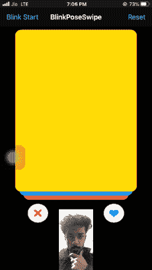
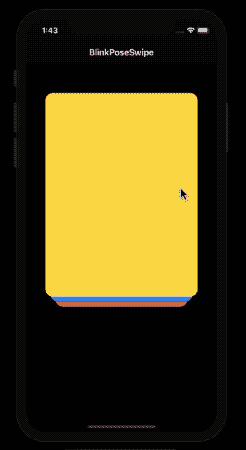
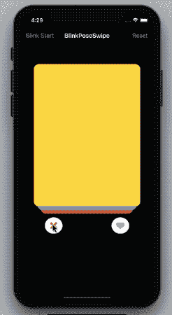

# 眨眼和转头——使用 ML Kit 的面部检测 API 构建一个打火刷 iOS 应用程序

> 原文：<https://betterprogramming.pub/build-a-touchless-swipe-ios-app-using-ml-kits-face-detection-api-da40d1e2cb86>

## 利用 ML Kit 的人脸检测 API 来执行无接触刷卡


由 [Unsplash](https://unsplash.com?utm_source=medium&utm_medium=referral) 上的 [Alexas_Fotos](https://unsplash.com/@alexas_fotos?utm_source=medium&utm_medium=referral) 拍摄的照片

随着 3D 运动感应技术已经在 Pixel 4 上推出，看起来我们与手机的交互方式将很快改变。随着苹果迄今为止最雄心勃勃的产品——AR 眼镜——已经在开发中，无触摸交互肯定有着光明的未来。

虽然 iPhone 前置摄像头上的真正深度技术确实允许您在应用程序中添加眼球追踪功能，但它仅在 iPhone X 和更高版本上可用。幸运的是，我们可以利用 Firebase 的 ML 工具包来帮助我们。具体来说，ML Kit 的人脸检测 API 不仅仅是在设备上进行人脸检测。ML Kit 的面部检测支持的一些功能有:

*   **面部跟踪** —这将面部检测技术扩展到视频序列中，根据运动和位置跟踪一段时间内出现的面部。然而，这绝不意味着面部识别(识别显示的特定面部)。
*   **面部朝向**—API 返回欧拉角 X、Y 和 Z，以确定在现实空间中的位置。欧拉 X 角为正的面意味着它朝上；正的欧拉 Y 角表示脸向左转；并且正的欧拉 Z 角相对于相机逆时针旋转。
*   **面部分类** —面部检测器具有将面部分类为*微笑*的能力，并返回眼睛是否睁开的概率。

在我们深入研究实现之前，让我们列出本教程的目标。

# 我们的目标

*   我们将首先使用 Swift 在我们的 iOS 应用程序中创建一个类似 Tinder 的刷卡界面。左右滑动是现在许多应用程序中常见的一种流行的 UI 设计。
*   接下来，我们将使用 AVFoundation 框架来设置我们的摄像机以进行帧处理。
*   最后，我们将集成 ML Kit，并使用上述人脸分类/定向结果来处理无触摸的滑动。

## 我们的最终目的地

本教程结束时，你将能够眨眼或转动头部来执行刷卡。下图是我完成此应用程序后所取得的成果:



# 创建一个类似火绒的滑动界面

启动 Xcode，使用 UIKit 创建一个新的单视图应用程序。我不太喜欢故事板，所以我将以编程方式创建所有的视图。

> 披露 *:* 在这个项目的开发过程中，我偶然发现了[这个优秀的作品](https://medium.com/@phillfarrugia/building-a-tinder-esque-card-interface-5afa63c6d3db)，它展示了如何构建一堆类似 Tinder 的具有滑动手势功能的卡片，并将其用作 kickstarter。

首先，让我们创建一个自定义视图—`TinderCard.swift`—如下所示:

除了设置我们的`swipeView`之外，我们还从`DataModel`中设置了一种独特的颜色(接下来会有更多的介绍)，我们已经将`UIPanGestureRecognizer`添加到上面的自定义视图中，并设置了一个阈值，超过这个阈值，刷卡将被考虑在内，并且调用自定义委托函数(`swipeDidEnd`)将该卡从堆栈中移除。

## 数据模型

数据模型目前只保存一个颜色属性。您可以通过添加图像和文本来进一步定制，使其类似于实际的 Tinder 卡片:

```
import UIKitstruct DataModel {

    var bgColor: UIColor

    init(bgColor: UIColor) {
        self.bgColor = bgColor
    }
}
```

## 自定义协议

我们需要创建几个协议。一个用于数据源，另一个用于处理滑动手势操作。它们的定义如下:

```
import UIKitprotocol SwipeCardsDataSource {
    func numberOfCardsToShow() -> Int
    func card(at index: Int) -> TinderCardView
    func emptyView() -> UIView?

}protocol SwipeCardsDelegate {
    func **swipeDidEnd**(on view: TinderCardView)
}
```

我们之前看到的自定义视图中的委托上调用的`swipeDidEnd`函数触发了 stack 容器(包含一叠刷卡)。我们来看看`StackContainerView.swift`类:

上面的`StackContainerView`班负责抱`TinderCardViews`组。每次刷卡时，它都会检查数据源(在`ViewController`中定义)中剩余的牌(如果有)，并将它们添加到牌堆的底部。

在我们将上面的容器视图插入到我们的`ViewController`中之前，这里有一个类似 Tinder 的刷卡界面:



接下来，设置按钮！

接下来，我们需要用上面的`StackContainer`和按钮来设置我们的`ViewController`，这些按钮可以在按下时模拟滑动手势动画。让我们在下一节做这件事。

# 以编程方式模拟滑动手势

为了模拟点击按钮时的滑动手势，我们需要用仿射变换来模拟真实生活中向右或向左滑动的角度，从而将 Tinder 卡片视图水平动画化。

在下面的`ViewController.swift`代码中，我们将设置我们的喜欢和不喜欢按钮，并将数据源插入堆栈容器自定义视图。

为了将`modelData`从`ViewController`传递到`StackContainerView`，我们遵循了协议:

```
stackContainer.dataSource = self
```

随后，我们需要实现`SwipeCardsDataSource`协议的方法，如下所示:

```
extension ViewController : SwipeCardsDataSource {

    func numberOfCardsToShow() -> Int {
        return modelData.count
    }

    func card(at index: Int) -> TinderCardView {
        let card = TinderCardView()
        card.dataSource = modelData[index]
        return card
    }

    func emptyView() -> UIView? {
        return nil
    }
}
```

## 创建我们的自定义按钮

在`viewDidLoad`方法中调用的`addButtons`函数的实现如下:

`onButtonPress`选择器功能是我们模拟左右滑动手势的地方，如下所示:

```
[@objc](http://twitter.com/objc) func onButtonPress(sender: UIButton){

        if let firstView = stackContainer.subviews.last as? TinderCardView{
            if sender.tag == 0{
                firstView.leftSwipeClicked(stackContainerView: stackContainer)
            }
            else{
                firstView.rightSwipeClicked(stackContainerView: stackContainer)
            }
        }
}
```

`leftSwipeClicked`和`rightSwipeClicked`函数在`TinderCardView`类中实现。`leftSwipeClicked`功能的代码如下所示:

```
func leftSwipeClicked(stackContainerView: StackContainerView)
{
    let finishPoint = CGPoint(x: **center.x - frame.size.width * 2**, y: center.y)
    UIView.animate(withDuration: 0.4, animations: {() -> Void inself.center = finishPoint
        self.transform = CGAffineTransform(rotationAngle: **-1**)}, completion: {(_ complete: Bool) -> Void in
        stackContainerView.swipeDidEnd(on: self)
        self.removeFromSuperview()})
}
```

向右滑动类似于上面的代码。您不需要在旋转角度设置为-1 的情况下进行仿射变换，而是需要在旋转角度设置为+ 1 的情况下进行仿射变换，以显示向右侧的倾斜。

让我们看看迄今为止我们已经取得的成就:



既然我们类似 Tinder 的刷卡原型已经完成，让我们继续讨论相机部分。如果您已经从上一节中注意到了，我们需要设置我们的`CameraView`类。我们将在屏幕底部执行此操作。

# 使用 AVFoundation 设置摄像机

在你设置你的摄像机之前，在`info.plist`文件中添加`NSCameraUsageDescription`以避免以后运行时崩溃。

苹果的 **AVFoundation** 框架帮助我们做了以下事情:

*   设置我们摄像机的输入设备。在这个用例中，我们将使用前置摄像头。
*   初始化摄像机会话。
*   从输出中捕获一个样本缓冲区。我们将把样本缓冲区从实时帧传递到 ML Kit 的视觉实例，以检测面部，然后是眨眼和面部定位。

`CameraView.swift`类的代码如下所示:

按下导航条按钮时，将从`ViewController`调用`beginSession`功能。

让我们以编程方式将刚刚创建的`CameraView`添加到我们的`ViewController`视图中，如下所示:

```
func addCameraView()
{
    cameraView = CameraView()
 **cameraView.blinkDelegate = self**
    view.addSubview(cameraView)cameraView.translatesAutoresizingMaskIntoConstraints = false
    cameraView.bottomAnchor.constraint(equalTo: view.bottomAnchor).isActive = true
    cameraView.centerXAnchor.constraint(equalTo: view.centerXAnchor).isActive = true
    cameraView.widthAnchor.constraint(equalToConstant: 150).isActive = true
    cameraView.heightAnchor.constraint(equalToConstant: 150).isActive = true
}
```

注意设置在`CameraView`上的`blinkDelegate`代表。让我们定义自定义协议`BlinkSwiperDelegate`，它由两种方法组成:

```
protocol BlinkSwiperDelegate {func leftBlink()
func rightBlink()}
```

每当检测到相应的闪烁时，我们将调用这些方法，以便在`TinderCardView`上执行滑动。

让我们继续本教程的最后一部分，将 ML Kit 集成到我们的 iOS 应用程序中，并利用它的人脸检测 API。

# 在我们的 IOS 应用程序中集成 ML 工具包

为了开始 ML 工具包集成， [Firebase 的文档](https://firebase.google.com/docs/ios/setup)是一个很好的起点。以下是在应用程序中集成 Firebase 时需要做的重点工作:

*   创建一个新的 Firebase 项目，并注册您的应用程序的捆绑包 ID。
*   下载`GoogleService-Info.plist` 文件，放入你的 Xcode 项目中。
*   使用 Cocoapods 或 Swift Package Manager 添加相关的 Firebase 依赖项。在我们的案例中，它们是:

```
pod 'Firebase/MLVision'
pod 'Firebase/MLVisionFaceModel'
```

*   最后，使用`FirebaseApp.configure()`初始化`AppDelegate`中的 Firebase。

现在我们已经完成了 Firebase 的设置，`import FirebaseMLVision`进入你的`CameraView.swift`班级。是时候对来自摄像机的实时帧执行人脸检测了。

在您的`CameraView.swift`类中初始化以下属性:

```
private lazy var vision = Vision.vision()lazy var options : VisionFaceDetectorOptions = {
        let o = VisionFaceDetectorOptions()
        o.performanceMode = .accurate
        o.landmarkMode = .none
 **o.classificationMode = .all**
        o.isTrackingEnabled = false
        o.contourMode = .none

        return o
    }()
```

> 注意:为了加快眨眼检测，我们已经禁用了地标、轮廓和面部跟踪检测。

为了检测眼睛睁开的概率和面部方向，在视觉面部检测器选项上设置`classificationMode`到`all`很重要。

为了运行人脸检测，我们需要传递`faceDetector`方法中的选项。传递给这个`faceDetector`的图像应该是类型`VisionImage`。以下代码片段展示了 iOS 中 ML Kit 的人脸检测的要点。

```
let faceDetector = vision.faceDetector(options: options)
faceDetector.process(image, completion : {})
```

现在，让我们从 AVFoundation 的`captureOutput`委托方法中检索样本缓冲区，并将其传递给面部检测:

```
func captureOutput(_ output: AVCaptureOutput, didOutput sampleBuffer: CMSampleBuffer, from connection: AVCaptureConnection) {

        guard let imageBuffer = CMSampleBufferGetImageBuffer(sampleBuffer) else {
            print("Failed to get image buffer from sample buffer.")
            return
        }
 **let visionImage = VisionImage(buffer: sampleBuffer)**
        let metadata = VisionImageMetadata()
        let visionOrientation = **visionImageOrientation**(from: **imageOrientation**())
        metadata.orientation = visionOrientation
        visionImage.metadata = metadata
        let imageWidth = CGFloat(CVPixelBufferGetWidth(imageBuffer))
        let imageHeight = CGFloat(CVPixelBufferGetHeight(imageBuffer))

        DispatchQueue.global().async {
            self.detectFacesOnDevice(in: visionImage, width: imageWidth, height: imageHeight)
        }
}
```

`imageOrientation`和`visionImageOrientation`是两个实用函数(可在最后获得源代码),用于确定从摄像机检索的图像的方向，并在调用面部检测器之前在元数据中设置它。

## 针对眨眼和面部方向执行面部检测

`detectFacesOnDevice`在`VisionImage`上为我们进行人脸检测，并返回检测到的`VisionFace`的列表。使用这些，我们可以找到脸部的包围盒、`leftEyeOpenProbability`、`rightEyeOpenProbability`等等。以下代码片段包含该函数的完整实现:

在上面的代码中，当检测到眨眼时，我们触发相关的委托函数。注意`restingFace`布尔属性。它用于防止多次触发代理功能，并让用户在下一次滑动时通过眨眼返回到正常状态(不闪烁)。

或者，您可以使用`headEulerAngleZ`使用面部位置来执行手势滑动——当您向左倾斜头部时会出现正值，应触发向左滑动。您可以设置角度的阈值。以下代码片段显示了处理眨眼和头部姿势的条件:

```
if headPose > 25 || (rightEyeOpenProbability > 0.95 && leftEyeOpenProbability < 0.1){swipeLeft()
}
```

委托函数`rightBlink`和`leftBlink`以编程方式调用各自的滑动，就像我们在上一节模拟滑动手势中看到的那样。

就是这样！您应该会获得类似于开始时看到的结果。

这个应用程序的完整源代码可以在这个 [GitHub 资源库](https://github.com/anupamchugh/iowncode/tree/master/BlinkPoseAndSwipeiOSMLKit)中找到。只需集成 Firebase，将`GoogleService-Info.plist`文件复制到项目中，就可以使用**了。**

# 下一个在哪里？

使用动作感应的非接触式手势交互有着光明的未来，随着增强现实眼镜已经投入使用，这项技术应该会继续获得大量投资。

从这里开始，您可以创建自己的手势检测核心 ML 模型，在您的应用程序*中执行无触摸滑动。*或者您可以在此 *处重复使用现有的[型号。](https://github.com/hanleyweng/Gesture-Recognition-101-CoreML-ARKit)*

这一次到此为止。感谢阅读。