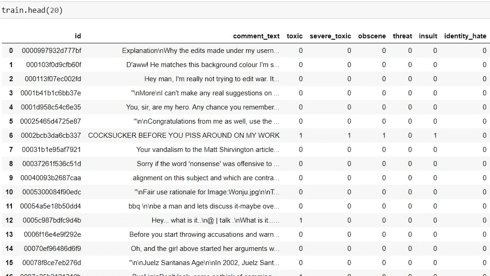
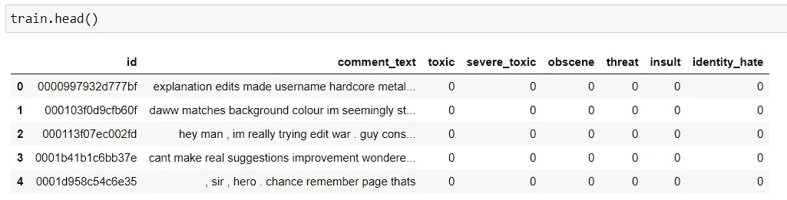
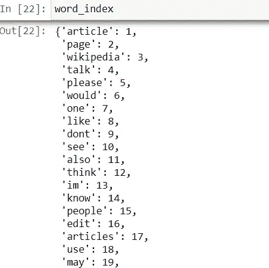
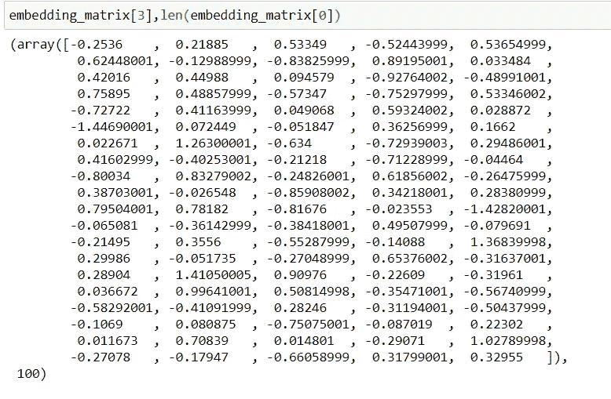
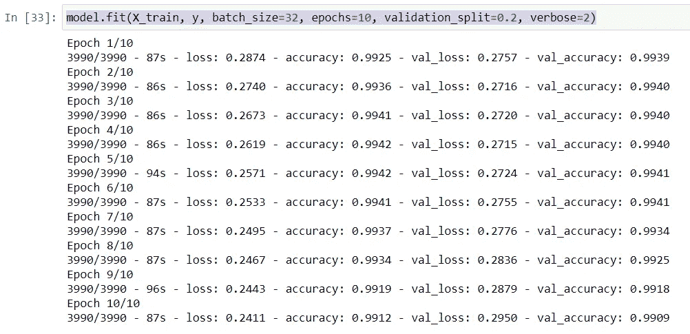
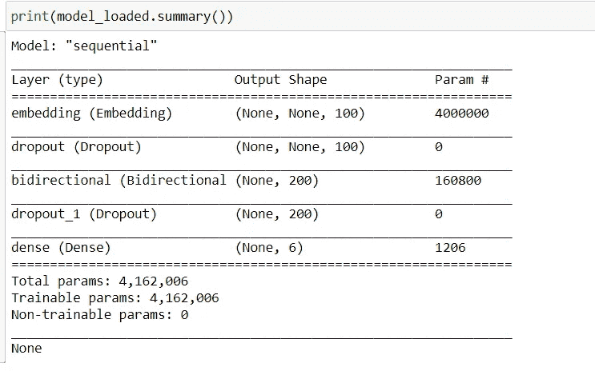

# 用 Python 构建有毒注释分类器

> 原文：<https://betterprogramming.pub/build-a-toxic-comments-classifier-in-python-fab1f0504631>

## 了解社交媒体平台如何检测有害评论


照片由[安娜·施韦茨](https://www.pexels.com/@shvetsa?utm_content=attributionCopyText&utm_medium=referral&utm_source=pexels)从[派克斯](https://www.pexels.com/photo/happy-woman-removing-face-mask-after-taking-bath-3852159/?utm_content=attributionCopyText&utm_medium=referral&utm_source=pexels)拍摄

仇恨的话语或评论会伤害许多人的感情。许多社交媒体网站，如脸书、推特和 Instagram，使用机器学习方法来检测和分类有害或仇恨的评论。

今天，我将带你经历一个制作有毒评论分类器的类似过程。最后，我们将获得一个模型，该模型将接受用户定义的输入，并将生成一个评论是否有毒的信号。

我们将使用 Python 编程来完成这项任务，并将使用 Jupyter Notebook 来运行我们的代码片段。

# 步骤 1:定义 Python 库

我们使用`nltk`进行文本处理和清理。我们有文本数据，但机器只理解数字数据，因此，我们将使用 word2vec 模型将文本数据转换为数字向量。

最后，为了训练出文本模型，我们将使用长短期记忆(LSTM)。

# 步骤 2:加载训练和测试数据

熊猫图书馆可以帮助我们加载数据集进行模型训练。

```
train=pd.read_csv("train.csv")
test=pd.read_csv("test.csv",encoding="ISO-8859-1")
```



资料截图

# 步骤 3:定义文本清理和处理步骤

我们的任务是删除所有的特殊字符，重复的单词，将所有的单词转换成小写，并删除所有的链接和不需要的文本。

NLTK 为我们提供了可以导入的停用词列表，如下所示:

```
stop_words = set(stopwords.words('english'))
```

现在让我们创建一个函数来删除所有的停用词。

```
def CleanText(comment):
    comment=processQues(comment)
    comment = nltk.word_tokenize(comment)
    w = [wd for wd in comment if wd not in stop_words]
    return " ".join(w)
```

定义函数后，是时候将它们应用到我们的数据框中了。

```
train["comment_text"]=train["comment_text"].apply(CleanText)
test["comment_text"]=test["comment_text"].apply(CleanText)
```



文本清理结果

# 步骤 4:定义 word2vec 模型

我们将使用一个预训练的 word2vec 模型来将我们的文本转换成数字向量。



字索引

# 步骤 5:利用手套 word2vec 模型

在定义了我们的 word2vec 模型之后，我们可以根据我们的文本数据使用相同的模型。

最后，我们将为数据集中的所有单词获得一个大小为 100 的向量。



# 步骤 6:定义我们的数据训练模型

我们将在 Keras 中使用一个序列模型，LSTM 图层后面是一个密集图层，作为我们的最终输出。

# 步骤 7:训练我们定义的模型

```
model.fit(X_train, y, batch_size=32, epochs=10, validation_split=0.2, verbose=2)
```



模特培训

# 步骤 8:保存并加载我们定义的推理模型

我们可以使用一行 Python 代码保存我们的模型，如下所示:

```
model.save("model_final.h5")
print("Saved model to disk")
```

现在，为了加载保存的模型，我们可以使用 Keras 中的`load_model`函数。

```
#Load Model
from tensorflow.keras.models import load_model
model_loaded = load_model('model_final.h5')
```



加载的模型摘要

# 结论

好了，这篇文章就到这里。我们已经介绍了一个用于分类有害评论的现成的 Keras 模型。

我希望你喜欢这篇文章。敬请关注后续文章。

谢谢你的阅读！