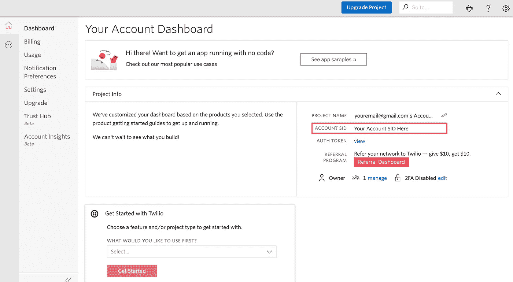
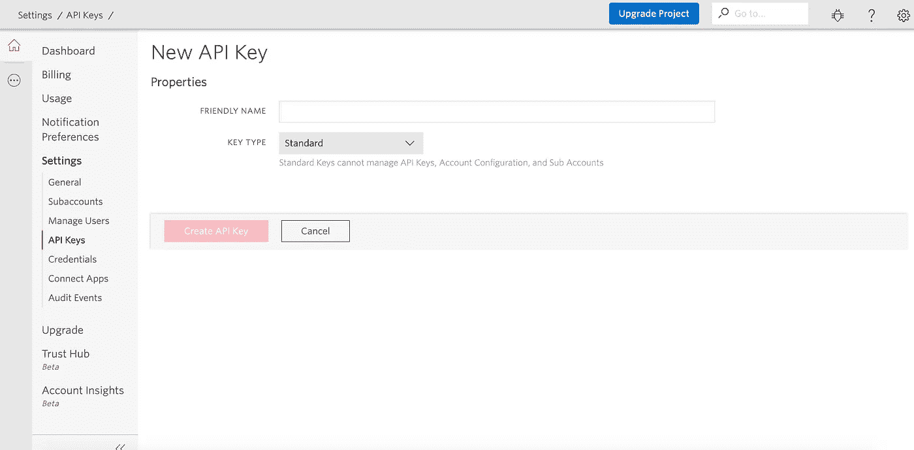
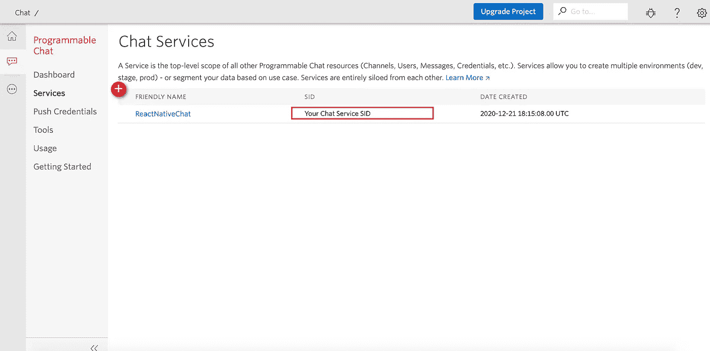
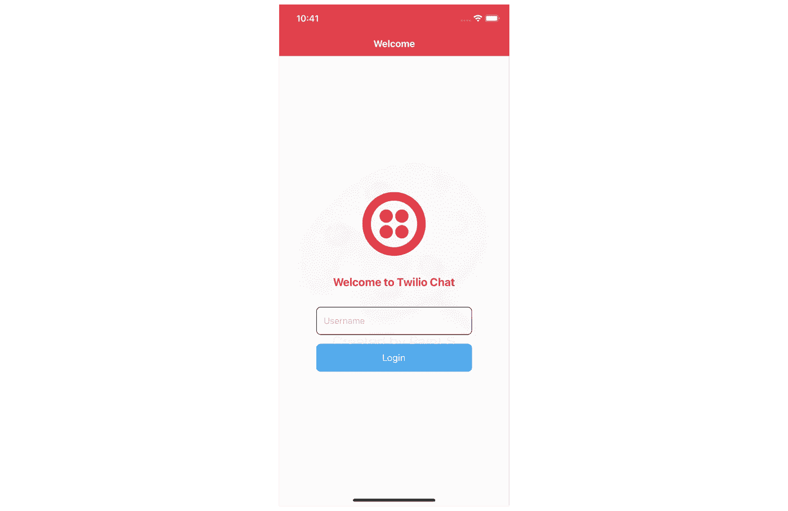
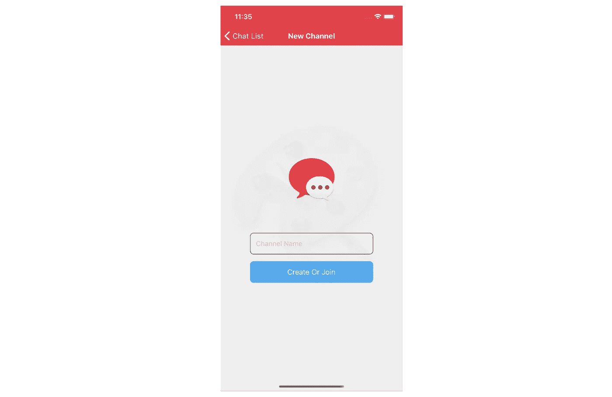
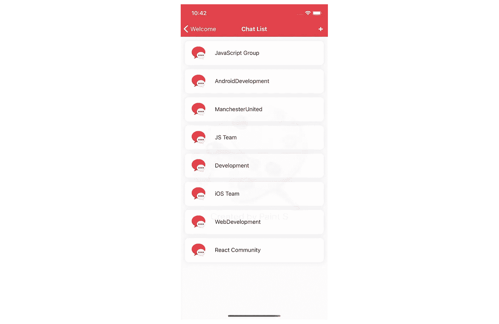
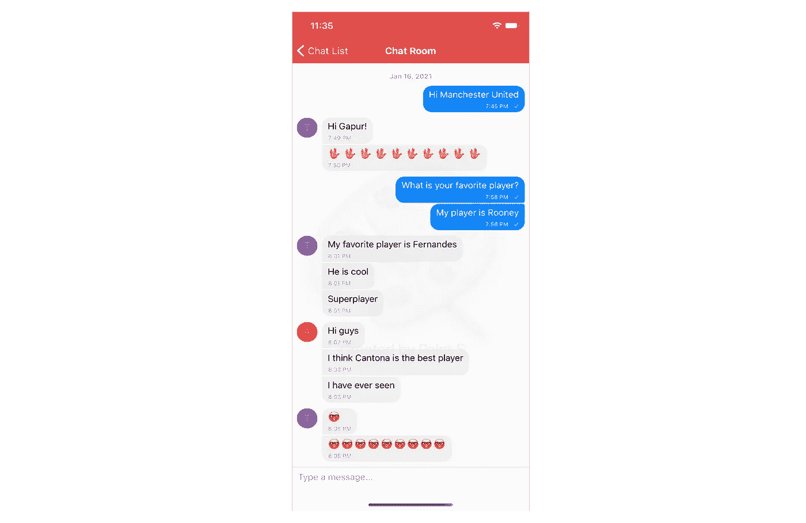
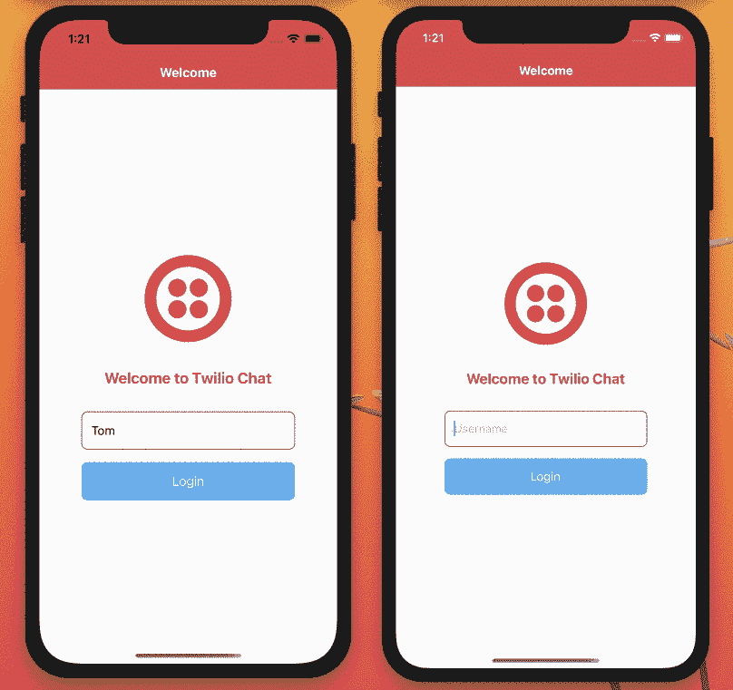

# 使用 React Native 构建一个基于 Twilio 的聊天应用

> 原文：<https://betterprogramming.pub/build-a-twilio-powered-chat-app-using-reactn-ative-2460b7995a30>

## 使用 Twilio 可编程聊天工具快速入门


格伦·卡斯滕斯-彼得斯在 [Unsplash](https://unsplash.com/s/photos/texting?utm_source=unsplash&utm_medium=referral&utm_content=creditCopyText) 上的照片

我想为我的 React 本机应用程序构建一个快速、功能全面的聊天功能。我设法用 Twilio 可编程聊天工具来做这件事。

Twilio 可编程聊天使您可以轻松地将聊天功能添加到您的 web 和移动应用程序中，而无需构建或扩展实时聊天后端。Chat 拥有所有必要的 API 和特性来与您的业务逻辑集成，以确保您能够掌控一切。

我在互联网上搜索了很多，以找到使用 Twilio 可编程聊天和 React Native 的最佳方式。不幸的是，我没找到多少。所以我决定写一篇关于它的文章，希望能节省别人一些时间。

# 设置项目

首先，我将通过以下代码行创建一个新的 React 本地项目:

```
react-native init react_native_twilio_chat
cd react_native_twilio_chat
npm run ios
```

太好了，我们已经成功创建了 React 本机应用程序。

# 创建我们的服务器

在开始之前，我们需要生成一个访问令牌来授权 React Native 应用程序与可编程的 Twilio Chat 进行通信。

为了设置我们的聊天后端，我们需要来自 Twilio 帐户的四个值。我们将这些存储在我们的`.env`文件中:

*   **服务实例 SID**—一个[服务](https://www.twilio.com/docs/api/chat/rest/services)实例，我们应用程序的所有数据都存储在这个实例中并确定其范围
*   **账户 SID** —您的主要 Twilio 账户标识符
*   **API 密钥** —用于认证
*   **API 秘密** —用于认证

如果您没有 Twilio 帐户，请访问 Twilio，然后[轻松创建一个免费帐户](https://www.twilio.com/try-twilio)。

现在，如果你的账户准备好了，你可以在 [Twilio 控制台](https://www.twilio.com/console)上找到你的账户 SID。您应该将它作为值`TWILIO_ACCOUNT_SID`复制并粘贴到`.env`文件中。



帐户 SID

接下来，我们需要通过导航到设置> API 密钥>新 API 密钥来生成 API 密钥和 API 秘密。



新的 API 密钥页面

如果您成功地创建了这些东西，让我们复制并粘贴 SID 和 secret 作为值`TWILIO_API_KEY`和`TWILIO_API_SECRET`。


API 密钥和机密

最后，我们需要通过导航到所有产品&服务>可编程聊天>服务>聊天服务来创建一个新的[聊天服务](https://www.twilio.com/console/chat/services)。



聊天服务 SID

让我们复制并粘贴服务 SID 作为值`TWILIO_CHAT_SERVICE_SID`。

最后，我们的`.env`文件应该是这样的:

```
TWILIO_ACCOUNT_SID=your_account_sid
TWILIO_API_KEY=your_api_key
TWILIO_API_SECRET=your_api_secret
TWILIO_CHAT_SERVICE_SID=your_chat_service_sid
```

当我们的`.env`准备好了，我们可以创建一个简单的服务器，只有一个`GET`路由`/token/:identity`。该路由将从`TWILIO`请求并返回一个令牌。让我们为服务器安装依赖项:

```
yarn add express dotenv twilio
```

创建我们的`server.js`:

这就是我们的服务器。现在，我们可以用下面的命令行运行我们的服务器:

```
node server.js
```

# 反应导航

为了向您展示 Twilio 可编程聊天的实际应用，我将在 React Native 上构建一个全功能的应用程序。我们的应用程序将有四个屏幕:`WelcomeScreen`、`ChatListScreen`、`ChatRoomScreen`和`ChatCreateScreen`。

我们需要一个路由器在 React 本地应用的屏幕间导航。所以我要用`[react-navigation](https://reactnavigation.org)`库。React 导航在 iOS 和 Android 上都提供了 100%的原生平台导航。我们应该用所需的包来安装它:

```
yarn add @react-navigation/native react-native-reanimated react-native-gesture-handler react-native-screens react-native-safe-area-context [@react](http://twitter.com/react)-native-community/masked-view [@react](http://twitter.com/react)-navigation/stack
```

# 欢迎屏幕

我们将从欢迎屏幕开始。让我们创建`welcome-screen.js`并添加以下代码:

我们将使用`username`来生成 Twilio 访问令牌。



欢迎屏幕

# 聊天-创建屏幕

下一步是创建一个聊天客户端，这就是我们需要令牌的目的。我将使用`[twilio-chat](https://www.npmjs.com/package/twilio-chat)`来连接和使用 [Twilio SDK](http://media.twiliocdn.com/sdk/js/chat/releases/4.0.0/docs/index.html) 。让我们安装并测试它:

```
yarn add twilio-chat events
```

然后，我们将创建一个`getToken`方法来处理与令牌服务器的通信。

现在，我们应该通过调用`[create(token)](http://media.twiliocdn.com/sdk/js/chat/releases/4.0.0/docs/Client.html#.create__anchor)`来创建带有令牌的 Twilio 聊天客户端实例。此外，我们有两个事件来帮助管理我们的令牌过期:`[tokenAboutToExpire](http://media.twiliocdn.com/sdk/js/chat/releases/4.0.0/docs/Client.html#event:tokenAboutToExpire__anchor)`和`[tokenExpired](http://media.twiliocdn.com/sdk/js/chat/releases/4.0.0/docs/Client.html#event:tokenExpired__anchor)`。

让我们创建一个`twilio-service.js` 文件来防止 Twilio 聊天客户端在所有屏幕上重复初始化。我们将创建并存储一个 Twilio 服务客户端实例，并在每个屏幕上使用它。

最后，我将用下面的代码创建`chat-create-screen.js`:

一旦聊天客户端被初始化，我们可以用`[createChannel({ uniqueName, friendlyName })](http://media.twiliocdn.com/sdk/js/chat/releases/4.0.0/docs/Client.html#createChannel__anchor)`创建一个新的聊天频道，或者用`[join()](http://media.twiliocdn.com/sdk/js/chat/releases/4.0.0/docs/Channel.html#join__anchor)`方法加入一个现有的频道。要加入一个现有的频道，我们必须使用`[getChannelByUniqueName](http://media.twiliocdn.com/sdk/js/chat/releases/4.0.0/docs/Client.html#getChannelByUniqueName__anchor)()`方法从 Twilio 获取频道，并将房间名传递给它。

如果通道不存在，将会引发异常。如果确实存在，该方法将返回通道资源，并从那里加入通道。



新频道屏幕

# 聊天列表屏幕

我将在`ChatListScreen`上显示我订阅的所有频道。作为用户，当我在`CreateChannelScreen`上加入或创建新频道时，我希望使用更新的频道。因此，我们需要在 Redux 或 React 上下文中全局存储通道。Redux 对于我们简单的应用程序来说太复杂了，所以我们将使用 React 上下文。

让我们用下面的代码创建我们的`app-context.js`:

`AppContext`存储`channels`和`updateChannels`方法的列表。因此我们可以得到所有的频道:

```
const { channels, updateChannels } = useApp();
```

现在，我们的`chat-list-screen.js`:

首先，我们检索令牌并创建 Twilio 聊天客户端的实例。然后，我们通过使用`getSubscribedChannels()`方法获得所有订阅频道的当前列表，并将它们存储在全局 React 上下文中。

Twilio 没有提供根据最新消息对频道列表进行排序的功能。最好的办法是将所有通道加载到一个数组中，并自己对它们进行排序。

因此，我订阅了`messageAdded`事件，当一条新消息被添加到服务器上的频道时，该事件将被触发，因为我希望按照最后一条消息的时间对频道列表进行排序。因此，当有人通过聊天发送消息时，我们将更新特定频道的最后一条消息的时间。



聊天列表屏幕

# 聊天室屏幕

我将使用`[react-native-gifted-chat](https://github.com/FaridSafi/react-native-gifted-chat)`创建一个频道聊天室。`react-native-gifted-chat`是 React Native 最完整易用的聊天 UI。

让我们安装它:

```
yarn add react-native-gifted-chat
```

首先，我们必须获得一个 Twilio 聊天客户端，或者创建一个(如果不存在的话)。然后我们需要使用`[getChannelBySid(channelSid)](http://media.twiliocdn.com/sdk/js/chat/releases/4.0.0/docs/Client.html#getChannelBySid__anchor)`来获取特定的频道。

如果我们获得了通道，我们就可以通过使用`[getMessages()](http://media.twiliocdn.com/sdk/js/chat/releases/4.0.0/docs/Channel.html#getMessages__anchor)`方法从通道中获得所有的消息。

此外，我将订阅`[messageAdded](http://media.twiliocdn.com/sdk/js/chat/releases/4.0.0/docs/Channel.html#event:messageAdded__anchor)`事件，当新消息被添加到频道并更新我们的聊天时，该事件将被触发。

让我们来创造`chat-room-screen.js`:

我创造了一个叫做`onSend()`的方法。这个方法将调用 channel 对象上的 SDK 方法`[sendMessage()](http://media.twiliocdn.com/sdk/js/chat/releases/4.0.0/docs/Channel.html#sendMessage__anchor)`,并将用户输入的消息传递给它。



聊天室屏幕

# 让我们演示一下我们的 Twilio 聊天应用程序



反应-本地-twilio-chat

如果你想检查所有的代码，这里有到 GitHub 的链接。

# 结论

感谢阅读——我希望这篇文章对你有用。编码快乐！

# 资源

[](https://www.twilio.com/blog/2017/10/implement-chat-javascript-nodejs-react-apps.html) [## 在 JavaScript、Node.js 和 React 应用中实现聊天

### 如果您正在使用 JavaScript React 构建一个聊天用户界面，您如何集成后端的其余部分…

www.twilio.com](https://www.twilio.com/blog/2017/10/implement-chat-javascript-nodejs-react-apps.html) [](https://www.twilio.com/blog/build-a-chat-app-with-twilio-programmable-chat-and-react) [## 用 Twilio 可编程的 Chat 和 React.js 构建聊天应用

### 本教程将教你如何使用 Twilio 的可编程聊天 API 在 React 中构建一个聊天应用。完成后…

www.twilio.com](https://www.twilio.com/blog/build-a-chat-app-with-twilio-programmable-chat-and-react)