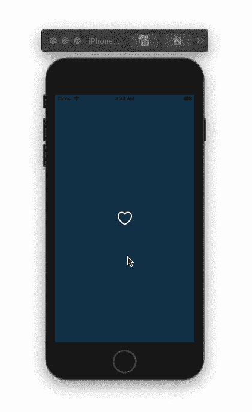
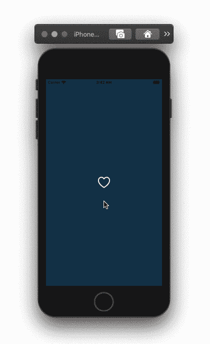

# 在 SwiftUI 中构建一个受 Twitter 启发的动画 Like 按钮

> 原文：<https://betterprogramming.pub/build-a-twitter-inspired-animated-like-button-in-swiftui-d558c4a3fc00>

## 一个有趣的、生动的心形按钮

Jude Beck 在 [Unsplash](https://unsplash.com?utm_source=medium&utm_medium=referral) 上拍摄的照片。

# 喜欢按钮视图

创建一个包含一个`ZStack`的结构视图，然后将两个`Image`视图添加到堆栈中。定义一个状态布尔变量，当用户点击图像时，该变量会改变其状态。使用`heart.fill`和`heart` SF 符号，或者添加您的自定义图像。

如果你使用 SF 符号，那么给带有`heart.fill`符号的图像视图添加以下修饰符:

*   `opacity`:图像未点击时数值为 0，点击时数值为 1。
*   `scaleEffect`:刻度不能是 0，所以当图像没有被点击时给它取值 0.1，当图像被点击时给它取值 1。
*   你可以尝试动画。我选择了一个线性动画来简化它。

给`ZStack`以下三个修改器:

*   `font`:这将改变 SF 符号的大小。
*   `onTapGesture`:切换这个修饰符内部的布尔变量。
*   `foregroundColor`:当用户点击图像时，将`ZStack`元素的颜色从白色变为红色。

代码结果:心形按钮动画

# CirclesView

创建一个新的结构视图，并将以下常量添加到该视图中:

*   `angle`:控制每个圆的位置。对于九个圆来说，40 度是一个很好的角度。
*   `radius`:通过偏移位置来控制圆的半径。
*   `speed`:控制动画速度。
*   `scale`:当图像未被点击时，给定标尺值 0.1，当图像被点击时，给定标尺值 1。

在我们的`CirclesView`中创建一个`ZStack`。在`ForEach`循环中，用以下修改器创建一个圆形:

*   `fill`:给圆形添加颜色。
*   `frame`:改变形状/视图尺寸。
*   `scaleEffect`:当图像未被点击时，赋予形状值 0.1，当图像被点击时，赋予`scale`变量。
*   同样，你可以尝试动画。线性动画看起来很适合我。
*   `offset`:通过偏移`x`和`y`的位置，形成圆形。使用下面代码片段中的公式。

您可以创建一个颜色数组来使用，而不是用相同的颜色填充所有的圆。

# 将 CirclesView 添加到喜欢按钮

在我们的`LikeButton`视图中，添加以下状态变量:

在`ZStack`内部，增加两个`CirclesViews`。您可以控制圆的半径、动画速度和比例。将`opacity`修饰符添加到两个`CirclesViews`中，并将上面定义的`opacity`变量传递给它。使用`.rotationEffect`调节器抵消其中一个`CircleViews`的旋转。

最后，给`ZStack`添加一个`scaleEffect`修饰符，并将`.onTapGesture`修饰符的代码改为下面的代码。该代码将动画显示`ZStack`的比例和`CircleViews`的不透明度。在第一个动画结束后，不透明度应该回到 0。

代码结果:心形和圆形动画

搞定了。感谢阅读。