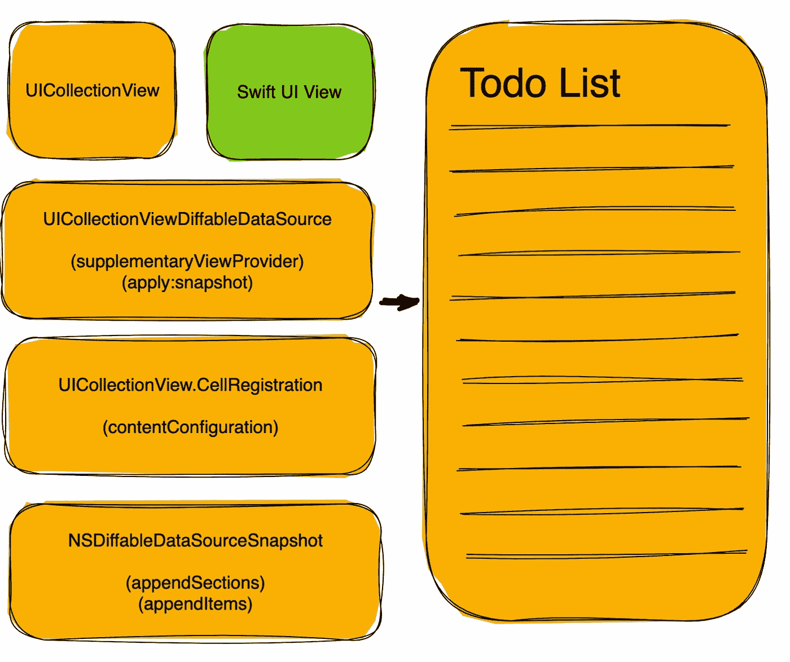
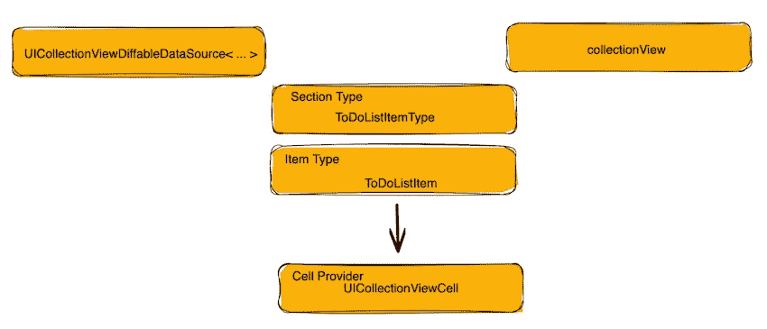

# 以 SwiftUI 视图为单元格构建 iOS 16 UICollectionView

> 原文：<https://betterprogramming.pub/build-a-uicollectionview-with-a-swiftui-view-as-its-cell-7a7121e84309>

## 利用 uihosting 配置

这篇文章将尝试说明如何在`UICollectionView`中整合 SwiftUI 视图，同时还将提供一个使用现代集合视图和不同数据源的快速介绍。

它将利用 WWDC 22 中为 iOS 和 tvOS 16 引入的新的`UIHostingConfiguration` API。如果你想尝试这个，你需要 Xcode 14(撰写本文时是测试版)。

我们将创建一个非常小的`ToDo`列表屏幕，显示`ToDo`列表项及其状态。`ToDo`列表将是一个集合视图，它的单元格将组成一个 SwiftUI 视图。

当我们完成时，屏幕将如下所示。下面讨论的完整示例可以在这里找到[。](https://github.com/mvemjsun/CollectionView)

具有 SwiftUI 视图的 UICollectionView 待办事项列表

这是继上一篇关于在 UIKit 视图中使用 SwiftUI 视图的[帖子](/using-swiftui-view-inside-a-uikit-view-efd44e06f10c)之后。

# 待办事项列表数据

一个`ToDoList`数据结构由一个`ToDoListItems`数组组成。这种关系的模型如下所示。我们拥有的待办事项列表数据将包含`Home`和`Office`的待办事项列表。

# 待办事项列表 SwiftUI 视图

让我们创建一个 SwiftUI 视图，它将显示一个单独的`ToDoListItem`，如下所示。

上面的视图使用了另一个 SwiftUI 视图`TaskStatus`。它根据状态将`ToDo`列表项的状态(完成或未完成)显示为系统图像图标。

# 构成集合视图

我们将创建一个名为`ToDoListViewController`的`UIViewController`类。在该类的`viewDidLoad`方法中，我们将执行以下操作。

*   使用复合布局创建和设置集合视图(参见下一节的讨论),并将其作为子视图插入。
*   设置集合视图差异数据源，并将其连接到集合视图。这也将设置它使用 SwiftUI 视图。
*   使用快照将数据应用到不同的数据源

我们将在后面的文章中讨论`viewDidLoad`中函数的工作，集合视图布局和数据源。

# 收藏视图布局

使用`UICollectionViewLayout`属性(`init(frame: collectionViewLayout:`初始化器)初始化集合视图。这定义了单元格在集合视图中的布局方式。自 iOS 13 以来，我们已经获得了一个名为`UICollectionViewCompositionalLayout`的新布局 API，正如苹果公司所说，“一个让你以高度自适应和灵活的视觉排列组合项目的布局对象”。该布局还引入了[节、组&项](https://developer.apple.com/documentation/uikit/uicollectionviewcompositionallayout)的概念。一旦使用初始布局创建了集合视图，您还可以使用 API `setCollectionViewLayout(layout:animated)`动态设置集合视图的布局。

节中有组，组中有项目。在我们的例子中，该部分对应于家庭或办公室，该项目是一个单独的`ToDoList`项目。

在我们的 ToDo 列表示例中，我们将项目横跨屏幕的整个宽度(`fractionalWidth(1.0)`)，并将它的高度设置为它所在的组的高度(`fractionalHeight(1.0)`)。

类似地，我们希望该部分跨越整个宽度&绝对高度为 60 ( `absolute(60)`)。

## 不同数据源和单元注册

从 iOS 13 和 tvOS 13 开始，我们有了用于`UICollectionViewDiffableDataSource`的 API，这大大简化了集合视图获取数据的方式。

我们使用它将集合视图连接到它的数据源，并定义它的“单元格提供者”。单元格提供程序是一个为集合视图返回单元格的函数。它的`init`签名是`init(collectionView:cellProvider:)`。

除了不同的数据源，我们还有一个 API 来进行“**单元注册**”(也可以使用旧的 API 如`register(_:forCellWithReuseIdentifier:))`来实现)。单元注册 API 提供了一种配置显示单元的方法。

> *现在，当我们使用 SwiftUI 来设置单元格* `*contentConfiguration*` *属性时，swift ui 的单元格注册功能就发挥出来了。我们用它来提供* `*UIHostingConfiguration*` *，这是一个新的 API (iOS 16)，允许我们指定 SwiftUI 视图作为其内容。如上所示，我们已经将内容设置为* `*CellView(toDoListItem: item)*` *，其中* `*CellView*` *是我们之前创建的 SwiftUI 视图。*

接下来，我们使用`dequeConfiguredCell(using:for:item)` API

uicollectionviewdiffabledata source 组件

为了完成数据源，我们最后设置数据源的`supplementaryViewProvider`属性来返回一个常规的 UIKit 视图`HeaderViewCell`。

# 将数据应用到数据源

激活集合视图的最后一步是向其中应用一些数据。同样，这是使用一个名为`NSDiffableDataSourceSnapshot`的最新 API (iOS 13)完成的。

一个可区分的数据源利用了我们之前讨论过的部分和项目的概念。我们使用一个 SectionIdentifierType `ToDoListItemType`和一个`ItemIdentifierType` `ToDoListItem`来初始化一个不同的数据源对象。

我们的`ToDo`列表项目属于“家庭”或“办公室”部分。我们使用数据源上的`applySections`和`appendItems` API，然后是`apply` API 来设置数据。

当我们将快照应用到集合视图数据源时，集合视图会自动重新加载数据！

# 摘要

自 iOS 13 以来，随着组合布局和不同数据源的引入，集合视图在开发人员体验方面有了很大改善。随着 SwiftUI 不断改进的支持和改进，我们现在能够利用现有`collectionView`的优势。

使用这些组件时要掌握的主要概念是理解`DiffableDataSource`、组合布局和单元注册。

Xcode 项目的完整示例可以在[这里](https://github.com/mvemjsun/CollectionView)找到。

# 参考

*   构图布局—[https://developer . apple . com/documentation/ui kit/uicollectionview compositionallayout](https://developer.apple.com/documentation/uikit/uicollectionviewcompositionallayout)
*   可区分数据源—[https://developer . apple . com/documentation/ui kit/uicollectionviewdiffabledata source](https://developer.apple.com/documentation/uikit/uicollectionviewdiffabledatasource)
*   使用可区分数据源—[https://developer . apple . com/documentation/uikit/views _ and _ controls/collection _ views/updating _ collection _ views _ using _ diffable _ data _ sources](https://developer.apple.com/documentation/uikit/views_and_controls/collection_views/updating_collection_views_using_diffable_data_sources)
*   UI 托管配置—[https://developer . apple . com/documentation/swift UI/uihostingconfiguration](https://developer.apple.com/documentation/swiftui/uihostingconfiguration)