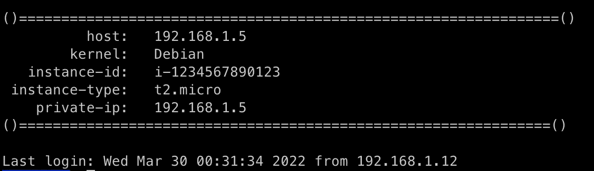

# 用 Ansible 在 AWS 上构建一个有用的 Linux 登录横幅

> 原文：<https://betterprogramming.pub/build-a-useful-linux-login-banner-on-aws-with-ansible-4c000aba1258>

## 怎么换横幅，放什么进去


[卢卡斯](https://unsplash.com/@lukash?utm_source=unsplash&utm_medium=referral&utm_content=creditCopyText)在 [Unsplash](https://unsplash.com/s/photos/linux?utm_source=unsplash&utm_medium=referral&utm_content=creditCopyText) 上的照片

大多数默认的 Linux 登录横幅(或者 MOTD 的)都有很多不尽如人意的地方。登录消息并不是让它保持原样的东西。它可以进行更改、定制和扩展，以适应特定的使用情况。如果您经常访问大量不同的云服务器或本地服务器，更改横幅几乎是一项要求。

您可以在登录横标中包含的选项几乎是无穷无尽的。你可以放任何东西，从关于服务器本身的基本信息到一个有趣的日常笑话。唯一的限制是你的想象力。

在本文中，我们不仅将探讨如何更改这个横幅以及在其中放入什么，还将探讨如何使用 Ansible 部署它，并在其中包含一些方便的 AWS EC2 信息。

## 抓取 EC2 实例元数据

如果您以前没有使用过实例元数据，那么您将享受到真正的乐趣。隐藏在大多数 EC2 实例 ami 中的是从该实例的操作系统中收集关于该实例的基本信息的能力。该实例公开了一个本地自行分配的 IP 地址，该地址为收集信息提供了一个基本的 HTTP 服务器。

 [## 检索实例元数据

### 因为可以从正在运行的实例中获得实例元数据，所以不需要使用 Amazon EC2 控制台…

docs.aws.amazon.com](https://docs.aws.amazon.com/AWSEC2/latest/UserGuide/instancedata-data-retrieval.html) 

元数据终结点通常在以下自行分配的 IPv4 地址上公开(只能在本地访问):

```
http://169.254.169.254/latest/meta-data/
```

例如，如果您想从实例内部获取私有 IP，您可以运行:

```
curl [http://169.254.169.254/latest/meta-data/local-ipv4](http://169.254.169.254/latest/meta-data/local-ipv4)
```

这将返回当前分配给该实例的私有 IP 地址。

如果我们想把这样的东西放到 Ansible 中，我们所要做的就是从剧本中发出一个简单的 web 请求。它看起来会像这样:

```
- name: Get EC2 instance metadata
  uri:
    url: "[http://169.254.169.254/latest/meta-data/local-ipv4](http://169.254.169.254/latest/meta-data/local-ipv4)"
    return_content: true
  register: ec2_local_ip
```

一旦这个任务完成，私有 IP 将被存储在`ec2_local_ip`变量的结果`content`键中。

如果您想获取关于实例的更丰富的元数据，您可以使用名为“[身份文档](https://docs.aws.amazon.com/AWSEC2/latest/UserGuide/instance-identity-documents.html)”的东西。这是一个 JSON blob，充满了实例类型、私有 IP 等信息。

可以从以下路径检索身份证明文件:

```
[http://169.254.169.254/latest/dynamic/instance-identity/document](http://169.254.169.254/latest/dynamic/instance-identity/document)
```

请注意，这属于`dynamic`数据，而不是`meta-data`键。

它看起来像这样:

```
{
  "accountId" : "123456789",
  "architecture" : "x86_64",
  "availabilityZone" : "us-west-1a",
  "billingProducts" : null,
  "devpayProductCodes" : null,
  "marketplaceProductCodes" : null,
  "imageId" : "ami-123456789",
  "instanceId" : "i-00001234567890",
  "instanceType" : "t2.micro",
  "kernelId" : null,
  "pendingTime" : "2022-01-21T00:47:18Z",
  "privateIp" : "192.168.1.5",
  "ramdiskId" : null,
  "region" : "us-west-1",
  "version" : "2017-09-30"
}
```

为了在 Ansible 中检索它，我们将使用略有不同的请求任务版本，并设置一个新变量:

```
- name: Get the instance identity document
  uri:
    url: "[http://169.254.169.254/latest/dynamic/instance-identity/document](http://169.254.169.254/latest/dynamic/instance-identity/document)"
    return_content: true
  register: identity_doc- set_fact:
    instance_metadata: "{{ identity_doc.json }}"
```

在这组任务完成后，我们将把身份文档的 JSON blob 加载到名为`instance_metadata`的变量中。

现在，让我们看看如何构建基本的行动手册，用这些信息替换横幅广告。

## 构建行动手册

为了更改横幅，我们需要在行动手册中为此设置一个简单的任务。几乎在所有情况下，你都想用自定义的东西替换整个横幅。在本例中，我们将对整个文件进行模板化:

```
- name: Change MOTD banner
    template:
      src: motd.j2
      dest: /etc/motd
    register: motd_file- name: Restart ssh when updated
    service:
      name: ssh
      state: restarted
    when: motd_file.changed
```

在上面的任务中，我们将模板文件应用到现有的`motd`路径之上。然后，假设文件已经被修改，我们重启`ssh`服务。这一点很重要，因为除非您重新启动服务，否则登录横幅不会被选中。

*注意:根据您的 Linux 发行版，该服务可能会被称为* `*ssh*` *之外的其他名称。*

现在，让我们看看如何构建模板本身。

## 构建模板

可转换模板是非常强大的功能。在角色或剧本中，您可以设置能够生成非常复杂的文本布局的模板文件。您可以使用这个引擎模板化配置文件等等。

对于这个例子，我们将插入我们收集的元数据，并构建一个更加美观的布局。

创建一个名为`motd.j2`的文件(可以在您的角色的`templates`目录中，也可以在剧本所在的目录中)，让我们开始构建基本模板:

```
()================================================================() host:   {{ ansible_host }}
        kernel:   {{ ansible_kernel }}
   instance-id:   {{ instance_metadata.instanceId }}
 instance-type:   {{ instance_metadata.instanceType }}
    private-ip:   {{ instance_metadata.privateIp }}()===============================================================()
```

在这个模板中，我们做了一些简单的事情，比如使用制表符和换行符进行格式化，但是我们还从实例标识文档中引入了一些变量以及内部的可转换变量。

请记住，在我们的剧本中，我们将身份文档存储在一个名为`instance_metadata`的变量中，这样我们就可以像访问普通字典一样访问它，并在模板中引用这些变量。

让我们看看最终的剧本会是什么样子。

## 把所有的放在一起

下面是一个行动手册示例，它将针对`localhost`运行，收集元数据并将横幅更改为我们的新模板:

```
---
- hosts: localhost
  tasks:
  - name: Get the instance identity document
    uri:
      url: "[http://169.254.169.254/latest/dynamic/instance-identity    /document](http://169.254.169.254/latest/dynamic/instance-identity/document)"
      return_content: true
    register: identity_doc - set_fact:
      instance_metadata: "{{ identity_doc.json }}" - name: Change MOTD banner
    template:
      src: motd.j2
      dest: /etc/motd
    register: motd_file - name: Restart ssh when updated
    service:
      name: ssh
      state: restarted
    when: motd_file.changed
```

根据您的特定 Linux 发行版的 SSH 配置，您可能需要更新 SSH 守护进程以支持使用 MOTD。

在 Debian 中，它位于`/etc/ssh/sshd_config`中。移除或注释掉`Banner`行应该可以让 MOTD 显示出来。

如果你仍然遇到麻烦，你可能还需要禁用位于`/etc/update-motd.d`的任何动态 MOTD 脚本。

一旦您将所有东西放在一起，并在 EC2 主机上运行剧本，您应该会看到一个类似于以下内容的令人愉快的新登录标语:



EC2 主机上的动态登录横幅。

现在，您登录后就可以访问基本的 EC2 信息了。这可以节省时间，并确保您使用正确的配置登录到正确的主机。

您可以扩展这个登录横幅，以显示来自实例元数据和 [Ansible](https://docs.ansible.com/ansible/latest/reference_appendices/special_variables.html) 的更多信息。如果你想要更有趣的东西，你可以添加一些功能，比如 [Cowsay](https://linux.die.net/man/1/cowsay) 或者 [Fortune](https://linux.die.net/man/6/fortune) 。

感谢您的阅读！如果你喜欢这篇文章，看看下面我的一些其他文章:

*   [*如何解决 Linux 服务器运行缓慢的问题*](/how-to-troubleshoot-slow-linux-servers-20a4e2843131)
*   [*AWS 本地区域的低延迟性能*](/low-latency-performance-with-aws-local-zones-e8b805aa7529)