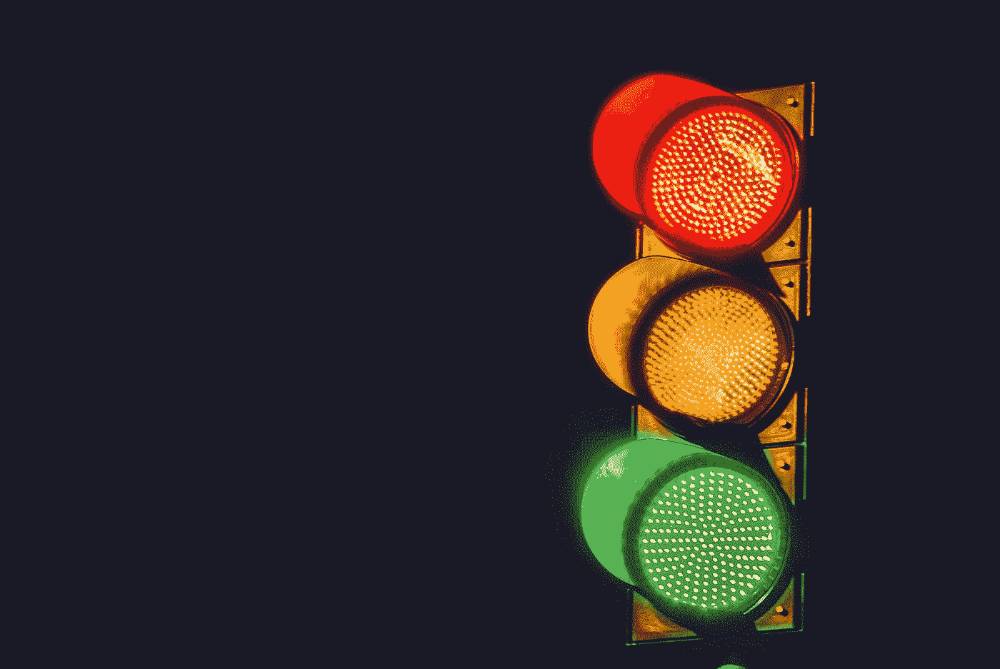
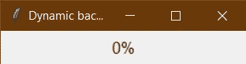
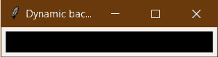
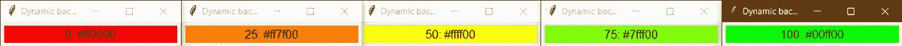
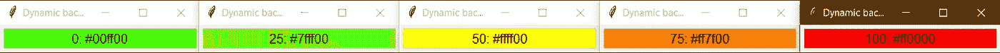
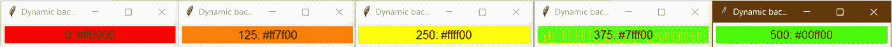
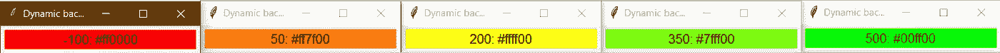

# 构建一个用户定义的函数来返回一个基于值和范围的颜色

> 原文：<https://betterprogramming.pub/build-a-user-defined-function-to-return-a-color-based-on-a-value-and-range-1f4838b29b2d>

## 以及复习十六进制颜色代码



在 [Unsplash](https://unsplash.com?utm_source=medium&utm_medium=referral) 上由 [Harshal Desai](https://unsplash.com/@harshaldesai?utm_source=medium&utm_medium=referral) 拍摄的照片。

*被困在付费墙后面？点击* [你可以试着用谷歌的颜色选择器](https://medium.com/better-programming/build-a-user-defined-function-to-return-a-color-based-on-a-value-and-range-1f4838b29b2d#RRGGBB 的字符串，其中 RR、GG 和 BB 表示十六进制格式的红色、绿色和蓝色分量的强度。十进制颜色强度从 0(最暗)到 255(最亮)不等。当转换成十六进制时，这转换成 00 到 FF 的范围。因此，黑色的十六进制代码是#000000(表示所有三种成分都处于最大黑暗状态)。同样，对于白色来说，是#FFFFFF。对于纯红色、绿色和蓝色，代码分别为#FF0000、#00FF00 和#0000FF。</p><p id=)[来了解它是如何处理黄色、棕色等复合色的。](https://www.google.com/search?q=color+picker)

现在来看代码。

我已经创建了一个最小的 tkinter UI，它由一个窗口中的标签组成:

运行这个程序后，您会看到下面的窗口:



在这里，我们可以看到值为 0，背景为灰色。因为我们没有提供背景颜色，所以它默认为灰色。

要添加背景颜色，我们只需要使用`bg` 参数将它提供给`Label`。让我们添加黑色:

```
pred = Label(mainframe, width=25, text=f"{value}%", bg='#000000', anchor='c',padx=5, font=('TkTextFont',12))
```



现在我们将创建一个函数，根据值和调色板为标签提供颜色。

首先，为了简单起见，让我们将我们的范围定义为 0 到 100，0 表示不好(红色)，100 表示好(绿色)。50 会是中性(黄色)。在这种情况下，不良、中性和良好的代码应为#ff0000、#ffff00 和#00ff00。从 0 到 50，红色为 255 (ff)，绿色从 0 (00)逐渐增加到 255 (ff)。从 50 到 100，红色从 255 降到 0，绿色保持 255。蓝色在两种情况下都保持为 0。

这可以表示为:

这个 RGB 代码现在需要转换成十六进制颜色代码。Python 有一个内置的整数到十六进制的转换器。

`print(hex(0))`返回`0x0`，其中`0x`是标识数字基数的前缀。`print(hex(255))`返回`0xff`。我们只需要忽略前两个字符，用 0 右填充输出，使其长度为 2。对所有三个 RGB 代码都这样做，得到的字符串以`#`为前缀，将其识别为十六进制颜色代码。这个一行程序做到了:

```
"#%s%s%s" % tuple([hex(c)[2:].rjust(2, "0") for c in (r, g, b)])
```

我们来测试一下这个逻辑！

我修改了标签文本以显示值和十六进制代码。让我们看看 0、25、50、75 和 100 的标签是什么样子的:



完美！

现在，如果我们需要改变方向呢？就是现在 0 是好的，100 是坏的？我们只是互换了红色和绿色的值！

用`color = hexcolor(value, reverse=True)`运行相同的脚本，我们得到:



最后，自定义范围怎么样？比如 0 到 500？我们将 UDF 修改如下:

用`range = [0, 500]`运行脚本给出:



到目前为止，一切顺利。[-100，500]怎么样？从值-100 开始:

`_tkinter.TclError: invalid color name “#ffx7f00”`

显然，由于负值，颜色代码被计算为负值，从而导致无效的十六进制代码。

我们需要做的是确保该范围在 UDF 转换为正范围。这可以通过将最小值设置为 0 并将最大值设置为`abs(range[1]-range[0])`来实现，这样范围大小保持不变。输入值也需要缩放为`value-range[0]`。

我们的最终代码如下所示:

在-100 到 500 的范围内运行，我们得到:



太好了！一切按预期运行。

这个 UDF 可以用于任何希望用颜色来表示值的 UI 元素。实现可能不是最有效的，甚至可能有一个包或内置的 Python 函数已经这样做了。如果你知道任何这样的方法，请让我知道。

Medium 仍然不支持向印度以外的作者支付费用。如果你喜欢我的内容，你可以给我买杯咖啡:)

[](https://www.buymeacoffee.com/siddhantsadangi) [## Siddhant Sadangi 正在 Streamlit 上创建 python 网络应用程序

### 嘿👋我刚刚在这里创建了一个页面。你现在可以给我买杯咖啡了！

www.buymeacoffee.com](https://www.buymeacoffee.com/siddhantsadangi)