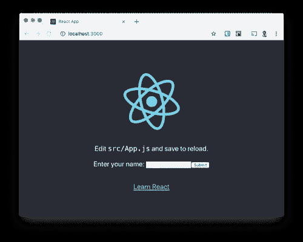
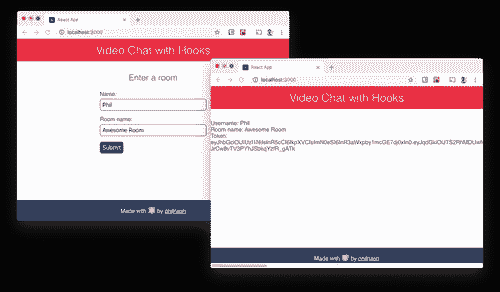
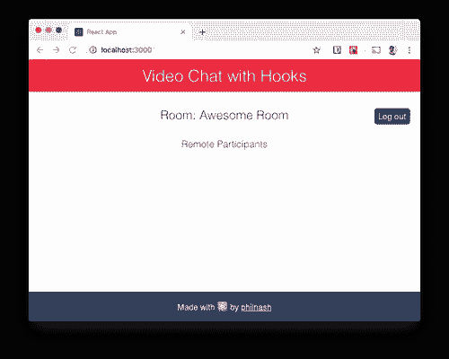
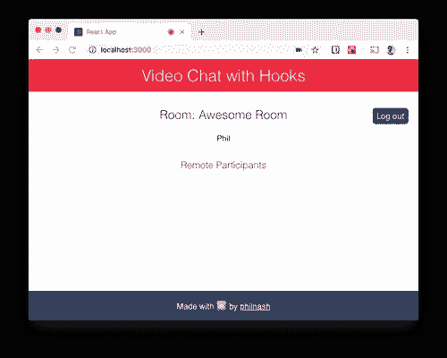
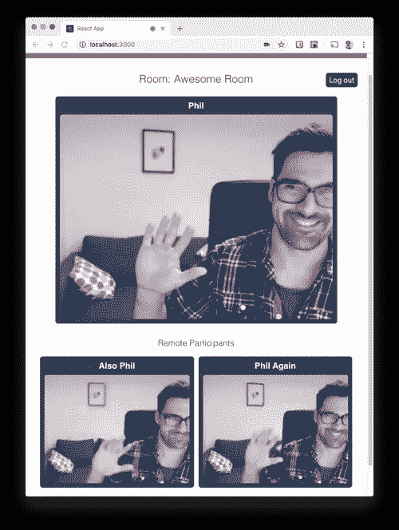

# 用 React Hooks 建立视频聊天

> 原文：<https://betterprogramming.pub/build-a-video-chat-with-react-hooks-5f3337881327>

## 使用 Twilio Video 构建一个视频聊天应用程序，只与功能组件交互


我们以前在 Twilio 博客上看过[用 React 构建的视频聊天，但从那以后，在 16.8 版本中，React 发布了](https://www.twilio.com/blog/2018/03/video-chat-react.html)[钩子](https://reactjs.org/docs/hooks-intro.html)。钩子允许你在功能组件中使用状态或其他 React 特性，而不是编写一个类组件。

在这篇文章中，我们将使用 [Twilio Video](https://www.twilio.com/docs/video/javascript) 构建一个视频聊天应用程序，并使用`useState`、`useCallback`、`useEffect`和`useRef`钩子只与功能组件进行交互。

# 你需要什么

要构建这个视频聊天应用程序，您需要以下内容:

*   [Node.js 和 npm 已安装](https://nodejs.org/en/)。
*   一个 Twilio 账户(在这里注册一个[免费的 Twilio 账户](https://www.twilio.com/try-twilio))。

一旦你得到了所有这些，我们就可以准备我们的开发环境了。

# 入门指南

因此，我们可以直接进入 React 应用程序，我们可以从我创建的的[React 和 Express starter 应用程序](https://github.com/philnash/react-express-starter/tree/twilio) [开始。下载或克隆 starter app 的](https://www.twilio.com/blog/react-app-with-node-js-server-proxy)[“twilio”分支](https://github.com/philnash/react-express-starter/tree/twilio)，进入新目录，安装依赖项:

```
git clone -b twilio git@github.com:philnash/react-express-starter.git twilio-video-react-hooks
cd twilio-video-react-hooks
npm install
```

将`.env.example`文件复制到`.env`。

```
cp .env.example .env
```

运行应用程序以确保一切正常运行:

```
npm run dev
```

您应该会在浏览器中看到这个页面:



# 正在准备 Twilio 凭据

若要连接到 Twilio Video，我们需要一些凭据。从你的 [Twilio 控制台](https://www.twilio.com/console)中，复制你的账户 SID 并将其作为`TWILIO_ACCOUNT_SID`输入到`.env`文件中。

你还需要一个 API 密匙和密码，你可以在控制台中的[可编程视频工具下创建它们。创建一个密钥对，并将 SID 和秘密作为`TWILIO_API_KEY`和`TWILIO_API_SECRET`添加到`.env`文件中。](https://www.twilio.com/console/video/project/api-keys)

# 添加一些风格

在这篇文章中，我们不打算关注 CSS，但是让我们添加一些内容，这样结果看起来不会很糟糕！从这个网址中抓取[CSS 并用它替换`src/App.css`的内容。](https://raw.githubusercontent.com/philnash/twilio-video-react-hooks/master/src/App.css)

现在我们准备开始建造。

# 规划我们的组件

一切都将从我们的`App`组件开始，我们可以为应用程序布局页眉和页脚以及`VideoChat`组件。

在`VideoChat`组件中，我们想要显示一个`Lobby`组件，用户可以在其中输入他们的名字和他们想要加入的房间。

一旦他们输入了这些细节，我们将用一个`Room`组件替换`Lobby`，该组件将处理与房间的连接并显示视频聊天中的参与者。

最后，对于房间中的每个参与者，我们将呈现一个`Participant`组件来处理他们的媒体显示。

# 构建组件

## 应用程序组件

打开`src/App.js`，这里有很多我们可以删除的初始示例应用程序的代码。

另外，`App`组件是一个基于类的组件。我们说过要用功能组件构建整个应用程序，所以我们最好改变这一点。

从导入中，删除`Component`和`logo.svg`的导入。用一个呈现应用程序框架的函数替换整个`App`类。整个文件应该如下所示:

## 视频聊天组件

该组件将根据用户是否输入了用户名和房间名来显示大厅或房间。创建一个新的组件文件`src/VideoChat.js`，并使用以下样板文件开始:

```
import React from 'react';

const VideoChat = () => {
  return <div></div> // we'll build up our response later
};

export default VideoChat;
```

`VideoChat`组件将成为处理聊天数据的顶级组件。

我们需要存储加入聊天的用户的用户名，他们将要连接的房间的房间名，以及他们从服务器获取的[访问令牌](https://www.twilio.com/docs/video/tutorials/user-identity-access-tokens)。

我们将构建一个表单，在下一个组件中输入一些数据。

对于 React 钩子，我们使用`[useState](https://reactjs.org/docs/hooks-reference.html#usestate)` [钩子](https://reactjs.org/docs/hooks-reference.html#usestate)来存储这些数据。

## 使用状态

`useState`是一个函数，它接受一个参数，即初始状态，并返回一个包含当前状态的数组和一个更新该状态的函数。

我们将析构该数组，给出两个不同的变量，如`state`和`setState`。我们将使用`setState`来跟踪组件中的用户名、房间名和令牌。

从 React 导入`useState`开始，为用户名、房间名和令牌设置状态:

接下来，我们需要两个函数来处理当用户在各自的输入元素中输入时对`username`和`roomName`的更新。

虽然这可以工作，但是我们可以在这里使用另一个 React 钩子来优化我们的组件；`useCallback`。

## 使用回调

每次调用该函数组件时，都会重新定义`handleXXX`函数。它们需要成为组件的一部分，因为它们依赖于`setUsername`和`setRoomName`函数，但是它们每次都是相同的。

`useCallback`是一个 React 钩子，允许我们[记忆](https://en.wikipedia.org/wiki/Memoization)函数。也就是说，如果它们在函数调用之间是相同的，它们就不会被重定义。

`useCallback`接受两个参数，要记忆的函数和函数依赖项的数组。如果函数的任何依赖关系发生变化，这意味着被记忆的函数是过时的，然后该函数被重新定义和记忆。

在这种情况下，这两个函数没有依赖关系，所以一个空数组就足够了(来自`useState`钩子的`setState`函数被认为是函数中的常量)。

重写这个函数，我们需要将`useCallback`添加到文件顶部的导入中，然后包装这些函数。

当用户提交表单时，我们希望将用户名和房间名称发送到服务器，以换取我们可以用来进入房间的访问令牌。我们也将在这个组件中创建这个函数。

我们将使用[获取 API](https://developer.mozilla.org/en-US/docs/Web/API/Fetch_API) 将数据作为 JSON 发送到端点，接收并解析响应，然后使用`setToken`将令牌存储在我们的状态中。

我们还将用`useCallback`包装这个函数，但是在这种情况下，这个函数将依赖于`username`和`roomName`，所以我们将它们作为依赖项添加到`useCallback`。

对于这个组件的最后一个功能，我们将添加一个注销功能。这将把用户逐出房间，并让他们返回大厅。为此，我们将令牌设置为`null`。再一次，我们将它包装在`useCallback`中，没有依赖关系。

```
const handleLogout = useCallback(event => {
    setToken(null);
  }, []);

  return <div></div> // we'll build up our response later
};
```

这个组件主要是编排它下面的组件，所以在我们创建这些组件之前，没有什么需要渲染的。

接下来让我们创建`Lobby`组件来呈现要求输入用户名和房间名的表单。

## 大厅组件

`Lobby`组件的主要工作是使用这些道具来呈现表单，就像这样:

让我们更新`VideoChat`组件来渲染`Lobby`，除非我们有一个`token`，否则我们将渲染`username`、`roomName`和`token`。

我们需要在文件的顶部导入`Lobby`组件，并在组件函数的底部渲染一些 JSX:

为了让它显示在页面上，我们还需要将`VideoChat`组件导入到`App`组件中并呈现它。再次打开`src/App.js`并进行以下更改:

确保应用程序仍在运行(或使用`npm run dev`重启)，并在浏览器中打开它，您将看到一个表单。

填写用户名和房间名称并提交，视图将会显示您选择的名称以及从服务器检索的令牌。



## 房间组件

现在我们已经向应用程序添加了用户名和房间名，我们可以使用它们加入 Twilio 视频聊天室。要使用 Twilio 视频服务，我们需要 JS SDK，安装时使用:

```
npm install twilio-video --save
```

在`src`目录中创建一个名为`Room.js`的新文件。从下面的样板文件开始。

我们将在这个组件中使用 Twilio Video SDK 以及`useState`和`useEffect`钩子。我们还将从父组件`VideoChat`中获得`roomName`、`token`和`handleLogout`作为道具:

```
import React, { useState, useEffect } from 'react';
import Video from 'twilio-video';

const Room = ({ roomName, token, handleLogout }) => {

});

export default Room;
```

该组件要做的第一件事是使用令牌和`roomName`连接到 Twilio 视频服务。当我们连接时，我们将得到一个`room`对象，我们将希望存储它。

该房间还包括一个参与者列表，该列表会随着时间的推移而变化，因此我们也会存储它们。我们将使用`useState`来存储这些，房间的初始值将是`null`,参与者的初始值是一个空数组:

```
const Room = ({ roomName, token, handleLogout }) => {
  const [room, setRoom] = useState(null);
  const [participants, setParticipants] = useState([]);
});
```

在我们加入房间之前，让我们为这个组件渲染一些东西。我们将映射参与者的阵列，以显示每个参与者的身份，并显示房间中本地参与者的身份:

让我们更新`VideoChat`组件来呈现这个`Room`组件，代替我们之前的占位符信息。

在浏览器中运行它将显示房间名称和注销按钮，但没有参与者身份，因为我们还没有连接和加入房间。



我们已经获得了加入房间所需的所有信息，因此我们应该在组件的第一次呈现时触发连接操作。

一旦组件被破坏，我们也想退出房间(没有必要在后台保持 WebRTC 连接)。这些都是副作用。

对于基于类的组件，这是您使用`componentDidMount`和`componentWillUnmount`生命周期方法的地方。对于 React 钩子，我们将使用 [useEffect 钩子](https://reactjs.org/docs/hooks-effect.html)。

## 使用效果

`useEffect`是一个函数，它接受一个方法并在组件渲染后运行该方法。

当我们的组件加载时，我们希望连接到视频服务，我们还需要在参与者加入或离开房间时运行的函数，以分别添加和删除参与者。

让我们通过在`Room.js`中的 JSX 之前添加以下代码来开始构建我们的钩子:

这使用`token`和`roomName`连接到 Twilio 视频服务。

当连接完成时，我们设置房间状态，为连接或断开连接的其他参与者设置一个监听器，并遍历任何现有的参与者，使用我们之前编写的`participantConnected`函数将它们添加到参与者的数组状态。

这是一个好的开始，但如果我们移除组件，我们仍然会连接到房间。所以，我们也需要清理自己的垃圾。

如果我们从传递给`useEffect`的回调函数中返回一个函数，它将在组件卸载后运行。当一个使用`useEffect`的组件被重新渲染时，这个函数也会被调用，在再次运行之前清理效果。

让我们返回一个函数，它停止所有本地参与者的跟踪，然后断开与房间的连接，如果本地参与者已连接:

注意，在这里，我们使用了之前从`useState`获得的`setRoom`函数的回调版本。

如果你将一个函数传递给`setRoom`，那么它将被调用之前的值，在这个例子中，现有的房间，我们称之为`currentRoom`，它将把状态设置为你返回的任何值。

但是我们还没有完成。在当前状态下，该组件将退出已连接的房间，并在每次重新渲染时重新连接到该房间。这并不理想，所以我们需要告诉它什么时候应该清理并再次运行效果。

很像`useCallback`，我们通过传递效果依赖的变量数组来实现。如果变量已经改变，我们想先清理，然后再运行效果。如果它们没有改变，就没有必要再次运行效果。

查看功能，我们可以看到，如果`roomName`或`token`发生变化，我们会连接到不同的房间或作为不同的用户。让我们也将这些变量作为数组传递给`useEffect`:

注意，我们在这个效果中定义了两个回调函数。您可能认为这些应该像我们之前做的那样包装在`useCallback`中，但事实并非如此。

因为它们是效果的一部分，所以只有在依赖项更新时才会运行。你也不能在回调函数中使用钩子，[它们必须直接在组件或自定义钩子中使用](https://reactjs.org/docs/hooks-rules.html)。

我们基本上完成了这个组件。让我们检查一下它目前是否工作，重新加载应用程序，输入用户名和房间名。

当你进入房间时，你应该看到你的身份出现。单击注销按钮将带您回到大厅。



拼图的最后一块是呈现视频通话中的参与者，将他们的视频和音频添加到页面中。

# 参与者组件

在`src`中创建一个名为`Participant.js`的新组件。我们将从通常的样板文件开始，尽管在这个组件中，我们将使用三个钩子，`useState`和`useEffect`，我们已经看到了，还有`useRef`。

我们还将在道具中传递一个`participant`对象，并用`useState`跟踪参与者的视频和音频轨迹:

当我们从参与者那里获得一个视频或音频流时，我们会想把它附加到一个`<video>`或`<audio>`元素上。

由于 JSX 是声明性的，我们不能直接访问 DOM(文档对象模型)，所以我们需要通过其他方式获得对 HTML 元素的引用。

React 通过 [refs](https://reactjs.org/docs/refs-and-the-dom.html) 和 [useRef 钩子](https://reactjs.org/docs/hooks-reference.html#useref)提供对 DOM 的访问。要使用引用，我们先声明它们，然后在 JSX 中引用它们。在渲染任何东西之前，我们使用`useRef`钩子创建我们的引用:

现在，让我们归还我们想要的 JSX。为了将 JSX 元素连接到 ref，我们使用了`ref`属性。

我还将`<video>`和`<audio>`标签的属性设置为自动播放(这样它们一有媒体流就播放)和静音(这样我就不会在测试期间被反馈弄聋，如果你犯了这个错误，你会感谢我的)。

这个组件还没有做太多，因为我们需要使用一些效果。我们将在这个组件中实际使用三次`useEffect`钩子，你很快就会明白为什么。

第一个`useEffect`钩子将设置视频和音频轨道的状态，并为添加或删除轨道时的参与者对象设置监听器。当组件被卸载时，它还需要清理和删除这些侦听器并清空状态。

在我们的第一个`useEffect`钩子中，我们将添加两个函数，这两个函数将在添加或删除参与者的音轨时运行。

这些函数都检查轨道是音频轨道还是视频轨道，然后使用相关的状态函数将其添加到状态中或从状态中删除。

接下来，我们使用`participant`对象来设置音频和视频轨道的初始值，使用我们刚刚编写的函数来设置`trackSubscribed`和`trackUnsubscribed`事件的侦听器，然后在返回的函数中进行清理:

注意，钩子只依赖于`participant`对象，除非参与者改变，否则不会被清理并重新运行。

我们还需要一个`useEffect`钩子将视频和音频轨道连接到 DOM，这里我只展示其中的一个，视频版本，但是如果你用视频代替音频，音频是一样的。

钩子将从状态中获取第一个视频轨道，如果它存在，将它附加到我们前面用 ref 捕获的 DOM 节点。可以使用`videoRef.current`在 ref 中引用当前 DOM 节点。

如果我们附加了视频轨道，我们还需要返回一个函数来在清理过程中分离它。

重复`audioTracks`的挂钩，我们准备好从`Room`组件中呈现我们的`Participant`组件。

在文件顶部导入`Participant`组件，然后用组件本身替换显示标识的段落。

现在重新加载应用程序，加入一个房间，你会在屏幕上看到你自己。打开另一个浏览器，加入同一个房间，你会看到自己两次。点击退出按钮，你将回到大厅。



# 结论

在 React 中使用 Twilio 视频构建需要更多的工作，因为有各种各样的副作用要处理。

从请求获取令牌、连接到视频服务，到操纵 DOM 连接`<video>`和`<audio>`元素，有相当多的事情需要考虑。

在这篇文章中，我们看到了如何使用`useState`、`useCallback`、`useEffect`和`useRef`来控制这些副作用，并使用功能组件构建我们的应用程序。

希望这能帮助你理解 Twilio Video 和 React Hooks。这个应用程序[的所有源代码都可以在 GitHub](https://github.com/philnash/twilio-video-react-hooks) 上找到，你可以拆开再组装起来。

关于 React Hooks 的进一步阅读，请看一下[官方文档](https://reactjs.org/docs/hooks-intro.html)，它非常全面，这是关于 Hooks 中[思维的可视化，并查看](https://wattenberger.com/blog/react-hooks) [Dan Abramov 对](https://overreacted.io/a-complete-guide-to-useeffect/) `[useEffect](https://overreacted.io/a-complete-guide-to-useeffect/)`的深入研究(这是一篇很长的帖子，但我保证这是值得的)。

如果你想了解更多关于使用 Twilio Video 构建的信息，请查看这些关于在视频聊天中切换摄像头的帖子。

如果你开发了这些，或者其他很酷的视频聊天功能，请在评论中告诉我。