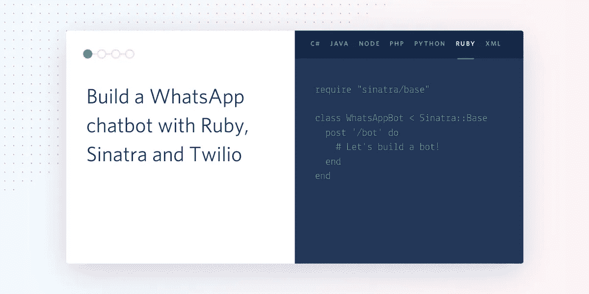
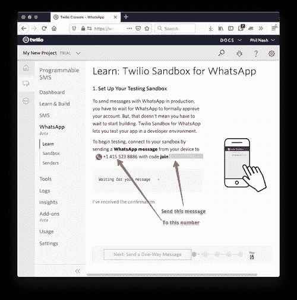
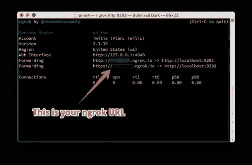
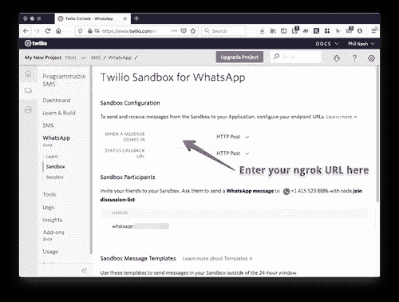
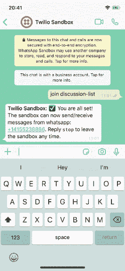

# 用 Ruby、Sinatra 和 Twilio 构建一个 WhatsApp 聊天机器人

> 原文：<https://betterprogramming.pub/build-a-whatsapp-chatbot-with-ruby-sinatra-and-twilio-69482ea1e8e8>

## 创建您自己的聊天机器人



聊天机器人是以某种方式与人类交流的程序。它们可以非常基本，对关键词或短语做出反应，或者使用类似于 [Twilio Autopilot](https://www.twilio.com/docs/autopilot) 的东西来利用自然语言理解(NLU)来提供更丰富的体验，并构建更复杂的对话。

在本教程中，我们将看到使用 [Twilio API for WhatsApp](https://www.twilio.com/docs/sms/whatsapp/api) 和 Ruby web framework [Sinatra](http://sinatrarb.com/) 开始为 WhatsApp 构建聊天机器人是多么容易。这是我们要建立的对话的一个例子:


# 你需要什么

要在本教程中构建自己的 WhatsApp bot，您需要以下内容:

*   [安装红宝石](https://www.ruby-lang.org/en/downloads/)和[捆扎机](https://bundler.io/)
*   [ngrok](https://ngrok.com/) 这样我们就可以[以风格](https://www.twilio.com/blog/2015/09/6-awesome-reasons-to-use-ngrok-when-testing-webhooks.html)向世界公开我们的本地 webhook 端点
*   一个 [WhatsApp 账户](https://www.whatsapp.com/)
*   一个 Twilio 帐户(如果你还没有，请在这里注册一个新的 Twilio 帐户，升级后可以获得 10 美元的信用点数

# 配置您的 WhatsApp 沙盒

要在 WhatsApp 上启动一个机器人，你必须[通过 WhatsApp 的审批流程](https://www.twilio.com/whatsapp/request-access)，但 Twilio 允许你[使用沙盒](https://www.twilio.com/console/sms/whatsapp/learn)构建和测试你的 WhatsApp 应用。让我们从配置你的 WhatsApp 账户使用的沙盒开始。

Twilio 控制台会引导您完成整个过程，但您需要做的是:

1.  前往 Twilio 控制台的 WhatsApp 沙盒[区域，或者从控制台](https://www.twilio.com/console/sms/whatsapp/learn)[导航到](https://www.twilio.com/console/)[可编程短信](https://www.twilio.com/console/sms)然后 [WhatsApp](https://www.twilio.com/console/sms/whatsapp/learn) 。
2.  页面上会有 WhatsApp 沙盒号。打开你的 WhatsApp 应用程序，给那个号码发一条新消息。
3.  该页面还有你需要发送的信息，即“加入”加上两个随机的单词，比如“加入明目张胆的鸽子”。发送您的消息到沙盒号码。



当您收到一条消息时，您就已经设置好了，可以开始使用沙盒了。

# 创建 Ruby 应用程序

让我们开始一个新的 Ruby 应用程序，在其中构建我们的机器人。首先创建一个新的工作目录。然后，在应用程序中初始化一个新的`Gemfile`,并创建几个我们需要的文件:

```
mkdir whatsapp-bot
cd whatsapp-bot
bundle init
mkdir config
touch bot.rb config.ru config/env.yml
```

添加我们将用于构建该应用程序的 gem:

*   [Sinatra](http://sinatrarb.com/) ，一个简单的 web 框架。
*   twilio-ruby 宝石这样我们就可以生成 [TwiML](https://www.twilio.com/docs/sms/twiml) 。
*   [http.rb](https://github.com/httprb/http) ，帮我们以后做一些 http 请求
*   [envable](https://github.com/philnash/envyable)，to [管理应用](https://www.twilio.com/blog/2015/02/managing-development-environment-variables-across-multiple-ruby-applications.html)中的环境变量。

```
bundle add sinatra twilio-ruby http envyable
```

`config/env.yml`将存储我们的应用程序配置，Envyable 将为我们将其加载到环境中。我们只需要为这个应用程序存储一个配置:您的 Twilio auth 令牌，您可以在您的 [Twilio 控制台仪表板](https://www.twilio.com/console)上找到它。将您的授权令牌添加到`config/env.yml`:

```
TWILIO_AUTH_TOKEN: YOUR_TWILIO_AUTH_TOKEN
```

我们将使用`config.ru`来加载应用程序和配置，并运行它。将以下内容复制到`config.ru`:

```
require 'bundler'
Bundler.requireEnvyable.load('./config/env.yml')require './bot.rb'
run WhatsAppBot
```

让我们通过创建一个“Hello World！”来测试一切是否按预期运行辛纳特拉应用。打开`bot.rb`并输入以下代码:

```
require "sinatra/base"class WhatsAppBot < Sinatra::Base
  get '/' do
    "Hello World!"
  end
end
```

在命令行上，使用以下命令启动应用程序:

```
bundle exec rackup config.ru
```

应用程序将在 [localhost:9292](http://localhost:9292) 上启动。在你的浏览器中打开它，你会看到“Hello World！”。

# 构建聊天机器人

现在我们的应用程序已经设置好了，我们可以开始构建我们的机器人了。在这篇文章中，我们将构建一个简单的机器人，当有人向我们的 WhatsApp 号码发送消息时，它会响应两个关键字。我们要在消息中寻找的单词是“狗”或“猫”，我们的机器人会用一张随机的图片和关于狗或猫的事实来回应。

# Webhooks

使用 WhatsApp 的 Twilio API，当您的号码(或沙盒帐户)收到一条消息时，Twilio 会向您定义的 URL 发出一个 [webhook 请求](https://www.twilio.com/docs/usage/webhooks)。该请求将包括关于消息的所有信息，包括消息的正文。

我们的应用程序需要定义一个路由，我们可以将其设置为 webhook 请求 URL 来接收这些传入的消息，解析出消息是否包含我们正在寻找的单词，并使用 [TwiML](https://www.twilio.com/docs/sms/twiml) 进行响应。TwiML 是一组描述应用程序如何与 Twilio 通信的 XML 元素。

到目前为止，我们构建的应用程序可以响应根路径上的 webhook，但是它所做的只是响应“Hello World！”所以让我们开始更新它。

让我们去掉“Hello World！”路线并添加一条`/bot`路线。默认情况下，Twilio webhooks 是`POST`请求，所以我们也将设置路由来处理它。为此，我们将一个块传递给 Sinatra 定义的`post`方法。

```
require "sinatra/base"class WhatsAppBot < Sinatra::Base
  post '/bot' do end
end
```

接下来，让我们从请求参数中提取消息体。因为我们要尝试将消息的内容与单词“狗”和“猫”进行匹配，所以我们还要将正文翻译成小写。

```
class WhatsAppBot < Sinatra::Base
  post '/bot' do
    body = params["Body"].downcase
  end
end
```

我们将使用 TwiML 来响应消息，而`twilio-ruby`库为我们提供了一个有用的类来构建我们的响应:`Twilio::TwiML::MessagingResponse`。在下一行初始化新的响应:

```
class WhatsAppBot < Sinatra::Base
  post '/bot' do
    body = params["Body"].downcase
    response = Twilio::TwiML::MessagingResponse.new
  end
end
```

`MessagingResponse`对象使用构建器模式来生成响应。我们将构建一条消息，然后向其中添加正文和媒体。我们可以将一个块传递给`Twilio::TwiML::MessagingResponse#message`方法，这将在结果中的`[<Message>](https://www.twilio.com/docs/sms/twiml/message)` [元素](https://www.twilio.com/docs/sms/twiml/message)中嵌套这些元素。

```
class WhatsAppBot < Sinatra::Base
  post '/bot' do
    body = params["Body"].downcase
    response = Twilio::TwiML::MessagingResponse.new
    response.message do |message|
      # nested in a <Message>
    end
  end
end
```

现在我们需要开始构建我们的实际响应。我们将检查正文是否包含单词“狗”或“猫”，并添加相关的响应。如果消息体不包含任何单词，我们还应该添加一个默认响应来告诉用户机器人可以响应什么。

```
class WhatsAppBot < Sinatra::Base
  post '/bot' do
    body = params["Body"].downcase
    response = Twilio::TwiML::MessagingResponse.new
    response.message do |message|
      if body.include?("dog")
        # add dog fact and picture to the message
      end
      if body.include?("cat")
        # add cat fact and picture to the message
      end
      if !(body.include?("dog") || body.include?("cat"))
        message.body("I only know about dogs or cats, sorry!")
      end
    end
  end
end
```

我们目前没有办法获得狗或猫的事实。幸运的是，我们可以使用一些 API 来实现这一点。对于狗，我们将使用[狗 CEO API 用于图片](https://dog.ceo/dog-api/)和[这个狗 API 用于事实](https://kinduff.github.io/dog-api/)。对于猫来说，有[图片 API](https://thecatapi.com/)和[猫事实 API](https://catfact.ninja/)。我们将使用之前安装的 http.rb 库向这些 API 中的每一个发出请求。

每个 API 处理`GET`请求。要使用 http.rb 发出 get 请求，您可以在`HTTP`模块上调用`get`,将 URL 作为字符串传递。`get`方法返回一个响应对象，您可以通过调用`to_s`来读取其内容。

为了使应用程序美观整洁，让我们将对这些服务的 API 调用打包到一个`Dog`和`Cat`模块中，每个模块都有一个`fact`和`picture`方法。

将这些模块添加到底部`bot.rb`:

```
module Dog
  def self.fact
    response = HTTP.get("https://dog-api.kinduff.com/api/facts")
    JSON.parse(response.to_s)["facts"].first
  end def self.picture
    response = HTTP.get("https://dog.ceo/api/breeds/image/random")
    JSON.parse(response.to_s)["message"]
  end
endmodule Cat
  def self.fact
    response = HTTP.get("https://catfact.ninja/fact")
    JSON.parse(response.to_s)["fact"]
  end def self.picture
    response = HTTP.get("https://api.thecatapi.com/v1/images/search")
    JSON.parse(response.to_s).first["url"]
  end
end
```

现在我们可以像这样在 webhook 响应中使用这些模块:

```
class WhatsAppBot < Sinatra::Base
  post '/bot' do
    body = params["Body"].downcase
    response = Twilio::TwiML::MessagingResponse.new
    response.message do |message|
      if body.include?("dog")
        message.body(Dog.fact)
        message.media(Dog.picture)
      end
      if body.include?("cat")
        message.body(Cat.fact)
        message.media(Cat.picture)
      end
      if !(body.include?("dog") || body.include?("cat"))
        message.body("I only know about dogs or cats, sorry!")
      end
    end
  end
end
```

要通过 Twilio 将消息返回给 WhatsApp，我们需要将响应的内容类型设置为“text/xml”并返回 xml 字符串。

```
class WhatsAppBot < Sinatra::Base
  post '/bot' do
    body = params["Body"].downcase
    response = Twilio::TwiML::MessagingResponse.new
    response.message do |message|
      if body.include?("dog")
        message.body(Dog.fact)
        message.media(Dog.picture)
      end
      if body.include?("cat")
        message.body(Cat.fact)
        message.media(Cat.picture)
      end
      if !(body.include?("dog") || body.include?("cat"))
        message.body("I only know about dogs or cats, sorry!")
      end
    end
    content_type "text/xml"
    response.to_xml
  end
end
```

这就是 webhook 的所有代码，但是还有一点需要考虑。

# Webhook 安全性

这可能不是在 webhook 请求中返回的最关键的数据，但是保护您的 web hook 以确保您只响应来自您期望的服务的请求是一个很好的实践。 [Twilio 使用您的 auth token](https://www.twilio.com/docs/usage/webhooks/webhooks-security#validating-signatures-from-twilio) 对所有 webhook 请求进行签名，您可以验证该签名来验证请求。

`[twilio-ruby](https://www.twilio.com/blog/2014/09/securing-your-ruby-webhooks-with-rack-middleware.html)` [库提供了 rack 中间件，使得验证来自 Twilio](https://www.twilio.com/blog/2014/09/securing-your-ruby-webhooks-with-rack-middleware.html) 的请求变得容易:让我们也将它添加到应用程序中。在你的`WhatsAppBot`类的顶部，包含带有`use`方法的中间件。将以下三个参数传递给`use`:中间件类`Rack::TwilioWebhookAuthentication`、认证令牌和保护路径(在本例中为“/bot”)。)

```
class WhatsAppBot < Sinatra::Base
  use Rack::TwilioWebhookAuthentication, ENV['TWILIO_AUTH_TOKEN'], '/bot'

  post '/bot' do
```

# 将机器人连接到 WhatsApp

在命令行上，用`ctrl/cmd + c`停止应用程序，并用以下命令重新启动:

```
bundle exec rackup config.ru
```

我们现在需要确保 Twilio webhooks 能够到达我们的应用程序。这就是为什么我在这个应用程序的需求中包含了 [ngrok](https://ngrok.com) 。ngrok 允许我们将一个公共 URL 连接到运行在我们机器上的应用程序。如果您还没有安装 ngrok，请按照说明下载并安装 ngrok 。

使用以下命令启动 ngrok，通过隧道到达端口 9292:

```
ngrok http 9292
```

这将为您提供一个 ngrok URL，您现在可以将它添加到 WhatsApp 沙盒中，以便传入的消息将被定向到您的应用程序。



获取 ngrok URL 并添加 bot 的路径，看起来像这样:`https://YOUR_NGROK_SUBDOMAIN.ngrok.io/bot`。在 WhatsApp 沙盒管理中标记为“当有消息时”的输入中输入该 URL，并保存配置。



# 测试你的机器人

现在，你可以向 WhatsApp 沙盒号码发送一条消息，你的应用程序就会开始运行，向你返回狗或猫的图片和事实。



# 制造更多的机器人

在这篇文章中，我们看到了如何为 WhatsApp 配置 Twilio API，并将其连接到 Ruby 应用程序，以返回狗或猫的图片和事实。你可以在 GitHub 上获得这个 bot 的所有[代码。](https://github.com/philnash/ruby-whatsapp-bots)

这是一个简单的机器人，但它为构建更多机器人提供了良好的基础。你可以研究一下[从 WhatsApp 接收图像，制作一个视觉机器人](https://www.twilio.com/blog/celebrity-spotting-twilio-api-whatsapp-aws-rekognition-ruby)或[发送或接收位置，作为信息](https://www.twilio.com/docs/sms/whatsapp/api#location-messages-with-whatsapp)的一部分。我们还可以在此基础上使用 Twilio Autopilot 创建更智能的机器人。

你造过什么有趣的机器人吗？你还希望探索哪些其他功能？请在评论中告诉我。