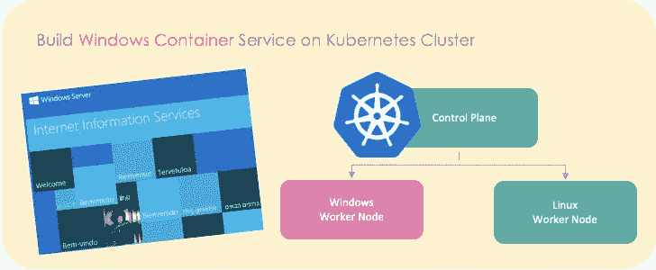
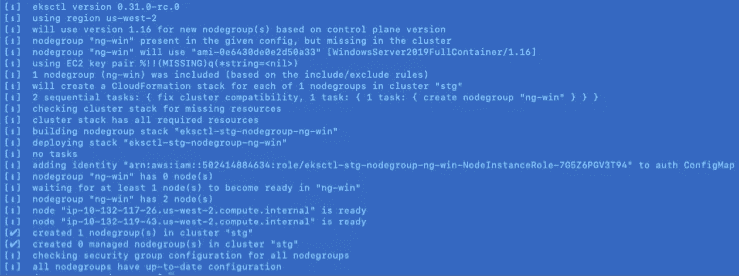
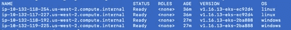
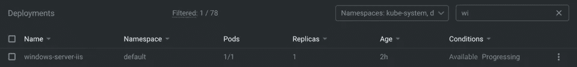

# 在 Kubernetes 集群上构建 Windows 容器服务

> 原文：<https://betterprogramming.pub/build-a-windows-container-service-on-a-kubernetes-cluster-cac5087a4499>

## 在 AWS EKS 上设置 Windows 容器工作节点和示例应用程序的分步指南



作者照片。

使用容器(如 NET、PowerShell 等)支持 Windows 应用程序开发。)，我们应该构建 Windows worker 节点来支持在其上运行的应用程序。

老实说，我认为 Windows 容器需要更多的时间来成熟，才能提供轻量级的设计和基础映像来提高效率。但是，如果您想查看试用版，可以按照下面的步骤在 AWS EKS 上设置一个 worker 节点和应用程序。

# 先决条件

Kubernetes 集群必须启动并运行至少一个基于 Linux 的 worker 节点来运行核心系统:`kubernetes v1.14+`。

应该安装 EKS CTL `eksctl`来支持工作节点的创建。

查看 GitHub 上的 [Kubernetes 文档](https://kubernetes.io/docs/setup/production-environment/windows/intro-windows-in-kubernetes/)和 [eksctl 了解更多信息。](https://github.com/weaveworks/eksctl)

# 创建 Windows 工作节点

通过`eksctl`安装 VPC 资源控制器和准入 webhook，启用 Windows 支持；

```
# Change CLUSTER_NAME to your EKS Clustereksctl utils install-vpc-controllers --cluster [CLUSTER_NAME] --approve
```

正如在[亚马逊 EKS 文档](https://docs.aws.amazon.com/eks/latest/userguide/windows-support.html)中提到的，你也可以使用另一种方法来启用 Windows 支持。

创建 Windows 节点组:

```
# Change REGION_NAME, CLUSTER_NAME, GROUP_NAME, node-type to your EKS Clustereksctl create nodegroup --region [REGION_NAME] --cluster [CLUSTER_NAME] --name [GROUP_NAME] --node-type [m5.large]  --nodes 2 --nodes-min 1 --nodes-max 2 --node-ami-family WindowsServer2019FullContainer --asg-access --external-dns-access --full-ecr-access --alb-ingress-access --node-private-networking
```



Windows 节点组创建

完成后，您可以使用下面的命令来验证 Windows worker 节点是否启动并运行:

```
kubectl get nodes   -L kubernetes.io/os
```



Kubernetes 集群工作节点

# 部署简单的 Windows 服务

使用下面的 YAML 文件，使用节点选择器`kubernetes.is/os: windows`和基本映像`windows server core`部署带有 Windows worker 节点的 Windows Server IIS。

对于 Windows 容器，提供了四种容器基本映像:

1.  [Windows 服务器核心](https://hub.docker.com/_/microsoft-windows-servercore)
2.  [纳米服务器](https://hub.docker.com/_/microsoft-windows-nanoserver)
3.  [窗户](https://hub.docker.com/_/microsoft-windows)
4.  [Windows 物联网核心](https://hub.docker.com/_/microsoft-windows-iotcore)

要了解更多关于 Windows 容器基础映像的信息，请参见文档。

```
cat << EOF | kubectl apply -f -

apiVersion: apps/v1
kind: Deployment
metadata:
  name: windows-server-iis
  namespace: default
spec:
  selector:
    matchLabels:
      app: windows-server-iis
      tier: backend
      track: stable
  replicas: 1
  template:
    metadata:
      labels:
        app: windows-server-iis
        tier: backend
        track: stable
    spec:
      containers:
      - name: windows-server-iis
        image: **mcr.microsoft.com/windows/servercore:1809**
        ports:
        - name: http
          containerPort: 80
        imagePullPolicy: IfNotPresent
        command:
        - powershell.exe
        - -command
        - "Add-WindowsFeature Web-Server; Invoke-WebRequest -UseBasicParsing -Uri '[https://dotnetbinaries.blob.core.windows.net/servicemonitor/2.0.1.6/ServiceMonitor.exe'](https://dotnetbinaries.blob.core.windows.net/servicemonitor/2.0.1.6/ServiceMonitor.exe') -OutFile 'C:\\ServiceMonitor.exe'; echo '<html><body><br/><br/><marquee><H1>Hello EKS!!!<H1><marquee></body><html>' > C:\\inetpub\\wwwroot\\default.html; C:\\ServiceMonitor.exe 'w3svc'; "
      nodeSelector:
       ** kubernetes.io/os: windows**
---
apiVersion: v1
kind: Service
metadata:
  name: windows-server-iis-service
  namespace: default
spec:
  ports:
  - port: 80
    protocol: TCP
    targetPort: 80
  selector:
    app: windows-server-iis
    tier: backend
    track: stable
  sessionAffinity: None
  type: LoadBalancerEOF
```

由于基础图像很大，提取图像需要一些时间。容器启动并运行后，您将能够连接到 IIS。



Windows server 容器已启动并正在运行


连接到 IIS

# 我的工作版本

