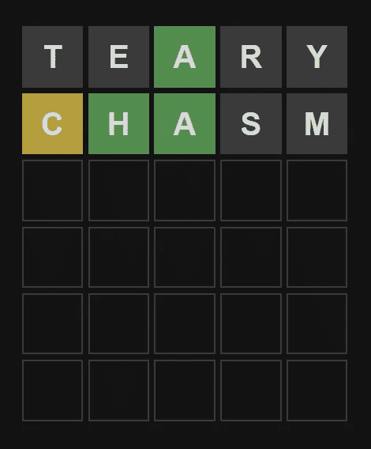
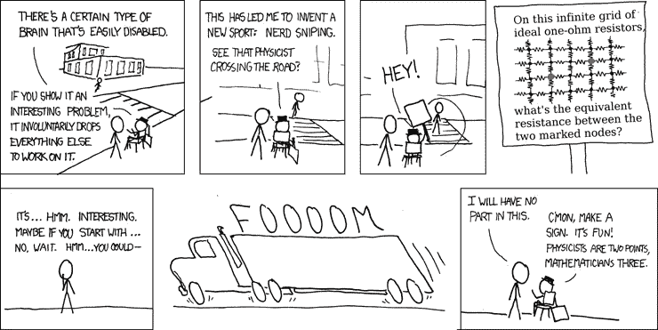

# 使用 Rust 构建一个 Wordle 解算器

> 原文：<https://betterprogramming.pub/build-a-wordle-solver-using-rust-27c5dc3e97c0>

## 我在沃尔得打败了我的祖母——这就是你应该关心的原因


[拉维·帕特尔](https://unsplash.com/@ravi_patel?utm_source=medium&utm_medium=referral)在 [Unsplash](https://unsplash.com?utm_source=medium&utm_medium=referral) 上拍照。不是我奶奶

# 游戏

[Wordle](https://www.powerlanguage.co.uk/wordle/) 是一款比较简单的游戏。如果你玩过《智多星》，应该会觉得耳熟。目标是用尽可能少的猜测找出一个神秘的单词。这个神秘的词每天都在变。这里有两个猜测的例子。



游戏[单词](https://www.powerlanguage.co.uk/wordle/)的两个猜测示例

猜猜看，每个字母的颜色都会改变。

*   绿色—字母正确。
*   黄色—字母存在于单词中，但不在那个空格中。
*   灰色—单词中不存在该字母。

如你所见，最多有六次猜测。如果你在六次猜测中找不到神秘单词，你就输了。我每天都在和我的祖母比赛，尽可能少的猜词。



[XKCD 356:书呆子狙击](https://xkcd.com/356)

这完全是书呆子狙击我。我有一种强烈的冲动，想开发一个可以在尽可能少的猜测中找到神秘单词的应用程序。

# 我是如何做到的

首先，我们需要一份英语单词表。我最初使用[玉米芯列表](http://www.mieliestronk.com/wordlist.html)，但是我发现用 [dwyl 的列表](https://github.com/dwyl/english-words/)更成功。

对于这个项目，我决定使用 Rust，因为我对自己快速制作 MVP 的能力最有信心。

我使用的两个单词列表都被格式化为由`\n`字符分隔的单个单词的序列。在 Windows 上(我正在用的就是这个)，他们也有那些讨厌的小`\r`字符。

沃尔多非常注重字母。我可以根据我所知道的不在神秘单词中的字母(这些是游戏中的灰色字母)从单词列表中删除项目，也可以根据我所知道的神秘单词中的字母*和*(橙色或绿色字母)删除项目，但在很多情况下，仍然会留下很多可能的单词。我需要根据单词字母的可能性来排序单词。

为此，我计算每个字母在单词列表中出现的频率，并根据其组成部分出现的频率给每个单词打分。

程序的第一步是加载单词列表并计算字母数:

使用默认的`HashMap`(它使用 SipHash，这对于单个字符的查找来说不是很好)，可能在性能方面不是最好的，但这只是一个玩具程序，不需要成为世界上最快的东西。

接下来，我们需要检查单词列表，排除包含灰色字母的单词。这里有一个函数可以帮助您做到这一点:

它接受一些不同的 char 片:

*   Word:我们要检查的单词。
*   发现:这是一个切片，包含我们发现的字母(绿色的)，在我们不知道字符的位置有" "(空格)字符。
*   不:这是一片包含我们知道在神秘单词中**不是**的字母。
*   Must:这是一个含有字母的切片，我们知道**是神秘单词中的**，但我们不知道它的位置。
*   面膜:这是一系列面膜。我们删除所有包含与任何掩码匹配的字母的单词。这对于消除单词列表中包含标点符号的单词和消除包含橙色字母的单词很有用，但在我们知道它们不是的位置。

现在我们要做的就是运行单词列表中的每个单词，看看它是否与我们已知的字符匹配，在每次猜测后用新信息更新每个片段的内容。

# 为什么你应该关心

这听起来是个没用的问题。确实是。除了我之外，这绝对不会让任何人受益，而且我肯定不会在和我祖母比赛的时候使用这个。

那你为什么这么做？

无用问题的无用答案是有用的。他们教我们如何提高，没有真正的利害关系的压力。他们也只是单纯的乐趣。

这也是一种反思。过去你是如何处理这个问题的？你的思维有了怎样的提高？也许说这个小小的 Wordle solver 是自我反思的关键是有点宽宏大量，但我不认为它是那么遥远。

```
**Want to Connect?**If you like art, or photography, also check out my [Instagram.](https://www.instagram.com/elijah_sirius/)
```