# 使用样式化组件和 Storybook.js 构建高级 React 输入字段

> 原文：<https://betterprogramming.pub/build-advanced-react-input-fields-using-styled-components-and-storybook-js-a231b9b2438>

## 用最新技术构建 React 组件的开发指南


图片来源:作者

在[上一篇文章](https://medium.com/better-programming/build-react-tabs-using-recoil-styled-components-and-storybook-js-4ad534cef007)中，我们使用[反冲](https://medium.com/better-programming/recoil-a-new-state-management-library-moving-beyond-redux-and-the-context-api-63794c11b3a5)、[样式组件](https://medium.com/better-programming/styled-components-a-css-in-js-approach-755f6a196c42)和 [Storybook.js](/an-in-depth-look-at-storybook-6-8c44cd6895ee) 构建了 React 选项卡。在这里，我们将浏览高级输入字段:`ClearableInput`和`MultiValueClearableInput`。开发过程可以应用到日常编码工作中。这也是一个常见的面试问题，在一个小时的面试时间内很容易回答。

由于输入字段是独立的，`useState`非常适合于状态管理。在这种情况下，我们不需要使用反冲进行外部状态管理。

[创建 React App](https://medium.com/better-programming/10-fun-facts-about-create-react-app-eb7124aa3785) 用于设置 React 编码环境:

```
npx create-react-app my-app
cd my-app
npm start
```

在您的`package.json`中为`[dependencies](https://medium.com/better-programming/package-jsons-dependencies-in-depth-a1f0637a3129)`设置样式组件:

```
npm i styled-components
```

为项目安装故事书:

```
npx sb init
```

用以下文件创建`src/components/AdvancedInputs`:

```
$ ls
AdvancedInputs.stories.js   MultiValueClearableInput.js index.js
ClearableInput.js           clear.svg
```

# 输入栏

HTML `<input>`标签指定了一个输入字段，用户可以在其中输入数据。它可以是文本字段、复选框、单选按钮、文件输入或其他内容。

默认输入是文本字段:

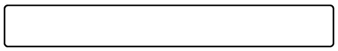

看起来不错。

在其中键入一些文本。

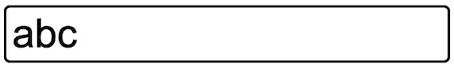

输入`Backspace`可以从后向前逐字符删除内容。使用`x`清除所有文本会更好吗？

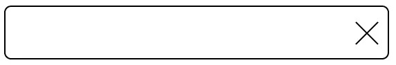

# 可清除的输入

HTML input 元素不包括 clear 图标(`x`标记)，更不用说 clear 功能了。我们需要构建一个 React 组件来实现`ClearableInput`字段。这是一个由两个元素组成的容器:一个输入字段和一个清除图标。我们称之为*组合输入。*

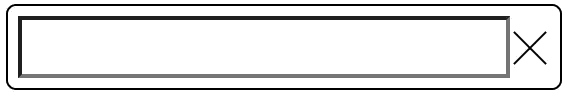

内部输入字段有一个黑色边框。当它聚焦时，它有一个蓝色的轮廓:

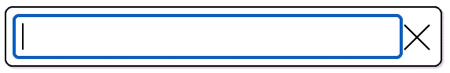

我们需要隐藏内部输入字段的边界和轮廓，使组合输入看起来像一个组件:

```
border: 0;
&:focus {
  outline: none;
}
```

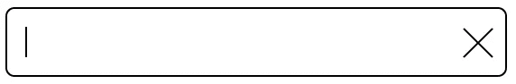

下面是用样式化组件实现的`src/components/AdvancedInputs/ClearableInput.js`:

第 40-45 行指定了输入字段。当值改变时，输入值状态被更新(第 42-44 行)。

第 46-55 行指定了清除图标。指定了图标大小(第 48-49 行)和笔画颜色(第 50 行)。当点击图标时，输入字段被清除(第 51-53 行)。

输入字段和清除图标在容器中显示为 flex 项。图标大小是固定的，输入字段将采用剩余的宽度。

清除图标上写有 [SVG](https://medium.com/better-programming/create-react-app-and-svgs-70970ac715f2) 。以下是 SVG 代码和图像:

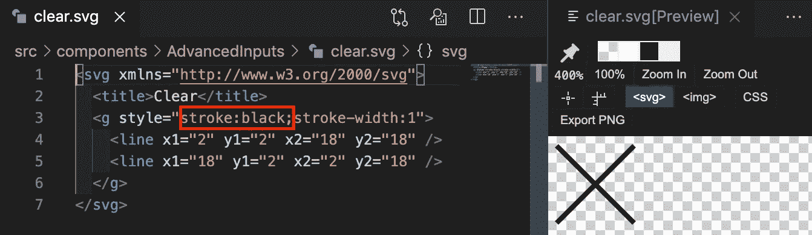

上面的 SVG 由两条对角线组成。图标大小和笔画颜色由每次使用指定。然而，我们在这里添加`stroke:black`是为了预览`x`标记。`src/components/AdvancedInputs/clear.svg`中的实际 SVG 文件不包含笔画颜色。

```
<svg ae lu" href="http://www.w3.org/2000/svg" rel="noopener ugc nofollow" target="_blank">http://www.w3.org/2000/svg">
  <title>Clear</title>
  <g style="stroke-width:1">
    <line x1="2" y1="2" x2="18" y2="18" />
    <line x1="18" y1="2" x2="2" y2="18" />
  </g>
</svg>
```

# 多值可清除输入

除了清晰的图标，我们还会努力让组合输入更有趣。每当用户按下`Enter`键，现有的`none-empty`值就会从输入栏中提取出来，成为一个项目，以灰色背景显示。

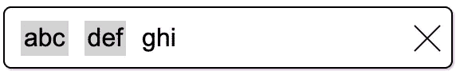

重复的项目值表示有错误。组合输入将以红线为边界。

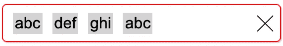

此外，我们也可以将透明图标改为红色。

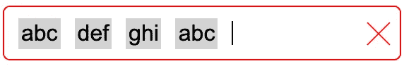

如果尺寸超过宽度，这个`MultiValueClearableInput`可以绕到下面的行。

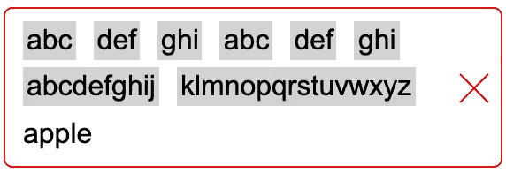

输入`Backspace`将从后向前逐个删除输入栏中的文本和项目。

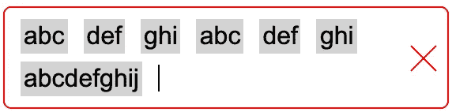

当没有重复项值时，组合输入边框将变回黑色。

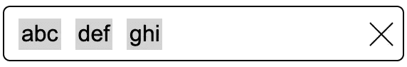

单击清除图标将清除所有项目，以及输入字段中的当前值。

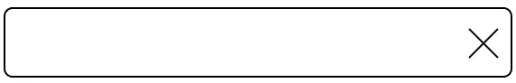

这个`MultiValueClearableInput`可以用一个由三个东西组成的容器来构建:一个`div`列表、一个输入字段和一个清除图标。

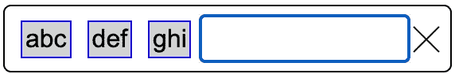

此外，`div`列表和输入字段由一个输入容器分组。

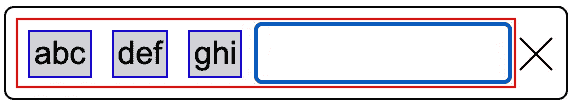

我们复制`ClearableInput`代码并扩展它来完成`MultiValueClearableInput`。

这里是`src/components/AdvancedInputs/MultiValueClearableInput.js`:

第 13 行定义了容器的边框颜色，这是基于是否有错误。`isError`传递给第 77 行的道具。

第 53 行添加了一个状态来跟踪项目值。

第 55-57 行计算状态以及是否有错误(重复的项目值)。

除了输入字段和清除图标之外，第 79-81 行还指定了一个项目列表。

第 84 行处理`KeyDown`事件。事件处理程序在第 59-74 行定义。为什么我们用`KeyDown`而不用`KeyPress`？是因为`KeyPress`事件只针对可打印的字符键被调用，`KeyDown`事件针对所有字符被引发，包括不可打印的字符，如`Control`、`Shift`、`Alt`、`Backspace`等。`Enter`键是一个可打印字符。

第 94 行根据是否有错误来设置 SVG 颜色。

第 97 行清除条目值，同时清除输入字段(第 96 行)。

这个文件向`ClearableInput`添加代码。我们可以为它添加一个参数来处理这两种情况，而不是有两个文件。你想把它当作一次练习吗？

此外，我们遵循最佳实践为[重新导出](https://medium.com/better-programming/a-handy-guide-to-export-and-import-modules-for-javascript-and-typescript-6cff8e47d554)创建`src/components/AdvancedInputs/index.js`。这使得使用很容易。

# 故事书

[Storybook](https://storybook.js.org/) 是 UI 开发的工具。它通过隔离组件使开发更快更容易。这允许我们一次处理一个组件。

这是`src/components/AdvancedInputs/AdvancedInputs.stories.js`:

第 10-12 行定义了第一个故事。是那个`ClearableInput`。

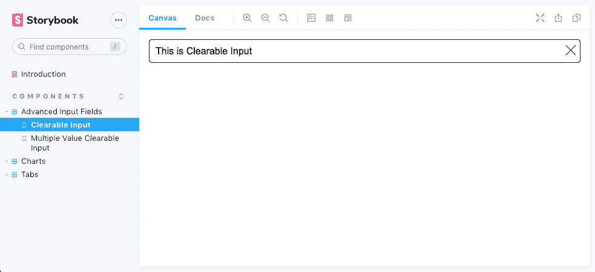

第 14-16 行定义了第二个故事。是那个`MultiValueClearableInput`。

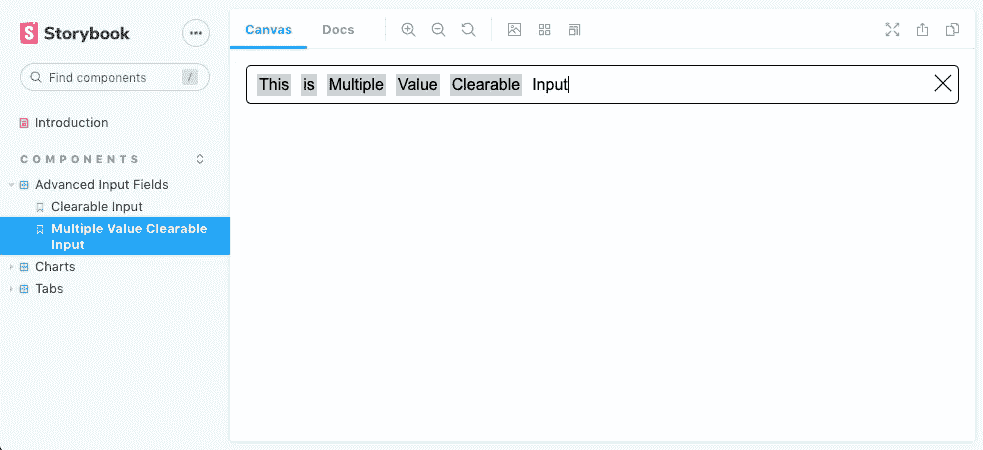

用命令`npm run storybook`启动故事书。

这个例子位于 GitHub 上的[。你可以在线观看和玩故事书示例](https://github.com/JenniferFuBook/react-components)。

您可能想知道这个示例页面是如何设置的。让我们走一遍这个过程。

在根目录下，运行命令`npm run build-storybook`。它运行一个脚本`build-storybook -o docs -s public`，将构建好的文件放到`docs`目录中。提交并将更改推送到 GitHub。

在 GitHub 页面中，选择`Settings`。

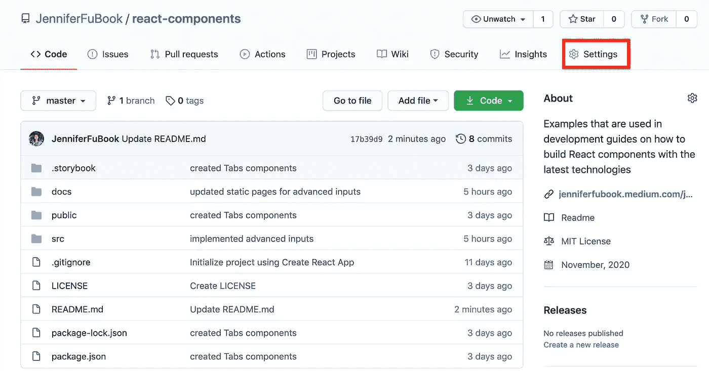

在设置页面，向下滚动到 GitHub 页面部分。

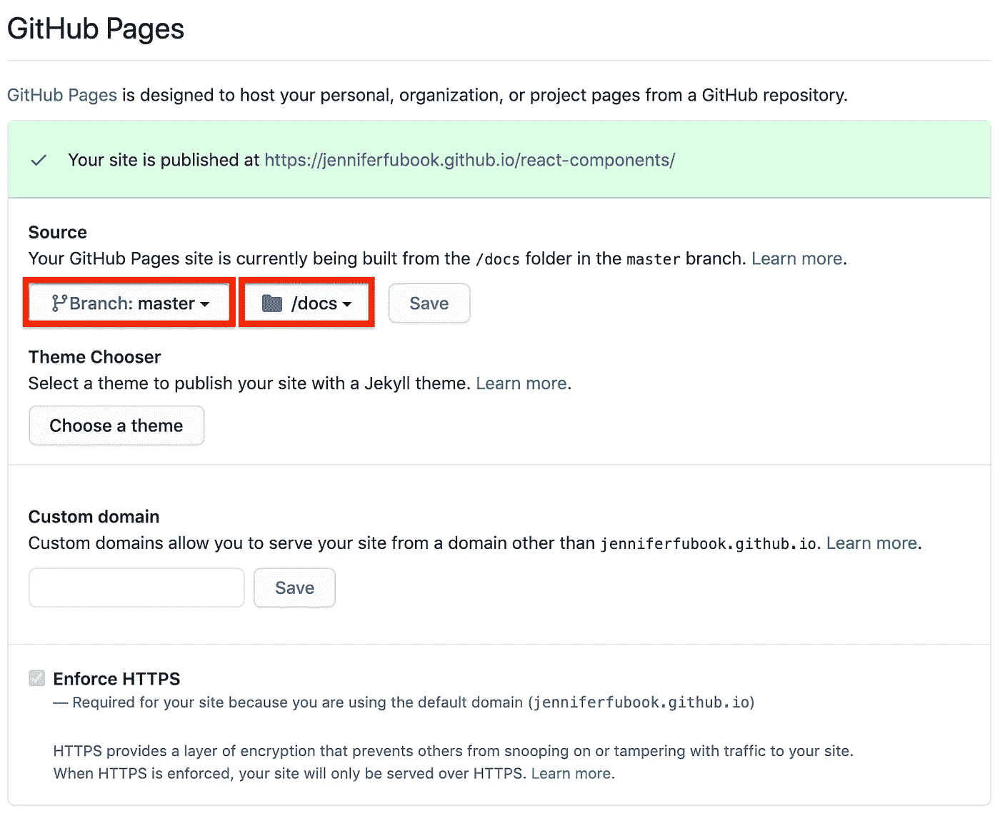

选择 GitHub Pages 站点的分支和目录，并保存更改。故事书的例子可以在[这里](https://jenniferfubook.github.io/react-components/?path=/story/components-advanced-input-fields--clearable-input)查阅。

# 结论

我们已经使用样式组件和故事书创建了高级输入组件。这些组件发布在 GitHub Pages 站点上，供查看和播放。

你想试一试吗？

感谢阅读。我希望这有所帮助。你可以在这里看到我的其他媒体出版物。