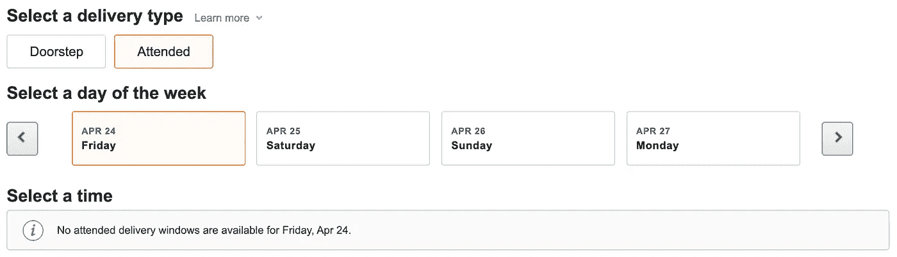

# 构建一个机器人来获取 Amazon Fresh 上可用递送时段的通知

> 原文：<https://betterprogramming.pub/build-amazonfresh-delivery-slot-alerts-c9e12a429e23>

## 不再刷新页面


图片来源:[https://barnimages.com/greens-and-vegetables-in-store/](https://barnimages.com/greens-and-vegetables-in-store/)

随着最近冠状病毒的爆发，人们严重依赖送货服务来满足基本需求。亚马逊生鲜是提供送货上门的领先服务之一，是美国电子商务公司 AmazonFresh 的子公司。

但是随着过去几周递送需求的增加，AmazonFresh 引入了递送日期槽功能。该功能允许用户仅在有空位的情况下订购食品，根据我最近的经验，几乎不可能找到如下所示的空位:



AmazonFresh 结帐页面

这促使我使用以下工具构建了一个自动化的交付槽跟踪器:

1.  Python 3.6
2.  [硒](https://www.selenium.dev/):无头浏览器
3.  [Twilio](https://www.twilio.com/) :短信提醒

# 用必要的 Python 包设置您的环境

将下面指定的 python 包复制到 requirements.txt 文件中:

并使用以下命令设置您的环境:

```
pip install -r requirements.txt
```

# 使用无头浏览器访问 AmazonFresh 的 Python Selenium 代码

上面的 Python Selenium 代码使用了一个 [ChromeDriver](https://chromedriver.chromium.org/) ，它被签入 [GitHub 库](https://github.com/bryan3189/amazonfresh_delivery_slot_alerts)。这段代码假设您已经在 AmazonFresh 购物车中添加了所有商品，并执行以下操作:

1.  将您的 Amazon Prime 凭据作为登录 Amazon 的输入。
2.  成功登录后，它跳转到结帐页面，并点击所有显示的日期槽。对于每个日期槽，它检查是否有任何可用的时间槽，并保存该信息。
3.  如果在扫描完所有日期时段后没有可用时段，脚本会休眠五分钟，然后重新开始检查可用时段的过程。但是如果一个时间段可用，它将打印该时间段的信息并退出。

# 设置一个免费的 Twilio 帐户来使用短信提醒功能

前往 [Twilio](https://www.twilio.com/try-twilio) 创建您的免费试用帐户。成功创建试用帐户后，请执行以下操作:

1.  使用仪表板预订试用号。试用帐户只能让您从 Twilio 提供的试用号码发送手机短信。
2.  在“已验证的号码”部分添加您的手机号码。这一设置至关重要，因为使用试用帐户，您将无法向未经验证的号码发送短信。
3.  复制 Twilio 仪表板中指定的`ACCOUNT SID`和`AUTH TOKEN`。

Twilio 代码片段

将上面的代码片段添加到前面的 Selenium 脚本中，可以让您在时间段可用时收到文本提醒，这样您就可以快速预订您的位置！

# 完整的源代码

[](https://github.com/bryan3189/amazonfresh_delivery_slot_alerts) [## Bryan 3189/Amazon fresh _ delivery _ slot _ alerts

### Python Selenium 脚本在 AmazonFresh 交付槽可用时生成警报…

github.com](https://github.com/bryan3189/amazonfresh_delivery_slot_alerts) 

我希望你觉得上面的方法有用，如果你有任何问题，请随时联系我。祝编码愉快，保持安全！