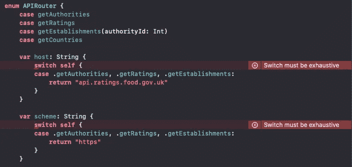

# 使用 Async/Await 在 Swift 中构建现代网络层

> 原文：<https://betterprogramming.pub/build-an-api-layer-in-swift-with-async-await-abe8a5ca75da>

## 一个 Async/Await API 层，帮助您轻松应对现场编码面试

图片来自 [Pixabay](https://pixabay.com//?utm_source=link-attribution&utm_medium=referral&utm_campaign=image&utm_content=788002)

iOS 开发人员现场编码访谈中的一个常见要求是能够在设定的时间框架内从头开始实现网络层。虽然它可能不会经常出现在专业工作中，因为大多数应用程序都已经包含了一个已建立的网络层，但当想要原型化某个东西时，知道如何快速建立一个网络层是非常有用的。

我想演示一个快速简单的网络层，您可以使用它来进行现场编码面试，它符合坚实的原则，使用泛型，实现 Async/Await，具有适当的错误处理，在 UIKit 和 SwiftUI 应用程序中工作，如果您从头开始练习编写它，可以在 10 分钟内启动并运行，这使您在技术面试中有更多的时间专注于其余的功能。

我们开始吧！

首先，我们需要一个 API 来提取数据，最好是有几个不同的端点来返回不同类型的数据。英国政府的食品卫生评级 API 是一个很好的起点。

请花些时间熟悉它，但了解它并不重要，因为作为本指南的一部分，我们将特别关注几个端点。

在一些编码上:

我们将开始用一个`enum`对`APIRouter`进行编码，作为我们的路由器对象，它将包含构建每个请求所需的组件。在本指南中，我们将创建 3 个不同的请求:

1.  `getAuthorities` —返回英国不同当局(即地区)的详细信息
2.  `getRatings` —返回食品卫生部门使用的评级系统的详细信息
3.  `getEstablishments` —返回机构的详细信息，我们将向其传递一个 ID 以返回特定机构(地区)内的机构

我们将把我们在这个枚举中设置的组件转换成 URLComponents，作为`APIRequestDispatcher`的一部分，但是我们需要一些东西:

1.  host——这是你的 API 请求的公共根，想想`medium.com`
2.  scheme —这是您的 API 的 web 服务器协议(HTTP / HTTPS)
3.  path——这是我们请求的特定资源端点，想想`{host}/@soaringearth`
4.  方法—您用来发出请求的 API 方法(发布/上传/修补/获取/删除)
5.  参数—这些是您想要发送给 API 的任何查询参数

你可能会注意到我没有涉及身体对象，我从未在面试中被要求亲自执行`POST`请求，这是因为与更简单的`GET`请求相比，设置和配置需要额外的时间。如果我们确实想添加主体数据，它将作为`URLRequestDispatcher`的一部分被添加，因为 iOS 中的`URLComponents`只处理 URL 的构造(这似乎是显而易见的)——它将是我们需要添加数据的`URLRequest`对象。

您将看到上面的完整路由器，它与之前讨论的内容相匹配。你可能想知道为什么我们决定使用一个`enum`，原因很简单。如果我们决定添加第四个请求，编译器将在每个计算出的变量中抛出错误，以表明我们缺少一个已处理的案例，这可以防止您忘记实现它的 scheme/path/method 等。

关于`APIRouter`的一个注意事项—由于我提到了可靠的原则，拥有一个包含应用程序想要发出的每个请求的所有组件的单一路由器不太符合单一责任原则，在生产应用程序中，如果每个端点有多条路径，即(/ratings，/ratings/{id}，/ratings/{id}/xxxYYY)，您可能需要考虑为每个端点配备不同的路由器，但是请记住本指南的上下文，即能够在有时间限制的技术面试中制作一些东西，本指南中的方法就足够了。

我们现在进入`APIRequestDispatcher`。这可能是指南中最复杂的部分，包含一些您可能不熟悉的功能，即`generics`和`async/await`，我将包含一些文档链接:

*   泛型:[https://docs . swift . org/swift-book/language guide/generics . html](https://docs.swift.org/swift-book/LanguageGuide/Generics.html)
*   async/Await:[https://docs . swift . org/swift-book/language guide/concurrency . html](https://docs.swift.org/swift-book/LanguageGuide/Concurrency.html)

还会有自定义错误处理的元素，但是很容易看出发生了什么。

这个类本身很简单，只包含一个类函数`request<T: Codable>(router: APIRouter) async throws -> T`。对于大多数情况，处理简单的 API 请求已经足够了。分解一下，你可以看到它期望并将返回符合可编码协议的对象，你需要提供一个`APIRouter`作为参数，函数异步运行，也可以抛出错误。

让我们来分解上面的片段:

1.  `URLComponent`是我们将基于之前创建的`enum`构造的，这也是为什么我们需要向函数传递一个`APIRouter`。
2.  `URLComponent`包含一个属性，允许您获取一个可选的 URL，如果该 URL 不能基于它所设置的各种组件来构造，它将返回 nil。如果我们无法获得完整的 URL，我们还想在这里抛出一个自定义错误。
3.  这是食品卫生 API 的一个细微差别，它要求所有请求都包含一个`x-api-version`头，其他 API 不需要这个。
4.  `try await withCheckedThrowingContinuation { continuation` —这是一个 Async/Await 函数，它挂起当前任务，并使用`checked throwing continuation`调用闭包，这是一种奇特的说法，可以用异步工作的结果来调用闭包。闭包的内容与常规的 URLSession 请求基本相同。
5.  如果我们的`dataTask`没有获得任何数据，我们可以在这里抛出我们的其他自定义错误来指示一个`noData`响应，适当地处理错误。
6.  `DispatchQueue.main.async`将使我们回到主线程上。
7.  使用 Async/Await 的主要区别是，我们需要调用`continuation.resume(with:`并提供我们的结果(成功/失败)，而不仅仅是返回。

对于请求调度程序来说，这就差不多了，我们的泛型被解码并返回，任何错误都被相应地处理和抛出。

创建自定义错误就像定义新的枚举一样简单:

我们将制作的 API 客户端是用户/应用程序交互与 API 通信的方式。我们将使用 POP(面向协议编程)方法为每个请求创建一个客户端。每个请求都有自己的协议和符合它的类，我们这样做是为了方便模仿 API 客户端和更好地分离关注点，因为一些屏幕可能只想访问权威列表，而其他屏幕可能只想访问评级。

您可以看到上面的实现，您可能会注意到，使用`RatingClient`我们传递了一个参数，但没有传递给路由器，这是因为 API 中有一个限制，评级端点不接受和查询参数，因此过滤必须在设备上完成。

这个实现中使用的模型对象很容易理解，它们是符合 codable 的基本结构。为了提高使用对象时的可读性，使用了两个`CodingKeys`,它们将接收到的对象的键转换为模型对象中存在的属性的名称。更多信息可以在[这里找到](https://developer.apple.com/documentation/foundation/archives_and_serialization/encoding_and_decoding_custom_types)

最后，这里有一个使用 Async/Await 方法获取数据的例子。这只是将 API 请求封装在`Task.init`中并使用 do/catch 来处理错误的一个例子。

感谢您的阅读，我真的希望所有的东西都被清楚地解释和理解，我在几次采访中使用了这种方法，一旦您练习了几次，您就可以真正地在大约 10 分钟内编写好 API 层。如果您对本指南或 iOS 职位面试有任何疑问，请随时联系我们。