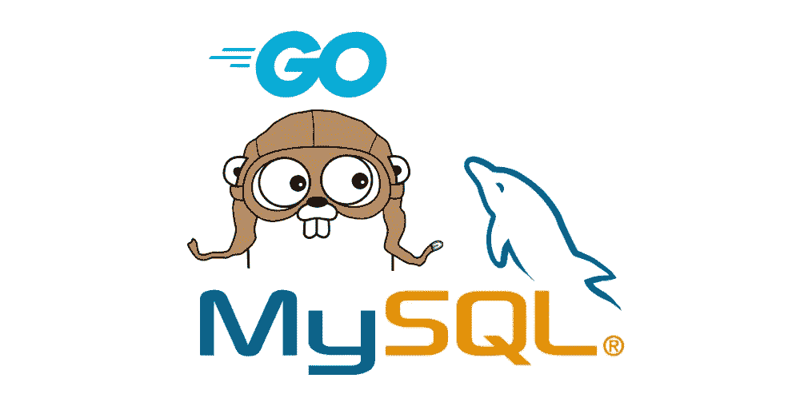
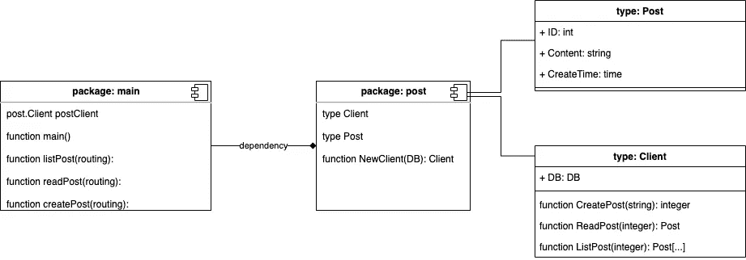
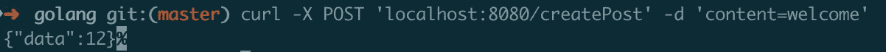
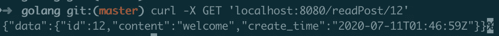
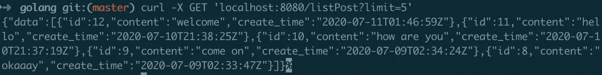

# 使用 Go 和 MySQL 构建一个 API

> 原文：<https://betterprogramming.pub/build-an-api-using-go-and-mysql-1d290c681f1c>

## 这比你想象的要容易



图片来源:作者

# 范围

项目范围是构建一个 API 来管理内容帖子。您将创建一个具有三种功能的 API:创建一篇文章、阅读一篇文章和列出文章。数据库是安装在 localhost 的 MySQL。

数据库库正在使用[https://github.com/jmoiron/sqlx](https://github.com/jmoiron/sqlx)。
HTTP 路由库正在使用[https://github.com/gin-gonic/gin](https://github.com/gin-gonic/gin)。

既然 Go 社区已经有了一个很棒的库，那么几乎没有理由从头开始编写一切。

# 应用设计



项目应用设计

我们有两个套餐:`main`和`post`。

`main`包是 Golang 中运行应用程序的可执行包。它由来自包`post` ( `postClient`)的一个实例和三个处理路由的函数(`listPost`、`readPost`和`createPost`)组成。

`post`包是与数据库交互来管理 post 的包。它有两种对象类型:`Client`和`Post`。`Client`是使用软件包的界面。`Post`是现实世界内容发布模型的抽象。`Client`的实例有三个运行查询或插入数据库的功能。

这个项目的数据库结构只有一个名为“post”的表来存储包`post`中的对象`Post`。表格结构如下。

# 密码

## “邮寄”包裹

下面的代码块解释了我们如何构建需要 DB 输入的`Client`和`Post`类型以及`NewClient`函数。数据库输入使用的是在包外初始化的包。这种方法的思想是包不关心谁和什么创建了`Client`实例，只要它提供了一个工作的 DB 连接池。行内注释解释了代码。

下一个代码块显示了`Client`内部的功能。所有的功能都使用来自`sqlx`的功能。

## “主”包

这个包负责运行 HTTP 请求监听器。当请求到来时，包使用来自`gin`的 HTTP 请求路由。在启动时，`main`包启动一个数据库实例，然后传递该实例从`Post`包创建一个新的`Client`。

## 初始化数据库和 HTTP 路由

在上面的代码中，`r`通过三个用例进行路由:

*   `/listPost` =获取帖子列表
*   `/readPost/:id` =获取一篇文章，其中`:id`是文章 ID 的动态路径
*   `/createPost` =创建一个新的 post，这个路由使用 HTTP POST 方法来携带请求体

这三个路由使用的函数利用了在包级别定义的`postClient`实例。该函数的代码如下。

代码`listPost`正在接收来自`c.Query("limit")`的输入。该查询从 HTTP 请求中捕获额外的参数。带有参数的 HTTP 请求的一个例子是`/listPost?limit=5`。使用函数中的代码，它将把`5`解析为一个限制。

`readPost`函数接收来自`c.Param("id")`的输入，后者正在读取 HTTP 请求中的参数。该参数是 URL 请求本身的动态输入。带参数请求的一个例子是`/readPost/1`。代码使用捕获路由模式`/readPost/:id`，它捕获`:id`作为输入。举个例子，`id`就是`1`。

函数`createPost`正在使用 HTTP POST 请求。POST 请求可以携带使用`c.PostForm("content")`读取`content`的主体数据接收的主体。

所有代码就绪后，使用以下命令运行应用程序:

```
go run main.go
```

# 演示

## 创建新帖子

请求使用以下 cURL 创建一个内容为“hello”的新帖子:

```
curl -X POST 'localhost:8080/createPost' -d 'content=welcome'
```

请求的输出是文章 ID。



## 使用 ID 阅读帖子

使用以前的 ID 作为请求的输入。使用以下卷曲。

```
curl -X GET 'localhost:8080/readPost/12'
```

请求的输出是 post 数据。



## 列出帖子

使用下面的 cURL 获取五篇最新的帖子。

```
curl -X GET 'localhost:8080/listPost?limit=5'
```

输出是五篇最新文章的数据列表。



# 摘要

Go 社区中有这么多健壮的库，在 Go 中开发一个 API 很容易。你可以在这里查看完整的代码:

[https://github.com/purnaresa/golang/tree/master/project101](https://github.com/purnaresa/golang/tree/master/project101)

如果你想问一些关于围棋的问题或者对教程有什么疑问，请留下你的评论。下一个教程你想学什么？