# 用 Fastify 和 MongoDB 构建一个 API

> 原文：<https://betterprogramming.pub/build-an-api-with-fastify-and-mongodb-b34261bb3318>

## 用 Fastify 后端执行数据库操作


照片由 [Chuttersnap](https://unsplash.com/@chuttersnap) 在 [Unsplash](http://unsplash.com) 上拍摄。

Express.js 是一个久经考验的框架，使用起来绝对轻而易举。即使 Express 是轻量级的，也经常需要一个更快的后端系统。这使得你的应用程序更快更灵敏。

这就是 Fastify 的用武之地。由于开销较低，这是一个比 Express 更高效、更快速的框架。这意味着，即使在处理繁重的工作负载时，您的服务器也能保持响应。事实上，根据 Sergey Onufrienko 的说法，Fastify 比 Express 快 20%。

除了速度，它还能提供什么？首先，它有一个不断增长的插件库。最重要的是，它有一个模式系统。例如，假设您的服务器有以下响应:

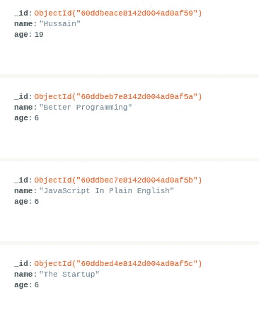

服务器响应

如果你的前端只需要`name`字段呢？通过使用 Fastify 的模式系统，您可以设置一个过滤器并发送`name`字段作为响应:

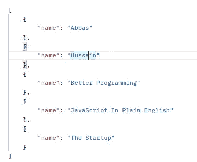

我们期望的反应

在本文中，您将学习如何使用 MongoDB 和 Fastify 作为后端框架来构建 API。

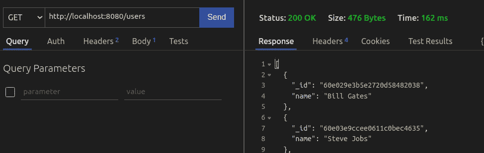

使用 Fastify 后端获取请求

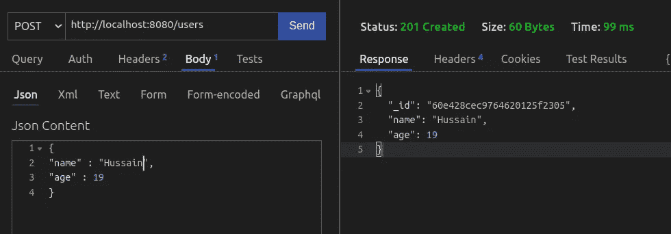

使用 Fastify 后端发布请求

我们开始吧！

# 入门指南

## 项目设置

要初始化 Node.js 应用程序，请运行以下终端命令:

现在让我们安装所需的依赖项。这里，我们需要以下包:

*   `dotenv`:使用环境变量。
*   `fastify`:构建我们的后端。
*   `fastify-mongodb` : Fastify 的插件，帮助我们与数据库互动。
*   `mongodb`:允许我们解析 URL 参数并将它们转换成`ObjectID`字段。

要获取这些模块，请运行以下命令:

```
npm i dotenv fastify fastify-mongodb mongodb 
```

接下来，转到您的`.env`文件，粘贴您的 MongoDB 连接字符串，如下所示:

```
CONNECT_DB = connectionString
```

完成后，让我们讨论我们的项目结构。

## 项目目录

在项目的文件夹结构中，创建以下文件夹:

*   保存我们的应用程序逻辑。
*   这个目录将保存我们的路由和它们各自的处理程序。

最后，项目的文件夹结构应该如下所示:

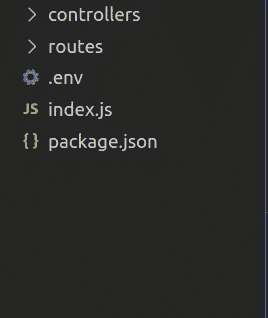

项目结构

# 创建我们的 API

## 回家路线

在`/index.js`中，编写以下代码:

*   线 1:带入`fastify`模块。`logger`属性告诉 Fastify 将用户的路线和响应代码注销到终端。
*   第 6-9 行:使用`fastify-mongodb`插件，这样我们就可以在项目中使用我们的数据库。
*   第 11-13 行:如果用户去了`/`路线，显示一个响应。
*   第 15 行:在端口`8080`上运行我们的后端。

让我们来测试一下。转到您的 API 客户端，向`localhost:8080`发出请求。

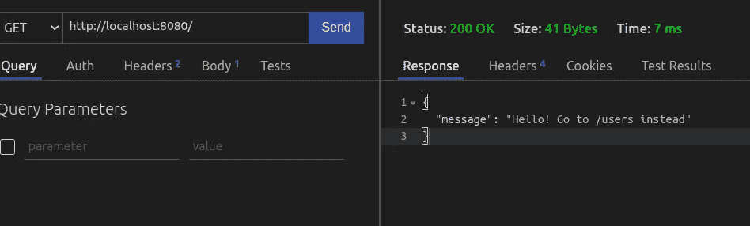

代码的输出

太好了！我们的代码有效。

## 将用户添加到数据库

在您的`controllers`文件夹中，创建一个名为`users.controller.js`的文件。在这里，编写以下代码:

*   第 4 行:从数据库中获取`users`集合。
*   第 5 行:列出数据库中的所有用户，并将它们放在一个数组中。
*   第 7 行:最后，将结果发送给客户机。
*   第 13 行:存储有效载荷中的`name`和`age`字段，并将它们存储在`data`对象中。
*   第 14 行和第 15 行:最后，将这些数据保存到数据库中，并将这些数据发送给客户机。

我们现在已经写出了我们的逻辑。作为第二步，现在让我们将它注册为一个处理程序。

在`routes`中，创建一个名为`users.js`的文件。在这里，编写以下代码:

*   第 4 行:如果用户去了`/users`路线，运行`listUser`功能。
*   第 5 行:当用户向`/users`路由发送数据时(一个`POST`请求)，调用`addUser`方法。

我们快完成了！剩下的就是登记`/users`路线了。

为此，转到`/index.js`并写下这一行:

```
fastify.register(require("./routes/users"));
```

为了测试您的代码，对`/users`路由执行一个`POST`请求:

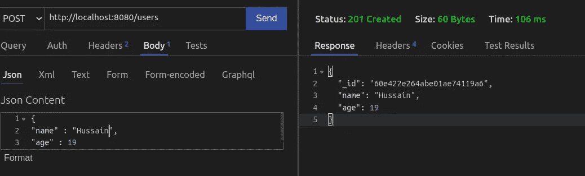

代码的输出

要获取`users`集合中的所有文档，使用一个`GET`请求:

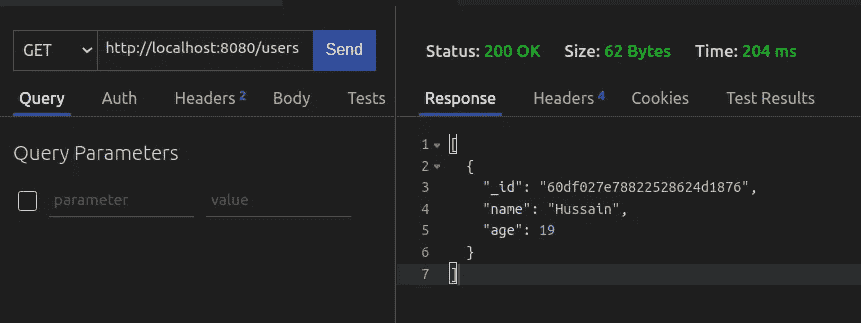

代码的输出

这真的很简单！

最后，`/index.js`应该是这样的:

## 从数据库中读取用户

在`controllers/users.controller.js`中，添加以下代码:

*   第 4 行:找到具有特定`id`字段的用户。`req.params`对象包含 URL 参数。在这种情况下，我们只需要`id`参数。
*   第 5-7 行:如果存在，返回结果。
*   第 8 行:否则，通知客户端这个用户不存在。

作为最后一步，我们必须将该功能注册到我们的`users`路线。转到`routes/users.js`，在`routes`功能中添加以下行:

```
fastify.get("/users/:id", getUser);
```

这将是输出:

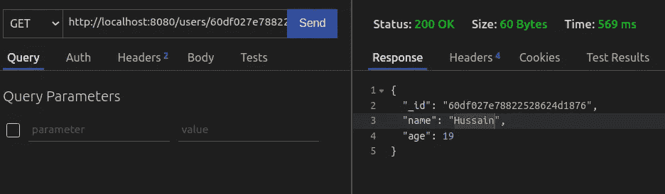

代码的输出

在下一节中，您将学习如何更新数据库中的用户。

修改后的`/routes/user.js`应该是这样的:

## 更新用户

转到`/controllers/users.controller.js`并添加以下程序块:

*   第 10-14 行:找到具有匹配`id`的用户，并根据有效载荷对其进行更新。
*   第 15 行:最后，向客户机发送一条消息，表明这个过程是成功的。

第二步，转到`routes/users.js`并添加以下行:

```
fastify.put("/users/:id", updateUser);
```

这意味着如果用户对`users/:id`执行一个`PUT`请求，Fastify 将调用`updateUser`方法。

运行代码。这将是输出:

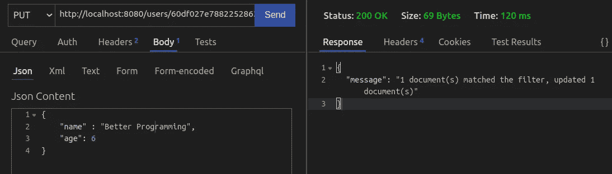

在下一节中，您将编写代码来实现删除功能。

## 删除用户

在`users.controllers.js`中写入以下代码:

*   第 4 行:找到具有匹配的`id`字段的用户。如果找到，从数据库中删除此文档。
*   第 6 行:如果服务器找不到特定的记录，通知客户机。

我们要做的就是将它注册为一个处理程序。为此，转到`routes/users.js`并添加以下行:

```
fastify.delete("/users/:id", deleteUser);
```

这将是输出:

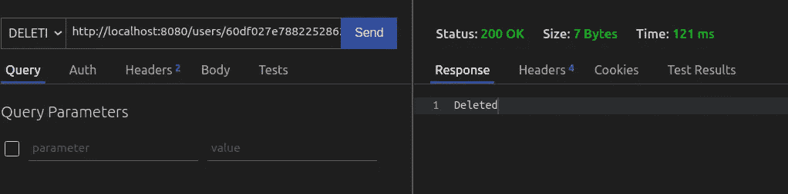

代码的输出

我们现在已经完成了这一部分。在下一节中，您将为这个 API 创建一个模式。

最后，`routes/users.js`应该是这样的:

## 创建模式

每当我们向`/users`发出请求时，我们都会获得每个用户的所有字段:

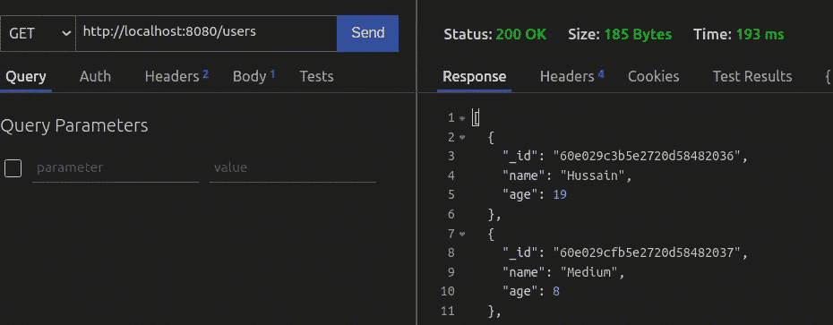

在本文中，我们将构建一个模式，告诉 Fastify 排除`age`字段。

在您的`routes/users.js`文件中，添加以下代码块:

让我们一段一段地剖析这段代码:

*   第 4 行:如果响应码是`200`(响应成功)，返回的结果应该是一个`array`。
*   第 6 行:这个数组的每一项都是`object`的类型。
*   第 8-10 行:每个对象都有两个字段:an `_id`和`name`。
*   第 16 行:使用这个模式的路由将使用`listUsers`方法作为它的处理程序。
*   第 20 行:最后，告诉 Fastify,`/users`路由将使用`getUsersopts`模式。

运行代码。

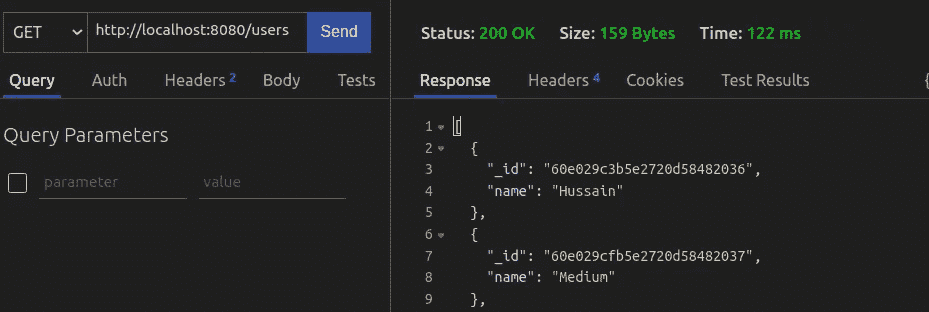

代码的输出

我们的代码有效！我们的服务器返回了少量数据。这意味着我们的请求大小也缩小了。

现在让我们为用户使用`id`搜索条目编写一个模式。

在`users/routes.js`中，添加这段代码:

*   第 4-10 行:在响应代码`200`上，发送项目的`_id`、`name`和`age`字段。
*   第 18 行:为`/users/:id`字段使用`getUserOpts`模式。

就是这样！这将是输出:

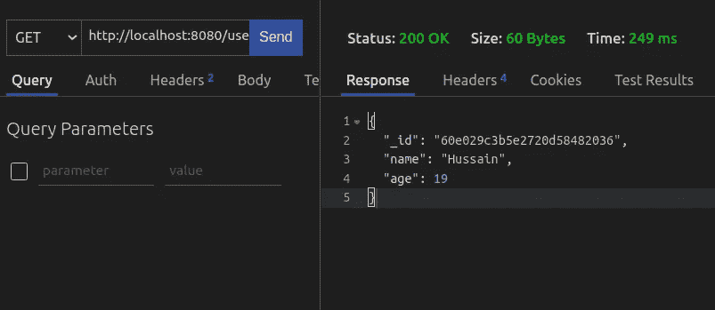

代码的输出

我们甚至可以在请求负载上使用模式。为了演示这一点，我们将编写一个在`/users/:id`处理`PUT`请求的模式。

*   第 4 行:请求体的类型应该是`object`。
*   第 5 行:我们的服务器需要`name`和`age`字段。如果其中任何一个不存在，请求将失败。
*   第 7 行:`name`应为`string`类型，`age`应为`integer`类型。

让我们来测试一下。执行一个不正确的`PUT`请求来 Fastify，如下所示:

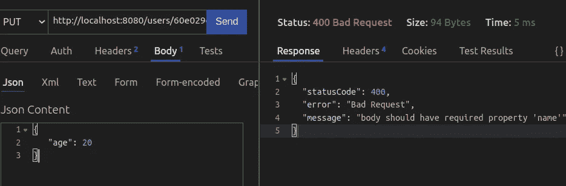

我们请求中的错误

只有我们指定了所有必填字段，请求才会通过:

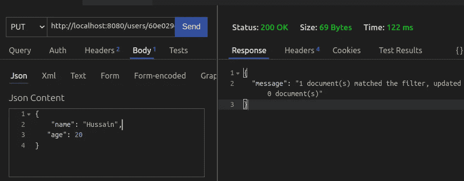

正确的请求

太神奇了！现在让我们为我们的`POST`请求具体化一个模式。添加以下代码:

*   第 26 行:在`/users`路线上使用`postUserOpts`模式。

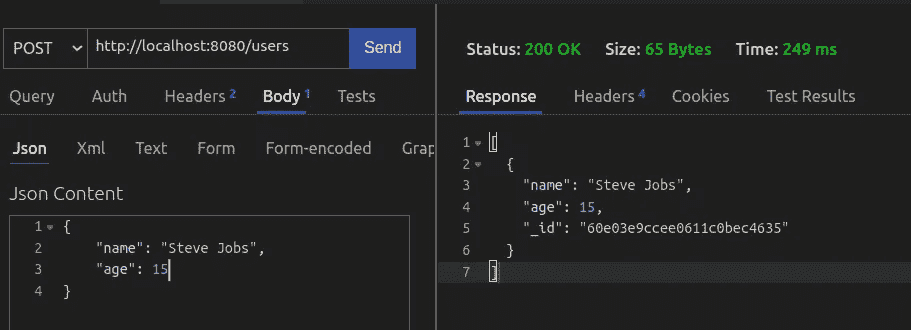

代码的输出

我们剩下的工作就是为我们的请求设计模式。

*   第 5 行:返回的输出应该是类型`string`。

这应该是代码的输出:

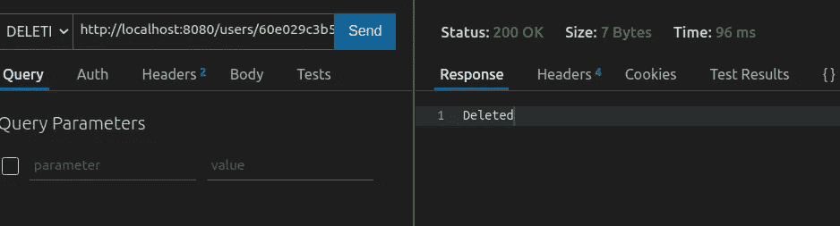

代码的输出

我们完事了。

# 更多资源

[GitHub 上这个项目的代码](https://github.com/HussainArif12/Fastify-tutorial)。

*   [如何用 Mongoose 和 Fastify 构建超快的 REST API](/how-to-build-blazing-fast-rest-apis-with-node-js-mongodb-fastify-and-swagger-114e062db0c9)-[齐格弗里德·格里姆比克](https://medium.com/u/468d13fc3da9?source=post_page-----b34261bb3318--------------------------------)
*   [Fastify 速成班—旅行媒体](https://www.youtube.com/watch?v=Lk-uVEVGxOA)
*   [忘记快递。选择这些替代方案——log rocket](https://blog.logrocket.com/forget-express-js-opt-for-these-alternatives-instead/)

# 结论

如果您的目标是构建一个支持响应性和速度的 API，那么 Fastify 将满足您的需求。此外，其庞大的插件生态系统允许您开发复杂的功能，而无需编写大量代码。

非常感谢您的阅读！