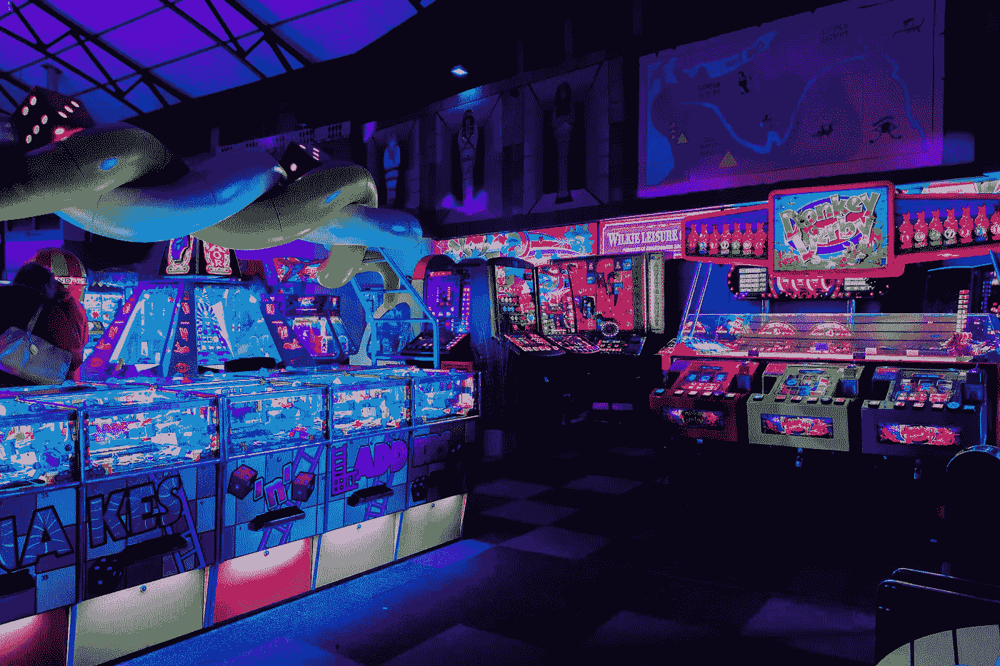

# 用普通 JavaScript 构建一个街机游戏

> 原文：<https://betterprogramming.pub/build-an-arcade-game-with-vanilla-javascript-d318fc94832b>

## 用 DOM 操作创建一个简单的街机游戏



照片由[卡尔·劳](https://unsplash.com/@carltraw?utm_source=unsplash&utm_medium=referral&utm_content=creditCopyText)在 [Unsplash](https://unsplash.com/s/photos/arcade?utm_source=unsplash&utm_medium=referral&utm_content=creditCopyText) 拍摄

对于那些刚开始接触 JavaScript 世界的人来说，今天是一个特殊的日子。掌握我们的手艺的唯一方法是实践，今天我们要弄脏我们的手，并开始提高我们的 DOM 操作技能。怎么会？用普通的 JavaScript 构建一个简单的街机游戏。

尽管这篇文章是针对初学者和新手的，但这并不意味着更有经验的开发者不会发现它也很有用。

# 我们将涵盖的内容

*   CSS 和 JavaScript 的基础知识。
*   Flexbox 的基础，CSS3 网页布局模型。
*   使用 JavaScript 动态操作 DOM。
*   一次演练。

# 挑战


普通 JavaScript 街机游戏

街机游戏有以下要求:

*   它使用一个图像作为背景，并有一个可点击的鸭子图像。
*   当用户点击鸭子时，会发生两件事:1 .当前分数增加 1 和 2。鸭子移动到一个随机的位置。
*   它应该使用 ES6 规范特性来构建。
*   它使用 Flexbox 进行布局。

简单。现在怎么办？一般来说，对于这样的问题，我们需要做的第一件事是考虑我们需要遵循的方法和解决方案。这意味着我们需要弄清楚完成这些需求所需的每个步骤和细节。我们来分析一下。

为了解决这个难题，我们将按照给定的顺序执行接下来的步骤。分裂，你将征服！

1.  使用资源(背景图像和鸭子)和配乐框实现布局。
2.  当我点击鸭子时，我需要什么？我们需要一个事件侦听器，当我们点击它时，它将成为一个触发器。
3.  创建一个函数来增加当前分数。
4.  创建一个随机移动鸭子的函数。

事不宜迟，让我们动手干吧。

# 1.布局

我们的布局(index.html)将有一个作为容器的 div，然后图像背景和鸭子。最后，一个`scoreContainer` 元素带有分数文本和分数(一个计数器)。

```
<div class="container">
     
     
     <div class="scoreContainer">
       <div id="score-text">Score</div>
       <div id="score-counter">0</div>
    </div>
</div>
```

## 风格

```
/*Make any img element responsive*/
img {
 max-width: 100%;
}/*Set a fixed size for width and height and in an absolute position*/
#duck {
 margin: 50px;
 width: 100px;
 height: 100px;
 position: absolute;
 left: 100px;
 top: 100px;
}/*Style for the Score container*/
.scoreContainer {
 background-color: black;
 width: 15%;
 height: 15%;
 color: #ffffff;
 top: 5%;
 right: 5%;
 border: 2px solid greenyellow;
 border-radius: 10px;
 display: flex;
 position: fixed;
 flex-direction: column;
 align-items: center;
}#score-text {
 font-size: 1.5em;
}#score-counter {
 font-size: 3.1em;
 font-weight: bold;
 color: #06e515;
}
```

# 2.Java Script 语言

## 2.1 创建事件监听器

现在，我们将在鸭子图像上创建一个事件监听器。当用户点击鸭子图片时，它会触发一个函数。

```
//Get the target element
const duck = document.querySelector("#duck");//Add the click event listener
duck.addEventListener("click", () => {
  //Dont forget call the functions here 
  increaseScore();
  moveDuck();
});
```

## 2.2 创建一个增加当前分数的函数

我们刚刚创建了事件监听器。现在，我们将创建一个函数，将计数器(我们的分数)增加 1。

```
//Increase score by 1
const increaseScore = () => {
  //Get the content of the target element. The current value for score
  const score = document.querySelector("#score-counter").innerHTML;
  //Get the element to increase the value
  const scoreHTML = document.querySelector("#score-counter");
  //Cast the score value to Number type
  let count = Number(score);
  //Set the new score to the target element
  scoreHTML.innerHTML = count + 1;
};
```

## 2.3 创建一个随机移动鸭子的函数

是时候动鸭子了。然而，因为鸭子会随机移动，所以创建一个助手函数来获得一个随机数是一个不错的选择，我们稍后将使用这个随机数来设置随机位置。让我们创建这个函数:

```
//Get a random numberconst getRandomNum = (num) => {
  return Math.floor(Math.random() * Math.floor(num));
}
```

现在，我们要创建一个函数来移动鸭子。我们使用`innerWidth` 属性获取窗口的内部宽度(以像素为单位),使用`innerHeight` 属性获取窗口的内部高度(以像素为单位)。此外，我们使用`getRandomNum`函数来设置顶部和左侧属性的像素数，以影响鸭子的垂直和水平位置。

```
/*
Move the duck randomly 
*/
const moveDuck = () => {
  const w = window.innerWidth;
  const h = window.innerHeight;
  duck.style.top = getRandomNum(w) + "px";
  duck.style.left = getRandomNum(h) + "px";
};
```

这就是今天的全部！我希望您遵循了这个简单的指南，并且已经理解了 DOM 操作。

# **已完成的程序**

街机游戏 DOM 操作

*感谢阅读！我希望这篇文章对你有帮助。*