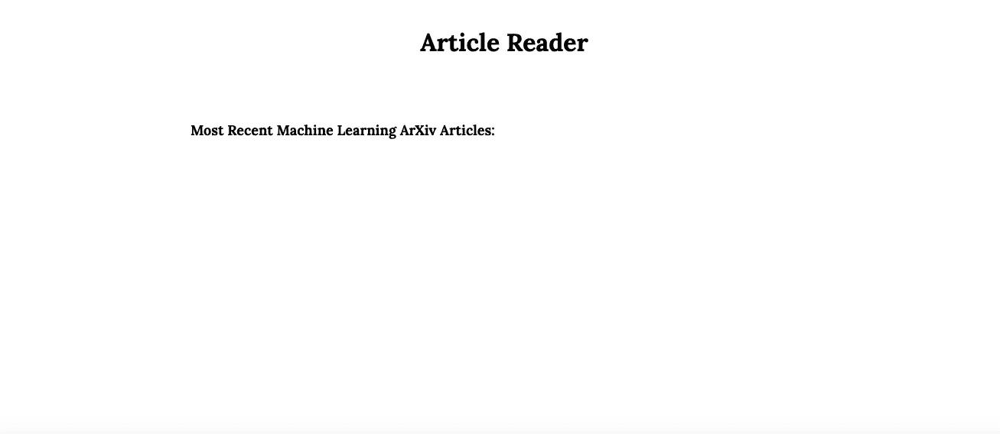
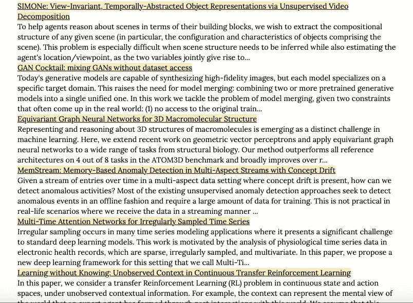
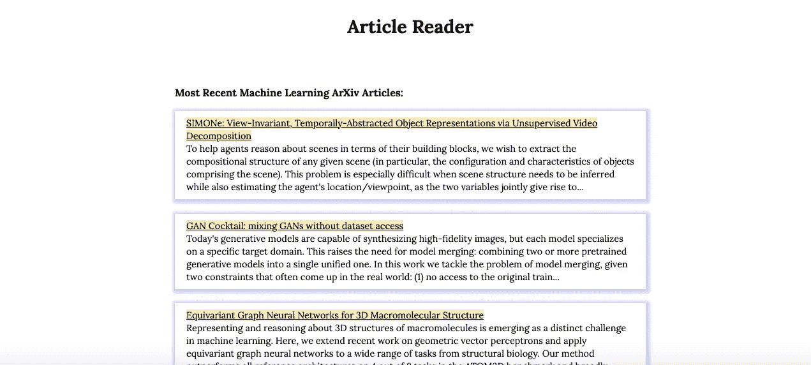

# 使用免费的 API 和 JavaScript 构建一个文章阅读器 Web 应用程序

> 原文：<https://betterprogramming.pub/build-an-article-reader-web-app-using-free-apis-and-javascript-ce1100d43a21>

## 下面是我如何在一个下午构建一个 web 应用程序


西蒙·瑞在 [Unsplash](https://unsplash.com?utm_source=medium&utm_medium=referral) 上拍摄的照片

当我经历建立我的简历的漫长过程时，我决定开始建立一些我自己的个人项目。我以前已经开始这样做一百万次了，但是这一次，我实际上要完成其中的一些。

我知道，我知道…每个人都这么说。

你猜怎么着？我已经完成一个了！接招吧，拖延症。

在这篇文章中，我将带你经历我希望在未来几个月中建立的许多个人项目中的第一个。我希望你觉得这个项目有帮助，或者至少有点有趣。希望它能启发你自己的一些项目！

# 定义项目

我想建立一个可以放在我的文件夹中的项目——可以展示一些与我申请的开发人员工作相关的技能。我还希望构建一些有趣且有点用处的东西。

当我思考这个问题时，我想到了两个我想解决的小而紧迫的难题:

*   我花了太多时间在手机上浏览无聊的内容。
*   我没有花足够的时间阅读对我的课程有实际帮助的计算机科学材料。

考虑到这两个痛点，我决定了一个解决方案。我会开发一个文章阅读器应用程序，只给我提供计算机科学研究和最近的科技相关新闻。这样，我就可以有东西可以无意识地滚动*和*可以更容易地获得有用的阅读材料。

我觉得这是个好主意，所以我决定试一试。

# 步骤 1:寻找免费的 API

第一步是弄清楚从哪里获取文章以及如何获取。在 Google 上快速搜索免费的计算机科学内容后，我发现有许多免费的公共 API 可以让我访问我需要的内容。

作为参考，这里有两个很好的可用公共 API 列表。

*   公共 API—免费 API 的集合列表
*   [https://public-apis.io/](https://public-apis.io/)

我选择只从一个 API 开始:arXiv API。arXiv 在广泛的学术领域提供了大量严谨和前沿研究的免费访问，这对我的项目来说是完美的。

# **第二步:阅读 API 文档**

对我来说幸运的是，arXiv API 维护得非常好，并且有很好的文档记录。这里可以找到[这里](https://arxiv.org/help/api/)。

根据文档，可以通过多种方式调用 API。也许最简单的方法是通过对正确的 URL 发出 HTTP GET 或 POST 请求来从 arXiv 获取文章。使用这种方法，只需更改 URL 的参数，就可以确定您想要哪些文章。这是我采用的方法。

我的第一个问题是如何建立我的网址。arXiv 提供的基本 URL 如下所示:

```
http://export.arxiv.org/api/{method_name}?{parameters}
```

在这种格式中，有两个重要的组成部分:我们想要使用的方法和我们想要定义的搜索参数。这些在 url 中由`method_name`和`parameters`表示。

出于我的目的，从 arXiv 数据库中检索文章的最简单方法是使用 query 方法。arXiv 为使用查询方法提供了一个简单的接口。所有需要做的就是将`query`插入`method_name`位置，就在`?`的前面。这样做的时候，我的 URL 看起来像这样:

```
http://export.arxiv.org/api/query?{parameters}
```

接下来，我需要弄清楚 URL 中包含哪些参数。为此，我将重点缩小到三个具体标准:

*   我对学习更多关于计算机科学研究的一些特定领域感兴趣。我选择了机器学习、博弈论、数据结构和算法设计。
*   我希望它们越近越好。
*   我只想要其中的一小部分——刚好够放在一个漂亮干净的饲料中。

为了缩小搜索范围，只搜索符合这些标准的文章，arXiv 允许用户将多个参数用一个`&`符号连接起来。

我需要的第一个参数是`search_query`参数。此参数采用一个表示要搜索的特定条件的字符串。换句话说，API 接口为用户提供了一组九个不同的“前缀”和“解释”，我们可以用它们来缩小搜索查询的范围。

如上所述，我在寻找三个特定类别的计算机科学文章:机器学习、博弈论、数据结构和算法设计。在 arXiv API 中，我可以通过将它们链接在一起来搜索所有这三个类别，如下所示:

```
search_query=cat:cs.LG+AND+cat:cs.GT+AND+cat:cs.DS
```

这比看起来要简单得多，查询用连接器`+AND+`链接了三个单独的`prefix:explanation`对。在这三篇文章中，我都使用前缀`cat`按类别搜索，后跟三个“解释”、“T10”(机器学习)、`cs.GT`(博弈论)和`cs.DS`(数据结构)，以搜索我的三个特定主题类别。

为了进一步过滤查询结果，我将几个参数连接在一起:

为了按照最后更新日期对返回的文章进行排序，我使用了:

```
sortBy=lastUpdatedDate
```

为了确保文章从最近到最近显示，我使用了:

```
sortOrder=descending
```

这可能是不必要的，但我甚至指定从第一篇最近的文章开始，而不是第三篇或第四篇最近的文章:

```
start=0
```

最后，为了确保我们一次只显示 10 篇文章，我还添加了:

```
max_results=10
```

这样，我的完整网址看起来像这样:

```
http://export.arxiv.org/api/query?search_query=cat:cs.GL&sortBy=lastUpdatedDate&sortOrder=descending&start=0&max_results=10
```

# 步骤 3:用 XMLHttpRequest 获取数据

定义了 URL 之后，我接下来需要关注如何将查询的数据拉入我的应用程序。

根据 arXiv 文档，我发现将文章放入 web 应用程序的最佳方式是使用 XMLHttpRequest。

如果您不熟悉 XMLHttpRequest (XHR)对象，它们是一种与 web 服务器交互的方法，允许您从 URL 检索数据。它们使用起来相当简单，是 AJAX 编程的一个常见方面。

如果您想了解更多关于 XMLHttpRequest 对象的知识，这里有一些快速的文章可以帮助您快速入门:

*   [“XMLHttpRequest”——MDN Web Docs](https://developer.mozilla.org/en-US/docs/Web/API/XMLHttpRequest)
*   [“XMLHttpRequest”——维基百科](https://en.wikipedia.org/wiki/XMLHttpRequest)

在我的项目中使用 XHR 非常简单。我所要做的就是在代码中定义一个 XHR 对象，并将其指向正确的 URL。

首先要做的是使用构造函数方法`XMLHttpRequest()`声明我的 XHR 对象的一个实例:

够简单！这一行简单地声明了一个新的 XHR 对象，我可以用它来查询数据。

XMLHttpRequests 本身就是一个 API，它为用户提供了一组有用的内置方法和属性。因此，我可以使用内置方法通过新的`xhr`对象来提取数据。

为此，我使用了`.open()`方法来打开对我的 URL 的 GET 请求:

`.open()`方法简单地说:

*   `GET`是我正在使用的 HTTP 方法。
*   `http://export.arxiv.org/api/query?search_query=cat:cs.GL&sortBy=lastUpdatedDate&sortOrder=descending&start=0&max_results=10`是我请求的网址。
*   该函数应该异步运行，由最后的布尔值`True`指定。

然后,`.open()`方法初始化 HTTP 请求。

一旦发出 HTTP 请求，我就可以指定如何处理返回的响应。

为此，我可以使用 XMLHttpRequest API 提供的另一个内置属性，即`.onreadystatechange` 事件处理程序。每当我的`xhr`对象的`readyState`属性改变时，这个事件处理器执行一个回调函数。

`readyState`属性返回客户端请求的状态。我们可以在这里进行更详细的讨论，但是只需要注意到`readyState`属性只有五种状态:`UNSENT`、`OPENED`、`HEADERS_RECEIVED`、`LOADING`或`DONE`。特定的状态让我知道我的 GET 请求的状态。我的回调函数根据状态决定我如何处理 GET 请求返回的响应。

`.onreadystatechange`处理程序的基本语法是:

```
XMLHttpRequest.onreadystatechange = callback;
```

在我的项目环境中，我像这样设置处理程序:

决定如何在我的 web 页面上显示数据的实际代码最终放在了我的回调函数中。我马上会谈到这一点，但是首先，我需要将最后一个`XMLHttpRequest`方法添加到我的代码中:方法`.send()`。

`.send()`方法只是将我的请求发送给服务器。因为我的请求是异步发送的，所以这个方法将在`.open()`方法执行后立即返回。在我的代码中是这样的:

也超级容易！此时，我的代码如下所示:

用这段代码，我已经创建了:

*   一个`XMLHttpRequest`对象。
*   带有对象的`GET`请求。
*   用于`GET`请求的事件处理程序。
*   实际发送请求的 send 方法。

负责我项目的核心部分。现在我可以开始有趣的事情了:数据解析！

# 步骤 4:解析响应文本

既然我已经构建了我的简单 web 应用程序的框架，我可以着手处理如何处理来自我的`GET`请求的响应。

要做的第一件事是检查我的请求是否正确完成。我还需要检查响应状态。

为了检查我的请求是否正确完成，我需要检查`readyState`是否返回了一个状态`DONE`——如果它返回了其他的东西，这意味着我的函数还没有完成，所以不需要发生任何事情。

我还需要检查返回的状态是否等于 200，这表示请求成功了。

实现这两种检查，我的代码如下所示:

现在，如果我的响应是成功的，我应该能够看到响应数据。如果我想检查我的代码是否工作正常，我可以插入一个快速的`console.log(this.responseText)`,其中“做一些有成功响应的事情”注释是为了查看返回的数据。这样做将在浏览器控制台中显示如下内容:

API 响应文本—摘自 arXiv API 用户手册的示例

上面的响应文本是格式化的 XML 数据。具体来说，arXiv API 使用一种称为 Atom 的 XML 语法。无需深究 Atom 的细节，只需知道 Atom 是一种用于发布 web 内容的流行方法，其功能类似于 RSS 提要。

出于我的目的，我只需要知道如何访问以这种格式提供给我们的数据。这就是 JavaScript 代码的用武之地。

响应数据以 XML 字符串的形式提供给我们。然而，为了实际使用这个字符串，我需要某种方法来解析它。幸运的是，我没有手动这么做(尽管我确信那会很有趣)，而是做了一点小手脚，使用了另一个名为 DOMParser 的 API 来解析 XML 字符串。

就像使用 XMLHttpRequest API 一样，我所要做的就是使用一个构造函数来创建一个新的 DOMParser 对象，我可以用它来为我做脏活:

在这里，我首先创建了一个名为`domparser`的新 DOMParser 对象。接下来，我使用我的 DOMParser 对象来调用`.parseFromString()`方法，该方法再次省略了细节，获取我的字符串并将其转换为 XML 对象。

解析后的 XML 对象看起来与上面提到的字符串输出完全一样，但是现在我可以使用标准文档对象模型接口中可用的方法，通过标记名选择 XML 数据的单个元素。

由于对 XML 响应的元数据不感兴趣，我接下来只专注于响应数据的`<entry>`标记中的数据。为此，我只需使用`.getElementsByTagName()`方法选择 XML 数据中的每个`<entry>`标签。

这一行代码产生了一个由`<entry>`数据组成的可迭代数组。条目数据包含我的文章阅读器所需的所有信息，并排除了不必要的元数据，如更新日期或版本号。

# 步骤 HTML 标记

现在我有了要插入到应用程序中的数据，我需要编写一点 HTML 标记来确定在哪里插入我的文章。

我只需要给文章阅读器页面一个简单的标题，并创建一个 div，我可以在我的网页上显示文章。我的标记看起来像这样:

这给了我一个简单得可笑的网页，作为我的文章提要的容器。鉴于我对简单性的偏好，页面看起来像这样:



简单的网页

接下来，我可以将我的文章提要直接插入到代码中有评论的页面中。

# 步骤 6:用 JavaScript 显示信息

为了决定如何显示文章提要，我从 Medium 和其他新闻提要中获得了一些灵感。通常，大多数文章提要如下所示:


中等物品进给

简单明了，这些订阅源只显示关于每篇文章的一些信息——足以帮助读者判断文章是否值得一读。提要显示文章的标题(也可以作为文章的链接)、作者姓名、出版物名称、副标题和一些小的元数据，如发表的数据和文章的长度。

纯粹为了让我的文章阅读器尽可能简单，我决定只显示每篇文章的标题(带有文章 pdf 的链接)和一段 400 字符的文章摘要。这就是我需要的所有信息，来告诉我这篇文章是否值得一读。

为了实现这个期望的显示，我决定遍历我的`<entry>`标签数组，并将每个链接、标题和摘要片段放入它们自己的数组中，如下所示:

这给了我三个不同的数组:一个包含链接，一个包含标题，一个包含摘要。然后，我可以使用这三个数组将我的信息输入到我的网页中。

然而，首先，我还需要做一件事。因为摘要的长度不同，所以我需要对每个摘要应用一个映射函数，将它们缩减到 400 个字符:

这给了我一个包含 10 个摘要的数组，每个摘要不超过 400 个字符。

接下来，我必须构建 HTML 来插入到我的文档中:

在这里，我在一个名为 parsed 的新数组中创建了 10 个元素。每个元素都是一个 div 元素，代表一篇文章。每篇文章都包含一个标题，一个到实际 pdf 的链接，以及一个直接来自文章摘要的 400 个字符的摘要。

最后，JavaScript 任务的最后一步是将每篇文章一篇接一篇地插入实际的网页。我通过遍历解析过的数组并使用 DOM 方法`.insertAdjacentHTML()`将每篇文章插入到网页中来实现这一点。

正确完成后，我的网页上的提要如下所示:



这正是我想要的！我的 feed 给了我 arXiv 数据库中最近十篇机器学习、博弈论和数据结构文章的标题和摘要。此外，因为我将提要创建为我先前存在的 portfolio 网站上的一个页面，所以提要已经使用了一点 CSS 样式。

作为参考，下面是我的全部 JavaScript 代码:

剩下的就是添加更多的 CSS。

# 步骤 7:添加一些 CSS

因为这个项目更多的是学习如何使用 API，所以我保持我的 CSS 非常简单。我只需要把文章隔开一点，把标题和摘要区分开来。

因为我在我的个人网站中加入了这个项目，所以我使用了 Sass 并使用了一个变量`$spacer`。这个项目非常简单，实际上并不需要预处理器，但这就是我所做的:

添加一些样式后，最终结果看起来像这样:



成品阅读器

# 第七步:快乐阅读！

就是这样！一个非常简单的文章阅读器，使用免费的 API 和一些简单的 HTML、CSS 和 JavaScript。

虽然这个项目目前的形式非常简单——可能简单到无法真正调用一个应用程序——但将来我有很多方法可以扩展这个项目。例如，我可以很容易地添加一个输入表单，让用户定制他们的搜索，而不是将我的搜索查询直接硬编码到我的代码中。这将非常像一个典型的搜索栏，并增加了用户互动的元素，使其更像应用程序。

如果我想变得真正疯狂，我还可以添加其他免费 API，并引入其他文章来源，使它更像一个典型的新闻提要。我甚至可以提供过滤文章的功能，这取决于那天我想读什么。

然而，那是另一个项目。现在，我将继续享受我的简单项目！

如果你想看完成的项目，你可以在我的网站[这里](http://mattdemichele.co/article-reader)看到它。这不是世界上最漂亮的项目，也不是最令人印象深刻的项目。但是，嘿，这是一个好的开始。更不用说，我现在有别的东西可以滚动，而不是愚蠢的狗 TikToks！

我希望你喜欢这个项目，并发现我的思考很有帮助。一如既往的感谢阅读！当然，感谢 arXiv 使用它的开放访问互操作性。