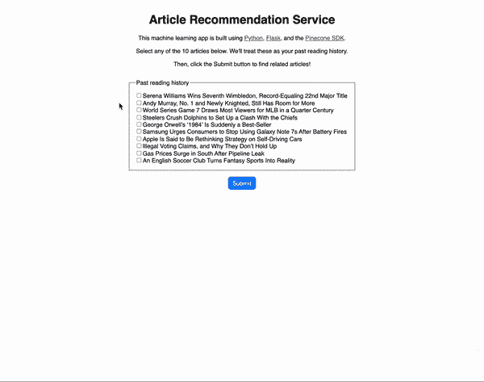
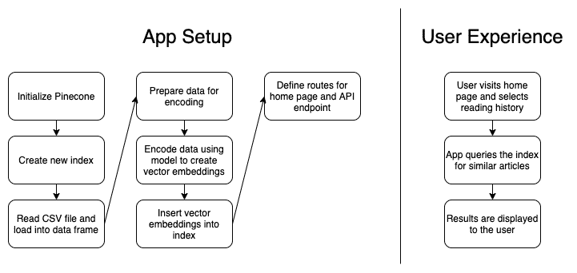

# 用 AI/ML 构建文章推荐引擎

> 原文：<https://betterprogramming.pub/build-an-article-recommendation-engine-with-ai-ml-c6e931e34d3b>

## 获得更好内容建议的 Python 应用程序

马库斯·温克勒在 [Unsplash](https://unsplash.com?utm_source=medium&utm_medium=referral) 上的照片

内容平台靠向用户推荐相关内容而繁荣。平台提供的相关项目越多，用户在网站上停留的时间就越长，这通常会转化为公司广告收入的增加。

如果你曾经访问过新闻网站、在线出版物或博客平台，你很可能接触过推荐引擎。每一个都基于你的阅读历史接受输入，然后推荐更多你可能喜欢的内容。

作为一个简单的解决方案，一个平台可以实现一个基于标签的推荐引擎——你读了一篇“商业”文章，所以这里有另外五篇标签为“商业”的文章然而，构建推荐引擎的更好方法是使用**相似性搜索和机器学习算法**。

在本文中，我们将构建一个 Python Flask 应用程序，它使用[松果](https://www.pinecone.io/)——一个相似性搜索服务——来创建我们自己的文章推荐引擎。

# 演示应用概述

下面，你可以看到我们的演示应用程序如何工作的简短动画。页面上最初显示十篇文章。用户可以选择这十篇文章的任意组合来代表他们的阅读历史。当用户点击提交按钮时，阅读历史被用作查询文章数据库的输入，然后向用户显示另外十篇相关文章。

演示应用程序—文章推荐引擎

如你所见，返回的相关文章异常准确！在本例中，有 1024 种可能的阅读历史组合可用作输入，每种组合都会产生有意义的结果。

那么，我们是怎么做到的呢？

在构建应用程序时，我们首先从 Kaggle 找到了新闻文章数据集。该数据集包含来自 15 个主要出版物的 143，000 篇新闻文章，但我们只使用了前 20，000 篇。(这个数据库的完整数据集包含超过 200 万篇文章！)

然后，我们通过重命名几列并删除那些不必要的列来清理数据集。接下来，我们通过嵌入模型运行这些文章，以创建[向量嵌入](https://www.pinecone.io/learn/vector-embeddings/)——这是机器学习算法的元数据，用于确定各种输入之间的相似性。我们使用了[平均单词嵌入模型](https://nlp.stanford.edu/projects/glove/)。然后，我们将这些矢量嵌入插入到松果管理的矢量索引[中。](https://www.pinecone.io/learn/vector-database/)

将矢量嵌入添加到索引后，我们就可以开始查找相关内容了。当用户提交他们的阅读历史时，会向一个 API 端点发出请求，该端点使用 Pinecone 的 SDK 来查询矢量嵌入的索引。端点返回十篇相似的新闻文章，并在应用程序的 UI 中显示它们。就是这样！很简单，对吧？

如果你想自己尝试一下，你可以在 GitHub 上找到这个应用的代码。`README`包含如何在您自己的机器上本地运行应用程序的说明。

# 演示应用程序代码演练

我们已经了解了应用程序的内部工作原理，但是我们实际上是如何构建它的呢？如前所述，这是一个利用松果 SDK 的 Python Flask 应用程序。HTML 使用模板文件，前端的其余部分使用静态 CSS 和 JS 资产构建。为了简单起见，所有的后端代码都在`app.py`文件中，我们在下面完整地复制了它:

让我们检查一下`app.py`文件的重要部分，以便理解它。

在第 1–14 行，我们导入了应用程序的依赖项。我们的应用依赖于以下内容:

*   `dotenv`用于从`.env`文件中读取环境变量
*   `flask`用于网络应用程序设置
*   `json`用于使用 JSON
*   `os`也用于获取环境变量
*   `pandas`用于处理数据集
*   `pinecone`使用松果 SDK
*   `re`用于处理正则表达式(RegEx)
*   `requests`请求 API 下载我们的数据集
*   `statistics`获取一些方便的统计方法
*   `sentence_transformers`对于我们的嵌入模型
*   `swifter`用于处理熊猫数据框

在第 16 行，我们提供了一些样板代码来告诉 Flask 我们的应用程序的名称。

在第 18–20 行，我们定义了一些将在应用程序中使用的常量。其中包括松果索引的名称、数据集的文件名以及从 CSV 文件中读取的行数。

在第 22–25 行，我们的`initialize_pinecone`方法从`.env`文件中获取我们的 API 密匙，并用它来初始化松果。

在第 27–29 行，我们的`delete_existing_pinecone_index`方法在松果实例中搜索与我们正在使用的名称相同的索引(“文章-推荐-服务”)。如果找到一个现有的索引，我们就删除它。

在第 31–35 行，我们的`create_pinecone_index`方法使用我们选择的名称(“文章-推荐-服务”)、“余弦”接近度度量和一个碎片创建了一个新的索引。

在第 37–40 行，我们的`create_model`方法使用`sentence_transformers`库来处理平均单词嵌入模型。稍后我们将使用这个模型对矢量嵌入进行编码。

在第 62–68 行，我们的`process_file`方法读取 CSV 文件，然后对其调用`prepare_data`和`upload_items`方法。接下来描述这两种方法。

在第 42–56 行，我们的`prepare_data`方法通过重命名第一个“id”列并删除“date”列来调整数据集。然后，它获取每篇文章的前四行，并将它们与文章标题组合在一起，创建一个新字段作为要编码的数据。我们可以基于文章的全部内容创建矢量嵌入，但是为了加快编码过程，四行代码就足够了。

在第 58–60 行，我们的`upload_items`方法通过使用我们的模型对文章进行编码，为每篇文章创建一个矢量嵌入。向量嵌入然后被插入松果索引。

在第 70–74 行，我们的`map_titles`和`map_publications`方法创建了一些标题和出版物名称的字典，以便以后更容易通过它们的 id 找到文章。

到目前为止，当后端应用程序启动时，我们描述的每个方法都在第 98–104 行被调用。这项工作为我们基于用户输入实际查询松果索引的最后一步做准备。

在第 106–116 行，我们为我们的应用程序定义了两条路径:一条到主页，一条到 API 端点。主页提供了`index.html`模板文件以及 JS 和 CSS 资产，API 端点提供了查询松果索引的搜索功能。

最后，在第 76–96 行，我们的`query_pinecone`方法获取用户的阅读历史输入，将其转换为矢量嵌入，然后查询松果索引来查找相似的文章。当点击`/api/search`端点时调用该方法，这发生在用户提交新的搜索查询的任何时候。

对于视觉学习者来说，这里有一个图表概述了该应用程序的工作原理:

应用架构和用户体验

# 示例场景

那么，把这些放在一起，用户体验是什么样的呢？我们来看三个场景:一个对体育感兴趣的用户，一个对科技感兴趣的用户，一个对政治感兴趣的用户。

体育用户选择关于两位著名网球运动员小威廉姆斯和安迪·穆雷的前两篇文章作为他们的阅读历史。在他们提交选择后，应用程序会回复关于温布尔登、美国公开赛、罗杰·费德勒和拉斐尔·纳达尔的文章。完全正确！

技术用户选择关于三星和苹果的文章。在他们提交选择后，应用程序会回复关于三星、苹果、谷歌、英特尔和 iPhones 的文章。再次伟大的推荐！

politics 用户选择了一篇关于选民欺诈的文章。在他们提交选择后，应用程序会回复关于选民 ID、美国 2020 年大选、投票率和非法投票指控(以及为什么他们站不住脚)的文章。

三个三个！我们的推荐引擎被证明非常有用。

# 结论

我们现在已经创建了一个简单的 Python 应用程序来解决现实世界中的问题。如果内容网站可以向用户推荐相关内容，用户将会更喜欢这些内容，并在网站上花费更多时间，从而为公司带来更多收入。大家都赢了！

相似性搜索有助于为您的用户提供更好的建议。松果作为一种相似性搜索服务，让您可以轻松地向用户提供建议，以便您可以专注于自己最擅长的事情——建立一个充满值得阅读的内容的迷人平台。