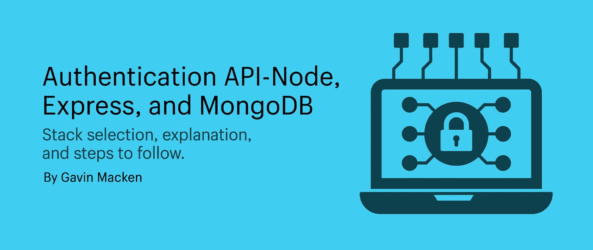

# 用 Node、Express 和 MongoDB 构建一个身份验证 API

> 原文：<https://betterprogramming.pub/build-an-authentication-api-with-node-express-and-mongodb-112b448c21f2>

## 堆栈选择、说明和后续步骤



构建一个可以管理用户注册和认证的应用程序 API 激发了人们的思考。在这次深入探讨中，我们将从预期行为、技术决策、支持包和安全要求等方面逐一介绍这些考虑事项。

在此之前，让我们先来看一看我们选择的堆栈以及它们所提供的功能。

# **Node.js**

节点。js 是 JavaScript 的运行环境。它主要用于非阻塞、事件驱动的服务器。

Node 将使我们能够在前端和后端使用 JS，允许全栈 JavaScript 开发，并且对现有 JS 开发人员来说有更容易的学习曲线。有一个很好的生态系统，其架构适合运行在分布式设备上的轻量级、高流量、数据密集型(但处理/计算能力较低)的应用程序。

Node.js 的理想应用程序可以包括聊天应用程序、股票经纪人仪表板、监控仪表板或在开发过程中代替 nGinx 使用的反向代理

## **缩放考虑**

JavaScript 的设计是一种单线程语言，这意味着它一次只能处理一个命令，因此它的方法被认为是阻塞方法，但它具有异步功能，这允许它的方法是非阻塞的。

为了更好地解释这一点，我把它比作一个有一个服务员和五张桌子的餐馆。

封锁系统——服务员记下一张桌子的订单，在食物准备好并从厨房送来之前，不能为任何其他桌子服务。

一个非阻塞系统——服务员接受一份订单，并把它带到厨房。然后，他们可以自由地接受另一份订单，并把它带到厨房。当食物准备好了，他们会再次被要求把食物从厨房送到各自的桌子上。

我们可以通过添加负载平衡器或集群来进一步扩展。集群允许我们利用多核系统。因此，我们可以启动 Node.js 进程集群来处理负载，而不是在单个线程上运行 Node.js 的单个实例。

这是有帮助的，但是通常不建议在节点上运行繁重的计算，它们会使 CPU 紧张并阻塞额外的请求。

另一个考虑是，对于关系数据库，ORM 工具不如其他语言如 Rubys 的“ActiveRecord”等先进。

## **思绪**

对于我们的登录应用程序，Node 和 JavaScript 与传统的服务器端语言相比没有真正的架构优势，除了它允许我们在应用程序的前端和后端都使用 JavaScript。

# **MongoDB**

说到数据库，我们有两个明显的选择:

1.  一个**关系**数据库，将数据存储在由强制模式创建的行和列中。
2.  一个**非关系型**数据库，在集合和文档中存储数据，可以是无模式的。

这两种方式各有优势，这取决于您存储的数据以及您可能需要如何访问和操作这些数据。对于这个应用程序，一个比另一个没有太大的优势，但是我决定使用非关系型 MongoDB，原因如下。

*   上手超级快。文档数据模型是一种存储和检索数据的强大方法，它允许开发人员快速移动。MongoDB 是一个无模式的 NoSQL 文档数据库。这意味着您可以在其中存储 JSON 文档，并且这些文档的结构可以变化，因为它不像 SQL 数据库那样强制执行。开发人员可以安装 MongoDB，并在基于云的 DB 上立即开始编写代码。
*   Json 存储:是的，在 SQL 数据库上存储 JSON 是可能的。但是 MongoDB 及其基于文档的存储非常适合它。JSON 是一种简单而强大的方式来描述和存储数据，以及在彼此内部嵌入文档。
*   它与 Node.js 配合得很好。因为 MongoDB 是一个分布式数据库，允许特别查询和实时更新，并且是 Node.js 的极好的兼容者，正如我们前面提到的，node . js 非常适合于跨分布式设备运行的高流量、数据密集型(但处理/计算能力较低)的应用程序

## **缩放解决方案**

MongoDB 的横向扩展架构可以支持海量数据和流量。

MongoDB 的横向扩展架构将工作分布在许多更小(更便宜)的计算机上，这意味着您可以创建一个应用程序，它可以自信地处理随着业务增长而出现的流量高峰。

相比之下，大多数 SQL 数据库使用纵向扩展的体系结构，这是有局限性的，因为它依赖于创建更快、更强大的计算机。

MongoDB 可以支持大量的读写。这些创新的核心是 MongoDB 的分片方法，当信息在计算机集群中传播时，它允许信息集群存储在一起。

MongoDB 还支持数据库事务，允许将对数据库的许多更改组合在一起，并且可以成批进行或拒绝。

# 表达

Express 是一个路由和中间件 web 框架，它本身的功能很少，本质上是一堆中间件函数调用。

这些中间件功能可以访问`req`和`res`对象以及`next`参数，后者调用堆栈中的下一个中间件模块。

Express 将是所有这些好东西的粘合剂:

*   **关于我们将创建的用户模型的路由端点。**`express.Router`是一个内置于 Express 中的路由系统，可以满足我们所有的路由需求
*   **解析 JSON**:**`express.json()`方法是 Express 中内置的中间件函数。它使用 JSON 有效负载解析传入的请求，并基于`body-parser`。**
*   ****JSON Web 令牌**:**jwt 将对应用程序的请求进行签名和认证。我们将创建一些定制的中间件来处理用户认证，监听请求和响应****
*   ******错误响应**:我们将创建定制的中间件来监听服务器端的错误响应，并允许我们以模块化的方式处理它们。****
*   ******express——除非** : 当一个条件满足时，有条件地跳过一个中间件，我们可以使用`express-unless`包。这在与定制认证中间件结合使用时尤其有用。****
*   ******bcryptjs** : 密码从不以纯文本形式存储。npm 包将加密我们的密码，并且是 JavaScript 中使用密码最多的包之一。****

## ******猫鼬******

****Mongoose 是一个对象文档建模(ODM)层，位于 Node 的 MongoDB 驱动程序之上。如果您来自 SQL，它类似于关系数据库的对象关系映射(ORM)。****

****虽然不要求在 Mongo 中使用 Mongoose，但它有许多简洁的特性可以在开发过程中提供帮助。我们将关注的问题包括:****

## ******1。模式******

****我们之前提到过 Mongo 是无模式的，这对于快速开发非常好，尽管对于验证对象和维护结构不是很好。****

****Mongoose 模式将定义文档的结构、默认值和验证器。它有助于维护结构，清楚地了解什么将进入数据库，减少可预防的错误，并允许更干净的代码。****

## ******2。型号******

****Mongoose 模型提供了一个数据库接口，用于创建、查询、更新、删除记录等。****

****它还创建了模型抽象，使其更容易使用，所以看起来你只是在使用对象而不是纯数据。****

****模式有几个可配置的选项，可以传递给构造函数或 set 方法。我们将使用它来创建 JSON 对象。****

# ****软件包安装****

*   ****[节点](https://nodejs.org/en/download/)****
*   ****[在你的机器上运行 node . js](https://nodejs.org/en/docs/guides/getting-started-guide/)****

****太棒了。现在来建立我们的蒙哥数据库。当然，有不同的方法可以做到这一点，但是我相信最快的方法是利用云上的免费共享数据库。****

******注意**:您应该能够[按照这些步骤](https://www.mongodb.com/try)创建 Mongo 数据库。****

****下载后，在您的终端中运行`npm init`。这将提示您输入一个入口点，我们将把它设置为`server.js`:****

```
**$ npm install express mongoose express-unless bcryptjs dotenv jsonwebtoken — save**
```

*   ****[快递](https://expressjs.com/)****
*   ****[明示——除非](https://www.npmjs.com/package/express-unless)****
*   ****[bcryptjs](https://www.npmjs.com/package/bcryptjs)****
*   ****[Dotenv](https://www.npmjs.com/package/dotenv)****
*   ****[Jsonwebtoken](https://www.npmjs.com/package/jsonwebtoken)****

# ****建筑****

****我们将构建一个安全的 REST API 来处理用户模型的常见需求:****

```
**// User DataUser {
  Id: (auto generated UUID)
  Username: String
  Email: String
  Password: String
  Date: Date
}**
```

****我将用于创建和安全获取该用户的端点是:****

*   ****`POST`在端点上`/users/register`(创建一个新用户)****
*   ****端点`/users/login`上的`POST`(检查用户并认证)****
*   ****`GET`在端点上`/users/:id`(获取特定用户)****

****我想做的下一件事是粗略地设计我的目录结构:****

```
**Controllers
 - Userscontroller.js
Modals
 - Usersmodal.js
Services
 - Userservice.js
Helpers
 - Errorhandler.js
 - jwt.js
server.js
.env**
```

## ****server.js****

****我们正在使用 Express 中间件功能创建一个模块化系统，我们将在该系统中完成以下工作:****

*   ****监听请求和响应，并将它们路由到适当的控制器，在本例中是我们的用户控制器****
*   ****验证请求，这将使用我们的 JWT 模块，除非它们来自不需要验证的特定路由。****
*   ****解析 JSON 数据****
*   ****倾听回答中的错误****

****当应用程序启动时，我们还将连接到 mongoose。****

****您将能够使用 Mongo URL，该 URL 可以通过遵循[文档](https://www.mongodb.com/try)来创建。****

****在这里，我们也将开始看到`mongoose`的一些优势。****

****它有两个非常有用的内置方法，在发生错误或成功连接到数据库时充当事件处理程序。****

****Express 将通过监听我们决定的本地主机来再次帮助我们。以下代码将帮助我们做到这一点:****

## ****jwt.js****

****为了处理 JSON Web 令牌(jwt)的创建和授权，我们将创建一些定制的中间件和助手方法。****

****我们可以使用这些来检查客户端在请求头中发送的授权令牌，并创建和签名令牌以发送到客户端。****

****我们已经使用了`dotenv`包将秘密密码安全地存储在一个`.env`文件中，该文件用于构建和验证令牌。确保不要将该文件提交到生产环境中。****

## ****错误处理程序. js****

****我见过的模块化错误的一个好方法是创建定制的中间件，它监听错误响应并管理返回给客户端的内容。****

****错误处理中间件模块在调用堆栈中的位置很重要，因为它需要在我们应用的路由中间件之后被调用。****

## ****UserController.js****

****我们的用户控制器在 Express Router 的帮助下监听请求，然后决定如何处理这些请求及其后续数据。****

****当用户注册时，我们做的第一件事就是利用`bcryptjs`来加密密码(尽快这样做是明智的)。它允许我们制造盐。Salts 创建唯一的密码，即使在两个用户选择相同密码的情况下，然后散列该密码。****

****完成后，我们准备将它发送到我们的服务模块，该模块包含用我们创建的散列密码更新我们的 MongoDB 数据库所需的方法。****

## ****UserModals.js****

****在我们查看服务模块之前，最好先深入查看一下`usermodal.js`文件。****

****在这里，我们利用 Mongoose 为我们的用户对象创建一个模式。我们将使用它进行类型检查和数据验证。****

****Mongoose 模式有几个可配置的选项，可以传递给构造函数或 set 方法，我们可以用它来创建一个`toJSON`,这个方法将我们的 MongoDB 文档转换成可以发送到我们客户端的 JSON。****

****在这里，我们创建并设置一个 id 属性，并删除`_id`、`__v`以及我们不需要发送回客户端的密码散列。****

****然后我们创建我们的 mongoose 模型并导出它。这个模型将可以访问 mongoose 的所有有用的查询方法，从 MongoDB 中检索我们的数据。****

## ****UserServices.js****

****在我们查看我们的服务模块之前，最好深入查看一下我们的 usermodal.js。****

****在这里，我们利用 Mongoose 为我们的`User`对象创建一个模式。我们将使用它进行类型检查和数据验证。****

****模式有一些可配置的选项，可以传递给构造函数或 set 方法，这将很有帮助，因为我们可以使用它来创建一个`toJSON`方法，通过创建和设置一个 id 属性并删除`_id`、 `__v`和我们不需要发送回客户端的密码散列，将我们的 MongoDB 文档抽象成 JSON，我们很乐意将它发送回客户端。****

****然后我们将创建我们的 Mongoose 模型并导出它。这个模型可以访问所有有用的查询方法，从 MongoDB 中检索我们的数据。****

****我希望你已经发现这是有用的，感谢您的阅读。****

****GitHub 回购:【https://github.com/gavmac/authentication-api ****

## ****想联系作者？****

****如果你喜欢这个，你可能也会喜欢我们在`[!!nerdy](https://www.notnotnerdy.com/)`创造的其他一些博客文章和创意。每个月都会推出新的设计。****