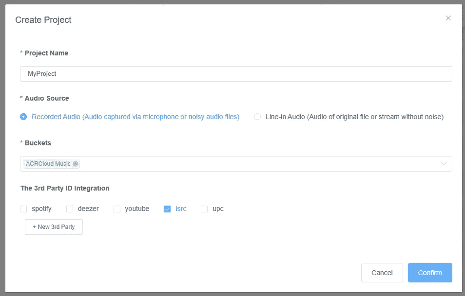

# 用 React 和 Vercel 构建自动卡拉 ok 系统

> 原文：<https://betterprogramming.pub/build-an-auto-karaoke-system-with-react-and-vercel-d66ac2ca3b50>

## 构建这个有趣系统的深入指南


照片由 [israel palacio](https://unsplash.com/fr/@othentikisra?utm_source=medium&utm_medium=referral) 在 [Unsplash](https://unsplash.com?utm_source=medium&utm_medium=referral) 上拍摄

你好，又见面了。今天，我们将使用 React 和 Vercel 创建一个自动卡拉 ok 系统。

我们的项目包括从音频样本中识别一首歌曲，然后显示它的歌词。我们可以使用 ACRCloud 进行音频识别，使用 Musixmatch 提供歌词。此外，我们将需要后端代码与这两个服务进行交互。这就是为什么我们将学习如何用 Vercel 设置无服务器功能，这样我们就不必创建服务器了。

# 项目设置

让我们从用 React 和 TypeScript 初始化 Vite 项目开始。

然后，我们将使用以下 NPM 软件包来启动和运行:

```
npm i acrcloud formidable formidable-serverless jotai react-feather react-input-slider react-media-recorder

npm i -D @vercel/node @types/formidable
```

# 歌曲识别

# 使用 ACRCloud API

在访问 ACRCloud API 之前，我们需要一些凭证。如果您还没有，请在[acrcloud.com](http://acrcloud.com/)创建一个帐户，然后导航到您的[音频和视频识别项目](https://console.acrcloud.com/avr#/projects/online)。在自由层帐户中，您只能参与一个项目。因此，如果您已经有一个项目，请使用那里的凭证。如果没有，用提供的配置创建一个新项目。



在 ACRCloud 建立一个音频和视频识别项目

选择所需铲斗后，确保检查`isrc`。这个以后会有帮助的。

复制主机、访问密钥和秘密密钥，然后将它们粘贴到项目根目录下的一个`.env`文件中。

```
...
ACR_HOST="identify-eu-west-1.acrcloud.com"
ACR_ACCESS_KEY="INSERT_ACCESS_KEY"
ACR_SECRET="INSERT_SECRET_KEY"
```

# 无服务器功能设置

使用`npm i -g vercel`安装 Vercel CLI。现在运行`npx vercel link`将文件夹与一个 Vercel 项目链接起来。您可以链接现有项目，也可以从命令行创建新项目。

一旦项目被链接，创建一个`api`文件夹，为我们的每个无服务器功能存储单独的文件。让我们创建第一个函数来识别一首歌曲并返回它的 ISRC。

在这个文件夹中创建一个名为`acr-identify.ts`的新文件，其中包含我们的代码，可以在`http://localhost:[PORT]/api/acr-identify`处访问前端。

# 获取歌词

# 设置 Musixmatch

像 ACRCloud 一样，如果你还没有的话，在 [Musixmatch Developers](https://developer.musixmatch.com/) 创建一个账户。一旦你创建了一个应用程序，进入[应用程序](https://developer.musixmatch.com/admin/applications)页面找到 API 密匙。现在，将 API 密钥添加到您的`.env`文件中。

# 创建函数

我们将使用`axios`请求 API，首先请求给定 ISRC 的 Musixmatch 曲目 ID，然后请求曲目的歌词。我们使用和以前一样的方法来创建一个函数，但是现在在`/api/find-lyrics`。将以下代码添加到新文件中:

未指定无服务器功能使用的 HTTP 方法。因此，我们假设客户端发出 GET 请求，因此我们读取 URL 参数来获取 ISRC。

# 原子

我们使用`jotai`来管理 React 应用程序的状态。创建一个`/src/store.ts`文件，并添加以下 atom 配置:

# 构建应用程序组件

如果没有歌词被返回，我们为用户显示一个麦克风按钮。如果没有，我们显示歌词和其他歌曲信息。在`/src/App.tsx`中使用以下代码:

注意我们代码中歌曲速率的使用。稍后，我们将看到如何突出显示歌词，以便用户可以跟随。

# 显示错误

我们的自动卡拉 ok 系统的错误通常涉及未找到的歌曲或歌词。因此，我们可以使用一个新组件`/src/ErrorMessage.tsx`向用户提供这个反馈。

# 录制音频

让我们在/ `src/MicrophoneInput.tsx`处创建一个新的`MicrophoneInput`组件。这里，我们将使用`react-media-recorder`录制一定长度的音频，并将样本发送到我们的无服务器函数。

# 文件结构

首先定义文件的结构。看起来是这样的:

# 挂钩用法

我们需要函数在与无服务器函数交互时更新状态。

`react-media-recorder`为我们提供了在 React 中简化媒体录制的钩子。这里我们添加了一个提交音频的停止事件处理程序。

# 开始录音

点击按钮时记录开始，经过`RECORD_DURATION`毫秒后记录停止。

# 动画录制进度

我们必须使用`requestAnimationFrame`来更新进度动画的状态。从上面的代码中，动画显示了一个在录制过程中降低高度的条。


麦克风录音动画(如演示中所示)

我们用这个函数更新动画的进度:

# 提交音频数据

现在，我们可以创建一个函数来提交音频文件，如前所述。

# 渲染动画

现在让我们来呈现一个包含了上面解释的所有代码的按钮。

# 显示歌曲标题

在`/src/SongTitle.tsx`中，创建一个组件来显示识别出的歌曲的标题。

# 改变歌唱速度

我们将使用`react-input-slider`创建一个滑块组件来控制歌曲速率。在现实中，歌词不会以相同的速度演唱，但用户仍然可以控制他们想唱卡拉 ok 的速度。

如果您对更精确的歌词跟踪感兴趣，请查看 Musixmatch 的 [Rich sync](https://developer.musixmatch.com/documentation/api-reference/track-richsync-get) 。

创建文件`/src/SongRateInput.tsx`，并为组件添加以下代码:

# 显示歌词

要跟着歌词走，每个单词都必须单独突出显示，如演示中所示。

# 更新当前单词

我们可以在`src`中创建一个名为`lyrics`的文件夹。这里三个的第一档会是`LyricsBody.tsx`。该组件负责显示歌词的所有单词，并更新当前突出显示的单词。

我们在这里再次使用`requestAnimationFrame`来使更新每个单词的高亮颜色变得更加平滑。

但是请注意我们是如何在呈现歌词之前将它们解析成片段的。这一步是至关重要的，这样每个单词都可以单独设计。

# 解析歌词

在`lyrics`文件夹中创建`parser.tsx`文件。记得保留`.tsx`扩展名，以便我们可以使用 JSX 组件。

这个文件将导出下面的函数，将歌词分成单个单词的组成部分。

# 显示歌词的每个单词

在`/src/lyrics/LyricWord.tsx`创建一个新组件。它需要单词的索引和单词本身的值。

然后，如果索引匹配当前单词的索引，类名被应用到呈现的`<span>`。

# 最终注释

总之，我们使用 Vercel 无服务器功能来识别音乐和查找歌词。然后，我们创建了一个前端界面来逐个突出显示单词，并将所有内容联系在一起。

运行项目时，使用`npx vercel dev`确保无服务器功能可用。

这里还有一些需要考虑的事情:

Musixmatch 返回的歌词不完整。他们的免费计划只包括每首歌 30%的歌词，只有通过企业计划才能获得全部访问权限。

Musixmatch 的替代产品可能是[genius.com](https://genius.com/)，因为他们有一个 API 可以返回歌曲歌词的 URL。我们所要做的就是访问他们的 API 并抓取歌词。我可能很快会发表一篇文章解释网络抓取和这个 API。

如果你喜欢这篇文章，并想进一步探索，你可以在这里得到完整的代码。

可以加个按钮重置歌词吗？阅读我的[文章](https://cs310.hashnode.dev/why-jotai-is-the-key-to-better-state-management-in-react)解释 Jotai 来找出如何解释。

# 参考

[入门| Vite(](https://vitejs.dev/guide/)[vitejs . dev](http://vitejs.dev/)[)](https://vitejs.dev/guide/)

[识别 API — ACRCloud](https://docs.acrcloud.com/reference/identification-api)

[文档(](https://developer.musixmatch.com/documentation)[)musixmatch.com](http://musixmatch.com/)[)](https://developer.musixmatch.com/documentation)

[反应-媒体-记录器-NPM(【npmjs.com】](https://www.npmjs.com/package/react-media-recorder)[)](https://www.npmjs.com/package/react-media-recorder)

[用 Vite 安装顺风 CSS—顺风 CSS](https://tailwindcss.com/docs/guides/vite)

[平均语速和每分钟字数(](https://virtualspeech.com/blog/average-speaking-rate-words-per-minute)[virtualspeech.com](http://virtualspeech.com/)[)](https://virtualspeech.com/blog/average-speaking-rate-words-per-minute)

[构成原子——约泰](https://jotai.org/docs/guides/composing-atoms)

[使用带有 React 挂钩的 request animation frame | CSS-Tricks—CSS-Tricks](https://css-tricks.com/using-requestanimationframe-with-react-hooks/)

*原发布于*[*https://cs 310 . hash node . dev*](https://cs310.hashnode.dev/build-an-auto-karaoke-system-with-react-and-vercel)*。*