# 用 Python 构建自动化的 Twitter Feed

> 原文：<https://betterprogramming.pub/build-an-automated-twitter-feed-with-python-792f6e865147>

## 制作你自己的自动化的小众 Twitter feed


[莫兰](https://unsplash.com/@ymoran?utm_source=unsplash&utm_medium=referral&utm_content=creditCopyText)在 [Unsplash](https://unsplash.com/s/photos/twitter?utm_source=unsplash&utm_medium=referral&utm_content=creditCopyText) 上的照片

Twitter-feed 机器人通常是垃圾邮件，对平台没有特别的贡献。总的来说，他们只是个讨厌鬼。即便如此，如果你做得好，它们可以成为根据你的定位吸引特定受众的宝贵资源(后面会有更多)。

那么，如何制作一个有用的、不笨拙的 Twitter 机器人呢？

你来对地方了。继续阅读，学习如何创建你自己的个性化 Twitter 新闻源。

在我们开始之前，我想解释一下*为什么*这是个好主意。

Beevolve 的一项研究[显示，事实上，更多的推文=更多的关注者。](http://www.beevolve.com/twitter-statistics)

但是不断地发帖并不那么容易——而且必须是人们想看的内容。

解决办法？自动化。

在 Twitter 上拥有大量粉丝对于推广产品或内容非常有用——无论你是博客写手还是软件开发人员，你都可以向特定的目标受众推销你的东西

你将在本文中学习如何制作的机器人将从[黑客新闻](https://news.ycombinator.com/)和 [Reddit](https://www.reddit.com/) 中抓取包含特定关键词的科技新闻链接，并从你的账户上发布。虽然这个例子涉及到查找与技术相关的内容，但是为不同的网站和类型修改这些代码是非常容易的。

# 制作机器人

首先，我们需要考虑如何获得新闻链接。最普遍的方式是通过网络搜集——我们从想要获取新闻的页面中获取来源，并通过搜索来提取我们想要的任何内容。

Python 中有一个非常好的库，叫做 [Beautiful Soup](https://pypi.org/project/beautifulsoup4/) 。使用以下命令获取它:

```
pip install beautifulsoup4
```

这就是我们如何从黑客新闻中抓取帖子的方法。网页抓取可能会很慢，尤其是当你必须加载多个页面时，所以应该尽可能避免。

对于 Reddit，有一个更简单的选择。对于每一个 subreddit(例如， [r/Python](https://www.reddit.com/r/Python/) )，都有一个 JSON 文件包含所有热门文章的数据，还有一个文件包含新文章的数据。在本例中，它位于[这里](https://www.reddit.com/r/Python/new.json)。

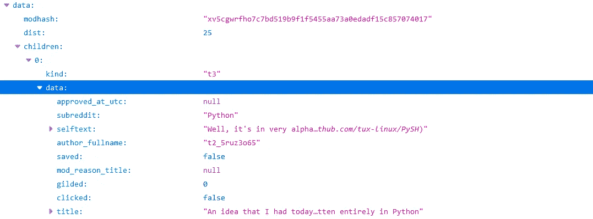

Reddit JSON 数据

先来做一个黑客新闻的刮刀。

首先，我们需要研究黑客新闻网站的行为。

该网站的起始页只是当天的热门帖子——到目前为止还不是特别有用。但是如果你滚动到底部，你会看到一个链接，上面写着“更多”

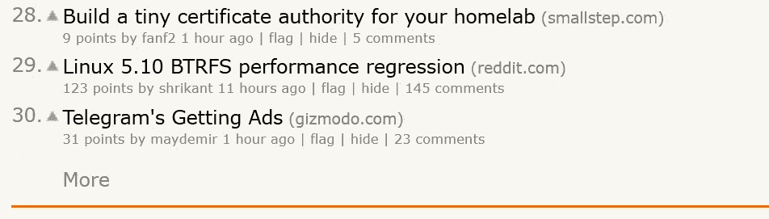

该链接将您带到下一页，在这里 URL 变为`[https://news.ycombinator.com/news?p=2](https://news.ycombinator.com/news?p=2)`。

您可以看到页面根据`p`变化，其中`p=1`包含前 29 篇文章，`p=2`包含后 29 篇文章，依此类推。需要注意的是，`p`不会超过 20，之后它只会返回空白页面。

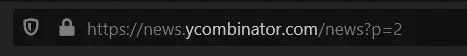

如果你右击并按下其中一个文章标题上的 Inspect 元素，你就能看到这个页面的源代码。

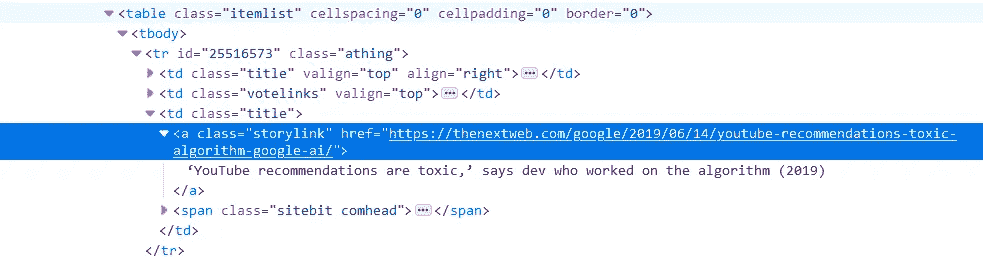

注意出处。你可以看到文章在一个 [HTML 表格结构](https://www.w3schools.com/html/html_tables.asp)中。

每个标题都是一个带有`class="title"`的`td`(表格数据单元格)，包含故事的 URL，其中也有文本标题。

你也可以看到另一个元素:`<td class="title valign="top" align="right">`。这不是我们想要的元素，但它属于类`title`，所以当我们试图获取`title`类表数据单元格时，它会出现。为了排除这个元素，我们可以利用`align="right"`属性，如果该属性存在，就从我们的结果中取消它的资格。

还有一个“新”页面，显示最近提交的帖子。

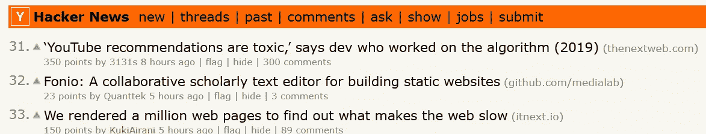

新页面遵循非常相似的系统；但是，您必须用`n=(number)`指定页面上的第一个文章编号，而不是`p=1`。例如，`[https://news.ycombinator.com/newest?n=24](https://news.ycombinator.com/newest?n=24)`显示 24 到 53。

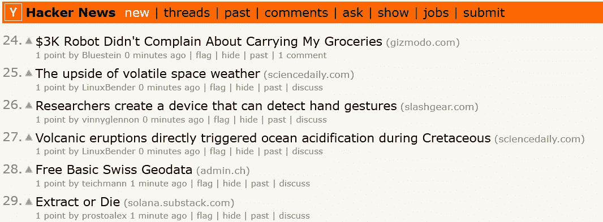

这是我们从黑客新闻网站抓取帖子所需的所有信息，它将允许我们获得所有页面的来源，从每个页面抓取所有 29 个帖子。你可以将这个过程应用到大多数网站，尽管它们的布局会有所不同。

现在，我们需要将这些信息放入 Python。

# 抓取黑客新闻

首先，我们想定义一个子程序，使用我们刚刚讨论过的信息从`new`或`top`中抓取页码。

这段代码首先确定它是在抓取新帖还是置顶帖，使用 requests 模块获取页面源，并使用 Beautiful Soup 解析表以提取相关信息。然后它输出每篇文章的标题和网址。

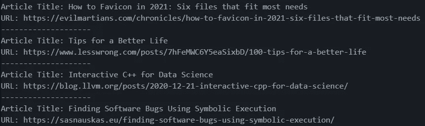

`Snapshot of output from scrapePageHN(1,True)`

为了获得每篇热门文章，我们可以重复 20 次(20 页):

# Reddit 订阅源

这段代码下载参数`url`中指定的 JSON 文件，将其解析为一个字符串，并遍历 post 对象，如果帖子是一篇文章的链接，则打印标题和 URL。

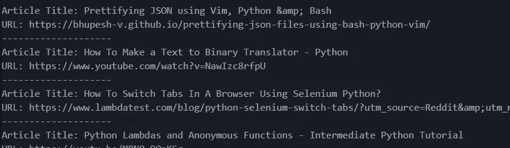

【https://www.reddit.com/r/Python/new.json[T4](https://www.reddit.com/r/Python/new.json)

# 过滤相关内容

还记得我们说过的垃圾邮件吗？

让我们修改上面的代码，只选择包含某些关键字的文章。

为了实现这一点，我们可以利用内置的`any()`函数。

如果 iterable 中至少有一个值是`True`，则`any()`返回`True`。

```
keywords=["python","fun","coding"]
string="i like python"
any(kw in s.lower() for kw in keywords)
```

这个例子将返回`True`，因为`python`在关键字列表中。

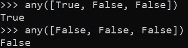

any 函数的另一个例子

如果字符串参数`s`中有任何关键字，该代码将返回`True`。

要在我们的代码中实现这一点，我们可以写:

并在我们的代码中实现:

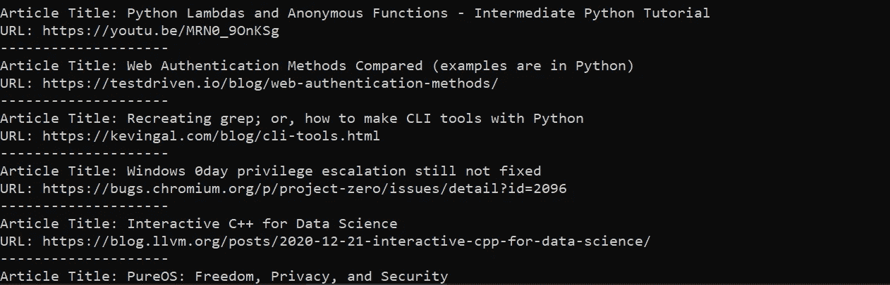

请注意，我们现在得到了更有针对性和更具体的内容。

## 在 Twitter 上发帖

为了在 Twitter 上发帖，你需要有 Tweepy

```
pip install tweepy
```

你需要创建一个 [Twitter 开发者应用](https://botwiki.org/resource/tutorial/how-to-create-a-twitter-app/)，获得一个认证密钥，并获得一个访问令牌。

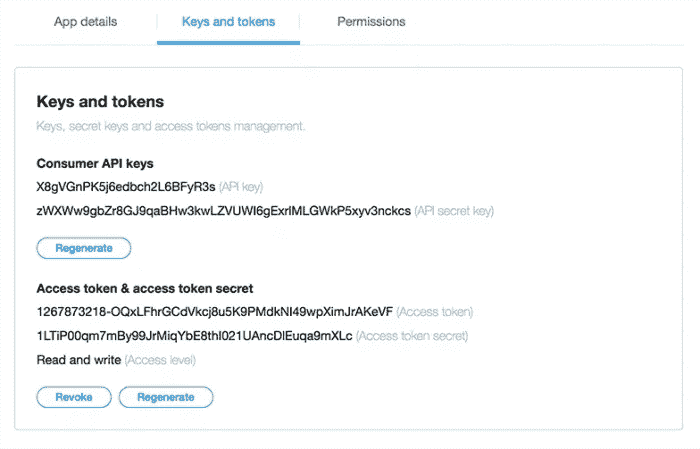

重要的是，访问令牌具有写权限。默认情况下不会，所以您需要更改权限并重新生成访问令牌。

前往“设置”>“应用程序权限”,并进行相应的编辑。

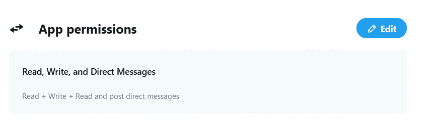

导航到“密钥和令牌”，并使用新的权限重新生成您的访问令牌和密码。

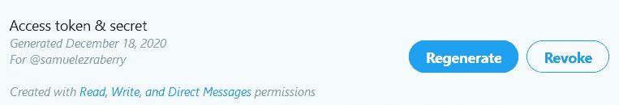

使用 Tweepy 测试您的密钥，如下所示:

tweet 可以用`api.update_status(string)`来完成，所以让我们创建一个子例程，它接受标题、URL、描述(因为没有机智的评论，tweet 就不完整)和一些标签，并将它们作为字符串发布。

在我们的后期抓取代码中，我们可以添加一个使用`webbrowser`模块在 web 浏览器中查看文章的选项，以及一个跳过或发布带有您选择的评论的文章的选项。让我们现在就实施它。

下面是该代码运行的示例:

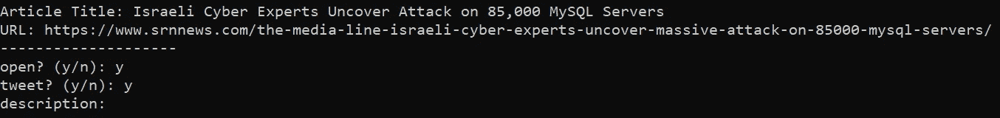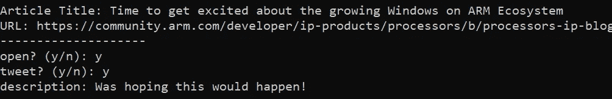

现在你知道了。一个自动化的利基特定新闻饲料，以帮助您获得追随者。你甚至可以更进一步，完全自动化它——我决定反对它，因为它可能有点垃圾，但谁知道呢。