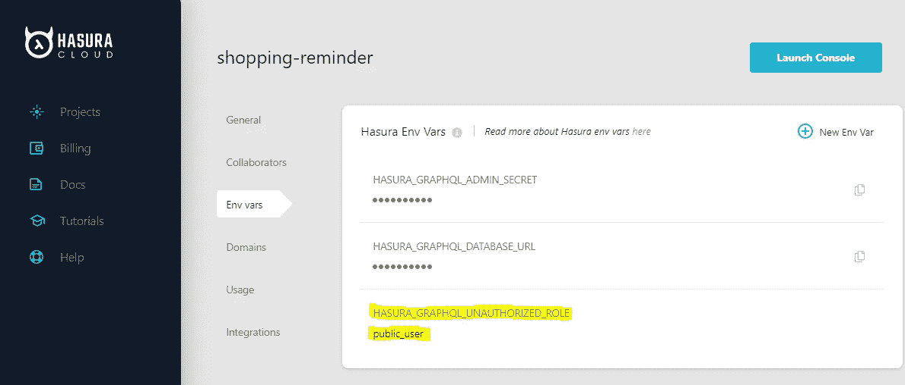
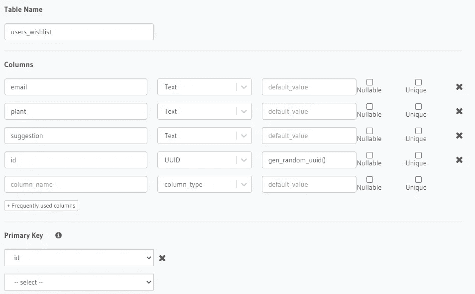
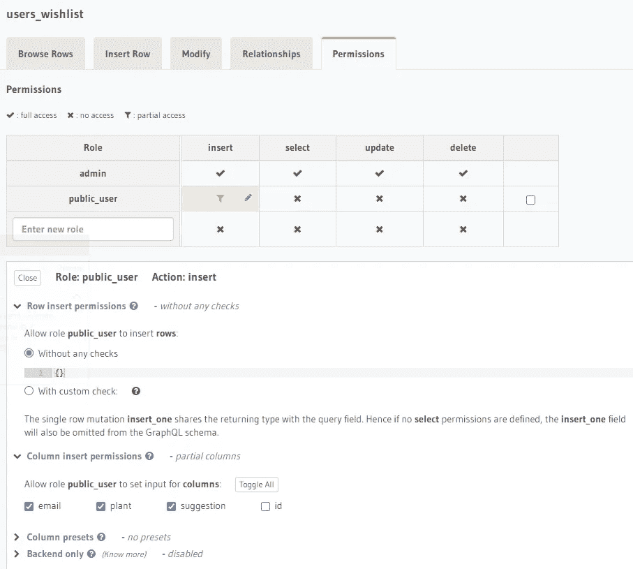
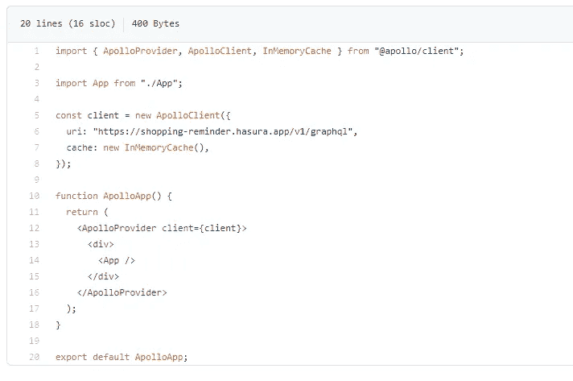
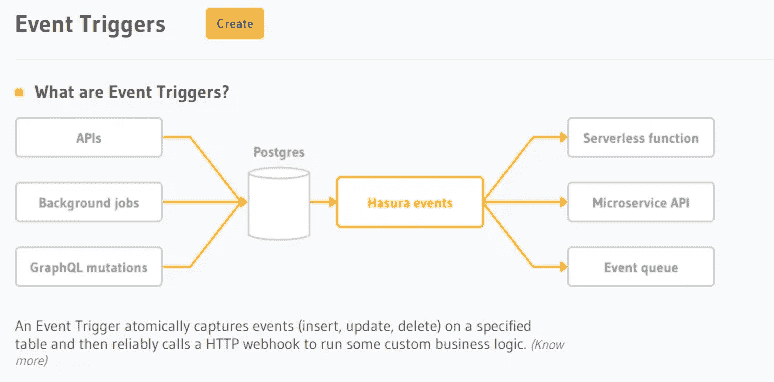
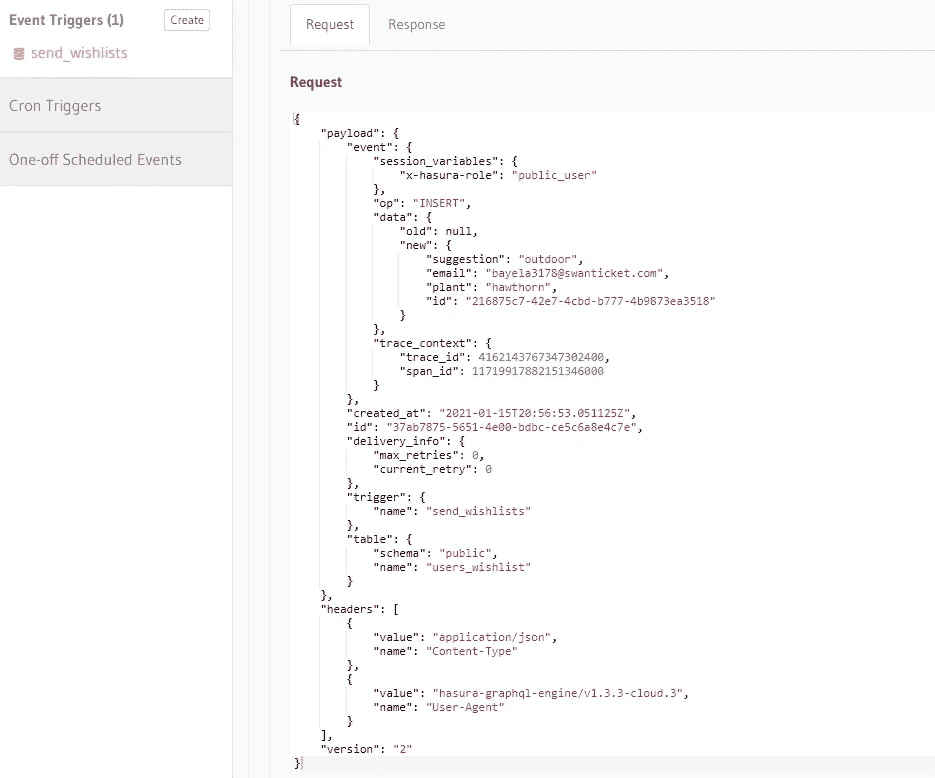
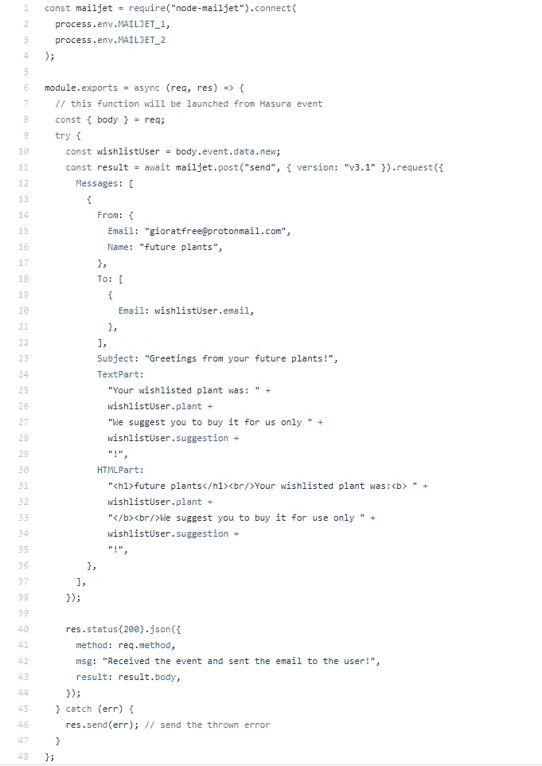
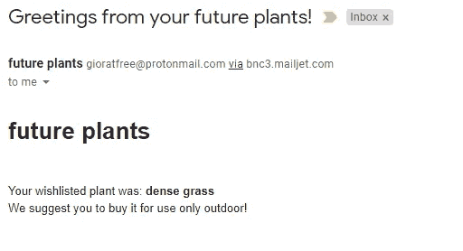

# 用 Hasura 事件构建电子商务购物车提醒

> 原文：<https://betterprogramming.pub/build-an-e-commerce-shopping-cart-reminder-with-hasura-events-e02e240df367>

## 设置事件触发器，为数据库中几分钟内发生的特定事件调用 webhooks


[亚采克·迪拉格](https://unsplash.com/@dylu?utm_source=medium&utm_medium=referral)在 [Unsplash](https://unsplash.com?utm_source=medium&utm_medium=referral) 上的照片。

*TL；DR:花更少的时间构建自定义触发器或观察器！感谢* [*Hasura 事件*](https://hasura.io/learn/graphql/hasura/custom-business-logic/5-create-event-trigger/) *和简单的 GraphQL 突变，将更多的时间花在你的应用或想法的核心上！*

在本教程中，我们将发现如何使用 Hasura 事件来存储用户的偏好/愿望列表，并从该事件发送触发的电子邮件。我们还将介绍 React 应用程序的创建，该应用程序连接到一个 Hasura 云实例，以使它完全工作。

你可以自己尝试[应用](https://hasura-shopping-reminder.vercel.app/)。GitHub 上有完整的应用程序[。](https://github.com/riccardogiorato/hasura-shopping-reminder)

# 1.使用 Hasura Cloud 设置您的 Hasura 帐户

第一步是配置您的 Hasura 服务器。我的首选是使用 [hasura.io](https://hasura.io/) 或任何其他云托管提供商，如 Heroku 或 AWS。我通常更喜欢使用 hasura.io，因为:

1.  它有一个简单和最小的仪表板来管理您的实例，与 AWS 或其他主机提供商的 UI 的复杂性相当。
2.  你可以免费获得每月 1 GB 的数据流量。
3.  每分钟高达 60 个请求，为您的项目提供动力。

# 2.使 Hasura 端点对 public_user 角色可用

我们希望我们的愿望列表功能能够轻松地工作，而不需要从用户那里询问除了他们的电子邮件以外的任何信息。为此，我们只需要向我们的 Hasura 服务器添加一个环境变量:

```
HASURA_GRAPHQL_UNAUTHORIZED_ROLE key value public_user
```



# 3.创建用户愿望列表表

现在我们只需要转到“数据”部分，直接从 Hasura 创建包含这些字段的`users_wishlist`表:

1.  电子邮件，文本
2.  文本形式的工厂和建议字段
3.  id 为 UUID，`gen_random_uuid()`为默认值

主键将是“id”字段！



# 4.设置 public_user 角色的权限

切换到“权限”选项卡并添加一个新的角色行:

*   不做任何检查，插入“电子邮件”、“工厂”和“建议”的权限，但不插入“id”字段，该字段将自动生成。



# 5.配置 React App 连接 Hasura！

如果你愿意，可以直接下载或者克隆[样例 React 项目](https://github.com/riccardogiorato/hasura-shopping-reminder)。

主要要求是在客户端添加 Apollo 客户端或任何其他 GraphQL 客户端。

要安装 Apollo 客户端并使用 Hasura 对其进行配置，您可以遵循本教程。

我们对其进行了如下配置:



# 6.启动变异并保存用户首选项

在我们的主应用程序代码中，我们添加了变异查询并配置了 Apollo 变异挂钩:

# 7.哈苏拉事件来了！

现在我们可以跳回到 Hasura 实例的“EVENTS”选项卡。



我们想要添加一个名为`send_wishlists`的新触发器，它链接到`public`模式和`Insert`触发器上的`users_wishlist`表。

我们需要传递一个 webhook URL，当这个事件发生时，将从我们的 Hasura 服务器调用这个 URL。


这里，我们传递了在 [Vercel](https://vercel.com/) 云托管提供商上运行的无服务器函数的自定义 webhook，但是您可以选择您喜欢的任何服务器环境。如果您愿意，您可以从这里的“无服务器功能示例”中挑选一些由 Hasura 团队支持的其他提供者的示例:

[](https://github.com/hasura/graphql-engine/tree/master/community/boilerplates/event-triggers) [## hasura/graph QL-引擎

### 该存储库包含各种用例的样板函数，适用于不同的无服务器或云功能…

github.com](https://github.com/hasura/graphql-engine/tree/master/community/boilerplates/event-triggers) 

# 8.通过 Hasura 事件触发无服务器功能

我们教程的最后一步是创建这个无服务器的函数来发送电子邮件提醒给用户。

但是首先，我们需要理解来自 Hasura 的请求是什么样的:



正如我们在请求体中看到的，Hasura 将传递各种字段，如事件、用户角色、操作类型和数据，所有这些都包含在`“payload”`中。

从有效负载中，我们将只使用包含来自修改行的先前和当前值的`“event”`对象。考虑到操作的类型，`“old/previous”`和`“new/current”`不会总是出现。在这种情况下，我们将获得一个新创建的行，因此我们不会有空的`“old”`值—只有`“new”`值。

要发送电子邮件，我们选择外部提供商。在这种情况下，它是 Emailjet，但是您可以选择任何其他提供商。

整个功能可以在 GitHub 上找到[。](https://github.com/riccardogiorato/hasura-shopping-reminder/blob/main/api/sendemail.js)

我们感兴趣的主线是[10 号线](https://github.com/riccardogiorato/hasura-shopping-reminder/blob/main/api/sendemail.js#L10)。我们从请求体中打开数据，并从 Hasura 表行中选择所有带有所有字段的对象。这个新插入的记录上的任何其他字段都可以在这里找到。



瞧，我们的应用程序完成了！如果我们返回 React 应用并完成插入过程，我们将会收到一封类似如下的电子邮件:



你会收到一封电子邮件，里面有你想要的植物

*注意:如果您在完成该过程后没有看到任何电子邮件，您可能会在垃圾邮件文件夹中找到它，因为我们正在使用免费的 Emailjet。*

# 摘要

通过使用 Hasura events，我们不需要开发任何定制的事件监听器，也不需要构建自己的连接到 PostgreSQL 数据库的触发检测器。

Hasura 可以简单地为我们隐藏所有这些复杂性，让我们创建自己的功能和逻辑特性，而不用担心让我们的基础设施工作的基本事情。

# 如果你想了解更多关于钩子的知识

我在开始使用自定义钩子的时候，亲自看过**[**学习 React 钩子**](https://amzn.to/2UFiZ5F)**【Apollo Client】和 GraphQL with React。这有助于我理解反应变得更快:[https://amzn.to/2UFiZ5F](https://amzn.to/2UFiZ5F)****