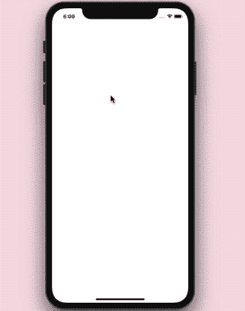
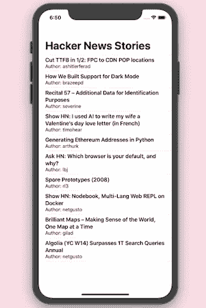
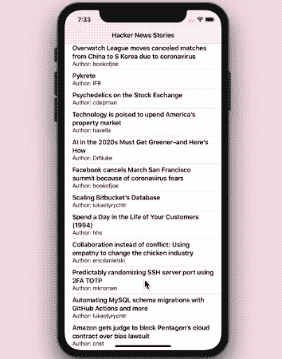

# 用 SwiftUI List 和 Combine 构建一个无止境的滚动列表

> 原文：<https://betterprogramming.pub/build-an-endless-scrolling-list-with-swiftui-combine-and-urlsession-8a697a8318cb>

## 让我们制作一个无限滚动的黑客新闻 API 提要

[冰茶](https://unsplash.com/@magicetea?utm_source=unsplash&utm_medium=referral&utm_content=creditCopyText)在 [Unsplash](https://unsplash.com/s/photos/list?utm_source=unsplash&utm_medium=referral&utm_content=creditCopyText) 上拍摄的照片

苹果的反应式编程框架[结合](https://developer.apple.com/documentation/combine)的引入使得`URLSession`和其他一些基础类型更加强大。

`URLSession`和它的出版商(`dataTaskPublisher`)真的是打了兴奋剂，允许我们做很多事情。具体来说，Combine 操作符让我们可以轻松地解码、重试、处理错误和链接多个请求，等等。

# 我们的目标

这段代码的目标是构建一个 SwiftUI 无限滚动列表。为此，我们将在 iOS 应用程序中的黑客新闻 API 上使用 Combine 和`**URLSession**`。

如果您对 Combine 框架不熟悉，我建议您在继续之前浏览一下“[Swift](https://medium.com/better-programming/a-deep-dive-into-the-combine-framework-in-swift-cffdfcc6f32c)中的 Combine 框架深度剖析”。

在这一部分结束时，你将能够实现以下结果:

# 入门指南

要设置一个 SwiftUI 列表来显示来自 web API 的数据，我们需要设置一个`ObservableObject`类，如下所示:

map 操作符将 API 结果转换成一个新的 publisher，它从 API 响应中返回`data`。

重要的是将`receive(on:)`设置到主线程以更新列表，并将`store`设置到可取消实例中的订阅，以保持其活动。

我们将在下一步使用这些数据，通过使用如下所示的`Codable`协议来解码 JSON:

`HNItem`结构需要符合 SwiftUI 列表的`Identifiable`协议，以区分每一行。

API 的结果设置在`HackerNewsFeed`类的`hnItems`属性上。由于它有一个已发布的属性包装器，这些更改反映在 SwiftUI 列表中，如下所示:

随后，我们在模拟器中得到以下结果:

没有无限滚动的 SwiftUI 列表

至此，我们已经在 SwiftUI 列表中设置了`URLSession`结果。但是这个列表还不能无限滚动。我们来配置一下。

# SwiftUI 列表无限滚动

目前，SwiftUI 不提供对滚动监听器的内置支持。幸运的是，有一个解决办法。

要在 SwiftUI 列表上设置无限滚动，我们需要在代码中处理以下场景:

*   通过对列表的行使用`onAppear`方法，我们可以确定用户何时到达最后一项，并相应地调用下一页的 API 请求。
*   为了防止重复 API 请求并确保网络请求同步，我们将使用 enum 来跟踪状态。

此外，我们可以为错误处理设置另一个枚举。

扩展了`ObservableObject`的`HackerNewsFeed`类的更新代码如下所示:

我们对上面代码中的`fetchStories`函数做了一些改动:

*   在请求没有返回结果之前，`pageStatus`枚举被设置为 loading。
*   `tryMap`用于代替`map`操作符处理网络错误。
*   `tryFilter`用于处理用户特定的错误。在我们的例子中，当达到 API 请求限制时，`exhaustiveNbHits`属性作为`false`返回。所以我们抛出适当的错误，这触发了`sink`中的失败。
*   `endOfList`是一个新发布的属性，用于在某些错误时触发警告对话框。

`shouldLoadMore`函数决定在用户滚动期间何时触发下一个 API 请求。在列表行的`onAppear`期间调用，如下所示:

这样做，我们将得到如前所示的输出。

我们在应用程序中使用的 Hacker News API 有 1000 个结果的限制。到达滚动的末尾时，我们将看到如下所示的警告对话框:

# 结论

我们能够使用 SwiftUI 和 Combine 构建一个黑客新闻故事无止境滚动新闻订阅应用程序。

接下来，您可以使用`replaceError`或`catch`操作符来处理 JSON 中的解析问题，并设置一个恢复发布器。

此外，您可以微调`shouldLoadMore`函数，在用户到达最后一个项目之前加载下一批结果(可能在用户到达倒数第三个项目时触发请求？).

上述 SwiftUI iOS 应用程序的代码可以在 [GitHub 存储库](https://github.com/anupamchugh/iowncode/tree/master/SwiftUICombineURLSession)中找到。

这一篇就到此为止——感谢阅读。