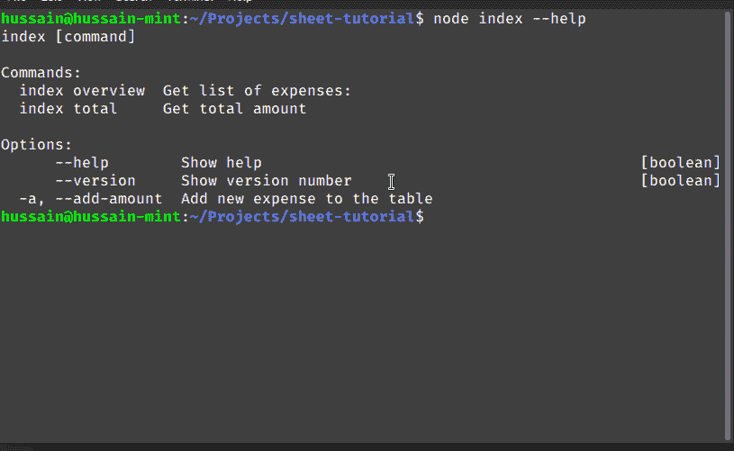
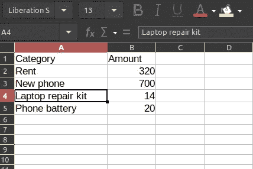
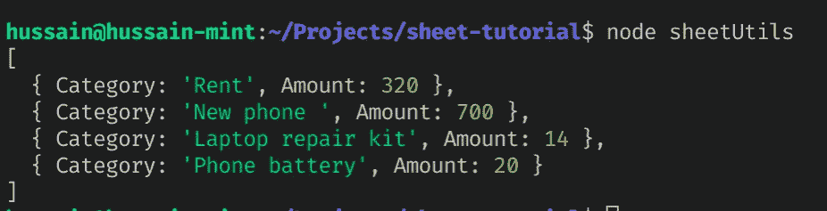
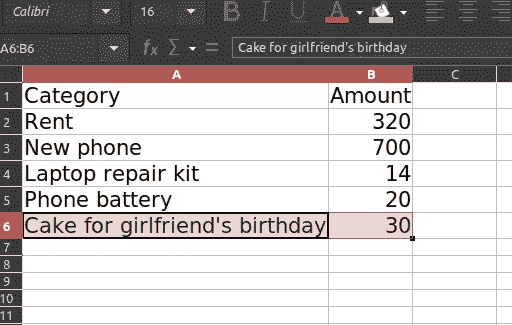
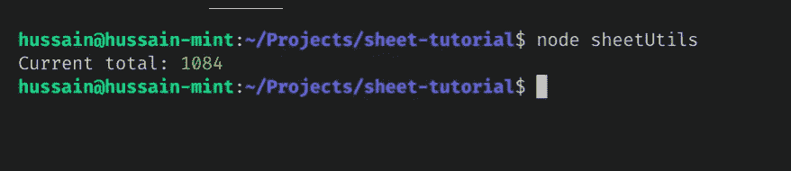
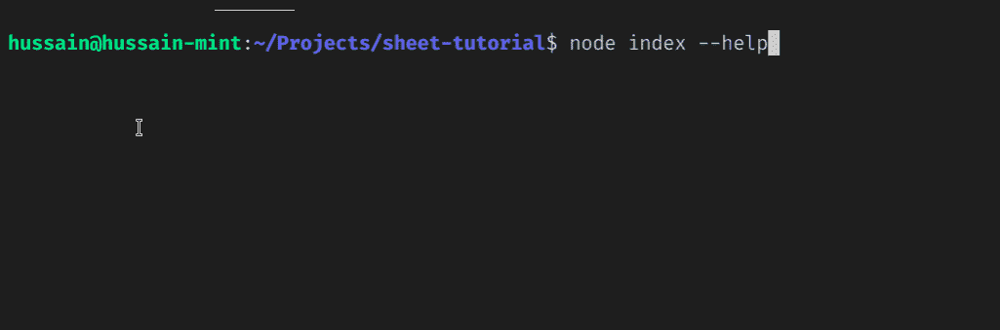
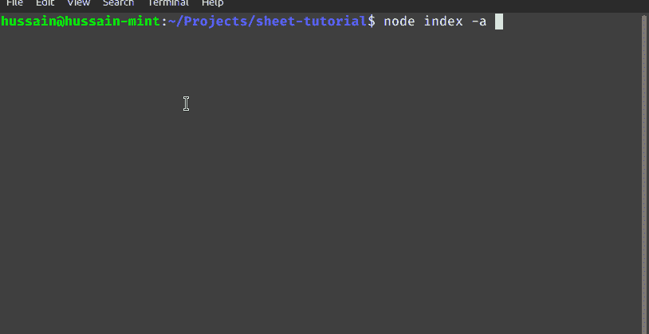
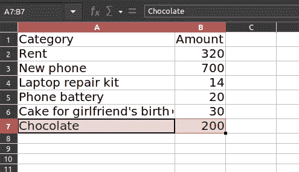

# 用 SheetJS 构建一个费用跟踪器

> 原文：<https://betterprogramming.pub/build-an-expense-tracker-with-sheetjs-8f38a045294a>

## 如何用 JavaScript 操作和创建电子表格


来源:[卢克·切瑟](https://unsplash.com/@lukechesser)在 [Unsplash](http://unsplash.com)

# 介绍

## 什么是 SheetJS，为什么要用它？

假设你是一家大型超市的会计。在这样的企业中，您需要创建电子表格来跟踪商店的财务状况，并执行其他数字运算操作。在这里，您必须执行以下操作:

*   打开电子表格编辑器，输入每天的销售清单
*   生成图表并计算总利润和收入
*   此外，将公式应用于数据以进行分析
*   最后，将这份文件发送给你的部门主管或其他权威人士

当然，那可能有用。但是考虑一下这个:如果你在一天之内获得了几百笔销售，那会怎么样呢？结果，这会浪费大量的时间和精力，因为你在一遍又一遍地做同样的事情。那么，我们如何解决这个问题呢？

减轻这种情况的一种方法是通过使用 API 来自动化这个操作。这就是 [SheetJS](https://github.com/SheetJS/sheetjs) 的用武之地。这是一个允许开发者使用 JavaScript 操作 Excel 文档的库。

在本文中，我们将构建一个基于终端的费用跟踪器。它会将费用添加到一个 Excel 文件中，并计算出总额。在本文结束时，结果将是这样的:



既然我们已经讨论了它的功能，那就让我们开始吧！

# 入门指南

首先，使用以下终端命令初始化项目存储库:

```
mkdir sheet-tutorial #create project directory
cd sheet-tutorial
npm init -y #initialize project
```

## 模块安装

在这个项目中，我们需要以下模块:

*   帮助我们设计终端界面
*   这个包将让我们通过代码与我们的电子表格进行交互

要安装这些依赖项，请执行以下 bash 指令:

```
npm i yargs xlsx
```

# 构建我们的项目

## 写入占位符数据

在本节中，我们将创建一个 Excel 文件，作为我们应用程序的数据库。

为此，请导航到项目目录的根目录。在那里，创建一个名为`Expenses.xlsx`的文件。顾名思义，这个 Excel 文件将存储客户的支出。

接下来，在`Expenses.xlsx`中，输入以下数据:



确保你的标题是类别和金额！

正如你在上面看到的，我们创建了两个标题:`Category`和`Amount`。在这些标题下，我们输入了各种费用及其相应的金额。

## 编码辅助函数

在您的项目中，创建一个名为`sheetUtils.js`的文件。这个模块将包含操作我们的数据库所需的实用方法。

在`sheetUtils.js`中，开始编写以下代码:

*   第 4 行:使用`path`模块为我们的`Expenses.xlsx`文档生成一个文件路径
*   第 6–8 行:读取我们文档的内容，并将其值存储在`sheetValues`变量中
*   第 9 行:将存储在`sheetValues`中的数据转换成 JSON 格式。这将使我们能够轻松地进行算术运算
*   第 15 行:出于调试目的，记录下`getParsedJSON`方法的值

让我们来测试一下！通过执行以下命令运行您的程序:

```
node sheetUtils
```

这将是输出:



代码的输出

如您所见，SheetJS 返回了我们之前输入的条目数组。此外，请注意，`Category`和`Amount`头现在被用作我们的 JSON 对象中的键。

我们的第二步是现在写一些代码，让用户添加费用到电子表格。

为此，将以下代码追加到`sheetUtils.js`文件中:

*   第 2 行:`[sheet_add_aoa](https://github.com/SheetJS/sheetjs#array-of-arrays-input)`实用程序方法将把`text`的值作为新条目插入到我们的工作表中。
*   第 3 行:稍后，保存修改后的`Expenses.xlsx`文档。
*   第 5 行:最后，执行`addEntry`方法将一个新的费用插入到文件中。

这将是电子表格中的结果:



Excel 中的输出

如您所见，SheetJS 现在已经将我们选择的数据添加到电子表格中。这意味着我们的计划成功了！

完成后，剩下的工作就是创建一个显示总支出的函数。为此，在`sheetUtils.js`中添加以下代码片段:

*   第 2 行:获取 JSON 格式的电子表格内容
*   第 3–5 行:使用`[map](https://developer.mozilla.org/en-US/docs/Web/JavaScript/Reference/Global_Objects/Array/map)`和`[reduce](https://developer.mozilla.org/en-US/docs/Web/JavaScript/Reference/Global_Objects/Array/Reduce)`函数从 JSON 数组中提取`Amount`值，并将它们相加。最后，将计算结果存储在`totalResult`变量中
*   第 8 行:最后，将总数输出到控制台
*   第 9 行:导出我们的自定义函数，以便在我们的项目中使用它们

这将是代码的结果:



代码的输出

瞧啊。我们的计划成功了。

最后，您的`sheetUtils.js`文件应该是这样的:

## 创建我们的 CLI

既然我们已经编写了助手方法，现在是时候设计我们的命令行界面了。这将让用户与程序进行交互。

作为第一步，首先创建一个名为`index.js`的文件。这里，从编写以下代码开始:

*   第 4–8 行:使用`yargs`模块定义我们的`add-amount`和`category`选项。这些选择将使用户能够向数据库添加新条目
*   第 9 行和第 10 行:描述`overview`命令。如果用户运行这条指令，程序将执行`getParsedJSON`方法
*   第 12 行和第 13 行:最后，定义`total`命令。如果用户运行这个命令，应用程序将显示用户的总支出

让我们来测试一下！像这样运行程序:

```
node index --help
```

这将是输出:



代码的输出

作为最后一步，我们现在需要编写额外的代码来支持`category`和`add-amount`选项。为此，在`index.js`中添加以下几行:

*   第 3 行:执行`addEntry`方法，并将用户输入作为函数的参数传递
*   第 4 行:最后，通知用户他们的条目已经被添加到文件中

这将是结果:



代码的输出

此外，这将是`Expenses.xlsx`文件中的输出:



请注意，我们的最新条目已成功添加到文件中。这意味着我们的程序没有任何问题。

我们完事了。

# 更多资源

[GitHub 上该项目的源代码](https://github.com/HussainArif12/sheet-tutorial)

*   [由 RedStapler 用 JavaScript 创建 XLSX](https://redstapler.co/sheetjs-tutorial-create-xlsx/)
*   [使用 Erich Buelow 的 JS 创建 Excel 文件](https://tealfeed.com/create-excel-files-using-javascript-wgt8u)
*   [Vincent Lab 使用 JS 中的 XLSX 文件](https://www.youtube.com/watch?v=TDGsVqVzW4A)
*   [通过学习谷歌电子表格用 NodeJS 做 Excel 宏](https://www.youtube.com/watch?v=tKz_ryychBY)

# 结论

在本文中，我们学习了如何使用 SheetJS 构建一个基本的费用跟踪器。使用这个图书馆绝对轻而易举。因此，这使您可以不费吹灰之力就开始使用电子表格。

非常感谢您的阅读！编码快乐！