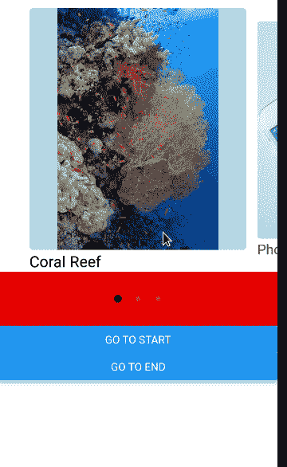
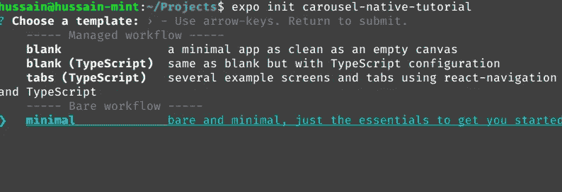
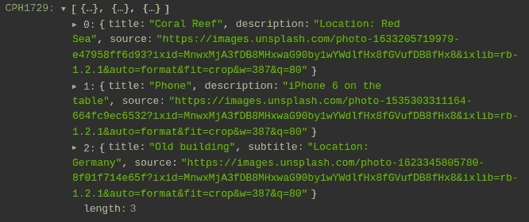
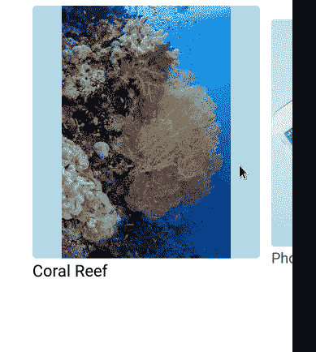
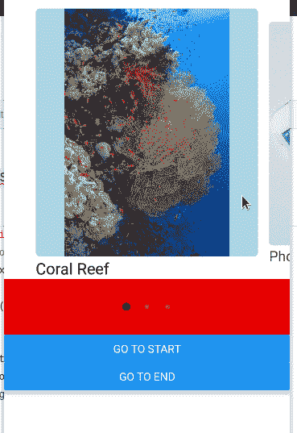

# 在 React Native 中构建一个图像转盘

> 原文：<https://betterprogramming.pub/build-an-image-carousel-in-react-native-5ce5d6b58e24>

## 将 React 原生快照旋转库集成到您的移动应用程序中


来源:[西格蒙德](https://unsplash.com/@sigmund)对 [Unsplash](http://unsplash.com)

当涉及到在同一个空间中显示内容的许多部分时，旋转木马是至关重要的。例如，假设你有一个成功的网上商店。如果你想显示一个报价和折扣的目录，在一个旋转木马中呈现它们是明智的。这样，列表不会占用太多空间，从而改进 UX 设计。

转盘使用的一个显著例子是 Instagram 应用程序:


Instagram 演示

要使用 React Native 创建 carousel，您必须执行以下操作:

*   使用 React Native 的 [FlatList API](https://reactnative.dev/docs/flatlist) 来显示我们的项目，并对其进行配置以使列表水平。
*   稍后，编写更多代码，以便在用户滑动滑块时显示自定义动画。
*   此外，构建分页功能。这将告诉用户传送带上的物品数量。

因此，这意味着你必须花费大量的时间和精力为你的应用程序编写一个旋转木马。那么，我们如何缓解这个问题呢？

这就是 [React 本机快照转盘](https://github.com/meliorence/react-native-snap-carousel)的用武之地。它是一个开源库，让您可以轻松构建 carousel 组件。它具有以下优点:

*   内置了对延迟加载的支持。这带来了性能。
*   一个 [API](https://github.com/meliorence/react-native-snap-carousel/blob/master/doc/PROPS_METHODS_AND_GETTERS.md#props) 用于定制目的。这样，您就可以改变组件的外观。
*   此外，React Native Snap Carousel 还包括一组用于控制你的 Carousel 的[方法](https://github.com/meliorence/react-native-snap-carousel/blob/master/doc/PROPS_METHODS_AND_GETTERS.md#methods)。这意味着您可以让用户通过单击按钮或键盘快捷键来导航元素。

既然说了它的优点，那就开始吧！

在本指南中，我们将构建一个带有导航按钮的图像转盘。这将是结果:



文章的结果

# 项目设置

## 项目初始化

我们需要首先使用 Expo 创建一个 React 本地存储库。为此，运行以下终端命令:

```
expo init carouse-native-tutorial
```

Expo 会让你挑一个模板。在这一步中，像这样选择`minimal workflow`:



选择“最小”

## 依赖项的安装

在这个项目中，我们只需要`react-native-snap-carousel`模块。这个包将让我们建立幻灯片和旋转木马。

要安装这个依赖项，请执行以下 bash 指令:

```
npm install react-native-snap-carousel
```

# 建造我们的旋转木马

## 创建我们的样式表

在项目目录的根目录下，创建一个名为`styles.js`的文件。这个文件将包含设计我们的界面所必需的代码。

在`styles.js`中，首先编写以下代码:

*   第 3 行:通过`Dimensions`模块获取用户设备的宽度。
*   第 8–10 行:`title`样式会将相应元素的字体大小改为`20`单位。
*   第 11–14 行:`item`属性将样式化我们的轮播项目。这里，我们告诉 React 幻灯片中的元素将占用所有可用的宽度。
*   第 15–20 行:`imageContainer`代表我们旋转木马的风格。在这里，我们使用`borderRadius`属性将转盘的角变圆。

接下来，将这段代码追加到同一个文件中，如下所示:

*   第 1–4 行:`image`将在我们的转盘中设计`Image`组件的样式。
*   第 5–15 行:我们将使用`dotContainer`、`dotStyle`和`inactiveDotStyle`属性来设计分页组件的样式。我们将在本文的后面学习分页。
*   第 18 行:最后，导出`styles`配置。这将允许我们将样式链接到我们的项目中。

## 创建我们的数据源

在您的项目中，创建名为`data.js`的新文件。这里，我们将列出我们想要在滑块中显示的图像。

在该文件中，添加以下代码:

在这段代码中，我们创建了一个对象数组。每个对象包含`source`、`title`和`description`字段。

## 设置一个旋转组件

在这一节中，我们将编写一些代码来构造我们的 carousel 项目。

在项目的根目录下，创建一个名为`CarouselItem.js`的文件。这个文件将负责在轮播中渲染图像。

在`CarouselItem.js`中，编写以下代码:

*   第 6 行:我们的`CarouselItem`将接受 props，它包含我们数据源的重要信息。
*   第 8 行:`Pressable`模块告诉应用程序用户可以与这个组件交互。`onPress`处理程序通知程序，当用户点击项目时，React 应该在弹出框中显示图像描述。
*   第 10 行:`ParallaxImage`组件将在幻灯片中显示我们的图像。

完成后，将以下代码追加到同一个文件中:

*   第 3 行:显示图像的`title`字段。
*   第 10 行:最后，导出`CarouselItem`组件。这意味着我们现在可以在我们的项目中使用这个定制模块。

现在我们已经创建了我们的 carousel 项，是时候构造我们的 slider 了。

## 设置我们的滑块

在本文的这一部分，我们的计划是开始构建我们的 slider 组件。

第一步，创建一个名为`CustomSlider.js`的文件。在这里，编写以下代码:

*   第 4 行:`CustomSlider`组件将接受一个`data`道具。这将是数据源。
*   第 5 行:出于调试目的，注销`data`的值。

留给我们的就是将`CustomSlider`模块呈现给 UI。为此，转到`App.js`并用以下代码替换所有代码:

*   第 6 行:呈现我们的`CustomSlider`并将我们的数据源传入`data`参数。

运行您的代码。这将是结果:



代码的输出

如您所见，React 在控制台中注销了我们的数据。这意味着我们的代码有效！

## 创建滑块

在这一节中，我们将在自定义的 carousel 组件上呈现我们想要的图像。

为此，用以下代码替换`CustomSlider.js`中的所有代码:

*   第 8 行:`settings`对象包含我们的[转盘配置](https://github.com/meliorence/react-native-snap-carousel/blob/master/doc/PROPS_METHODS_AND_GETTERS.md#props)。
*   第 13 行:告诉 React Native`CarouselItem`将负责向前端显示我们的项目。
*   第 18 行:渲染 carousel 并传入我们的配置。

这将是代码的输出:



代码的输出

如你所见，我们现在有了一个工作良好的滑块。这意味着我们的代码有效！

## 导航方法

在文章的这一部分，我们将让用户通过`Button` 元素来导航转盘。

在`CustomSlider.js`中，添加以下代码片段:

*   第 4 行:创建一个`useRef`实例。我们将用它来控制我们的幻灯片。
*   第 8 行:将我们的`carouselRef`钩子分配给这个`Carousel`组件。这意味着我们现在可以执行导航方法。

第二步，在同一个文件的`return`块中添加以下代码:

*   第 3–6 行:`snapToItem`方法导航到具有指定索引的幻灯片。在这种情况下，我们告诉 React Native 将用户重定向到第一个图像。
*   第 7–9 行:单击时，将用户重定向到数组中的最后一个图像。

这将是输出:


代码的输出

## 自定义分页组件

这里，我们的计划是借助`[Pagination](https://github.com/meliorence/react-native-snap-carousel/blob/master/doc/PAGINATION.md)` [组件](https://github.com/meliorence/react-native-snap-carousel/blob/master/doc/PAGINATION.md)引入分页。这将有助于改进用户界面设计。

首先，创建一个名为`CustomPaging.js`的文件。在这里，编写以下代码:

*   第 5 行:这个组件将接受两个道具:`data`(图像列表)和`activeSlide`(滑块的当前索引)。
*   第 6 行:`settings`变量包含我们的`[Pagination](https://github.com/meliorence/react-native-snap-carousel/blob/master/doc/PAGINATION.md#props)` [配置](https://github.com/meliorence/react-native-snap-carousel/blob/master/doc/PAGINATION.md#props)。
*   第 15 行:传入我们的配置并呈现`Pagination`组件

接下来，导航到`CustomSlider.js`并添加以下代码:

*   第 3 行:创建一个`slideIndex`钩子。顾名思义，这个变量将表示转盘的当前索引。
*   第 5 行:`onSnapToItem`处理程序在用户浏览幻灯片时运行。这里，我们告诉 React Native 将`slideIndex`变量更新为当前幻灯片编号。
*   第 10 行:呈现`CustomPaging`组件，并将我们的数据源和`slideIndex`状态作为道具传入。



代码的输出

我们完事了。

# 额外资源

[这是这个项目在博览会](https://snack.expo.dev/@hussainarifkl/carousel-tutorial)上的源代码。

*   沃尔多博客反应原生旋转木马:测试实践指南
*   [使用 React Native 通过 LogRocket 实现一个 carousel](https://blog.logrocket.com/using-react-native-to-implement-a-carousel/)
*   [用](https://javascript.plainenglish.io/react-native-carousel-4df6db1c3303) [加普尔·卡西姆](https://medium.com/u/bf97e5a35e12?source=post_page-----5ce5d6b58e24--------------------------------)反应本地旋转木马

# 结论

在本文中，我们学习了如何使用 React Native Snap Carousel 库构建一个简单的图像滑块。它的文档简洁明了。这让你可以毫不费力地使用旋转木马。

非常感谢您的阅读！编码快乐！