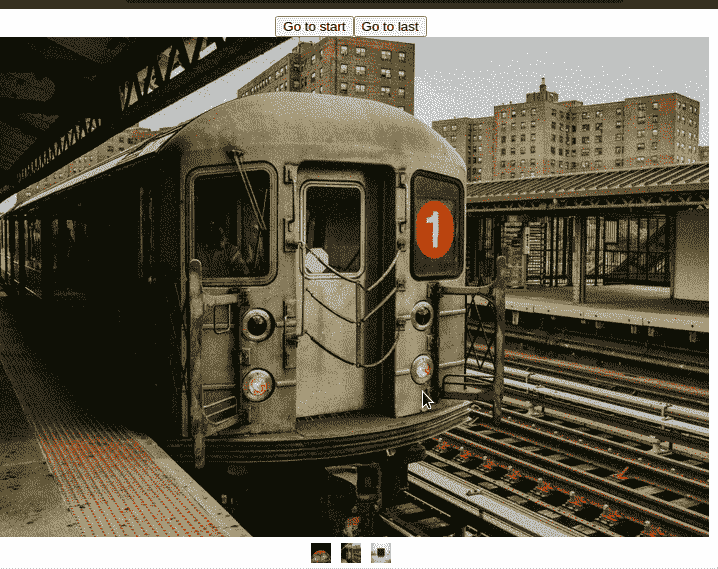
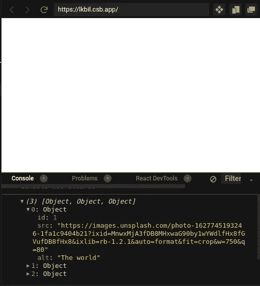
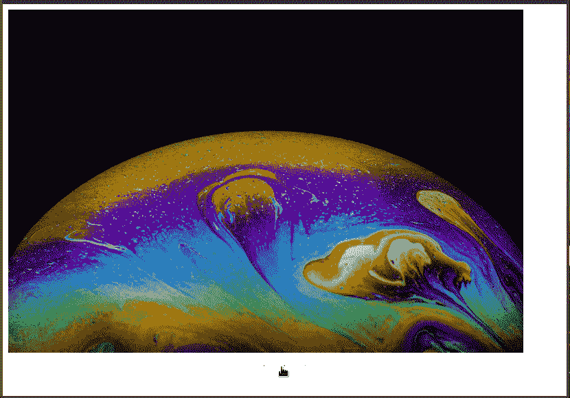
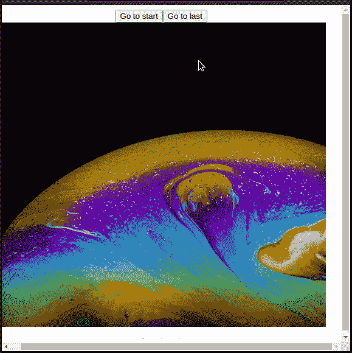
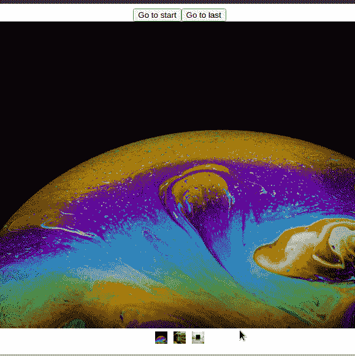
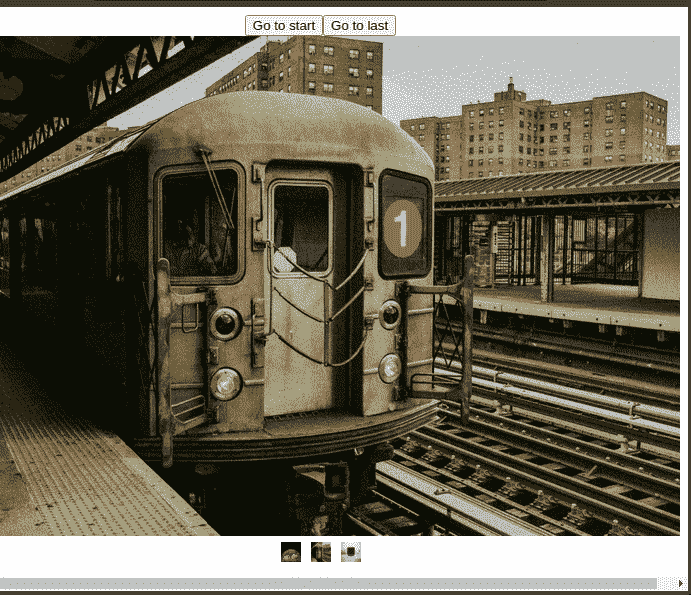

# 用 React Slick 构建一个图像转盘

> 原文：<https://betterprogramming.pub/build-an-image-carousel-with-react-slick-7afd7fee566e>

## 在您的前端 web 应用程序中利用 React Slick 的强大功能


来源:[亚历克斯·利特温](https://unsplash.com/@alexlitvin)在 [Unsplash](http://unsplash.com)

当涉及到在同一个空间中显示内容的许多部分时，旋转木马是至关重要的。例如，假设你有一个成功的网上商店。如果你想显示一个报价和折扣的目录，在一个旋转木马中呈现它们是明智的。这样，列表不会占用太多空间，从而改进 UX 设计。

转盘使用的一个显著例子是 [Saturn 在线商店](https://www.saturn.de/):


土星上的旋转木马演示

要使用 React 创建一个简单的 carousel，您必须执行以下操作:

*   编写大量复杂的 CSS 来显示我们的项目，并将它们放置在合适的位置。
*   稍后，编写定制逻辑来处理迭代功能和执行异常处理。
*   此外，编写更多代码来处理移动视图。例如，当用户用手指拖动滑块时，遍历列表。

因此，这意味着你必须花费大量的时间和精力为你的应用程序编写一个旋转木马。那么，我们如何缓解这个问题呢？

这就是[反应圆滑](https://react-slick.neostack.com/)的用武之地。它是一个开源库，让您可以轻松构建 carousel 组件。它具有以下优点:

*   内置了对[延迟加载](https://developer.mozilla.org/en-US/docs/Web/Performance/Lazy_loading)的支持。这带来了性能。
*   一个 [API](https://react-slick.neostack.com/docs/api/) 用于定制目的。这样，您可以改变组件的外观和感觉。
*   此外，React Slick 还包括一套用于控制你的转盘的[方法](https://react-slick.neostack.com/docs/api/#methods)。这意味着您可以让用户通过单击按钮或键盘快捷键来导航元素。

既然说了它的优点，那就开始吧！

在本指南中，我们将构建一个支持触摸的图像滑块。这将是结果:



本文的结果

# 入门指南

## 创建项目

我们需要首先搭建一个 React 存储库。为此，运行以下终端命令:

```
npx create-react-app custom-carousel
```

## 安装依赖项

我们将在这个项目中使用以下包:

*   帮助我们组装转盘模块。
*   `slick-carousel`:包含 CSS 代码来设计旋转木马的样式。

要安装这些包，请执行以下 bash 命令:

```
npm install react-slick slick-carousel
```

# 构建我们的图像转盘

## 创建我们的数据源

在您的项目目录中，创建一个名为`images.js`的单独文件。在这里，我们将列出我们想要在转盘中显示的图像。

在该文件中，首先编写以下代码:

在这段代码中，我们创建了一个对象数组。每个对象包含一个`id`、`src`(图像的源 URL)和`alt`(相应图像的可选文本)字段。

## 设置转盘组件

在这一部分，我们将开始构建我们的旋转木马。

在根目录下，创建一个名为`ImageCarousel.js`的文件。这个文件将包含渲染我们的滑块所需的代码。

这里，从编写以下代码开始:

*   第 6 行:`settings`变量包含我们的[转盘配置](https://react-slick.neostack.com/docs/api)。
*   第 7 行:`infinite`属性表明我们想要无限滚动。
*   第 12 行:`lazyLoad`值表示我们希望按需加载组件。这将有助于提高性能。
*   第 14 行:注销`images`道具的值。
*   第 17 行:渲染我们的旋转木马并传入我们的配置。

完成后，剩下的工作就是将它呈现给 UI。为此，转到`App.js`，用以下代码替换所有代码:

*   第 6 行:呈现我们的`ImageCarousel`模块，并将我们的数据源传入`images`属性。

这将是代码的输出:



控制台中代码的输出

如您所见，React 正在记录`images`数组的值。这意味着我们的代码有效！

## 创建滑块

在这里，我们将把我们想要的图像呈现到我们的自定义 carousel 组件上。

为此，请转到您的`ImageCarousel.js`文件。在这里，像这样改变`return`块:

*   第 4–8 行:对于`images`数组中的每一项，使用其`src`和`alt`字段呈现图像。React 现在会将每个图像渲染为旋转木马中的一个项目。

这将是代码的输出:



代码的输出

## 使用导航方法

在文章的这一部分，我们将让用户通过`button`元素来导航转盘。

在`ImageCarousel.js`中，像这样修改您的代码:

*   第 3 行:创建一个`useRef`实例。我们将用它来控制我们的幻灯片。
*   第 6 行:`slickGoTo`方法导航到具有指定索引的幻灯片。在这种情况下，我们告诉 React 将用户重定向到第一个图像。
*   第 7 行:单击时，将用户重定向到数组中的最后一个图像。
*   第 10 行:将我们的`carousel`钩子分配给这个`Slider`组件。这意味着我们现在可以执行导航功能。

这将是输出:



代码的输出

请注意，用户现在可以通过单击按钮来转到第一个和最后一个图像。这意味着我们的程序按预期工作！

## 自定义分页组件

这里，我们的计划是通过`customPaging`属性改变分页按钮的外观。这将有助于改进用户界面设计。

要实现这一点，请转到您的`ImageCarousel.js`文件。这里，将`customPaging`字段添加到`settings`对象，如下所示:

*   第 2 行:`i`参数对应于幻灯片的当前索引。
*   第 5–10 行:呈现来自`images`数组的图像。因此，React 将在幻灯片下方显示图像，而不是点。

这将是输出:



代码的输出

## 启用自动播放

在这一节中，我们将编写一些代码来运行我们的幻灯片，而无需任何用户交互。这可以通过`autoplay`支柱实现。

在您的`settings`数组中，添加以下代码:

*   第 3 行:我们将`autoplay`设置为`true`。这将告诉 React Slick 自动运行幻灯片。
*   第 5 行:我们将有一个`linear`动画。

这将是输出:



代码的输出

我们完事了。

# 更多资源

[GitHub 上这个项目的源代码](https://github.com/HussainArif12/image)

*   [带有 React Slick 的图像滑块](https://medium.com/weekly-webtips/image-slider-with-react-slick-d54a049f043) [Ashraful Islam](https://medium.com/u/d9e619c60fc5?source=post_page-----7afd7fee566e--------------------------------)
*   [Aiska Basnet](https://medium.com/wesionary-team/react-slick-for-carousel-40a3b546fded)生产的反应转盘滑道
*   [由 Cryce Truly 开发旋转木马和幻灯片应用](https://www.youtube.com/watch?v=uPv6OyyO6Hw)

# 结论

在本文中，我们学习了如何使用 React Slick 库构建一个简单的图像滑块。它的文档简洁明了。这让你可以毫不费力地使用旋转木马。

非常感谢您的阅读！