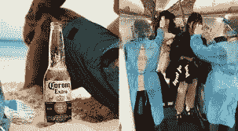

# 在 20 分钟内建立一个基本的图像分类数据集

> 原文：<https://betterprogramming.pub/build-an-image-classification-dataset-in-20-minutes-f7060091e81b>

## 了解如何挑选适合您的使用情形的数据集


图片由来自 Pixabay 的 Gerd Altmann 提供

大多数在线深度学习课程的最大缺陷是，大多数课程使用的数据都是为学习者清理和准备的。这意味着学习者错过了管理数据集的关键步骤。当你有了一个有趣的想法，却不知道如何着手时，这种技能差距通常会显露出来。

在完成我的第一门数据科学课程后，我遇到了这个问题。课程中有一节是关于使用卷积神经网络(CNN)进行图像分类的，用于演示的项目是一个使用 ImageNet 中的图像的犬种分类器。

这是一个有趣的项目，但它没有教会我如何管理数据集。在那门课程之后，我几乎因为沮丧而放弃了，我的进度也慢了下来——直到最近我开始参加 fast.ai 的“[程序员实用深度学习](https://course.fast.ai/)”课程。该课程的结构方式让学生能够从端到端的角度了解人工智能过程。

在本课程的图像分类部分，将向学生展示如何使用 Bing 图像搜索 API 构建数据集，该过程会返回与选定搜索词相关的图像。

这在我的脑海中打开了一扇门，经过一点研究，我找到了一种方法来实现同样的事情，而不需要 Microsoft 帐户、API 密钥和使用 API 所涉及的所有额外内容。

要在不到 30 分钟的时间内构建您自己的图像分类数据集，请遵循以下步骤。

# **1。安装 Bing 镜像下载器库**

这可以通过在终端中运行以下命令来完成:

```
pip install bing-image-downloader
```

关于这个库的更多信息可以在[这里](https://pypi.org/project/bing-image-downloader)找到。

# **2。下载数据集中每个类的数据**

这只用两行代码就可以完成，如下面的示例所示。

这里要考虑的关键参数是:

*   `query`:图片的搜索词。上面的示例预计将返回与百威啤酒相关的图像。
*   `limit`:您要为搜索词下载的图片数量。限制这一点是有好处的，因为你下载的图片越多，你得到的不相关的图片就越多。我发现在大多数情况下 150 是一个合理的限度。
*   `output_dir`:这是包含图像的文件夹的存储目录路径

上面的代码将创建一个名为 beer 的文件夹，并在其中创建两个文件夹。第一个将是一个`budweiser beer`文件夹，包含与百威啤酒相关的图像，第二个将是一个`corona beer`文件夹，包含与科罗纳啤酒相关的图像。

# **3。浏览图片，删除不相关的**



搜索科罗纳啤酒也会出现与该病毒相关的图片

在生成的数据集中不可避免地会有一些不相关的图像。快速浏览所有下载的图片，删除任何不符合你的模型目标的图片就足够了。

现在您有了一个数据集，其中包含了根据类别分组的相关图像。在我的下一篇文章中，我将向您展示如何用不到 25 行代码训练一个自定义图像分类器——听起来很棒，对吧？

**免责声明:**将这些图像用于个人项目是可以的，但如果是商业项目，请确保你没有违反隐私、知识产权或任何其他相关法律。