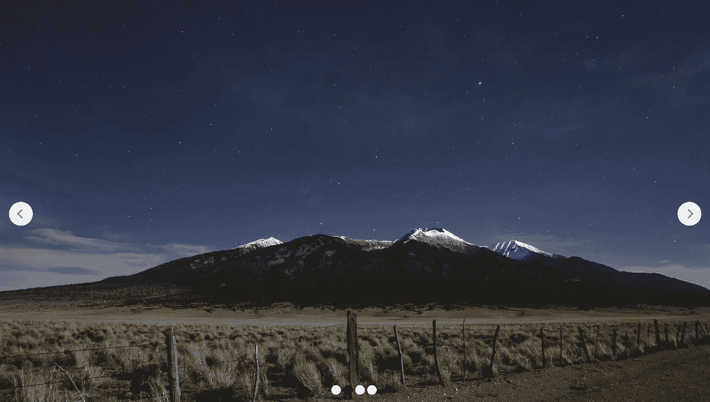

# React Hooks Slider:如何用 React Hooks 构建一个图像滑块

> 原文：<https://betterprogramming.pub/build-an-image-slider-with-react-es6-264368de68e4>

## 第一部分

约瑟夫·巴里恩托斯在 [Unsplash](https://unsplash.com?utm_source=medium&utm_medium=referral) 上的照片

*“创建一个带有 React 挂钩的滑块，”他们说。“会很有趣的，”他们说…*

开个玩笑——这很有趣，我会告诉你怎么做。本教程从最初的版本扩展而来，成为一个由三部分组成的系列。

以下是我们将在每一部分涵盖的内容:

1.  创建显示一系列内容所需的所有组件，以及在我们的滑块中来回导航每个幻灯片的能力。
2.  添加自动播放功能。
3.  我们将深入研究 [React 挂钩](https://reactjs.org/docs/hooks-intro.html)并优化滑块的性能和视觉吸引力。我们将通过利用`useEffect`和一些新的记忆助手来实现这一点。

我强烈建议您先通读本文，但是我也在文章末尾提供了一个视频教程、一个包含代码的资源库的链接以及本系列第二和第三部分的链接。

好吧，我知道你在想什么:让我们开始摇摆吧。

附:如果你喜欢这篇文章，可以在我自己的网站[https://danielzuzevich.io/blog](https://danielzuzevich.io/blog)查看我的一些文章

想找 JavaScript 导师/导师？在 https://danielzuzevich.io/contact[联系我](https://danielzuzevich.io/contact)

# 为我们的 React 挂钩滑块设计组件

第一步:首先，我们需要规划滑块的结构。我在下面列出了我认为我们需要完成的任务:

*   `Slider`(我们的顶层组件)
*   `SliderContent`(这将包含我们所有的幻灯片)
*   `Slide`(实际内容)
*   `Arrows`(左右箭头)
*   `Dots`(显示幻灯片数量的“分页”，以及我们当前正在查看的幻灯片)

我将更多地解释这些组件在构建时的作用。事不宜迟，让我们从我们的`Slider` 组件的一些代码开始。

# 滑块组件

第一步。将包含我在上面列出的所有其他组件，还将包含使一切协同工作的逻辑。在这个例子中，我将把我们的滑块构建成浏览器的全高和全宽，以使事情变得简单。

让我们看看我们的初始版本`Slider`是什么样子的。

滑块组件

超级简单。现在我们已经创建了我们的框架，让我们深入研究一下父级`Slider`和它的子组件`SliderContent`将如何协同工作来创建在任何滑块中都是标准的视觉效果。

# 设置滑块组件的样式

第二步。我们已经确定`Slider`和`SliderContent`将负责滑块中的大部分视觉效果，但是我们到底要如何实现呢？

我在下面分解了我的解决方案。

*   将创建一个我们想要的任意尺寸的容器，在我们的例子中，它将是浏览器的高度和宽度的 100%。
*   `SliderContent`将用于容纳我们所有的幻灯片，并将被设计为水平溢出滑块。这将允许我们将除当前活动幻灯片之外的所有幻灯片置于屏幕之外。

让我们用必要的 CSS 样式化我们的`Slider`组件:

这里最重要的部分是将溢出属性设置为“hidden”。有了这些，我们就可以开始着手`SliderContent`组件了。

# SliderContent 组件

既然我们有信心溢出`Slider`组件并将内容放到屏幕之外，我们希望给予`SliderContent`水平前后移动的能力。

来回移动该组件的能力允许我们显示我们选择的幻灯片，而其他幻灯片将保持在视图之外。

不要担心，如果您想知道这个组件如何拥有道具，而我们在`Slider`组件中还没有实现任何道具，我们现在就去做。我们走吧！

# 创建要向下传递给 SliderContent 的数据

跳回到`Slider`，我们需要创建`SliderContent`将作为道具使用的数据。这是它的样子。

如果你想知道我们如何来回移动，这里有你的答案。通过利用 [CSS 变换属性](https://developer.mozilla.org/en-US/docs/Web/CSS/transform)，我们可以很容易地创建一个平滑的效果，将`SliderContent`向左或向右平移。

还和我在一起吗？现在让我们创建我们的`Slide`组件吧！

# 滑动组件

最后，我们开始进入正题。很快我们就能通过在屏幕上放映幻灯片来看到我们的辛勤工作得到了回报。

下面是我们的`Slide` 组件的全部荣耀。

创建完成后，在我们可以在浏览器中看到我们的幻灯片之前，我们只剩下一些简单的事情了。

# 展示我们的幻灯片

为了展示我们的幻灯片，我们将让`Slider`接受我们的内容作为道具。让我们创建一个图像数组，并通过一个名为`slides`的道具将其传递给我们的`Slider`实例。

在`SliderConten` t 内部，映射到`props.slides`并为数组中的每个元素返回一个`Slide`组件非常简单。

如果操作正确的话，我们应该会看到本文开头描述的[金门大桥](https://www.goldengate.org/)的图像。但是等等，尽管我们的第一张幻灯片非常漂亮，我们也很想看看我们的其他幻灯片！

让我们把一些箭头扔进混合物里。

# 实现箭头功能

很高兴看到我们的内容在浏览器中可见，但现在我们只能看到第一张幻灯片。我们希望用户能够在幻灯片之间导航，因此我们将创建一个名为`Arrow`的组件，它接受两个道具`direction`和`handleClick`。

`direction`道具将决定我们是显示左箭头还是右箭头，而`handleClick`将被设置为`onClick`监听器来来回移动幻灯片。

但是，我们如何知道我们目前处于哪个阶段呢？我们可以通过创建一个名为`activeIndex`的新变量来实现这一点，这个变量为我们跟踪这一点。这个变量没有用，除非我们能增加/减少它的值。

让我们创建两个名为`nextSlide`和`prevSlide` *的函数。*这些功能将改变状态中的`activeIndex`和`translate`值，以便向左或向右移动我们的滑块*。*

这似乎很有效。最后一步是加入这些小点来帮助我们亲爱的用户无压力地浏览我们的滑块！

# 显示分页点

最后一部分是向用户提供一些视觉反馈，告诉他们有多少张幻灯片，以及他们当前正在查看哪张幻灯片。

让我们创建一个名为`Dots`的组件。

`Dots`将接受幻灯片数组作为道具，并映射到这些幻灯片上，为数组中的每个元素生成一个`Dot`。我们还要确保传递`activeIndex` 道具，这样我们就可以相应地设计我们的点了。非活动点将是白色的，而活动点将用黑色来区分自己。

让我们把点导入到`Slider`中，我们应该都准备好了。

好了，我们开始吧，让我们回到浏览器。

Tada！现在我们有了。看看你的滑球吧:

# React Hooks 图像滑块的后续步骤

虽然这个滑块确实完成了预期的工作，但我还是想指出它的一些缺点。具体来说，

*   当从第一张幻灯片导航到最后一张幻灯片时(反之亦然)，我们会在所有中间幻灯片之间循环。在我看来，这还有许多不足之处。
*   滑块不是非常移动友好，也不响应浏览器的大小调整…我的天哪！
*   给滑块一个自动播放的功能会很酷。

在教程的第二部分(下面的链接)，我将处理自动播放功能。

# 链接

第二部分。 [React Hooks Slider:如何用 Autoplay 构建图像滑块](https://medium.com/p/c94deaf763c4/edit)

第三部分。 [React Hooks Slider:如何构建一个平滑过渡和自动调整大小的图像滑块](https://medium.com/p/8a99859ac471/edit)

[GitHub 库](https://github.com/DZuz14/react-hooks-image-slider)

YouTube 上 React Hooks 滑块系列的第 1 部分

 [## 丹尼尔·祖泽维奇:软件工程师

### 我喜欢所有与 JavaScript 相关的东西，并且用……构建了从移动应用到 API 和命令行工具的所有东西

丹尼尔·祖泽维奇](https://danielzuzevich.io/blog)