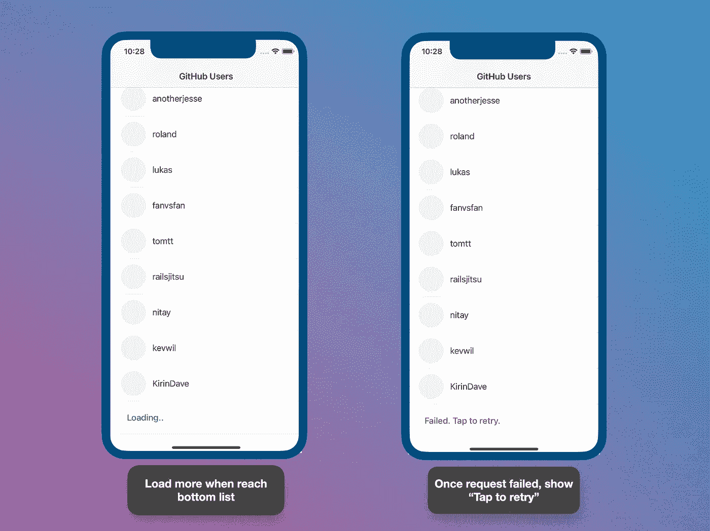
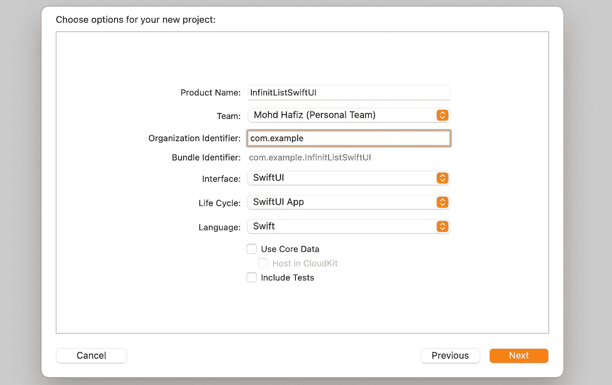
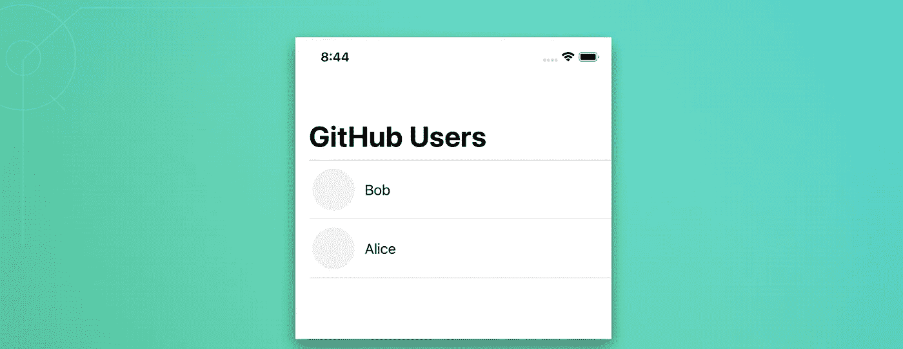
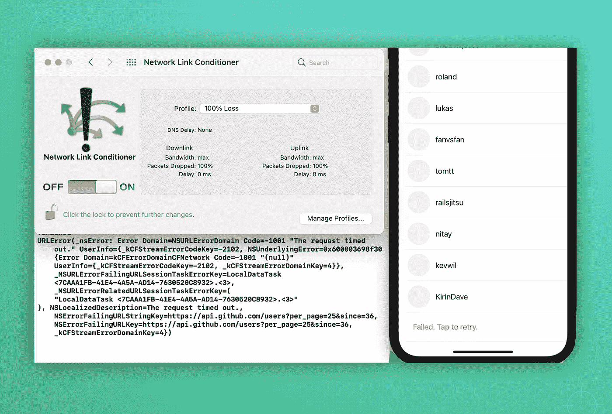

# 用 SwiftUI 和 Combine 构建无限列表

> 原文：<https://betterprogramming.pub/build-an-infinite-list-with-swiftui-and-combine-f9ea1e83a4a7>

## 使用 Combine 框架的简单整洁的 iOS 应用程序

我们将建造什么。图片由作者提供。

SwiftUI 自从在 WWDC2019 上推出以来，名气越来越大。在过去的两年里，苹果对这个 UI 框架做了很多改进。今天，开发人员已经开始采用它，并慢慢地从 UIKit 迁移他们的项目。

# 我们将建造什么？

在本教程中，我们将制作一个简单的列表，具有无休止的滚动和分页(如标题图像所示)。我们将使用 [GitHub API](https://docs.github.com/en/rest) 来获取一个[用户列表](https://docs.github.com/en/rest/reference/users#list-users)。它包含了 GitHub 成立以来的所有用户。在我们的最终产品中，我们将能够创建具有以下功能的应用程序:

1.  能够根据给定的页面限制获取用户列表。
2.  能够无休止地滚动带有分页的 [SwiftUI 列表](https://developer.apple.com/documentation/swiftui/list)。
3.  能够处理请求错误和重新加载。
4.  将[组合](https://developer.apple.com/documentation/combine)框架用于 API 请求和`ViewModel`。

# 我们开始吧

## 1.创建新的 SwiftUI 项目

## 2.创建可解码的用户模型

创建一个名为`User.swift`的新 Swift 文件。我们只从 JSON 对象中解码出`id`、`name`和`avatarUrl`。如上面的结果所示，在这个项目中，我们将只显示用户名作为一个简单的例子。您可以稍后增强它，以显示用户头像和个人资料的详细信息。

## 3.添加行视图

由于我们使用的是`List`，我们将首先创建行视图作为列表项。添加一个名为`UserRow.swift`的新“SwiftUI 视图”文件。然后，插入下面的代码。我们将使用带有`Image`和`Text`的简单`HStack`。

注意这个`UserRow`视图需要`User`作为依赖模型，这意味着如果没有模型传递给这个视图，它就不能被初始化。

## 4.主视图(内容视图)

`ContentView`是我们默认的主视图。主视图在`InfiniteListSwiftUIApp`文件(ProjectNameApp 文件)中定义。

太好了。让我们包括一个`NavigationView`和一个`List`。然后，插入一些静态用户数据。

现在，如果我们运行我们的项目，应用程序将类似于下图:

## 5.创建 API 服务

在这一步，我们将创建一个 API 服务来从 GitHub API 获取用户数据。如下图所示，为了启用分页，我们需要发送`since`和`per_page`参数。

`/users`来自 [GitHub API 文档](https://docs.github.com/en/rest/reference/users#list-users)的端点详情。

将以下代码添加到名为`APIService.swift`的新文件中。由于我们使用的是 SwiftUI，项目自动支持 iOS13+。我们将在我们的`URLSession`中使用[联合](https://developer.apple.com/documentation/combine)框架。

1.  创建一个接受`perPage`和`sinceId`并返回一个带有`[User]`的`AnyPublisher`类型的函数。
2.  用指定的参数构造一个 URL。
3.  创建一个超时 10 秒的 URL 请求。
4.  用`dataTaskPublisher`发送请求。然后将结果映射到`.data`(结果会返回`Data`和`Response`)。最后，将数据解码成`[User]`。简单又干净，对吧？

## 6.创建视图模型

添加一个名为`UserViewModel`的新 Swift 文件作为`ObservableObject`，并添加以下代码。通过子类化`[ObservableObject](https://developer.apple.com/documentation/combine/observableobject)`，我们的视图模型可以在 SwiftUI 视图中使用，并在发生任何重要变化时启用自动重新加载。

1.  用`[Published](https://developer.apple.com/documentation/combine/published)`包装器创建`users`和`isRequested`变量，使任何 SwiftUI 视图都能接收更新。
2.  添加一个常量`pageLimit`来指定将从 API 返回的用户对象的数量。然后，添加`currentLastId`来保存我们获取的`users`数组中的最后一个用户 ID。如前一步所述，它将用于分页参数请求。
3.  从我们的服务舱呼叫`getUsers()`。
4.  当请求失败时，我们将把变量`isRequestFailed`标记为`true`,这样它将触发订阅者视图并进行适当的重新加载。
5.  如果请求成功，我们将获得收到的值(类型为`[User]`)并将该值追加到`users`变量中。同样，当`users`变量发生变化时，它会立即触发视图重新加载其内容。然后，存储`currentLastId`用于下一次读取。

## 7.创建 LoaderView

现在我们想要创建一个`LoaderView`，它将被放置在`List`的底部。所以，无论何时出现，它都会调用获取数据函数。即使用户列表为空，`LoaderView`仍会出现在顶部并显示加载文本。

## 8.更新内容视图

这是我们的最后一步，非常简单，因为我们已经在`ViewModel`中分离了逻辑。

1.  移除先前的`users`静态变量，并使用来自`ViewModel`的`users`数据。创建一个`userViewModel`实例，将`[ObservedObject](https://developer.apple.com/documentation/swiftui/observedobject)`作为`UserViewModel`中变更的订阅者。它会在收到新的更新时使视图失效。
2.  和以前一样，除了现在我们使用来自`ViewModel`的`users`数组。
3.  将我们之前创建的`LoaderView`添加到底部的列表中。此外，它还有一个`onAppear()`函数将调用`fetchData`。添加`onTapGesture()`以在请求失败时重新获取数据。
4.  在`ViewModel`中调用`getUsers`。
5.  处理“点击重试”操作。

## 9.测试失败的请求

我建议使用网络链接调节器工具来模拟一个失败的网络请求，如下图所示。因此，当我们滚动到末尾时，我们可能会到达`LoaderView`，几秒钟后请求将会失败。详细内容你可以看我之前的[文章](https://medium.com/codex/simulate-poor-network-conditions-in-ios-development-1c1912a33a51)。

当网络请求失败时，会显示“点击重试”。

# 项目已完成

恭喜你！我们已经完成了所有的步骤，代码运行良好。当我用 Combine 框架实现 SwiftUI 代码时，我从未想到它会如此干净。

完整的源代码可以从我的 GitHub [库](https://github.com/xmhafiz/InfiniteListSwiftUI)下载。您可以尝试将其实现到您的项目中，并改进代码逻辑和 UI。关于联合收割机框架和`ObservableObject`协议的细节，你可以参考这个 WWDC [视频](https://developer.apple.com/videos/play/wwdc2019/226)和这篇 HackingWithSwift [文章](https://www.hackingwithswift.com/quick-start/swiftui/how-to-use-observedobject-to-manage-state-from-external-objects)。

感谢阅读和快乐编码！

# 参考

*   [https://developer . apple . com/documentation/combine/fail/receive(on:options:)](https://developer.apple.com/documentation/combine/fail/receive(on:options:))
*   [https://developer.apple.com/documentation/swiftui/list](https://developer.apple.com/documentation/swiftui/list)
*   [https://developer . apple . com/documentation/combine/observable object](https://developer.apple.com/documentation/combine/observableobject)
*   [https://developer.apple.com/documentation/combine/published](https://developer.apple.com/documentation/combine/published)
*   [https://developer.apple.com/videos/play/wwdc2019/226](https://developer.apple.com/videos/play/wwdc2019/226)
*   [https://www . hacking with swift . com/quick-start/swift ui/how-to-use-observed object-to-manage-state-from-external-objects](https://www.hackingwithswift.com/quick-start/swiftui/how-to-use-observedobject-to-manage-state-from-external-objects)
*   [https://docs.github.com/en/rest/reference/users#list-users](https://docs.github.com/en/rest/reference/users#list-users)