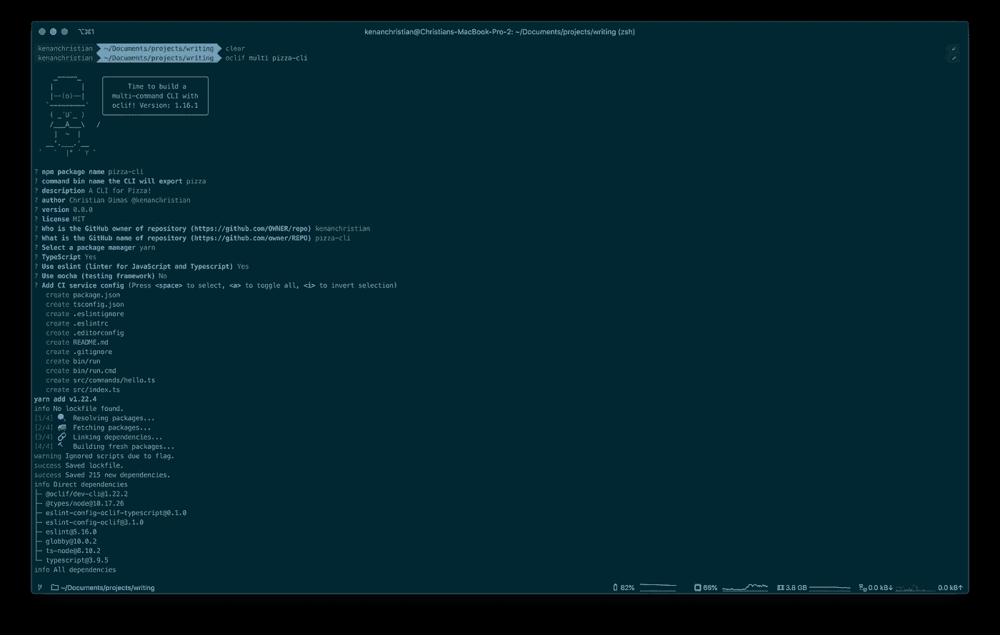
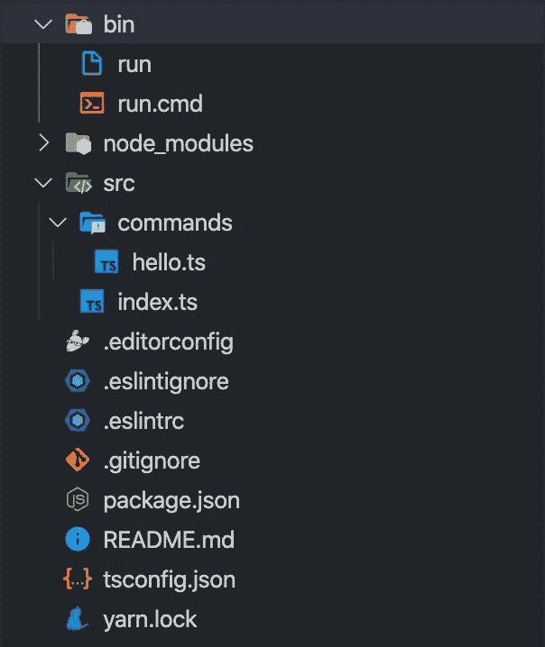
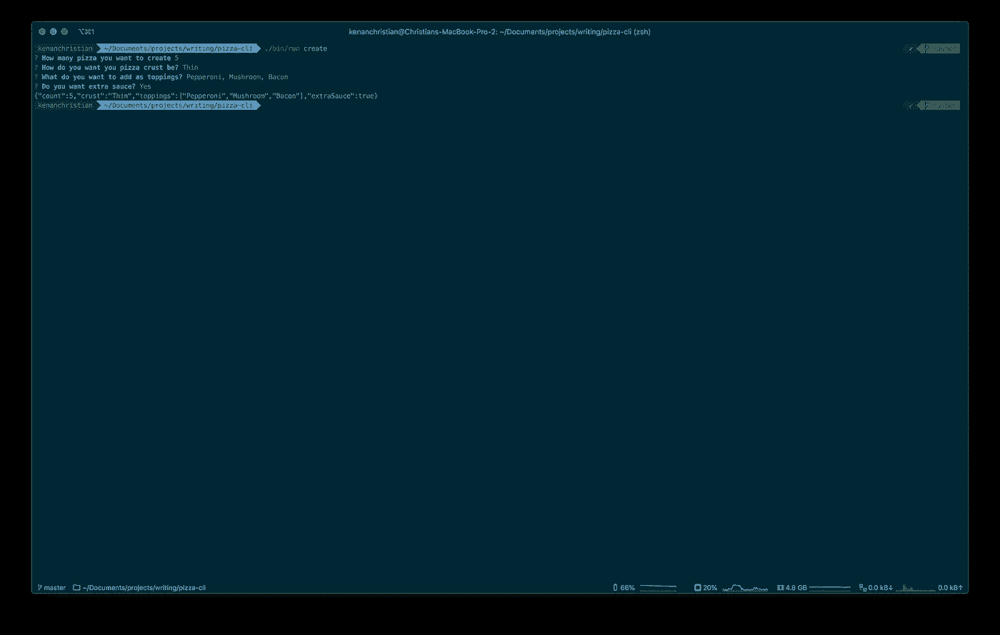
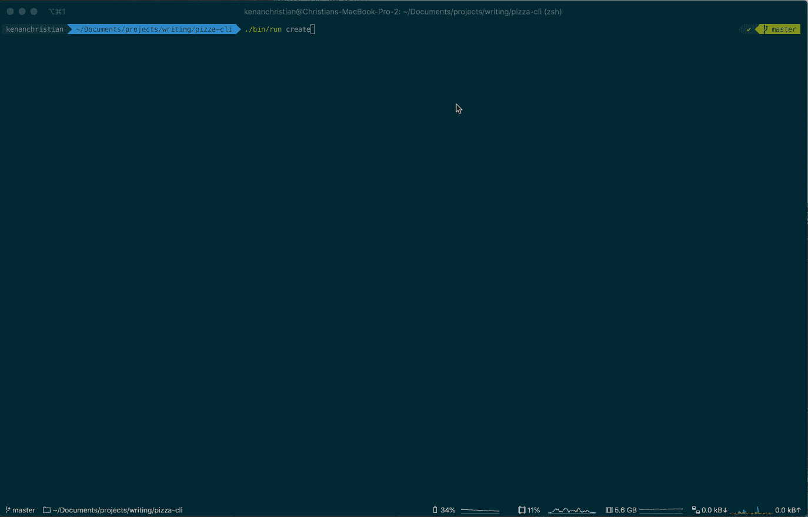

# 使用 TypeScript 构建交互式 CLI

> 原文：<https://betterprogramming.pub/build-an-interactive-cli-using-typescript-54d2b7d7250e>

## *使用 TypeScript、OCLIF 和 Inquirer 快速构建交互式 CLI*


由[帕特·克鲁帕](https://unsplash.com/@patkrupa?utm_source=unsplash&utm_medium=referral&utm_content=creditCopyText)在 [Unsplash](/s/photos/terminal?utm_source=unsplash&utm_medium=referral&utm_content=creditCopyText) 上拍摄的照片

在本文中，我们将使用 Typescript 和一个名为 OCLIF 的框架构建一个 CLI。我们将使它具有交互性，以便第一次使用时非常容易掌握和使用。

> 本文最初发布在我的博客这里:[https://www . christiandimas . com/build-interactive-CLI-using-typescript/](https://www.christiandimas.com/build-interactive-cli-using-typescript/)

# 入门指南

我们的核心功能需要两个 NPM 库。第一个叫做`OCLIF`，代表 Open CLI Framework。这个库为我们提供了构建 CLI 的完整工作流程。我们需要的另一个库叫做`Inquirer` **，**这将帮助我们使 CLI 具有交互性和用户友好性。

用 OCLIF 创建新项目有两种方法。
第一种是全局安装，然后运行如下命令:

```
yarn global add oclif 
oclif multi pizza-cli
```

另一种方法是简单地使用`npx`，就像这样:

```
npx oclif multipizza-cli
```

> 我们正在创建一个`multi`命令 CLI，其中 CLI 可以有多个命令。OCLIF 还支持创建单个命令 CLI。类似于`ls`命令，它只有一个功能

这个命令会给我们一些问题，这些问题会影响项目脚手架的布局



大多数问题都是不言自明的，并且会添加到您的`package.json`文件中。你应该注意两个问题:

*   **NPM 包名称:**这将在您向 NPM 发布 CLI 时使用。
*   **命令行界面将导出的命令绑定名称:**这是您在终端上键入的命令，以使用该命令行界面，如`npm`、`ls`等。

在搭建过程完成之后，移动到项目目录并在代码编辑器中打开它(在本文中我将使用 VSCode):

```
cd pizza-cli
code .
```

# 项目结构

项目结构将如下所示:



如您所见，在命令文件夹中已经有了一个名为`hello.ts`的文件。这个文件是我们唯一需要的一个`hello`命令。

我们来试试吧！回到您的终端，键入以下内容:

```
./bin/run hello     # This will call the hello subcommand
```

您也可以运行:

```
./bin/run --version   # This will show the cli version
./bin/run --help      # This will show a generated help for the CLI
```

酷！您刚刚创建了您的第一个 CLI！

现在，让我们看看`hello.ts`文件中有什么:

您的`hello.ts`文件将类似于上面的代码片段。让我们来看看几件有趣的事情:

1.  **描述和示例:**这将在您运行`help`子命令时出现，用于为使用它的用户提供更多信息。
2.  **标志:**这是为子命令定义所有可用标志的地方。这将在代码中被解析为 JSON。
3.  这是你定义所有可用参数的地方。这里需要注意的一点是参数的顺序很重要，因为它会影响 CLI 的使用方式。
4.  **运行方法:**`run()`方法是在调用 CLI 时执行的方法。这个方法没有参数，但是我们可以通过使用`this.parse()`方法得到所有的参数和标志，正如你在第 23 行看到的。

现在我们已经理解了文件的内容。我们稍微修改一下，让它符合我们的需求。

首先，让我们将文件名从`hello.ts`改为`create.ts`，将类名从`Hello`改为`Create`。这样就会把子命令从`hello`变成`create`，我们可以这样称呼它:`./bin/run create`。

现在让我们修改描述和示例，如下所示:

接下来，我们添加更多的标志和参数。它应该是这样的:

最后一步是更新`run()`方法，这样我们就可以看到参数和标志的样子。更新后的`run()`方法应该如下所示:

更新所有内容后，整个文件应该如下所示:

现在，当您回到终端时，您可以像这样调用命令:

```
./bin/run create 2 -t=pepperoni -c=thin -x
```

或者，如果您喜欢更详细的方式，您也可以这样做:

```
./bin/run create 2 --toppings=pepperoni --crust=thin --extraSauce
```

您将看到我们传入的所有标志和参数都被格式化为一个很好的 JSON 对象，很容易使用。

现在我们已经实现了所有的核心功能，是时候让它更具交互性了

# 让它互动

为了使 CLI 更具交互性和用户友好性，我们需要一个名为`Inquirer`的额外 NPM 包。您可以这样安装它:

```
yarn add inquirer
yarn add -D [@types/inquirer](http://twitter.com/types/inquirer)
```

安装完成后，让我们修改 run 方法，如下所示:

在第一行，我们从`inquirer`导入了`prompt()`方法，然后在`run()`方法中，我们调用了`prompt()`方法，而不是使用`this.parse`来获取所有传入的参数和标志。

`prompt()`方法接受用户在运行 CLI 子命令时被问到的一系列问题。最基本的问题包含一个`type`和`message`键，有关问题中可以使用的完整选项，请点击[这里](https://github.com/SBoudrias/Inquirer.js/#questions)。

现在一切都设置好了，现在您可以像这样执行 CLI:

```
./bin/run create
```

执行 CLI 时，它不会添加所有参数和标志，而是以交互方式要求您提供所需的数据。



恭喜你！您刚刚构建了您的第一个超级用户友好的交互式 CLI！

# **进一步改进**

在本文的这一部分，我想讨论一些改进，在我看来，这些改进将使 CLI 变得更好。

## **使交互提示可选**

这听起来可能有点奇怪。当可选提示符比通常的 CLI 有更好的用户体验时，我为什么要让它可选呢？

我的观点是，对于已经熟悉 CLI 的高级用户来说，只需添加他们需要的所有参数和标志，而不是通过交互式提示，这样实际上会更快。

为此，我们需要稍微修改一下`run()`方法，使它看起来像这样:

我将提示过程转移到一个新方法中，在 run 方法中，我们检查参数和标志。如果存在，我们就使用它，如果不存在，我们就运行提示过程。

通过这种实现，用户现在有两种使用 CLI 的方式。

**添加颜色和加载条**

我想做的下一个改进是让 CLI 看起来更好用。首先，通过给`this.log`方法添加颜色，所以它不仅仅是白色。其次，通过在进程运行时显示一个加载栏来提供更好的用户体验。

为此，我们需要安装两个包。我们需要`chalk`，为`this.log`添加颜色，我们需要`cli-progress`显示一个加载栏。我们这样安装它:

```
yarn add cli-progress chalk
yarn add -D @types/cli-progress @types/chalk
```

安装完这些包后，让我们再次更新我们的代码:

首先，我介绍一个叫做`makePizza()`的新方法。这只是为了模拟一个进程的运行。在这个方法中，我调用了一个`sleep()`方法。这只是一个简单的帮助方法，以确保该过程不会完成得太快。

然后使用`chalk`包给我们的日志添加颜色其实很简单，我们只需要导入我们需要的颜色方法。在这种情况下，我们使用黄色、绿色和青色。然后我们可以用这个方法来包装文本。就这么简单，我们得到一个彩色的日志！

接下来我们要做的是添加装载栏。首先，我们从`cli-progress`导入`SingleBar`和`Presets`。然后，在第 20 行，我们初始化加载栏并给它一个定制的格式。在第 24 行我们调用了`progressBar.start(length, startFrom)`方法，这用于设置加载条长度和起始值。

为了模拟一个流程，我们对每个比萨饼进行循环，以制作一个浇头，将 loading bar 值增加 1。现在所有这些都设置好了，我们的 CLI 如下所示:



相当酷！

要了解更多我们用过的东西，请访问下面的链接。感谢您读到这里，下一篇文章再见！

# 资源:

*   奥克里夫:[https://oclif.io/](https://oclif.io)
*   询问者:[https://github.com/SBoudrias/Inquirer.js/](https://github.com/SBoudrias/Inquirer.js/)
*   粉笔:[https://github.com/chalk/chalk](https://github.com/chalk/chalk)
*   CLI-进展:[https://github.com/AndiDittrich/Node.CLI-Progress](https://github.com/AndiDittrich/Node.CLI-Progress)
*   项目回购:[https://github.com/kenanchristian/pizza-cli](https://github.com/kenanchristian/pizza-cli)