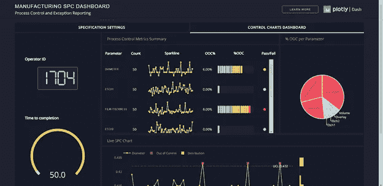

# 用 Dash 构建一个交互式的现代仪表板

> 原文：<https://betterprogramming.pub/build-an-interactive-modern-dashboard-using-dash-ab6b34cb515>

## 通过极具吸引力的数据可视化和高性能增强用户体验


[本杰明·蔡尔德](https://unsplash.com/@bchild311?utm_source=unsplash&utm_medium=referral&utm_content=creditCopyText)在 [Unsplash](https://unsplash.com/search/photos/dashboard?utm_source=unsplash&utm_medium=referral&utm_content=creditCopyText) 上的照片

你有没有想过用图形显示一组信息？或者在任何形式的应用中以一种容易理解的方式？

[Dash](https://plot.ly/dash) ，一个高效的 Python 框架，让你现在轻松多了。无论您是前端开发人员、后端开发人员、数据科学家还是完全的新手，都没有关系。Dash 让数据集的可视化变得更加舒适和容易。

所以，让我们仔细看看 Dash。

# **什么是破折号？**

Dash 是一个基于 Python 的框架，主要用于创建包含大量数据可视化的 web 应用程序。

顾名思义，Dash 专门用于创建基于 web 的仪表板应用程序。但是这是在一些 Python 库的帮助下通过使用纯 Python 实现的。

Dash 不仅可以帮助您创建交互式图形，还可以将这些图形嵌入到用户友好的 UI 中。由于是在 [Flask](https://palletsprojects.com/p/flask/) 、 [Plotly.js](https://plot.ly/javascript/) 和 React.js 之上编写的，Dash 非常适合构建具有高度定制用户界面的数据可视化应用。

它特别适合任何使用 Python 处理数据的人。Dash 抽象出了构建基于 web 的交互式应用程序所需的所有技术和协议，因此对开发人员来说更加方便。

# Dash 能做什么？

如果你以前用过 Mathematica，你会知道我们可以在仪表板类型的应用程序中构建非常酷的小部件和控制器。

即使在这些应用程序中，界面也不是可移植的，更不可定制。我们不能使用它，除非我们有 Mathematica 许可证。因为它们不可移植，我们不能用它们嵌入到 web 应用程序中。

所以，Dash 带来的是便携、有吸引力、更加可定制的东西。

例如，如果需要创建一个图表来展示股票交易所中某家公司的股票价格，使用 Dash 就可以轻松完成。

无论是实时数据馈送还是从 CSV 文件中提取的数据都无关紧要。Dash 允许您使用交互式图形创建自己的 web 应用程序，这将为用户提供实时更新。

一旦完成 Dash 应用程序的创建，它就可以发送到服务器，然后通过 URL 共享。由于 Dash 应用程序是在 web 浏览器中查看的，因此它天生具有跨平台和移动就绪性，当我们考虑今天的环境时，这是一个巨大的优势。

如果没有 Dash，科学数据分析中的数据可视化可能已经使用 JavaScript 完成了。但问题是，这种语言的数据分析工具还没有出现，而 Python 或 r。

# **仪表板安装**

您只需在终端中键入这些命令，就可以在计算机上安装 Dash。先决条件是:

*   应该安装 Python 2.x 或 3.x。
*   应该安装 Pip (Python 包安装程序)。

```
pip install dash # The core dash backend
```

指定版本，如“1.0.2”，是可选的。

要检查您安装了哪个版本，您可以在 Python shell 中运行下面的。

```
*>>> import dash_core_components**>>> print(dash_core_components.__version__)*
```

这将打印您当前使用的 Dash 版本。

# **构建 Dash 应用**

任何 Dash 应用程序都分为两个主要部分:

1.布局—考虑应用程序在用户界面中的静态外观。

2.回调函数——考虑应用程序的交互性。

每个 HTML 类都有一个 Python 类，这是 Dash 使用 Python 构建基于 web 的前端是多么容易的又一个例子。

他们在`dash_core_components`和`dash_html_components`库中维护了一组组件，但是你也可以[用 JavaScript 和 React.js 构建你自己的](https://github.com/plotly/dash-components-archetype)。

你可以根据自己的喜好使用任何 IDE，你可以简单地将你的文件命名为“`app.py`”，然后开始使用 Dash 框架。

下面是一个可以在 Dash 框架中使用的图形的基本示例。

```
import dash
import dash_core_components as dcc
import dash_html_components as html

external_stylesheets = [‘[https://codepen.io/chriddyp/pen/bWLwgP.css](https://codepen.io/chriddyp/pen/bWLwgP.css)']

app = dash.Dash(__name__, external_stylesheets=external_stylesheets)

app.layout = html.Div(children=[
html.H1(children=’Weather Dashboard’),

html.Div(children=’’’
Dash: A web application framework for Python.
 ‘’’),

 dcc.Graph(
 id=’example-graph’,
 figure={
 ‘data’: [
 {‘x’: [1, 2, 3, 4, 5, 6, 7, 8, 9, 10, 11, 12], ‘y’: [60.56, 150.43, 76.98, 80.49, 250.80, 110.56, 80.33,
 20.44, 15.32, 90.11, 150.67, 150.55], ‘type’: ‘bar’, ‘name’: ‘Expected Rain’},
 {‘x’: [1, 2, 3, 4, 5, 6, 7, 8, 9, 10, 11, 12], ‘y’: [40.09, 128.82, 51.57, 88.53, 295.47, 47.94, 42.05,
 3.41, 14.4, 113.65, 226.95, 142.51], ‘type’: ‘bar’, ‘name’: Actual Rain’},
 ],
 ‘layout’: {
 ‘title’: ‘Rainfall in SL in 2016’
 }
 }
 )
 ])

if __name__ == ‘__main__’:
 app.run_server(debug=True)
```

在这里，“仪表板核心部件”被导入为`dcc`并形成`Graph`部件来绘制该图。

同样，数据馈送的格式非常简单。`x`表示 x 轴的值，而`y`表示 y 轴的相应值。

因此，如您所见，我们只需将数据作为两个 Python 列表给出，这样 Dash 就会处理剩下的事情，并为您绘制一个引人注目的图表。

此外，还可以进行大量的定制，例如在`type`中，轴的名称、颜色、网格、背景颜色等。

Dash 包括“热重装”。当您使用`app.run_server(debug=True)`运行应用程序时，此功能默认激活。这意味着当你修改代码时，Dash 会自动刷新你的浏览器。如果您是一名开发人员，这将使您的生活变得容易得多。

`dash_html_components`库为每个 HTML 标签提供了一个组件。您可以使用任何格式为`html.<element>`的 HTML 元素。但在记谱法上略有不同。

如果你想在 Dash 中使用`<div>`，你必须使用`html.Div`而不是`html.div`。`html.H1(children='Hello Dash’)`组件在应用程序中生成一个`<h1>Hello Dash</h1>` HTML 元素。

孩子的财产是特殊的。按照惯例，总是第一个属性，也就是说可以省略:`html.H1(children='Hello Dash’)`和`html.H1('Hello Dash’)`一样。

此外，它可以包含字符串、数字、单个组件或组件列表。对于`dash_html_components`，每个组件都与关联的 HTML 组件完全匹配。

从[文档](https://dash.plot.ly/dash-html-components)、[、](https://dash.plot.ly/dash-html-components)可以得到进一步的信息。如果您使用 HTML 组件，您还可以访问属性，比如`style`、`class`和`id`。Python 类中提供了所有这些属性。

HTML 元素和 Dash 类大部分是相同的，但是有一些关键的区别:

*   样式属性是一个字典。
*   样式字典中的属性是`camelCased`。
*   类别密钥被重命名为`className`。
*   以像素为单位的样式属性可以只作为数字提供，而不使用 px 单位。

并不是所有的组件都是纯 HTML。`dash_core_components`描述了更高级别的组件，它们是交互式的，通过 React.js 库用 JavaScript、HTML 和 CSS 生成。

对于`dash_core_components`，有[很多例子和一个参考指南](https://plot.ly/dash/dash-core-components/)。参见此链接查看[下拉列表示例](https://plot.ly/dash/dash-core-components/dropdown)。

对于`dash_core_components.Graph`，图形的语法与 [Plotly.py](https://plot.ly/python/getting-started/) 库和 Plotly.js 库的语法相匹配。因此，您在[https://plot.ly/python/](https://plot.ly/python/)中看到的任何示例都适用，并且所有可用的属性都可以在[文档](https://plot.ly/python/reference)中找到。

## 设计元素的样式

元素的样式是通过 CSS 的`style`属性实现的。来自[文档](https://dash.plot.ly/dash-html-components)的示例:

```
html.Div([html.Div(‘Example Div’, style={‘color’: ‘blue’, ‘fontSize’: 14}),html.P(‘Example P’, className=’my-class’, id=’my-p-element’)], style={‘marginBottom’: 50, ‘marginTop’: 25
```

style 属性中的这些键值对可以在任何在线 CSS 教程中找到，它们还没有出现在 Dash 文档中。社区已经为此收集了一些很好的资源。

您的应用程序中的字体看起来会与这里显示的略有不同。这个应用程序使用一个定制的 CSS 样式表来修改元素的默认样式。

```
external_stylesheets = [‘https://codepen.io/chriddyp/pen/bWLwgP.css']app = dash.Dash(__name__, external_stylesheets=external_stylesheets)
```

Dash 中已经提供了各种仪表板模板。所以，我们可以使用一个并根据我们的需求进行定制。这些模板可以在 [Dash 应用程序库](https://dash-gallery.plotly.host/Portal/)中找到。

图形组件有许多参数，其中大多数是可选的。如果你想了解更多，你可以参考社区。



Dash 应用程序库中的仪表板示例

# **回调**

```
app.layout = html.Div([dcc.Input(id=’my-id’, value=’initial value’, type=’text’),html.Div(id=’my-div’)])@app.callback(Output(component_id=’my-div’, component_property=’children’),[Input(component_id=’my-id’, component_property=’value’)])
```

Dash 应用程序接口的输入和输出通过`app.callback`装饰器以声明方式描述。

在 Dash 中，上述应用程序的输入和输出只是特定组件的属性。在这个例子中，输入是 ID 为`my-id`的组件的`value`属性。

输出是 ID 为`my-div`的组件的`children`属性。

每当输入属性改变时，回调装饰器包装的函数将被自动调用。Dash 向函数提供输入属性的新值作为输入参数，Dash 用函数返回的内容更新输出组件的属性。

`component_id`和`component_property`关键字是可选的(每个对象只有两个参数)。不要把`dash.dependencies.Input`和`dash_core_components.Input object`混淆了。

前者只是在这些回调中使用，而后者是一个实际的组件。

注意它没有为布局中的`my-div`组件的`children`属性设置值。当 Dash 应用程序启动时，它会使用输入组件的初始值自动调用所有回调，以填充输出组件的初始状态。

在这个例子中，如果你指定了类似于`html.Div(id='my-div',children='Hello world')`的东西，当应用程序启动时它会被覆盖。

这有点像用 Microsoft Excel 编程——每当输入单元格发生变化时，依赖于该单元格的所有单元格都会自动更新。这叫做*反应式编程*。

# **性能**

由于 Dash 的回调本质上是功能性的，所以很容易添加内存化缓存。记忆化在函数被调用后存储其结果，如果用相同的参数调用该函数，则重用该结果。

Dash 应用程序通常是将跨多个平台部署的仪表板。此外，它们经常跨多个进程或线程部署。

在这些情况下，我们可以使用 *Flask 缓存*库，它将结果保存在共享内存数据库中，比如 [Redis](https://redis.io/) ，或者作为文件保存在您的文件系统中。

Flask 缓存还有其他不错的特性，比如基于时间的过期。如果你想每小时或每天更新你的数据(清除你的缓存),基于时间的过期是有帮助的。

因此，当我们将 Dash 框架视为创建仪表板的一种方式时，它使开发人员的生活变得更加轻松，同时，通过提供有吸引力的高性能数据可视化来增强用户体验。

它为程序员提供了一种只使用 Python 创建交互式 web 应用程序的方法。由于 Python 将是未来的前置运行编程语言，Dash 将是一大进步。

下次你想创建一个仪表板，试试 Dash 吧！