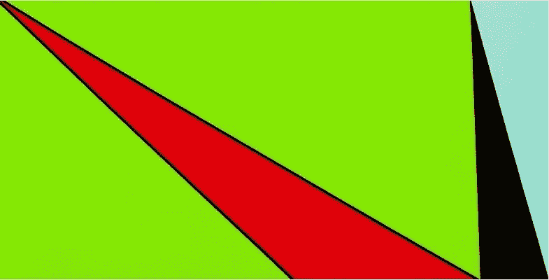
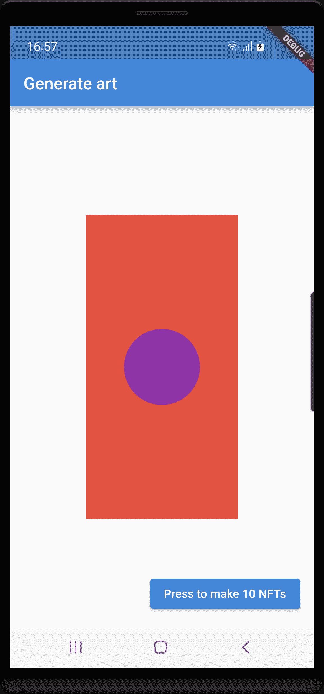

# 使用 Flutter 构建 NFT 集合

> 原文：<https://betterprogramming.pub/build-an-nft-collection-using-flutter-6df928e5f742>

## 使用 Flutter 创建艺术和管理智能合同



作者图片

你是一个 Flutter 爱好者，想学习不可替代令牌和智能合约的基础知识。在这个项目中，我们将构建一个 NFT 集合，并将其部署在 OpenSea 市场上。我们将构建两个颤振应用程序:一个生成艺术，一个控制我们的智能合同。我们将使用许多 Web3 工具:IPFS，皮纳塔，元面具，安全帽，坚固，开放齐柏林，多边形扫描，炼金术。

如果你对 NFT 的图片有一些很酷的想法，并且正在寻找一种快速简单的方法来制作和销售它，那么这篇文章不适合你。查看 [LaunchMyNFT.io](https://www.launchmynft.io/) 或类似网站。

这个项目的步骤如下:

1.  了解我们将开发什么。
2.  生成艺术:构建一个 Flutter 应用程序来创建图像和描述。将它们上传到 IPFS——星际文件系统。
3.  拿一个装有加密货币的钱包。
4.  创建并部署智能合约，该合约将在区块链上运行并跟踪您的 NFTs。
5.  构建一个 Flutter 应用程序来管理您的合同和 mint NFTs。
6.  在 OpenSea 市场上列出你的 NFT。
7.  从测试环境进入生产环境。

## 1.我们将开发什么

[OpenSea](https://opensea.io/) 是使用最多的 NFTs 市场。点击此[链接](https://opensea.io/collection/the-bling-nft-collection)在 OpenSea 上查看*珠光宝气的 NFT 系列*。它是按照本文档中的描述开发的。首先，熟悉一下收藏页面。然后单击其中一个 NFT 并检查 NFT 页面，包括属性和详细信息。

您将创建自己的收藏，就像这个一样，尽管图像要简单得多。

## 2.生成艺术

作为 NFT，你基本上可以卖任何东西。但在大多数情况下，NFT 是和一张图片联系在一起的。同样，它可以是任何类型的图像，例如从互联网上下载的可爱狗狗的图片。但是通常，NFT 收藏包含由计算机程序生成的图像。图像有许多属性，称为特征，通过改变这些属性，可以生成大量(通常是数千个)相似但不同的图像。谷歌“生成艺术”了解更多。

在这个项目中，我们将构建一个 Flutter 应用程序来生成如下图像:


的确非常简单，也不太漂亮，但它们将服务于我们的目的。每幅图像都有三个特征:背景色、前景色和圆半径。ArtWork 类定义了一个图像:

```
**class** ArtWork {
  String **title**;
  Size **artSize**;
  int **backgroundIndex**;
  int **forgroundIndex**;
  int **radiusIndex**;

  ArtWork(
      {**this**.**title** = **'Generate art'**,
      **this**.**artSize** = **const** Size(500, 1000),
      **this**.**backgroundIndex** = 0,
      **this**.**forgroundIndex** = 2,
      **this**.**radiusIndex** = 5});
}
```

颜色在[颜色.原色](https://api.flutter.dev/flutter/material/Colors/primaries-constant.html)材料颜色列表中定义为索引。radiusIndex 是 1 到 10 的整数，圆的半径是图像宽度* radiusIndex / 20。

你可以选择是要构建一个 Android 应用还是 Windows 应用。要创建 Android 应用程序，请在 Android Studio 中使用文件-新建-新建 Flutter 项目。要创建 Windows 应用程序，请运行以下命令:

*   *启动 ms-settings:developers* 并在 Windows 上启用开发者模式
*   *颤振配置-启用-windows-桌面*
*   *扑创 genwin*
*   *cd genwin*
*   *颤振运行窗口*并检查颤振样本程序是否工作。

在这两种情况下，在您的项目目录中，将[路径提供者](https://pub.dev/packages/path_provider)添加到 *pubspec.yaml* :

```
**name**: gen_art
**description**: Generate art for NFTs.
**publish_to**: **'none'
version**: 1.0.0+1
**environment**:
  **sdk**: **">=2.15.0 <3.0.0"
dependencies**:
  **flutter**:
    **sdk**: flutter
  **path_provider**: ^2.0.8
**dev_dependencies**:
  **flutter_test**:
    **sdk**: flutter
  **flutter_lints**: ^1.0.0
**flutter**:
  **uses-material-design**: true
```

并且做一个*扑酒馆弄*。

用以下内容替换 *lib/main.dart* :

该应用程序将显示这一点(在手机上，在 Windows 上调整窗口到类似的比例):



当你按下按钮时，这将发生十次:

*   基于随机值生成新图像。使用[自定义油漆](https://medium.com/flutter-community/a-deep-dive-into-custompaint-in-flutter-47ab44e3f216)显示，代码如下。
*   图像被写入一个名为*圆 x.png*(x = 0，1，…9)的文件
*   描述图像的 JSON 格式文件被写入 *Circle x.json* 。例如:对于第六圈: *{"name": "Circle 6 "，" description ":"这是第六圈"，" image ":" ipfs://IMAGES _ CID/Circle 6 . png "，" attributes ":[{ " trait _ type ":" BgColor "，" value": "17"}，{"trait_type":"FgColor "，" value": "8"}，{"trait_type":"Radius "，" value": "5"}]}*
*   这遵循了 OpenSea 上 NFT 元数据的标准格式。IMAGES_CID 是包含图像的文件夹地址的占位符，下面将详细介绍。

实际绘制是在 *lib/artpainter.dart* 中完成的。复制这个:

*drawArt()* 在画布上绘制图像。它由调用

*   *ArtPainter()* ，它是 CustomPaint 小部件的绘制器。画布宽度是设备宽度的一半。
*   *getPng()* ，返回一个. Png 格式的 Uint8List，可以作为。png 文件。画布大小为 500x1000 像素。NFT 的所有者可能希望将“他的”图像发送到打印店并挂在墙上。那么高分辨率是理想的。

运行应用程序。如果您运行 Android 应用程序，请使用 Android Studio 中的设备文件浏览器来检查结果。这些文件位于*data/data/(your _ app _ name)/app _ flutter*文件夹中。

如果运行 Windows 应用，会得到类似*未处理异常:FileSystemException:无法打开文件，path = ' C:\ Users \ Bo \ Documents/Circle 0 . png '(操作系统错误:访问被拒绝)*的错误信息。只需授权访问并再次运行。现在您知道在哪里可以找到您的文件。

创建两个名为 Images 和 JSON 的文件夹。复制。png 文件到图像和。json 文件到 JSON。

我们可以将文件存储在任何文件服务器上。但是，由于已经成为 NFT 的标准，我们将在 [Pinata](https://www.pinata.cloud/) 的帮助下将它们存储在 [IPFS](https://ipfs.io/) 上。这有很多好处，你可以在这里阅读。去皮纳塔注册免费计划。点击+上传并选择图像文件夹。记下几秒钟后您将获得的 CID。

将这段 JavaScript 代码存储在 JSON 文件夹之外:

将第二行中的 xxx 替换为您刚刚从 Pinata 获得的 CID。运行脚本:*节点 updatejson.js 0 9* 。检查 JSON 文件中的 IMAGES_CID 占位符是否已被真正的 CID 替换。

回到 Pinata，上传 JSON 文件夹。记下该文件夹的 CID。

您现在已经完成了艺术作品的创作和准备，可以继续下一项任务:

## 3.拿个钱包

要存储加密货币和 NFT，支付区块链交易，需要一个[钱包](https://n26.com/en-eu/blog/what-is-a-crypto-wallet)。在这个项目中，我们将使用[元掩码](https://metamask.io/)。你可以把它作为 Chrome 扩展安装在你的电脑上，作为一个应用程序安装在你的 Android 手机上，或者两者兼而有之(有一个同步功能)。我们将使用 Chrome 扩展。进入 MetaMask 主页，点击*安装 Chrome meta mask*。

关于为您的 NFTs 使用哪个区块链，有几种可能性。以太坊是最著名的收藏所在地，但由于沉重的交易费用，使用起来非常昂贵。对于这个项目，我们将使用多边形，这也是非常流行的 NFTs。两条链都有侧链，可以自由测试。以太坊有侧链 Rinkeby 和 Ropsten，Polygon 有 Mumbai。要检查 Polygon 上的交易、合同、钱包等，使用位于[https://polygonscan.com/](https://polygonscan.com/)的 Polygon Chain Explorer。这是免费的，不需要用户 id 或登录。要在孟买做同样的事情，去 https://mumbai.polygonscan.com/。把这些收藏起来，因为你会经常用到它们。

要在您的钱包中添加对 Polygon 和 Mumbai 的支持，您可以单击钱包中的网络下拉菜单，然后单击添加网络。但是有一个更简单的方法:去 polygonscan.com，向下滚动到网页底部，点击*添加多边形网络*按钮。然后对孟买做同样的事情:去 mumbai.polygonscan.com，向下滚动到网页底部，点击*添加孟买网络*按钮。

你还需要一些加密货币来支付你在孟买的交易。用于此的货币被称为马提克。把你的钱包换到孟买。复制你的钱包地址。前往[多边形水龙头](https://faucet.polygon.technology/)。在“获取测试令牌”面板中粘贴您的钱包地址，选择“自动令牌”，然后单击“提交”。一段时间后，你的钱包里将有 0.5 MATIC，如果你输入你的钱包地址，你就可以在 mumbai.polygonscan.com 上看到它——检查余额和内部交易。但也许你在 MetaMask 中看不到。然后，您必须通过单击“资产”下的“导入令牌”在元掩码中添加对 MATIC 的支持。或者，还有一个更简单的方法:去 polygonscan.com(不是孟买)，在搜索框中输入 *Matic Token* 。在概要文件摘要行的最右侧，单击三个垂直点。单击将令牌添加到 Web3 Wallet。

您现在有了一个可以用于测试的钱包。

## 4.创建和部署智能合同

在这一步中，我们将编写一个智能契约，编译它并将其部署在名为 Mumbai 的多边形测试链上。

智能契约会跟踪您的 NFT——有多少个，以及每个 NFT 的描述 URL(JSON 文件)、所有者(钱包地址)等等。它还被用来创造新的 NFT——这个过程被称为铸造 NFT。

智能合同是用一种叫做[可靠性](https://docs.soliditylang.org/)的特殊语言编写的。它受 JavaScript 的影响。幸运的是，您可以包含标准合同，然后只添加几行特定于您的项目的内容。

请遵循以下步骤。Bhaskar Dutta 在 [Figment Lear](https://learn.figment.io/tutorials/create-nft-smart-contract-with-hardhat) n 上有一篇很好的文章，描述了我们在这一部分的工作，如果你想了解更多细节的话。

1.  确保您拥有 node.js 的最新版本(15 或更高版本)。node.js 提供了我们将会经常用到的命令 npm 和 npx。
2.  为项目的这一部分创建一个目录，例如 *Circles* ，并将其光盘化。

3.安装 [Hardhat](https://hardhat.org/) ，一个区块链应用的开发环境。运行命令 *npm install -g hardhat。*

4.创建一个安全帽项目。运行命令 *npx hardhat。*在所有问题上按回车键，采用默认值，包括“创建一个基本的示例项目”。

5.Hardhat 会告诉你安装几个额外的包作为开发依赖。运行命令(忽略警告)

```
*npm install --save-dev "hardhat@2.8.3"
npm install --save-dev "@nomiclabs/hardhat-waffle@2.0.0"
npm install --save-dev "ethereum-waffle@3.0.0"
npm install --save-dev "chai@4.2.0"
npm install --save-dev "@nomiclabs/hardhat-ethers@2.0.0"
npm install --save-dev "ethers@5.0.0"
npm install @nomiclabs/hardhat-etherscan*
```

6.安装 [OpenZeppelin](https://openzeppelin.com/contracts/) 合同库。这是我们获得 NFTs 的标准契约的地方，名为 ERC721.sol

7.最后安装 [dotenv](https://www.npmjs.com/package/dotenv) 包。这允许我们将钱包地址和 IPFS cid 之类的东西放在。而不是对它们进行硬编码。运行命令 *npm install dotenv。*

8.在 Android Studio 或 VS 代码中打开 *Circles* 目录，熟悉内容。 *harhat.config.js* 是 Hardhat 的配置文件。*合同文件夹*是存放可靠性合同的地方。它有一个名为 *Greeter.sol* 的样本契约。旧版本的脚本包含用于部署合同的 JavaScript 文件等等。

9.为了检查安装是否正常，编译示例契约: *npx hardhat compile。*

10.创建一个名为。env 并添加以下几行:

```
CONTRACT_NAME = "John Doe's Circles Collection"
CONTRACT_SYMBOL = "JDCC"
CONTRACT_ADDRESS = ""
WALLET_OWNER = "0x6f3298d259e6EC1c48FA0d6265E8D49ad78EBFD7"
WALLET_PRIVATE_KEY="ecb5bfd5be173f61c24415bd3787600caeb3f0c50ebe3827e168da7e0b751a68"
POLYGONSCAN_KEY=""
ALCHEMY_KEY_TEST = ""
ALCHEMY_KEY_PROD = ""
JSON_CID = "QmQuXH6UCaY9iAYt5VcrTurF4BBeLC3XxxRfMxCuU4g3Gu"
IMAGES_CID = "QmPDLL5r7mxDZ3nhVVFzLxE5fRxxfDW1UAqeZsvRYoEzdq"
```

在哪里

*   CONTRACT_NAME 是您要为合同指定的名称。把无名氏换成你自己的名字。该名称不必是唯一的，但是由于它也将是 OpenSea 中的默认集合名称，如果我们都使用相同的名称，将会造成混乱。
*   CONTRACT_SYMBOL 是您要为所使用的令牌类型指定的名称，通常为三个或四个字符。用你自己的首字母代替 JD。
*   CONTRACT_ADDRESS 将在部署合同后填充
*   在 WALLET_OWNER 中输入元掩码钱包的公共地址。
*   在 WALLET_PRIVATE_KEY 中输入您钱包的私钥。打开钱包，进入*账户详情*，选择*导出私钥*。知道这把钥匙的人可以偷走你钱包里的所有资产。因此，您必须非常小心，不要让。环境文件。确保。env 列在。gitgnore 文件。
*   POLYGONSCAN_KEY 解释如下。
*   ALCHEMY_KEY_TEST 和 _PROD 解释如下。
*   JSON_CID 和 IMAGES_CID 是 IPFS CID。

11.将上面获得的 IPFS CID 放到 JSON_CID 和 IMAGES_CID 中。

12.为了以编程方式使用多边形扫描，我们需要一个 API。去 polygonscan.com 注册免费 API 计划。创建一个 API 密钥，并将其输入。env 文件作为 POLYGONSCAN_KEY。(孟买也使用相同的密钥)。

13.我们还将使用一个名为 [Alchemy](https://www.alchemy.com/) 的区块链开发者平台。注册，进入[仪表盘](https://dashboard.alchemyapi.io/)，点击+创建 APP，获得两个 API 密匙，一个用于孟买的测试，一个用于 Polygon Mainnet 的生产。把它们放在。env 文件(以 [https://)开头。](/).)

14.更新 *hardhat.config.js* 如下所示:

15.在合同文件夹中，删除 *Greeter.sol* 并添加我们的合同 *NFT.sol* :

有关解释，请参见虚构的文章。*is approved for all*override 是 OpenSea 需要的东西，如这里的[所述](https://docs.opensea.io/docs/polygon-basic-integration)。

16.编译合同: *npx hardhat 编译。*您应该会看到“编译成功完成”。

17.在脚本文件夹中，添加一个名为 *deploy.js* 的脚本:

18.现在运行命令
*npx hard hat run scripts/deploy . js-network Mumbai*

您应该会收到这样的消息

*无名氏圈系列(JDCC)部署到:0x 410 FB ECC 285 F3 a 833 f 09d 51d 8 cc 10 f 8e 7d 30 f 556*

这是你的合同地址。**将其复制/粘贴到。env 文件**！(Ctrl/m 复制)。

如果您得到*错误:内在交易成本的资金不足，*再次检查 WALLET_OWNER 和 WALLET_PRIVATE_KEY，并且您在那里有一些 MATIC 货币。

19.在孟买检查合同。polygonscan .你不会看到太多，因为它还没有被核实。一旦经过验证，智能合约的源代码就可以公开获得并验证。这创造了透明度和信任。你可以用 Polygonscan 管理合同。将名为 *verify.js* 的脚本添加到脚本:

然后运行命令

*npx hardhat 运行脚本/verify.js -网络孟买*

您应该会得到(这可能需要一些时间)这样的消息

*John Doe ' s Circles Collection(JDCC)验证地址:(合同地址)*

如果出现错误，尝试 *npx hardhat clean，npx hardhat compile* ，并再次验证。

20.现在检查一下孟买的合同。多边形扫描。点击*合同*，它现在应该有一个绿色的勾号，这意味着它已被验证。点击*阅读合同*并检查你(任何人)能得到的关于合同的信息。点击*写合同*和*连接 Web3* 看看你(只有你！)可以更新合同。最重要的是，您可以使用 *mint* 函数创建 NFT(JDCC 代币)。如果您只想制造一些 NFT，这可能就足够了。但是如果你想要 100 或者 10000 个 NFT，你必须用一个程序来铸币，这就是我们在下一节要做的。

## 5.构建一个 Flutter 应用程序来管理您的合同

在以太坊铸造一个 NFT 需要花费 100 美元甚至更多的所谓汽油费。多边形上的铸造几乎是免费的(大约 0.005 MATIC)。因此，对于以太坊上的许多藏品来说，直到买家准备支付标价加上费用，NFT 才被铸造出来。这有时被称为懒惰铸造。在这个项目中，我们将使用 Flutter 应用程序预先铸造所有 10 个 NFT。

*web3dart* 包用于与区块链交互。创建一个新的 Flutter 应用程序，并将 *pubspec.yaml* 替换为:

```
**name**: nft_contract
**description**: Manage NFT contract
**publish_to**: **'none'
version**: 1.0.0+1
**environment**:
  **sdk**: **">=2.15.0 <3.0.0"
dependencies**:
  **flutter**:
    **sdk**: flutter
  **web3dart**: ^2.3.1
  **http**: ^0.13.4
  **flutter_dotenv**: ^5.0.2
**dev_dependencies**:
  **flutter_test**:
    **sdk**: flutter
**flutter**:
  **uses-material-design**: true
  **assets**:
    - assets/abi.json
    - .env
```

那就去酒馆喝一杯。将 *lib/main.dar* t 替换为:

该应用程序可以处于三种模式之一: *none* (启动时)，使用 shownfts 小部件的 *shownfts* 显示当前合同中的所有 nfts，以及使用 showLatestMint 小部件的 *mint* 到 mint 显示新创建的 NFTs。


将显示部件复制到 *main.dart* 的末尾:

六个期货和一个现金流用于与合约和 IPFS 进行交互。将这些复制到 *main.dart* 的末尾:

abi 字符串是一个文本(json)版本的契约，稍后会介绍。

*getTokenSymbol、getTokenCounter 和 getTokenURI* 使用 web3dart API 从契约中读取 Symbol、TokenCounter 和 TokenURI。

*mintStream* 使用 web3dart API 调用契约中的 mint 函数。对于每个 NFT，它等待三个未来完成(并行，使用 [Future.wait](https://api.flutter.dev/flutter/dart-async/Future/wait.html) ):

*   造币交易
*   从 IPFS 检索相应的图像
*   两秒钟的延迟，以确保在显示下一个 NFT 之前可以看到 NFT。

然后，它发出一个事件，将图像作为参数。

当造币厂！按钮被按下，流被启动并被收听。对于每个事件，都会显示 NFT 图像和一些文本。

在运行应用程序之前

*   复制。env 文件从上一步复制到项目根目录。
*   在项目根目录下创建一个*资产*文件夹。在 mumbai.polygonscan.com 显示合同。单击“合同”并向下滚动到接近末尾的位置。在那里你会找到 ABI 契约。点击*将 ABI 复制到剪贴板*。创建文件 *assets/abi.json* 并粘贴。

现在做一个颤振运行和薄荷一些 NFT。从第 0 圈开始，如果效果如预期，则从第 1 圈到第 9 圈。

要查看钱包中的 NFTs，您首先必须添加令牌类型。单击“资产”，然后单击“导入令牌”。现在，钱包应该显示您有 10 个 JDCC 类型的代币，或者您在。环境文件。使用 Chrome extension 版本的 MetaMask，您无法显示钱包中的 NFT 图像。使用 Android 应用程序版本，您可以。如果你喜欢，试试看。

## 6.在 OpenSea 上列出 NFT

如果你想从你的 NFT 中赚钱，你必须把它们列在一个网站上，人们可以找到并购买它们。最受欢迎的网站是 OpenSea。在我们测试的时候，我们会在 [testnets.opensea.io](https://testnets.opensea.io/) 使用他们的测试版本。

去那里搜索 John Doe 的 Circles 集合或者您在。环境文件。现在您应该可以看到您的 NFTs 了(第一次可能需要一段时间)。单击编辑符号(笔)并输入所需的信息，如徽标和描述。提交更改。然后点击第一个 NFT。

检查字段。单击详细信息查看合同地址和令牌号。你现在可以按一下「出售」让买家看到它。在下一个屏幕上输入价格，例如 0.01 ETH(约合 25 美元)。输入持续时间(最长 6 个月)。点击完成列表。

对你所有的 10 个 NFT 重复这个步骤——但是如果你有 100 个，或者 10，000 个呢？OpenSea 有一个 [API，但遗憾的是(在撰写本文时)不支持 Mumbai 或 Polygon，只支持以太坊。相反，您可以使用像](https://www.npmjs.com/package/opensea-js)[木偶师](https://pptr.dev/)或[宏调度器](https://www.mjtnet.com/)这样的包来自动化 OpenSea GUI。我们不会在这里讨论，但是你可以在网上找到相关的文章。

## 7.从测试到生产

如果你对你在 Mumbai 和 testnets.opensea.io 上的收藏感到满意，你现在可以把它部署到 Polygon Mainnet 上。这个不贵，但也不免费，而且你还得在钱包里弄点真的加密货币。把你的钱包换成多边形。

*   不需要太多，1 MATIC 就够了。有很多网站出售密码(比特币基地，币安，…)。它们的不同之处在于注册的复杂程度、最低购买量以及支持的区块链和货币。我用了 [Transak](https://transak.com/) 。他们的最低购买量会给你带来比你需要的更多的好处。而是在 Polygon 上买 USDT，或者 WETH (Wrapped Ether = ETH on Polygon)。然后去 https://wallet.polygon.technology/gas-swap[拿 1 MATIC。](https://wallet.polygon.technology/gas-swap)
*   现在你可以在 Polygon:*npx hard hat run scripts/deploy . js-network Main 上创建契约了。*这可能需要几分钟时间。
*   将新合同地址复制/粘贴到。env 文件(Hardhat 使用的文件和 nft_contract 应用程序使用的副本)。
*   运行 *npx hardhat 运行脚本/verify.js - network Main。*这可能也需要一些时间。
*   更新 nft_contract 应用程序:在 initState 覆盖中，更改

**最终** ALCHEMY_KEY = dotenv。 **env** [ **'炼金术 _ 钥匙 _ 测试'**]；
到
最终 ALCHEMY_KEY = dotenv。 **env** [ **'炼金术 _ 钥匙 _ 产品'**]；

*   现在运行应用程序并创建您的 NFTs。
*   过一会儿，你应该可以在“production”[OpenSea](https://opensea.io/)网站上看到你的收藏。如上所述编辑收藏。您也可以在创建者收入下输入百分比费用(最多 10)。那么每卖出(或转售)一个 NFT，你就可以获得销售价格的 10%。单击每个 NFT 并将其列出。

你完了！

## 结束语

感谢您阅读这篇长文。我们已经走过了很多地方。如果你喜欢，请鼓掌。如果您有问题或意见，请回复。你可以买一个我的 NFT 来感谢我。可能不是一个好的投资，但谁知道呢？