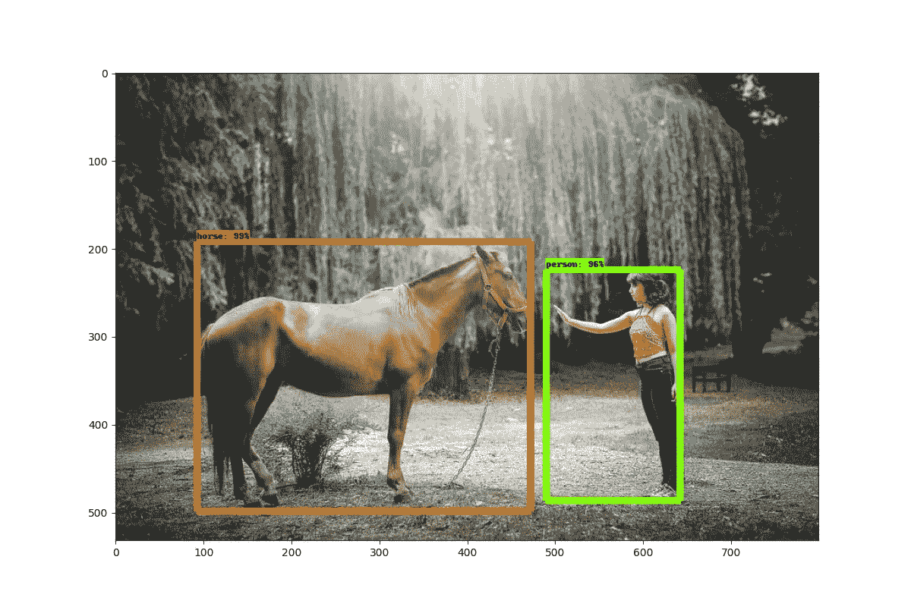
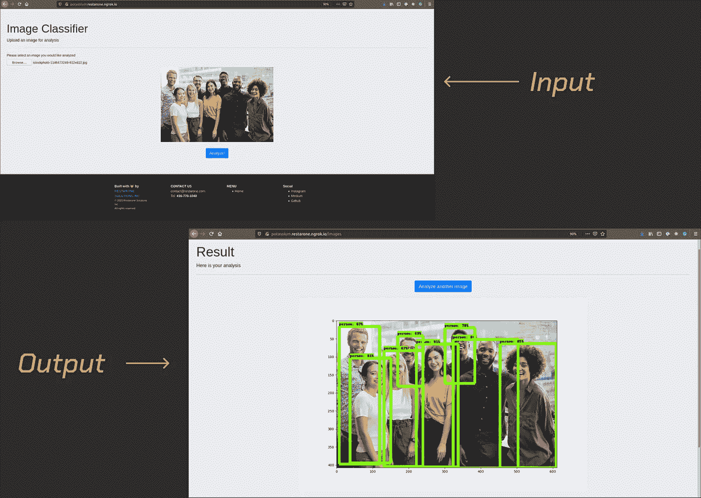

# 构建一个图像分类应用程序

> 原文：<https://betterprogramming.pub/build-an-object-classification-app-392b9db7839c>

## 使用 TensorFlow、Python、matplotlib 构建人工智能模型，并使用 Ruby on Rails 为 web 打包的指南



丹尼尔·卡诺在 [Unsplash](https://unsplash.com/?utm_source=unsplash&utm_medium=referral&utm_content=creditCopyText) 上的原始照片

我最近的任务是为水果分类构建一个 web API。我意识到这样的产品需要有检测一般物体的能力，以剔除非水果的图像。所以我决定开始这个项目，通过在网络上展示一个 [TensorFlow](https://www.tensorflow.org/) 模型来弄脏我的手。

在本文中，我将从实用的、代码优先的方法来介绍这个应用程序的功能和架构。在一个高层次上，该项目将在其人工智能和 web 层之间进行划分，我将向您介绍我是如何将它们粘合在一起的。

如果你想直接跳到代码，查看一下 [GitHub 库](https://github.com/donrestarone/object-detectr)。repo 中包含安装指南，因此你可以在本地试用该应用程序(在 Mac 和 Ubuntu 上测试)。你也可以点击查看[现场演示。](https://potassium.shashike.me/)

话不多说，这是我与 TensorFlow、Python 和 Ruby on Rails 一起开发的一个通用对象分类模型。

这是我上传图像进行分析的现场演示

# 应用程序功能

1.  用户应该能够上传图像，并看到预览。
2.  用户应该与他们上传的图像(但没有登录/认证)相关联，以便我们可以在分析后向他们展示正确的图像。
3.  图像分析应该向用户呈现他们上传的图像上绘制的带标签的边界框。
4.  确保图像输出的分辨率是固定的，无论原始图像大小如何(将所有图像缩放至 800 x 800)。



当用户单击 Analyze(上图)时，应该会向他们显示一个加载器，一旦系统完成处理，应该会显示分析后的图像(下图)

从架构的角度来看，为了实现上述内容，我们将使用 Rails、 [ImageMagick](https://imagemagick.org/index.php) 和一些 JavaScript 来处理文件上传、图像预览和缩放(到 800 x 800)。

为了将用户与他们的上传相关联，我们将使用 [Ahoy](https://github.com/ankane/ahoy) ，它将为每个访问者生成一个唯一的令牌。这个令牌将用于在文件系统中引用上传的图像及其分析输出。

一旦文件被上传、保存并缩放到 800 x 800，我们将使用一些来自 Ruby 的基本 Bash shell 调用将图像传递给 Python 脚本进行处理。一旦对它进行了处理，我们将使用 Ruby 从输出目录(分析后由 Python 脚本放在那里)中获取它，并通过 Rails 堆栈呈现给用户。

既然我们已经有了游戏计划，让我们开始工作吧！

# 铁轨边

我的存储库中的 Rails 应用程序存储在`object-detectr/potash`目录下。根据本教程[、](https://pragmaticstudio.com/tutorials/using-active-storage-in-rails)在 Rails 中设置活动存储，并设置以下实体关系:

```
rails g model Image analyzing:boolean analysis_completed:boolean assertion:stringrails g model ImageAnalysis image:references
```

生成模型后，安装 Ahoy。一旦建立了表，您的数据库模式应该如下所示:

db/schema.rb

跳到`app/models/image.rb`并进入以下内容:

app/models/image.rb

这将告诉活动存储，该模型有一个名为`captured_image`的可附加文件，并且它有一个`image_analysis`关联。我们将使用`captured_image`属性来存储用户给出的图像，使用`image_analysis`关联来存储经过分析的图像，这些图像最终将呈现给用户。

`app/models/image_analysis.rb`看起来和`image.rb`一样。(这是干燥的代码气味，你可以很容易地把它统一成一个模型..)

app/models/image_analysis.rb

准备就绪后，让我们生成一个控制器，它将呈现一个视图并处理文件上传。

```
rails g controller Images new create
```

为了方便起见，我们将更改路由文件，以便在用户访问根路径时向他们显示图像上传页面。

config/routes.rb

加入处理图像上传、缩放和 Python 脚本调用的管道。当你这么做的时候，请随时打电话给代码警察，因为我刚刚打破了单一责任原则。我把这些都放在一个文件里，希望能更容易地解释发生了什么——罪名成立。

app/controllers/images _ controller . Rb(不要和我一样，关注点请分开。)

所以我们来分解一下。`new`动作呈现视图，允许用户附加一个文件进行分析(稍后将详细介绍),而`before_action`钩子确保用户在前进之前必须附加一个文件。

动作发生在`create`方法中，我们通过调用`current_visit.visitor_token`从`Ahoy`获取当前用户会话的惟一令牌。使用该令牌作为标识符，我们创建图像，缩放它，并获取缩放图像的路径。

计算出缩放图像和 Python 脚本的路径后，我们进行系统调用(第 15–16 行),将缩放图像复制到需要输入的目录(在 Python 端),并运行将调用 TensorFlow 模型的 Python 脚本。

在 Python 脚本运行之后，我们计算输出的预期文件名和放置它的目录的路径。如果创建的文件没有错误(第 20 行)，我们创建一个`ImageAnalysis`实例并将分析后的图像附加到它上面。

让我们看看呈现给用户的视图。`new`动作将向用户呈现一个表单和一个提交按钮:

app/views/images/new.html.erb

我们将使用一点 JavaScript 来呈现上传图像的预览，以便用户能够在将图像上传到我们的服务器之前看到他们附加的内容。

应用程序/JavaScript/应用程序脚本/main.js

表单中添加了一个`onChange`监听器，它触发函数`readURL`，将`img`标签的 source 属性设置为选中的图像。有了这些代码，我们就能够在用户将图像附加到表单时立即呈现预览。让我们来看看当他们单击 Analyze 时呈现输出的视图！：

我们检查处理过的图像是否存在(第 8 行)，如果存在，我们渲染它；否则，我们会显示一个错误，要求用户再给我们一次机会。

好了，Rails/Ruby 到此为止。让我们继续到 Python 方面！

# Python 的一面

TensorFlow 模型位于项目的`object-detectr/models/research`目录下。这些模型是从官方 TensorFlow [库](https://github.com/tensorflow/models)中克隆出来的。

确保 Python 版本为 3.7.9 后，运行设置脚本并构建项目:

```
cd object_detectr/models/research
python setup.py build
python setup.py installpython -m pip install TensorFlow==1.15 lxml pillow matplotlib jupyter contextlib2 cython tf_slim
```

构建项目并安装依赖项后，跳到`models/research/object_detection/run.py`:

模型/研究/对象 _ 检测/运行. py

我从这个库[中抓取了这个脚本的原始版本](https://github.com/Bengemon825/TF_Object_Detection2020/blob/master/scripts/updated_old_example.py)，并根据我的用例进行了修改。如果你想深入了解这个脚本，可以看看上面提到的资源库的作者制作的这个[优秀视频。](https://www.youtube.com/watch?v=usR2LQuxhL4)

我对脚本的修改如下:

1.  允许将一个字符串作为命令行参数传递，并在构造`TEST_IMAGE_PATHS`数组时使用它指向输入文件名(第 102 行)。
2.  修改输出(第 147 行),用从命令行传入的字符串作为生成的图像名称的前缀。

这些改变允许 Rails/Ruby 使用由`Ahoy`生成的惟一标识符作为文件名，以编程方式将图像放置在`models/research/object_detection/test_images/`目录中。一旦完成，就可以用`python run.py some_unique_identifier.jpeg`调用脚本。由于`run.py`将包含前面传入的文件名作为生成文件名的前缀，我们可以预期将分析后的文件放在目录`models/research/object_detection/outputs/`中，文件名为`some_unique_identifier.jpeg.png`。

如果这个文件存在于这个有点笨拙的 Ruby-and-Python 歌舞的结尾，它将被呈现给用户。

如果你已经做到这一步，为了你的努力，这里是我对我的家猫提比略的分析:

是的，那绝对是只猫。

感谢阅读，并继续黑客！

[沙西克](https://www.linkedin.com/in/shashike-jayatunge/)是一名来自多伦多的软件工程师，也是 [Restarone Inc](https://www.restarone.com) 的创始人。当他不开发软件时，他就在 Medium 和 YouTube 上创作内容，帮助人们过渡到技术领域。

# 参考

1.  Bengemon825。" benge mon 825/TF _ Object _ detection 2020。" *GitHub* ，2020 年 7 月 10 日，GitHub . com/benge mon 825/TF _ Object _ detection 2020/blob/master/scripts/updated _ old _ example . py。
2.  克拉克，迈克。*务实工作室*，Pragmatic Studio . com/tutorials/using-active-storage-in-rails。
3.  技术，懒。“2020 年如何安装 TensorFlow 物体检测(网络摄像头和图像！)." *YouTube* ，YouTube，【www.youtube.com/watch?v=usR2LQuxhL4\. 