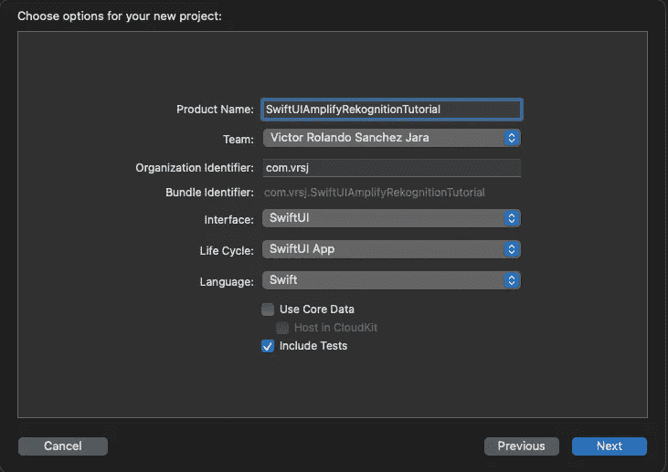
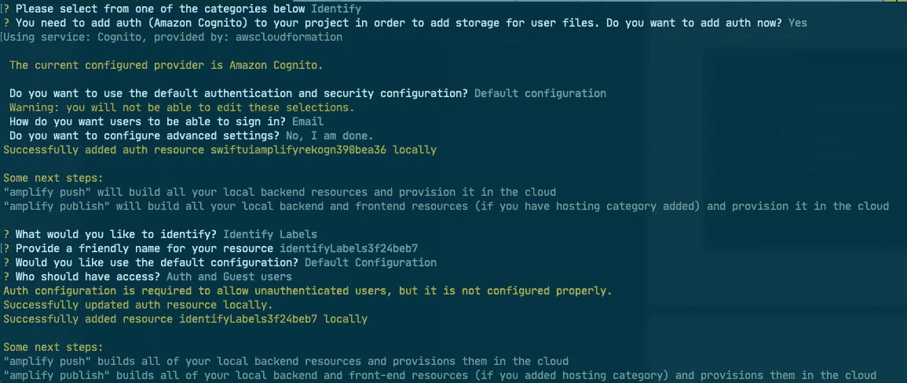
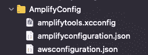
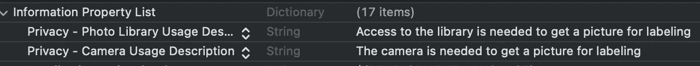
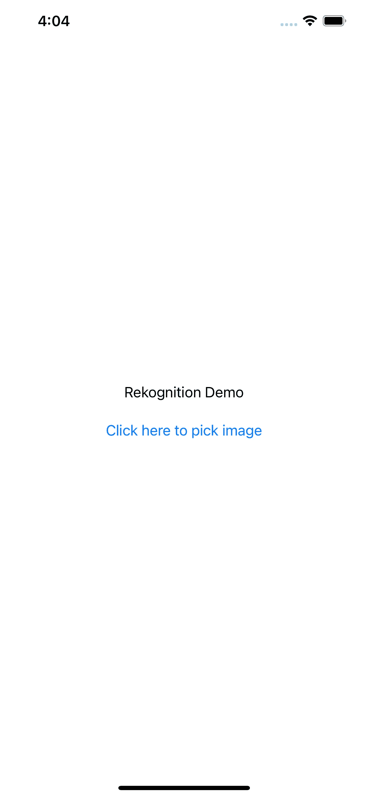
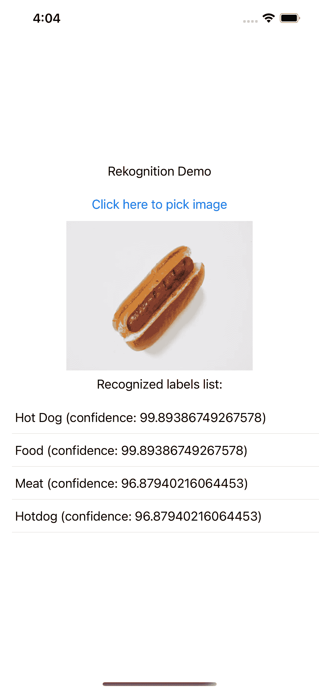

# 使用 Amazon Rekognition、Amplify 和 SwiftUI 构建一个对象检测应用程序

> 原文：<https://betterprogramming.pub/build-an-object-detection-app-using-amazon-rekognition-amplify-and-swiftui-20b51dd0024b>

## 让计算机视觉世界变得简单


由[克里斯萨纳·波尔托](https://unsplash.com/@krissana_renae?utm_source=medium&utm_medium=referral)在 [Unsplash](https://unsplash.com?utm_source=medium&utm_medium=referral) 拍摄。

# 为什么要用亚马逊 Rekognition？

有许多方法可以将机器学习集成到 iOS 应用程序中。苹果甚至提供 Core ML 来训练我们自己的模型，并获得在 iOS 设备上运行的预测。然而，不用担心训练我们自己的模型和许多因素，我们可以轻松访问云服务来获得所需的预测。Amazon Rekognition 是一种云服务，可以轻松识别对象、文本和人，以及其他可能性。

如果你有兴趣部署一个快速使用这些类型预测的应用程序，这个工具正适合你。

# 配置您的项目

如果您以前从未使用过 AWS Amplify CLI，您可以遵循[入门指南](https://docs.amplify.aws/start/q/integration/ios)。如果您没有 AWS 帐户，您需要注册一个，然后安装和配置 CLI。

配置完 CLI 后，让我们在 Xcode 中创建新项目。选择“单视图应用程序”选择 Swift 作为语言，SwiftUI 作为用户界面。您可以将生命周期保留为“SwiftUI App”给它您想要的产品名称和组织名称。



创建我们的项目

# 设置放大器

考虑到您已经在计算机上配置了 AWS CLI 和 Amplify，请在项目文件夹中运行以下命令:

```
$ amplify init
```

这将在 AWS 上创建一个新的 Amplify 项目。在这里，您可以输入项目和环境的名称。选取您的默认编辑器，选取 iOS 应用程序作为类型，然后选取您想要使用的 AWS 描述文件。

在您看到消息“Amplify setup completed successfully”后，您可以运行以下命令来添加`predictions`插件:

```
$ amplify add predictions
```

*   出现提示时，选择“识别”类别，因为我们将对图像进行标记。
*   您需要选择“是”将`auth`添加到项目中。如果您没有使用它，请选取“电子邮件”作为鉴定类型，然后选取“识别标签”
*   你可以选择资源的默认名称，默认配置，最后选择“授权和访客用户”来允许未签名的用户使用`predictions`插件。在本文中，我们允许访客用户关注预测部分，而不是授权。



添加放大预测插件

设置好`predictions`插件后，您可以运行以下命令将更改推送到云:

```
$ amplify push
```

# 设置 pod

一旦所有的更改都被推送到云中，我们需要将 [CocoaPods](https://cocoapods.org/) 添加到我们的项目中:

```
$ pod init
```

现在将以下窗格添加到窗格文件中:

我们项目的 Podfile

要安装 pod，我们需要运行:

```
$ pod install
```

现在我们已经完成了配置，我们可以打开 Xcode 了。

# 检查 Xcode 中的 AWS 配置文件

如果您在终端上运行最新的 Amplify CLI，当打开 Xcode 时，您应该会看到下图中的文件夹:



必需的文件

如果没有看到这个文件夹，需要把这些文件拖到 Xcode: `awsconfiguration.json`和`amplifyconfiguration.json`。

我们可能需要更新放大器配置。若要仅保留对原始文件的引用，请在将文件拖到项目中时取消选中“如果需要，请拷贝项目”。

# 初始化放大器

要使用 Amplify，我们需要在我们的`App Lifecycle`文件中初始化它。在示例项目中，由于我将项目命名为“SwiftUIAmplifyRekognitionTutorial”，因此文件被命名为`SwiftUIAmplifyRekognitionTutorialApp.swift`。您应该将文件内容更改为如下所示:

SwiftUI 应用生命周期文件

由于本教程使用新的 SwiftUI 生命周期，我们仍然需要使用`UIApplicationDelegateAdaptor`来初始化`didFinishLaunchingWithOptions`中的 Amplify。如果您选择使用传统的`AppDelegate`生命周期，您可以编辑您的`AppDelegate.swift`，添加`initializeAWSAmplify`方法，并调用它。

如果你注意到了，我们在`initializeAWSAmplify`中添加了`Auth`插件。即使我们允许用户作为访客使用预测，我们仍然需要添加这个插件来成功初始化 Amplify。

如果您在 Xcode 控制台上看到“Amplify initialized”信息，则一切正常。

# 在 SwiftUI 中创建图像拾取器

现在我们的项目已经完全配置好了，我们可以从创建一个`ImagePicker`开始，它将允许我们使用相机(如果使用物理设备的话)或者从库中选择图像。

在项目中创建一个新文件，并将其命名为`ImagePicker.swift`。然后向其中添加以下代码:

图像拾取器 UIViewControllerRepresentable

使用`UIViewControllerRepresentable`，我们将能够从 SwiftUI 视图中调用`ImagePicker`。

# 在 Info.plist 上设置权限

在我们可以在我们的设备上获取图像之前，我们需要向用户请求访问相机和库的权限。为此，打开您的`Info.plist`，添加描述为“需要访问图书馆以获取用于标记的图片”(或其他适合您的内容)的关键字`NSPhotoLibraryUsageDescription`，以及描述为“需要相机来获取用于标记的图片”的关键字`NSCameraUsageDescription`

您的`Info.plist`文件应该如下所示:



修改的信息列表

# 在内容视图上标记图像

现在，我们终于可以开始选择图像，然后使用 Amplify 获得标签。为此，我们可以在`ContentView`中创建一个非常基本的 UI:

使用 Amplify 获取图像和标签的视图

正如您在代码中看到的，我们创建了一个简单的`VStack`，它包含一个文本和一个按钮，该按钮将显示我们之前创建的`ImagePicker`，使我们能够用相机拍照(如果使用物理设备)或从库中选择图片(如果使用模拟器)。在同一个`VStack`上，我们还添加了可选的`chosenImage`(显示在我们的选择之后)和一个列表(将显示我们使用 Amplify `predictions`插件得到的标签)。您的应用程序应该如下所示:



获取图像的简单用户界面

当`ImagePicker`被解除时，我们调用`loadImage()`方法，它检查我们是否选择了图像，然后压缩图像以便更快上传。然后，我们获取图像的 URL，以便将其传递给`detectLabels()`方法，当对 AWS 的调用返回时，该方法将显示预测的标签。正如你在下图中看到的，当选择一张热狗的图片时，我们确实以 99.89%的置信度得到了正确的标签:



我们使用 Amplify 得到选择的图像和标签

# 结论

如果你想看看整个项目，请查看 [GitHub repo](https://github.com/rolisanchez/swiftui-rekognition-amplify-tutorial) 。

感谢阅读！