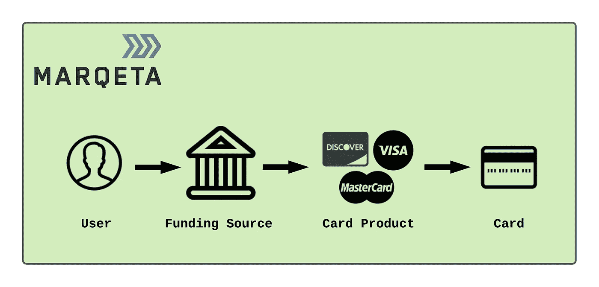
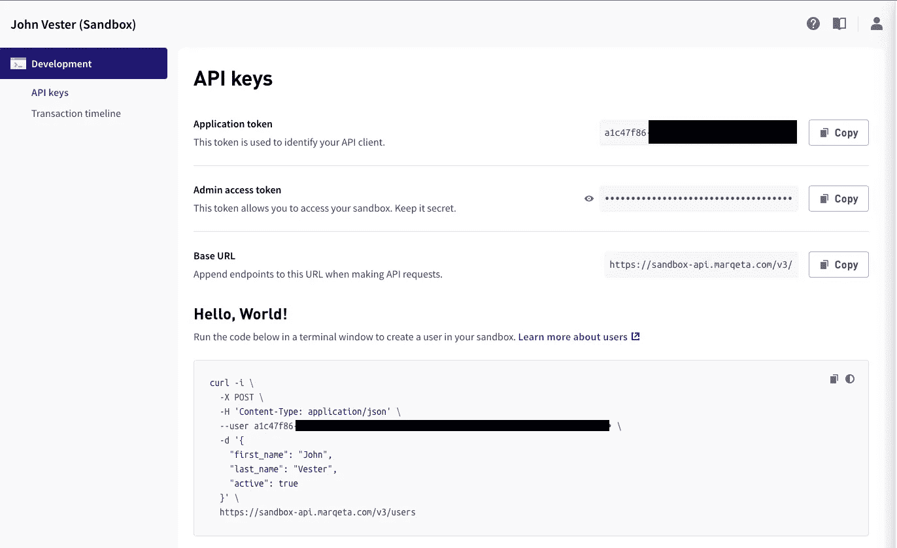
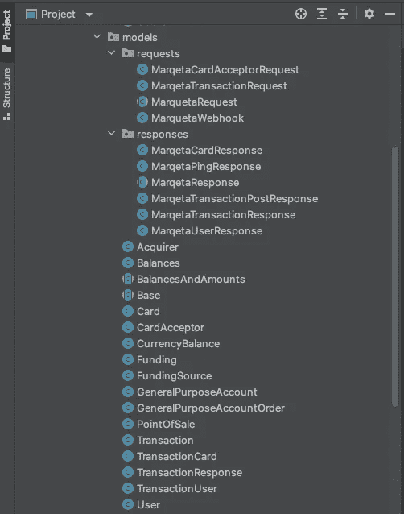
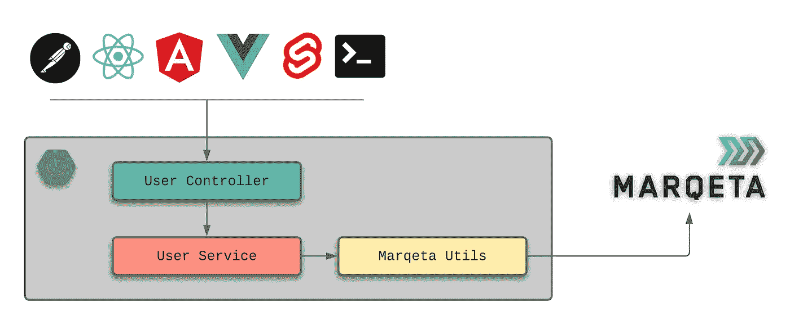
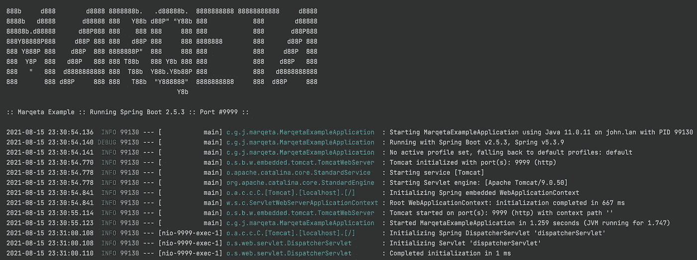

# 使用 Spring Boot 建立一个类似优步的支付服务

> 原文：<https://betterprogramming.pub/build-an-uber-like-payment-service-using-spring-boot-f6cfb45f67d8>

## 在支付了一个优步之后，我决定深入研究用于支付处理的 Marqeta API。看看几个小时后我去了哪里


在过去的两年里，当我从拉斯韦加斯机场前往我嫂子在偏远郊区的美丽庄园时，我体验了优步的服务。每次，优步游乐设施都是为我买的——这是我妹夫的一个友好姿态。因此，当我们穿过多岩石和干旱的内华达植被沙漠时，我能够专注于结识新朋友的机会，那里有相当多的豪华酒店和赌场。

7 月，我返回中西部的航班遇到了一些延误。这架西南航空公司的飞机没有在午夜后不久到家，而是在当地时间凌晨 4 点着陆。我不打算让我的妻子(和蹒跚学步的儿子)开 30 分钟的单程车来接我。相反，我决定第一次使用优步，安排我自己的旅程。

我印象深刻。我不仅遇到了另一个美好的灵魂，还体验了一个只用手机支付交通费用的惊人用例。事实上，我在出发前就设置了我的账户，因为我知道当这个城市的大部分人都熟睡时我需要交通工具。

在休息了几个小时并回到我的家庭办公室后，我决定了解更多关于优步背后的支付处理服务。这让我找到了 [Marqeta](https://www.marqeta.com/?utm_source=medium&utm_medium=blog&utm_campaign=devspotlight_september&utm_id=article1) ，一家我以前从未听说过的公司。查看他们的支付平台和 API，我想知道在利用 Marqeta 平台的同时，如何轻松地在 Spring Boot 创建支付服务。

因为我热爱写作，所以我想我应该记录下我探索的结果。

# 关于玛克塔

首席执行官[杰森·加德纳](https://twitter.com/jmgards)创立了 Marqeta，“通过让任何公司——无论是全新的创业公司还是最老牌的企业——都能够建立在我们现代发卡平台的基础上，而不必担心支付基础设施的复杂性，从而实现创新的民主化。”

这种方法立即引起了我的注意，因为我一直非常专注于利用框架、产品和服务，以便继续专注于提供扩展我的客户(或雇主)知识产权价值的解决方案。

Marqeta 的成功很容易通过关注技术的客户的“名人录”来衡量，这些客户全天候依赖 Marqeta。如前所述，优步品牌利用了 Marqeta。其他客户包括 [DoorDash](https://www.doordash.com/) 、 [Square](https://squareup.com/us/en) 、 [Instacart](https://www.instacart.com/) 、 [Affirm](https://www.affirm.com/) 和 [Brex](https://www.brex.com/) (旗下有 Airbnb、Classpass 和 Flexport)，这些公司在过去五年里都已家喻户晓。

截至 2021 年 3 月 31 日，Marqeta 已处理超过 3.2 亿张卡(支付来源)和 16 亿笔交易。Marqeta 的成功得到了福布斯(金融科技 50 强奖)、《快速公司》(50 大最具创新奖)和美国消费者新闻与商业频道(颠覆者 50 强奖)的认可。

对我来说，Marqeta 似乎是“真正的交易”。

# 没有 Java SDK，没问题

Marqeta 提供了一个非常令人印象深刻的[核心 API Explorer](https://www.marqeta.com/docs/core-api-explorer?utm_source=dzone&utm_medium=blog&utm_campaign=devspotlight_september&utm_id=article1) ，允许开发者了解支付平台。事实上，我以前的经验告诉我，当我开始看到可能性，并因简单地浏览 API 而兴奋时，那么我就处于优质产品的接收端。

虽然目前有针对 Python 和 Ruby 的软件开发工具包(SDK ),但没有针对 Java 的 SDK。然而，在审查了核心 API 之后，我觉得在 Spring Boot 构建一个支付服务，作为一个中间件产品，并对 Marqeta 平台进行 RESTful 调用，将是一个有趣的探索。

一旦完成，这个基于 Java 的中间件支付服务可以被在我的域中运行的定制应用程序利用，这些应用程序需要执行金融交易的能力。

在走这条路之前，也许我应该提供一些关于 Marqeta 平台的高级细节。

# Marqeta 入门

简单来说，Marqeta 设计的核心有四个主要概念:

*   用户—计划执行交易的客户(您)
*   资金来源—资金所在的金融机构(您的银行)
*   卡产品—由您的资金来源(如 Visa、Mastercard、Discover 等)提供的卡服务
*   卡—与您的资金来源(您的信用卡)相关的卡产品实例

我创建了下图来演示这些关系:



作者图片

出于本文的目的，我决定通过基本的 cURL 命令直接调用 Marqeta 核心 API 来设置用户、资金来源、卡产品和卡。

然而，在我开始之前，我需要用 Marqeta 创建一个新帐户，它将授予访问 Marqeta 沙箱的权限。

## 建立对 Marqeta 沙盒的访问

零成本开始使用 Marqeta 就像使用下面的链接创建一个帐户一样简单:

[http://app.marqeta.com/](http://app.marqeta.com/)

创建您的帐户后，导航至[发展仪表板](https://app.marqeta.com/development#!)将提供类似于下图的详细信息:



在本文的剩余部分，将引用上图中的以下项目:

*   应用令牌= `${APPLICATION_TOKEN}`和`APPLICATION_TOKEN_GOES_HERE`
*   管理员访问令牌= `${ADMIN_ACCESS_TOKEN}`和`ADMIN_ACCESS_TOKEN_GOES_HERE`

## 创建新用户

下面的 cURL 命令可以用来创建一个名为 [Randy Kern](https://twitter.com/randykern) 的新用户:

```
curl -i \
  -X POST \
  -H 'Content-Type: application/json' \
  --user APPLICATION_TOKEN_GOES_HERE:ADMIN_ACCESS_TOKEN_GOES_HERE \
  -d '{
    "first_name": "Randy",
    "last_name": "Kern",
    "active": true
  }' \
  [https://sandbox-api.marqeta.com/v3/users](https://sandbox-api.marqeta.com/v3/users)
```

成功的 POST 会产生 2xx HTTP 响应和 Randy Kern 用户的唯一令牌:

```
{
"token" : "1017b62c-6b61-4fcd-b663-5c81feab6524",
"active" : true,
"first_name" : "Randy",
"last_name" : "Kern",
"uses_parent_account" : false,
"corporate_card_holder" : false,
"created_time" : "2021-08-14T13:01:13Z",
"last_modified_time" : "2021-08-14T13:01:14Z",
"metadata" : { },
"account_holder_group_token" : "DEFAULT_AHG",
"status" : "ACTIVE",
"deposit_account" : {
  "token" : "6716c09f-c0dd-430f-ada5-d39f6c5059bb",
  "account_number" : "40018215000000810",
  "routing_number" : "293748000",
  "allow_immediate_credit" : false
  }
}
```

记下令牌值，因为稍后将需要使用它。

## 创造一个及时的资金来源

接下来，需要一个资金来源。对于这个例子，我们将使用一个即时(JIT)资金来源。把 JIT 模型想象成当你使用借记卡而不是预装一定金额的礼品卡时会发生什么。

下面的 cURL 命令在我的 Marqeta 沙箱中建立了一个名为“funding_source_bank”的 JIT 资金来源:

```
curl -X POST "[https://sandbox-api.marqeta.com/v3/fundingsources/program](https://sandbox-api.marqeta.com/v3/fundingsources/program)" \
  --user APPLICATION_TOKEN_GOES_HERE:ADMIN_ACCESS_TOKEN_GOES_HERE \
  -H "accept: application/json"  \
  -H "Content-Type: application/json"  \-d ‘{"name":"funding_source_bank","active":true}’
```

产生的有效负载应该类似于下面的注释:

```
{
  "name": "funding_source_bank",
  "active": true,
  "token": "069e4f6c-a731-48e2-82b7-0df9f44dea62",
  "created_time": "2021-08-15T02:42:06Z",
  "last_modified_time": "2021-08-15T02:42:06Z",
  "account": "12.003.001.000000"
}
```

注意来自这个新创建的资金来源的令牌值，因为这将是我们在下一个 cURL 命令中的`funding_source_token`。

# 创建卡产品

卡产品链接到 JIT 资金来源和属于给定用户的卡。下面的 cURL 命令创建一个新的卡产品，它使用上面创建的“funding_source_bank ”:

```
curl -X POST "[https://sandbox-api.marqeta.com/v3/cardproducts](https://sandbox-api.marqeta.com/v3/cardproducts)"  \
  --user APPLICATION_TOKEN_GOES_HERE:ADMIN_ACCESS_TOKEN_GOES_HERE \
  -H "accept: application/json"  \
  -H "Content-Type: application/json"  \
  -d '{
       "start_date":"2020-05-01",
       "name":"Funding Source Bank Card",
       "config":{
          "fulfillment":{
             "payment_instrument":"VIRTUAL_PAN"
          },
          "poi":{
             "ecommerce":true,
             "atm":true
          },
          "card_life_cycle":{
             "activate_upon_issue":true
          },
          "jit_funding":{
             "program_funding_source":{
                "funding_source_token":"JIT_TOKEN_GOES_HERE",
                "refunds_destination":"PROGRAM_FUNDING_SOURCE",
                "enabled":true
             }
          }
       }
    }'
```

这个请求产生一个卡产品令牌，它将用于为 Randy Kern 创建一张卡。产生的有效负载的一部分显示如下:

```
{
  "token": "99db1d05-9199-446c-9ff1-047df5ccf154",
  "name": "Funding Source Bank Card",
  "active": true,
  ...
```

## 创建新卡片

Marqeta 中的卡是一种支付设备，使用户能够在商家进行交易。简单来说，就把卡想象成借记卡或信用卡。对于我们的例子，我们将从上面建立的“资金来源银行卡”卡产品中创建一张卡。

要为 Randy Kern 创建卡片，请执行以下 cURL 命令:

```
curl -X POST "[https://sandbox-api.marqeta.com/v3/cards](https://sandbox-api.marqeta.com/v3/cards)"  \
  --user APPLICATION_TOKEN_GOES_HERE:ADMIN_ACCESS_TOKEN_GOES_HERE \
  -H "accept: application/json"  \
  -H "Content-Type: application/json"  \
  -d '{
       "user_token":"RANDY_KERN_USER_TOKEN_GOES_HERE",
       "card_product_token":"FUNDING_SOURCE_BANK_CARD_PRODUCT_TOKEN_GOES_HERE
   }'
```

应该会出现如下所示的有效负载:

```
{
  "created_time": "2021-08-15T02:47:52Z",
  "last_modified_time": "2021-08-15T02:47:52Z",
  "token": "9d32f3b7-2fb6-43ec-b4a8-99fc81312301",
  "user_token": "1017b62c-6b61-4fcd-b663-5c81feab6524",
  "card_product_token": "99db1d05-9199-446c-9ff1-047df5ccf154",
  "last_four": "4445",
  "pan": "111111______4445",
  "expiration": "0825",
  "expiration_time": "2025-08-31T23:59:59Z",
  "barcode": "11195778081390829687",
  "pin_is_set": false,
  "state": "ACTIVE",
  "state_reason": "New card activated",
  "fulfillment_status": "ISSUED",
  "instrument_type": "VIRTUAL_PAN",
  "expedite": false,
  "metadata": {}
}
```

至此，我们已经准备好配置 Spring Boot 服务了。

# Spring Boot 入门

在我的 Marqeta 沙箱中创建了一组基本数据后，下一步是使用 Spring Boot 创建一个简单的支付服务。Spring Boot 服务使用以下 URIs:

*   在 Marqeta 平台中配置用户
*   获取与给定用户令牌相关联的卡
*   获取与给定用户令牌相关联的事务
*   使用资金来源过账与用户相关联的卡的新交易

首先，我将以下依赖项添加到我在 IntelliJ IDEA 开发环境中创建的 Spring Boot 项目中:

```
<dependencies>
    <dependency>
        <groupId>org.springframework.boot</groupId>
        <artifactId>spring-boot-starter-jersey</artifactId>
    </dependency>
    <dependency>
        <groupId>org.springframework.boot</groupId>
        <artifactId>spring-boot-starter-web</artifactId>
    </dependency>
    <dependency>
        <groupId>org.apache.commons</groupId>
        <artifactId>commons-collections4</artifactId>
        <version>4.1</version>
    </dependency>
    <dependency>
        <groupId>org.apache.httpcomponents</groupId>
        <artifactId>httpclient</artifactId>
        <version>4.5.13</version>
    </dependency>
    <dependency>
        <groupId>org.springframework.boot</groupId>
        <artifactId>spring-boot-configuration-processor</artifactId>
        <optional>true</optional>
    </dependency>
    <dependency>
        <groupId>org.projectlombok</groupId>
        <artifactId>lombok</artifactId>
        <optional>true</optional>
    </dependency>
</dependencies>
```

接下来，我创建了一系列数据转换对象(dto ),以遵守 Marqeta 平台所使用和期望的数据契约。下面是我介绍的 DTO 课程的截图:



您可以在这里查看 Spring Boot 项目的更详细的源代码，而不是在这里涵盖所有这些项目:

[https://bit.ly/mq-models](https://bit.ly/mq-models)

## 马尔凯塔构型

以下属性被外化到 Spring Boot 的` [application.yml](https://gitlab.com/johnjvester/marqeta-example/-/blob/master/src/main/resources/application.yml) `配置文件中:

```
marqeta:
  application-token: ${APPLICATION_TOKEN}
  admin-access-token: ${ADMIN_ACCESS_TOKEN}
  hostname: sandbox-api.marqeta.com
  secure: true
  base-uri: /v3
```

application-token 和 admin-access-token 的值将在程序之外设置(比如一个环境变量),以避免将机密信息签入存储库。

在一个实际的例子中，hostname 属性也会被具体化，但是我决定让这个例子尽可能简单。

Marqeta 配置属性在 Spring Boot 可用，因为有了[MarqetaConfigurationProperties](https://gitlab.com/johnjvester/marqeta-example/-/blob/master/src/main/java/com/gitlab/johnjvester/marqeta/configs/MarqetaConfigurationProperties.java)类:

```
@Data
@Configuration("marqetaConfigurationProperties")
@ConfigurationProperties("marqeta")
public class MarqetaConfigurationProperties {
    private String applicationToken;
    private String adminAccessToken;
    private String hostname;
    private boolean secure;
    private String baseUri;
}
```

由于这种变化，通过依赖注入，配置值可用于任何组件或服务。下面是用户服务的一个示例:

```
@RequiredArgsConstructor
@Service
public class UserService {
    private final MarqetaConfigurationProperties marqetaConfigurationProperties;
    ...
}
```

## 与 Marqeta 核心 API 通信

为了保持事物“干燥”(不要重复自己)，我创建了一个 [MarqetaUtils](https://gitlab.com/johnjvester/marqeta-example/-/blob/master/src/main/java/com/gitlab/johnjvester/marqeta/utils/MarqetaUtils.java) 实用程序类来存放与 Marqeta 核心 API 进行 GET 和 POST 通信的帮助器方法。为了简单起见，我在下面列出了`marqetaGet()`方法:

因此，Spring Boot 的用户 API 只需提供以下信息就可以向 Marqeta 核心 API 发出 GET 请求:

```
CloseableHttpResponse closeableHttpResponse = MarqetaUtils.marqetaGet(marqetaConfigurationProperties, "/users", null)
```

## 在 Spring Boot 创建一个 GET URI

如上所述，基于 GET 的 URIs 将为用户、卡和交易而存在。下图说明了使用用户 API 的流程:



为了从 Spring Boot 服务中检索用户列表，我们将使用以下 cURL:

```
curl --location -X GET 'localhost:9999/users'
```

这个请求导致调用`UserController`类中的`getUsers()`方法:

`userService.getAllUsers()` 方法与`UserService`类交互，返回一个`User`对象列表:

使用上面提供的信息，下面的 JSON 响应负载被返回给发出请求的客户机:

```
[
    {
        "token": string,
        "createdTime": number,
        "lastModifiedTime": number,
        "metadata": {},
        "active": boolean,
        "firstName": string,
        "lastName": string,
        "usersParentAccount": boolean,
        "corporateCardHolder": boolean,
        "accountHolderGroupToken": string,
        "status": string
    }
]
```

按照同样的方法，我创建了剩余的 GET URIs，以及一个 POST 请求。对 Marqeta 核心 API 的每个请求都使用静态 MarqetaUtils 类，以减少 Spring Boot 服务中重复代码的数量。

要查看为本文创建的所有服务，只需打开以下 URL:

[https://bit.ly/mq-services](https://bit.ly/mq-services)

# 把所有的放在一起

随着 Marqeta 沙盒的创建和 Spring Boot 服务的准备就绪，我启动了 Spring Boot 服务:



为了验证配置设置是否正确，我还在 Spring Boot 创建了一个/ping URI 来与 Marqeta 核心 API 进行交互，而不需要请求任何数据。我对 Spring Boot 服务执行了以下 cURL:

```
curl --location -X GET 'localhost:9999/ping'
```

/ping URI 使用以下有效负载和 200 HTTP 响应进行响应:

```
{
    "success": true,
    "version": "rel-21.7.1",
    "revision": "7b6bf2842d024b0d26f5e29f5cc50617b0d49872",
    "timestamp": "Fri Jul 16 22:37:50 UTC 2021",
    "env": "sandbox",
    "id": "i-0e0a4a9bc40f8d05d:us-east-1a:10.128.19.176"
}
```

200 HTTP 响应和“success”属性的 true 值表示请求成功。

## 获取 Marqeta 中的用户列表

如前所述，以下 cURL 命令将返回用户列表:

```
curl --location -X GET 'localhost:9999/users'
```

我收到了来自 Spring Boot 服务的以下响应有效负载:

```
[
    {
        "token": "1017b62c-6b61-4fcd-b663-5c81feab6524",
        "createdTime": 1628946073000,
        "lastModifiedTime": 1628946074000,
        "metadata": {},
        "active": true,
        "firstName": "Randy",
        "lastName": "Kern",
        "usersParentAccount": false,
        "corporateCardHolder": false,
        "accountHolderGroupToken": "DEFAULT_AHG",
        "status": "ACTIVE"
    }
]
```

## 在 Marqeta 中获取给定用户的卡片列表

以下 cURL 命令将提供与 Randy Kern 用户令牌相关联的卡片列表:

```
curl --location --request GET 'localhost:9999/cards/user/1017b62c-6b61-4fcd-b663-5c81feab6524'
```

响应有效负载为 Randy Kern 用户提供了卡片摘要:

```
[
    {
        "token": "9d32f3b7-2fb6-43ec-b4a8-99fc81312301",
        "createdTime": 1628995672000,
        "lastModifiedTime": 1628995672000,
        "metadata": {},
        "userToken": "1017b62c-6b61-4fcd-b663-5c81feab6524",
        "cardProductToken": "99db1d05-9199-446c-9ff1-047df5ccf154",
        "lastFour": "4445",
        "pan": "111111______4445",
        "expiration": "0825",
        "expirationTime": 1756684799000,
        "barcode": "11195778081390829687",
        "pinSet": false,
        "state": "ACTIVE",
        "stateReason": "New card activated",
        "fulfillmentStatus": "ISSUED",
        "instrumentType": "VIRTUAL_PAN",
        "expedite": false
    }
]
```

## 将交易过帐到 Marqeta

Spring Boot 服务接受一个简单的 POST 请求，使用 MarqetaTransactionRequestt 主体负载在 Marqeta 平台上创建一个新的事务。

下面的示例是一个 MarqetaTransactionRequest 有效负载，用于 Friendly Tavern 的 7.50 美元交易:

```
{
    "amount": "7.50",
    "mid": "11111",
    "card_token": "9d32f3b7-2fb6-43ec-b4a8-99fc81312301",
    "card_acceptor": {
        "name": "The Friendly Tavern",
        "address": "290 S. Main St",
        "city": "Zionsville",
        "state": "IN",
        "zip": "46077",
        "country": "USA"
    },
    "webhook": {
        "endpoint": "[https://mywebook.url.goes.here.com](https://mywebook.url.goes.here.com)",
        "username": "some_username",
        "password": "some_password"
    }
}
```

上面的有效负载可以包含在下面的 cURL 语句中，以利用 Spring Boot 服务中的授权 API:

```
curl --location --request POST 'localhost:9999/authorization' \
  --user APPLICATION_TOKEN_GOES_HERE:ADMIN_ACCESS_TOKEN_GOES_HERE \
  --H 'accept: application/json' \
  --H 'Content-Type: application/json' \
  --d '{
        "amount": "7.50",
        "mid": "11111",
        "card_token": "CARD_TOKEN_GOES_HERE",
        "card_acceptor": {
            "name": "The Friendly Tavern",
            "address": "290 S. Main St",
            "city": "Zionsville",
            "state": "IN",
            "zip": "46077",
            "country": "USA"
        },
        "webhook": {
            "endpoint": "SOME_WEBHOOK_URL_GOES_HERE",
            "username": "USERNAME_GOES_HERE",
            "password": "PASSWORD_GOES_HERE"
        }
    }'
```

提交成功后，将显示该交易的全部详细信息。此外，一旦请求得到处理，webhook 对象就提供了调用指定端点的机会。更多关于使用 Marqeta webhooks 的信息可以在[这里](https://www.marqeta.com/docs/developer-guides/webhooks-overview?utm_source=medium&utm_medium=blog&utm_campaign=devspotlight_september&utm_id=article1)找到。

## 获取 Marqeta 中的交易列表

Randy Kern 用户已经创建了一个事务，我们可以通过下面的 cURL 命令访问“用户事务”URI:

```
curl --location --request GET 'localhost:9999/transactions/user/1017b62c-6b61-4fcd-b663-5c81feab6524'
```

结果是单个事务的以下数据:

```
[
    {
        "token": "ca66618d-43c7-4c74-aa30-5b2fedfc676f",
        "createdTime": 1629083511000,
        "type": "authorization",
        "state": "PENDING",
        "identifier": "19",
        "userToken": "1017b62c-6b61-4fcd-b663-5c81feab6524",
        "actingUserToken": "1017b62c-6b61-4fcd-b663-5c81feab6524",
        "cardToken": "9d32f3b7-2fb6-43ec-b4a8-99fc81312301",
        "gpa": {
            "ledgerBalance": 7.50,
            "availableBalance": 0.00,
            "creditBalance": 0.00,
            "pendingCredits": 0.00,
            "impactedAmount": -7.50,
            "currencyCode": "USD",
            "balances": {
                "USD": {
                    "ledgerBalance": 7.50,
                    "availableBalance": 0.00,
                    "creditBalance": 0.00,
                    "pendingCredits": 0.00,
                    "impactedAmount": -7.50,
                    "currencyCode": "USD"
                }
            }
        },
        "gpaOrder": {
            "token": "be3dc1b6-fa22-4ef9-8157-8fc10c86d632",
            "createdTime": 1629083511000,
            "lastModifiedTime": 1629083511000,
            "amount": 7.50,
            "transactionToken": "23976c31-efc2-4a44-8834-b5390ab131ab",
            "state": "PENDING",
            "response": {
                "code": "0000",
                "memo": "Approved or completed successfully"
            },
            "funding": {
                "amount": 7.50,
                "source": {
                    "token": "**********ea62",
                    "createdTime": 1628995326000,
                    "lastModifiedTime": 1628995326000,
                    "type": "program",
                    "active": true,
                    "name": "funding_source_bank",
                    "defaultAccount": false
                }
            },
            "fundingSourceToken": "**********ea62",
            "userToken": "1017b62c-6b61-4fcd-b663-5c81feab6524",
            "currencyCode": "USD"
        },
        "duration": 127,
        "userTransactionTime": 1629083511000,
        "settlementDate": 1629072000000,
        "requestAmount": 5.00,
        "amount": 5.00,
        "issuerReceivedTime": 1629083511084,
        "issuerPaymentNode": "00b8d031e0a4759766b5b5266f5229d8",
        "networkReferenceId": "765766405219",
        "currencyCode": "USD",
        "approvalCode": "223355",
        "response": {
            "code": "0000",
            "memo": "Approved or completed successfully"
        },
        "network": "DISCOVER",
        "acquirer": {
            "systemTraceAuditNumber": "940779"
        },
        "acquirerFeeAmount": 0,
        "user": {
            "metadata": {}
        },
        "card": {
            "lastFour": "4445",
            "metadata": {}
        },
        "cardAcceptor": {
            "mid": "11111",
            "mcc": "6411",
            "name": "The Friendly Tavern",
            "streetAddress": "290 S. Main St",
            "city": "Zionsville",
            "state": "IN",
            "zip": "46077",
            "countryCode": "USA"
        },
        "pos": {
            "pinPresent": false,
            "partialApprovalCapable": true,
            "purchaseAmountOnly": false,
            "recurring": false,
            "installment": false
        }
    }
]
```

虽然最终的有效载荷肯定不是精益的，但这是一项金融交易——具有预期的保障措施和制衡机制。

# 结论

从 2021 年开始，我一直努力实践以下使命宣言，我觉得这适用于任何 IT 专业人士:

> 将您的时间集中在提供扩展您知识产权价值的特性/功能上。将框架、产品和服务用于其他一切。*—j·维斯特*

Marqeta 当然符合我的使命宣言，消除了使用 Java 和 Spring Boot 实现支付平台的困惑和挑战。

2020 年，DZone 让我用 Java 写一个专注于支付处理的 RefCard。我拒绝了这个提议，因为我觉得利用支付处理服务要容易得多。如果我当时知道 Marqeta，我肯定会在我的答复中提到 Marqeta。

如果您的项目目标可以受益于优步、DoorDash、Square、Instacart、Affirm 和 Brex 信任的全功能支付处理平台，那么我强烈建议将 Marqeta 添加到您的供应商候选名单中进行评估。

我希望能更深入地了解 Marqeta 所能提供的更多方面，继续在我已经创建的 Spring Boot 服务的基础上更进一步。我的目标是在此过程中发表未来的文章。

如果您对本文中使用的全部源代码感兴趣，只需打开 GitLab 上的以下资源库:

【https://gitlab.com/johnjvester/marqeta-example 

祝你今天过得愉快！