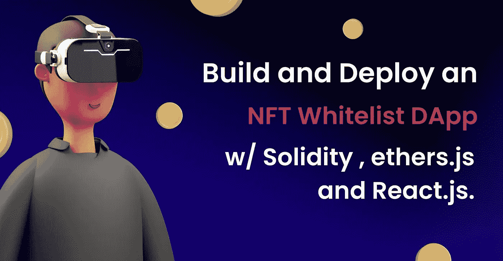
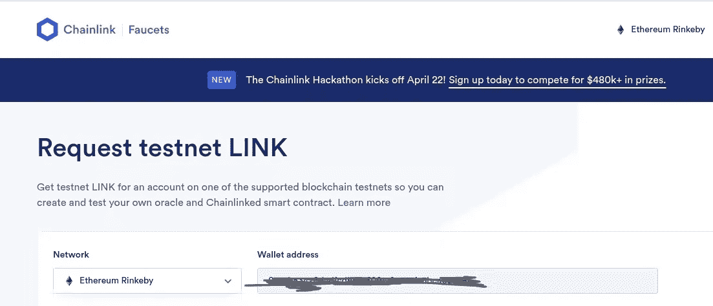
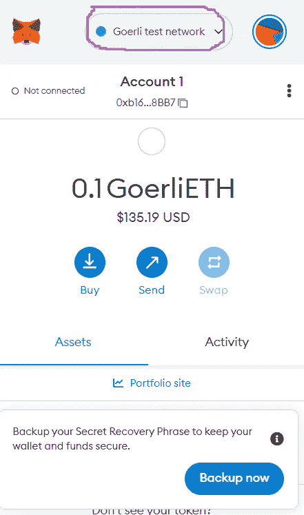
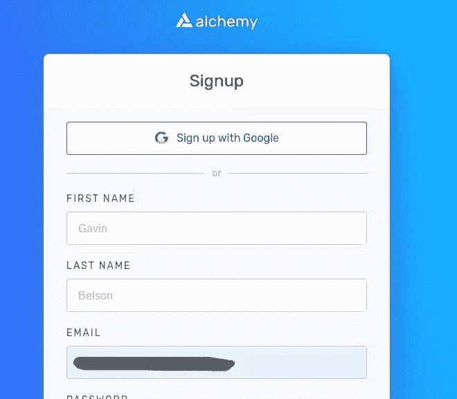
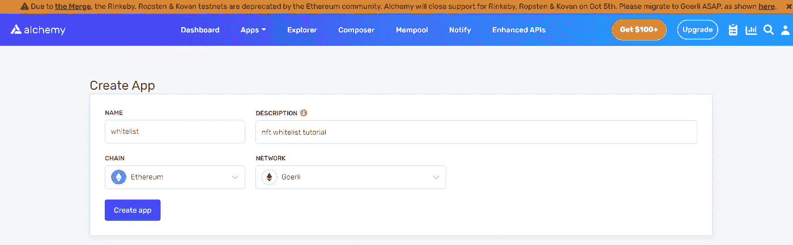
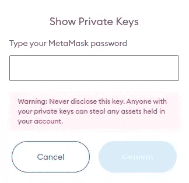
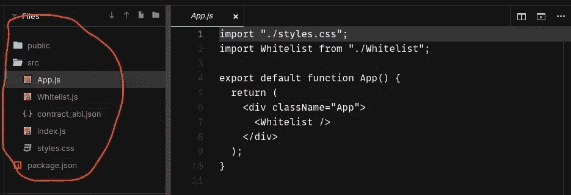
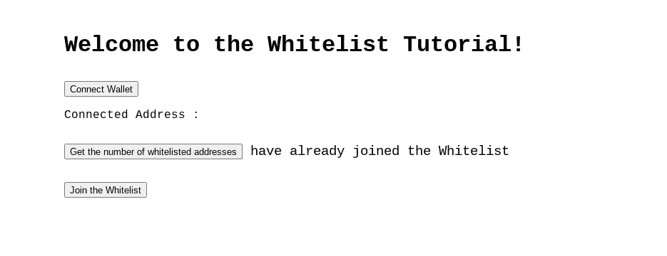
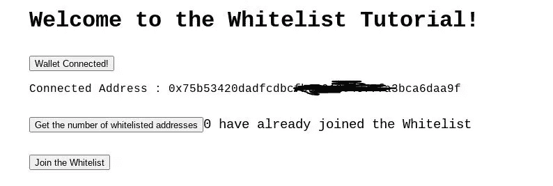

# 使用 React 和 Solidity 构建和部署 NFT 白名单应用程序

> 原文：<https://betterprogramming.pub/build-and-deploy-an-nft-whitelist-app-with-react-and-solidity-tutorial-96264e17dfd6>

## 这是一个 NFT 白名单用例。了解如何使用 React.js 和 ethers.js 与已部署的 Solidity 智能合约进行交互



在 [NFTs](https://www.simplilearn.com/tutorials/blockchain-tutorial/what-is-nft) 的技术组件上工作可能会产生大量必须实现的功能，这些功能被编码到智能合同和项目的铸造/路线图网站中。

考虑启动一个 NFT，并通过有限的白名单授予对特定艺术或激励的独家访问权。您可以使用智能合约创建您的白名单。然后，网站允许用户连接并加入白名单智能合约。

本质上，用户可以通过前端与智能合约进行通信的 DApp。

这个项目演示了一个基本的白名单用例。

# 介绍

在本帖中，我们将创建一个完全成熟的 DApp，它将部署在以太坊上。

Solidity 是我们智能合同的技术栈，Alchemy 是我们的 RPC，Hardhat 是我们的本地开发环境。

为了处理我们所有的区块链交互功能，我们将在前端使用 React.js 和 ethers.js。

# 先决条件

所需要的只是 Solidity 编程语言的基础知识和对 React.js 的中级掌握。

# 让我们建造一些东西

计划是首先构建和部署智能契约，然后是前端。

在接下来的几行中，我们将设置我们的 [Hardhat](https://hardhat.org/getting-started/) 环境，然后编写一些 Solidity 代码。

最后，我们将为我们的钱包注入测试令牌，并在 testnet 上发布我们的合同！

我们将继续接收我们的合同地址和合同 abi。它将作为与区块链合同的沟通渠道。

让我们把手弄得有点脏。

# 设置我们的环境

我们将使用 Hardhat 环境在本地构建和部署我们的智能合约。

*   在根目录或任何你想要的地方为你的智能合同创建一个文件夹。
*   要配置环境，进入根文件夹并运行以下命令。

```
// in this order, run these commandsnpm init --yes
npm install --save-dev hardhat
npx hardhat
```

运行`npx hardhat`后，您将会看到一些需要设置的配置:

*   选择创建一个基本示例项目
*   对于已经指定的 Hardhat 项目根，按 enter 键
*   如果您想添加一个`.gitignore`，请按回车键

通过安装这些软件包来完成 hardhat 安装。

复制并粘贴到您的终端:

```
npm install --save-dev [@nomiclabs/hardhat-waffle](http://twitter.com/nomiclabs/hardhat-waffle) ethereum-waffle chai [@nomiclabs/hardhat-ethers](http://twitter.com/nomiclabs/hardhat-ethers) ethers
```

就是这样！我们可以开始写一些代码。

# 白名单智能合同

在安装了 Hardhat 和其他所需的依赖项之后，我们可以看到`contracts`、`scripts`和`test`文件夹包含了`Greeting.sol`示例智能合约，以及它的部署和测试脚本。

确保所有这些文件夹都是空的，因为我们将从头开始创建新的智能合同！

在`contracts`文件夹中创建一个新文件，命名为`Whitelist.sol`

*   该合同将包括一个`uint public maxWhitelistedAddresses`,代表我们白名单上的最大账户数。如果达到这个数量，没有人可以加入白名单。在部署时，我们将使用构造函数为这个实体设置值。
*   该合同将包括一个`uint public numAddressesWhitelisted`,代表我们白名单上现有的账户数量。部署后，该值将为零，并且会一直增加，直到达到最大值。
*   合同将包括一个`mapping(address => bool) public whitelistedAddresses`。这个逻辑为`true`设置了一个特定的地址，并立即加入白名单。它还将用于确保没有帐户可以加入白名单两次！
*   此外，我们将有一个`constructor`函数，用于设置可以加入白名单的最大帐户的值，即`maxWhitelistedAddress`。该值将在部署时设置。

现在我们已经有了所有的类型、一个映射和一个构造函数，我们需要通过添加最重要的函数`addAddressToWhitelist()`来完成这个契约。

当用户想要加入白名单时，将调用该函数:

# 把我们的整个合同放在一起

# 配置部署脚本

在`scripts`文件夹中，创建一个`deploy.js`文件。在这个文件中，我们将拥有所有的部署逻辑和设置值构造函数。

# 资助我们的钱包，获得我们的 RPC

## 资助我们的钱包

为了推出我们的智能合约，我们将为我们的 [Metamask 钱包](https://metamask.io/)提供一些 testnet(假)硬币用于开发。

*   访问[此链接](https://faucets.chain.link/rinkeby)用一些假的 ETH 来充实你的钱包



*   在发出请求之前，启动 Metamask 并切换到 Goerli 测试网络(由于以太坊的协议变化:Rinkeby、Ropsten 和 Kovan 测试网络可能无法可靠地工作，并将很快被弃用。[了解更多](https://blog.ethereum.org/2022/06/21/testnet-deprecation/)。



## 获取我们的 RPC

Alchemy 是一个区块链 API 服务，它将允许我们轻松地部署我们的智能合约！



[注册](https://auth.alchemyapi.io/)，然后让我们过去创建我们的应用程序并获取我们的 API 密钥。

*   注册成功后，从仪表板创建应用程序。


*   填写一些相关数据以完成应用设置。选择以太坊和格利测试网络。



*   查看应用程序的详细信息并复制 HTTP 端点。我们将很快使用这个端点来部署合同。


# 让我们完成部署

*   在智能合同文件夹的根目录下创建一个`.env`文件。这个文件将包含您的 Alchemy HTTP 端点以及您的 Goerli 私钥。

切换到 Metamask 中的 Rinkeby 测试网络，复制私钥。



*   在你的。环境文件:

```
ALCHEMY_API_KEY_URL="add-your-alchemy-endpoint-url-here"GOERLI_PRIVATE_KEY="add-your-goerli-private-key-here"
```

*   为了能够将密钥导入到最终的配置文件中，我们需要一个名为 dotenv 的 npm 包。

```
npm install dotenv
```

# 部署前的最终配置

*   导航到`hardhat.config.js`文件。该文件将用于为部署过程配置我们的网络和 API 密钥。

为了方便起见，将下面几行代码复制并粘贴到文件中。

## 编制合同

```
npx hardhat compile
```

## 部署合同

```
npx hardhat run scripts/deploy.js --network goerli
```

*   瞧啊。我们的合同成功部署在以太坊 RInkeby 测试网络上！
*   记下控制台中输入的合同地址。它将需要在前端，以便与智能合同通信。
*   成功部署后会创建一个新的`artifacts`文件夹。该文件夹包含一个. json 文件，其中包含我们合同的 ABI。复制并保存它，因为我们需要它和合同地址。

# 白名单前端开发

既然我们已经完成了困难的部分，让我们建立我们的战线。对于一般人来说，直接与智能合同进行交流是很困难的。

作为开发人员，我们有责任创建一个交互式界面，用户可以通过该界面向智能合约发送请求。

在本教程的第二部分也是最后一部分，我们将创建一个 React app，将其连接到 Metamask，并使用`ethers.js`调用函数。

本质上，我们的应用程序将利用基本的 React 原则，如管理和更新状态以及通过函数调用事务。没什么太复杂的。我掩护你。

## 安装 React.js 和 ethers.js

*   访问[官方文档](https://reactjs.org/docs/create-a-new-react-app.html)在您的电脑上安装和设置`React.js`。
*   成功安装 React 后，通过运行以下代码将`ethers.js`安装为依赖项:

```
npm install ethers
```

*   为了简单和方便，我将在`src`文件的根目录下进行所有的推理。您可以按照您认为合适的方式安排文件夹结构。



## 构建前端

在`Whitelist.js`文件中:

现在你有了未过滤的应用程序，让我们实现所有的区块链函数并更新状态。

# 什么是提供者和签署者？

*   提供者是以太坊网络连接的抽象，它为常规以太坊节点功能提供清晰、一致的接口。
*   ethers 中的签名者是以太坊帐户的抽象，可用于对消息和交易进行签名，并向以太坊网络提交签名的交易以执行状态更改。

## 获取白名单中的帐户数量并加入白名单

# 将前端组装在一起

## 连接到元掩码之前



## 连接到元掩码后



# 在你离开之前

随着对 React 的进一步理解，您会注意到有几个最佳实践，比如定制钩子、ContextAPI 和`useReducer`钩子，它们可以用来使我们的代码更加干净和高效。

您可以自己实现哪些功能？

我为这一课创建了一个库[，为智能合约和前端创建了一个单独的文件夹。你可以调查一下。](https://github.com/kumancev/nft-whitelist)