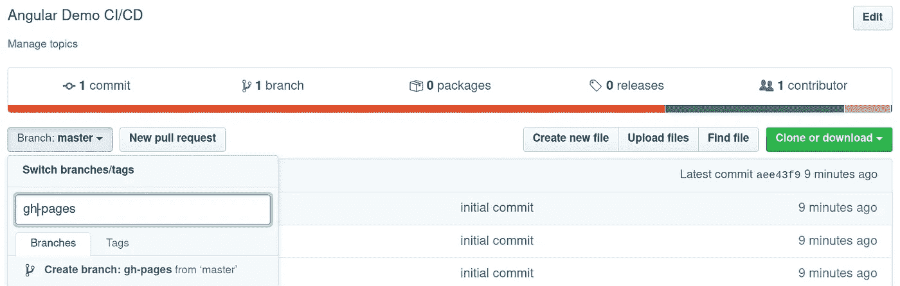
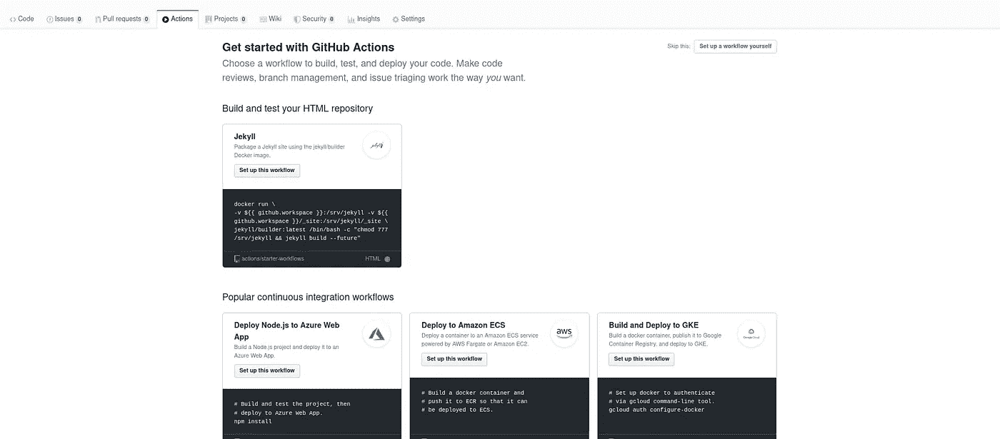
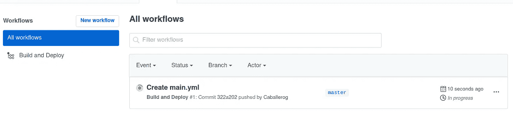
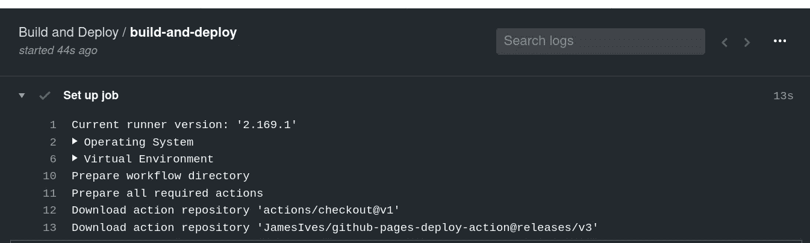
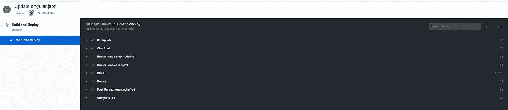
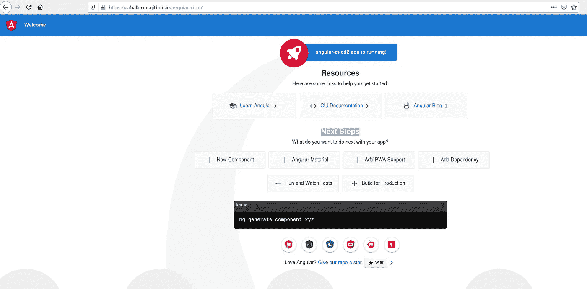

# 使用 GitHub 操作在 GitHub 页面中构建和部署 Angular 应用程序

> 原文：<https://betterprogramming.pub/build-and-deploy-angular-apps-in-github-pages-using-github-actions-d6da0efe293d>

## 使用 GitHub 页面和 GitHub 操作设置您的持续部署


[马太·亨利](https://unsplash.com/@matthewhenry?utm_source=medium&utm_medium=referral)在 [Unsplash](https://unsplash.com?utm_source=medium&utm_medium=referral) 上拍照。

# 介绍

很多时候，我们的前端应用程序需要快速有效的集成或部署系统。其他时候，相当多的时间被投入到手动部署我们的应用程序的任务中。

如今，随着致力于软件项目的提交和开发人员的增加，自动执行这种部署是绝对必要的。

本文将介绍如何使用 GitHub 动作和 GitHub 页面为 Angular 应用程序构建和部署系统。阅读本文的先决条件是在 GitHub 存储库中拥有我们的应用程序。

# 1.配置 gh 页面

我们需要做的第一件事是配置一个分支，静态文件(HTML、CSS、JS、images 等)将被提供给这个分支。).默认情况下，GitHub 有一个名为`gh-pages`的分支链接到它的静态服务器，该服务器为我们提供一个格式如下的域:`https://<username>.github.io/<repository>`。因此，我们做的第一件事是创建如下图所示的`gh-page`分支:



我们需要删除我们项目的文件，因为在构建过程之后，我们应用程序的文件必须在这个存储库中。下面是删除`gh-pages`分支中文件的步骤:

```
> git fetch origin gh-pages
> git checkout gh-pages
Branch 'gh-pages' set up to track remote branch 'gh-pages' from 'origin'.Switched to a new branch 'gh-pages'
```

完成后，我们定位到适当的分支，我们只需删除所有文件:

```
> git rm -rf .
> git add .
> git commit -m "remove files"
> git push
```

完成这些步骤后，您的存储库应该是空的，然后我们就可以开始下一步了。

# 2.为部署设置 npm 脚本

第二步是配置一个 npm 脚本，允许我们执行*构建*操作，而不是从终端运行这个任务。也就是说，Angular 应用确实有一个与*构建*操作相关的 npm 脚本。在我们的例子中，我们需要一个更具体的脚本，其中指定了*构建*任务将在生产模式(`— prod`)中完成，并且我们项目的基地址将不是根，而是存储库的名称:`--base href=/<repository>/`。

因此，我们返回到`master`分支，通过添加下面的npm 脚本来配置`package.json`文件:

```
git checkout master
```

我们编辑`package.json`文件:

```
“deploy”: “ng build --prod --base-href=/angular-ci-cd/”
```

# 3.GitHub 操作

这是本文最有趣的一步，因为我们将使用 GitHub 自己的工具GitHub 动作。为此，请转到 GitHub 中的“操作”标签。然后，您将看到几个模板:



GitHub 操作

这些文件是`.yml`格式的配置。这些文件将自动创建在`.github/workflows`目录中。在我们的具体例子中，我们将创建一个名为`build-deploy.yml`的文件，它将包含以下内容:

让我们开始了解这个文件和正在做的事情。如果你以前处理过`.YML` / `.YAML`文件，你会知道你必须对空格或表格空间非常严格，因为如果文件没有完全对齐或者你把空格和表格空间组合在一起，你会发现问题。

*   `name`:动作的名称，以便与我们配置的其他动作区分开来。
*   `on`:什么时候触发动作？在我们的例子中，我们只希望在`master` 分支上的推送操作完成时完成*构建*和*部署*流程。为此，我们在`build-deploy.yml`文件中创建了不同级别的缩进。虽然这不是本文的目标，但是这个触发参数允许我们构建一个 CI 系统(持续集成),在这个系统中，我们的应用程序的测试可以针对任何拉请求执行。
*   本节定义了我们行动中将要执行的任务。可以在一个操作中定义不同的任务。在我们的具体例子中，我们只需要配置一个我们称之为`build-and-deploy`的任务。在这一部分，您必须定义任务中的每个步骤。因此，我们在下面更详细地定义它。

## 乔布斯

定义任务的第一个要素是分配一个惟一的标识符或名称。在这个具体的例子中，是`build-and-deploy` *。任务可以在不同的环境中执行。使用`runs-on` 部分对此进行描述。在我们的例子中，只有一个环境被定义为 execution，因为任务是构建和部署我们的应用程序。如果您想要配置测试环境，这个标签非常有趣，因为它允许您配置不同的环境，在这些环境中您将对应用程序运行一系列测试。*

# 步伐

我们的`.YML`文件中的下一项是执行正在配置的动作的步骤序列。我们正在配置的任务由三个步骤组成。

## 检验

GitHub Actions 最强大的特性之一是它允许你使用第三方创建的动作。如果您总是执行相同的步骤，我们可以参数化并重用它们(这是另一篇文章的主题)。如果要使用第三方动作，就必须使用关键字`uses`，如代码所示。

```
- name: Checkout
  uses: actions/checkout@v1
```

在这个任务中，我们使用了`[actions/checkout@v1](https://github.com/actions/checkout)`。

我们在这个任务中做什么？嗯，很简单:这个动作在 GitHub 工作区的存储库中执行操作`check-out`。我的意思是，我们在 GitHub 操作的工作空间中执行命令`git checkout`。因此，我们可以完全访问流程中的以下步骤。

## 建设

下一步是构建我们的 Angular 应用程序——与我们手动构建的方式完全相同。因此，我们应该使用`npm install`安装依赖项，并在运行我们为构建我们的应用程序而配置的 npm 脚本之后:`npm run-script build`。因此，称为`Build`的步骤将由这两个步骤组成，我们可以使用 GitHub Actions 的`run`标签来描述这两个步骤。

```
- name: Build 
  run: | 
       npm install 
       npm run-script build
```

## 部署

最后一步是执行应用程序的部署。我们的应用程序的部署非常简单，因为一旦我们完成了 Angular 应用程序的构建阶段，我们只有静态文件(HTML、CSS 和 JS)。因此，我们所要做的就是复制以使我们的应用程序适应 GitHub 页面。这个任务总是相同的模式，也许会改变一些设置。因此，我们将使用一个[第三方动作](https://github.com/JamesIves/github-pages-deploy-action)来大大简化任务。

在这个操作中，我们必须配置一个安全令牌来访问存储库，这一点很重要。使用 GitHub API 显示我们的应用程序有不同的方式:

1.  `SSH`:使用部署键(`Deploy Key`)。
2.  `ACCESS_TOKEN`:为个人 GitHub 账户生成密钥。这必须通过从 GitHub 的配置面板创建一个密码来完成。
3.  `GITHUB_TOKEN` : GitHub 自动创建一个名为`GITHUB_TOKEN`的秘密用于工作流。

我们将使用`GITHUB_TOKEN`进行部署，因为它将从 GitHub 本身到 GitHub 页面完成。因此，我们将安全的责任委托给 GitHub 本身。

要在 GitHub 页面中成功部署，必须配置以下参数:要部署代码的分支(`BRANCH`)和代码所在的目录(`FOLDER`)。

部署动作(`Deploy`)如下所示:

```
- name: Deploy 
  uses: JamesIves/github-pages-deploy-action@releases/v3
  with:  
     GITHUB_TOKEN: ${{ secrets.GITHUB_TOKEN }}
     BRANCH: gh-pages  
     FOLDER: dist/angular-ci-cd
```

## 奖金

使用前面的步骤足以部署我们的应用程序。但是，我们可能希望配置两个额外的步骤，以便改进我们的工作流。一个有趣的配置是需要一个特定版本的`node` 和/或拥有一个之前已经安装的`node`包的缓存，这样你就不必在每次构建时都安装它们。

因此，我们需要配置的两个步骤如下:

1.  `setup-node`
2.  `cache`

```
- uses: actions/setup-node@v1 
  with:  
   node-version: '10.x'  
- uses: actions/cache@v1 
  with:     
   path: ~/.npm   
   key: ${{ runner.os }}-node-${{ hashFiles('**/package-lock.json') }}                    
   restore-keys: |    
       ${{ runner.os }}-node-
```

在上面的例子中，选择了`node 10`版本，缓存文件遵循了[动作](https://github.com/actions/cache) 的指令，其中描述了根据开发语言应该缓存哪些文件。

# 4.确认

最后，我们必须检查构建和部署是否正在执行。为此，我们转到显示工作流的 GitHub Actions 选项卡。



如果我们导航到不同的面板，我们可以看到每个任务的日志:



在这里，你应该看到所有的步骤都做得令人满意。



最后，我们在 URL 中找到我们的应用程序:`https://<user>.github.io/<repository>`。在我们的例子中，我们将应用程序部署在这条路线上:[https://caballerog.github.io/angular-ci-cd/](https://caballerog.github.io/angular-ci-cd/)。



# 结论

在本文中，我们介绍了一种使用 GitHub 动作和 GitHub 页面为 Angular 应用程序配置构建和部署系统的快速简单的方法。本文学到的概念可以移植到任何其他 CI 系统。

在使用 GitHub 动作和 GitHub 页面之前，我已经用 DroneCI 部署了几个月的私有静态服务器。从那次经历中学到的概念已经毫无问题地转移到这个持续集成的系统中。因此，本文中学到的概念可以很容易地转移到其他工具上。

到目前为止，没有理由不在 Angular 中以一种简单快捷的方式部署您的应用程序。此外，它与私有存储库配合得非常好。