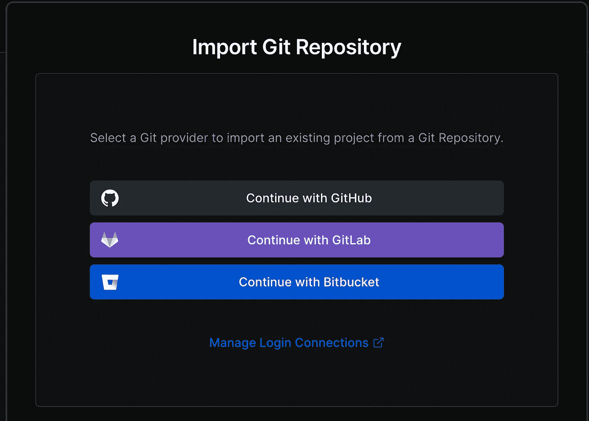

# 使用 Vercel 和 Prisma 构建和部署 TypeScript 函数

> 原文：<https://betterprogramming.pub/build-and-deploy-typescript-functions-using-vercel-and-prisma-997b3e2415dd>

## 创建一个由无服务器功能和数据库支持的行星追踪应用程序，点击一下就可以部署到网络上


照片由[阿尼鲁德](https://unsplash.com/@lanirudhreddy?utm_source=unsplash&utm_medium=referral&utm_content=creditCopyText)在 [Unsplash](https://unsplash.com/s/photos/planet?utm_source=unsplash&utm_medium=referral&utm_content=creditCopyText) 上拍摄

Vercel 是一个允许您轻松配置和部署应用程序的平台，它有一个很棒的免费层。作为其产品的一部分，您可以创建 Vercel 函数，这些函数运行在服务器上，充当应用程序的后端。这使得构建可伸缩和持久的 web 应用程序变得简单。

本教程将研究如何使用 TypeScript(Javascript 的一个强类型子集)、Prisma(一个强大的 ORM)和 SQLite 来实现这一点。最后，您将知道如何创建和部署自己的应用程序，并能够存储和检索数据。我们将创建一个应用程序，让你添加新的行星到数据库中，然后查看它们。

*你可以在* *这里找到本文的所有代码* [*。*](https://github.com/asleepyghost/vercel-prisma-golang-article)

# 前端设置

虽然前端在这里并不重要，因为本教程更多的是关于作为后端的函数。我们仍然会设置一些基本的东西。有一个记录数据的地方是很好的，它将更好地模拟真实世界的应用程序。

你可以使用任何你想要的框架，但是我将使用 React 和 Create-React-App。

运行`npx create-react-app my-app`。

**注意**:如果出现这样的错误:

```
You are running `create-react-app` <version>, which is behind the latest release (<version>).We no longer support global installation of Create React App.Please remove any global installs with one of the following commands:- npm uninstall -g create-react-app- yarn global remove create-react-app
```

请按照说明卸载全局 create-react-app 包并运行`npx clear-npx-cache`，然后再次运行该命令。它可能在不清除 npx 缓存的情况下工作，但对我来说没有。

# Vercel 设置

去[https://vercel.com](https://vercel.com)创建一个账户。

然后您会想要导入一个 GitHub 存储库，所以让我们来创建它。转到[https://github.com](https://github.com)并创建您的新存储库。完成后，从快速设置部分获取 repo URL，并在您的终端中刚刚创建的应用程序的根目录下输入以下命令。

```
git remote add origin <repository-url>
```

然后只需添加、提交和推送现有内容。

```
git add -A
git commit -m 'Initial commit'
git push --set-upstream origin main
```

如果你刷新 GitHub 窗口，你会看到你所有的文件。

好的，回到韦尔塞尔，在这个观点上:



点按“继续 GitHub”并导入您的新项目，然后按照向导进行设置。如果您使用一个众所周知的框架，Vercel 可能已经为您预填充了所有正确的命令。否则，您必须为您选择的方法手动输入这些信息。

部署完成后，您应该能够通过 Vercel 仪表板访问托管站点。

# 一个基本的 Vercel 函数

我们将快速创建一个简单的函数来测试我们的 Vercel 设置。

首先，运行`npm i @vercel/node`。对于我们接下来要使用的一些类型，我们需要这个包。

Vercel 函数位于项目根目录下的一个`api/`文件夹中。现在创建这个。

然后将一个`index.ts`文件添加到您的文件夹中，并粘贴以下代码:

您的函数的 URL 将与其在 API 文件夹中的位置相匹配。因此，我们刚刚创建的这个函数将可以在服务器上的同名路径中访问:`/api`。如果我们把一个函数放在`/api/users`文件夹中，那么它可以在路径`/api/users`中被访问。如果我们使用一个段，比如`/api/users/get/[id].ts`，那么我们将能够点击`/api/users/get/<some-id>`，然后检索我们通过请求对象传递的 id。如果这还不完全合理，也不要担心。教程结束的时候就知道了。

# 运行我们的功能

现在，您可以在您的终端中运行`vercel dev`。它将引导您完成一个向导，您可以在其中设置您的项目并将其链接到您创建的 Vercel 项目(当选项出现时，您必须复制并粘贴这个项目的名称)。这个命令将启动一个本地服务器，运行你的前端和后端功能。

一旦完成，访问`localhost:3000`，我们可以写一些代码来测试这个功能。

# 测试功能

为了检查这个函数是否正常工作，我们只需使用一些 HTTP 库来调用正确的 URL。我就用`axios`。

您可以通过运行`npm i axios`将它安装到您的项目中。

完成后，打开`App.js`文件，该文件可以在项目的`src`文件夹中找到。删除所有内容并粘贴到:

这是为了使代码干净并且易于使用。保存此文件。你在`http://localhost:3000`的应用也应该更新。

现在，如果您加载该窗口，然后检查运行`npx vercel dev`的终端窗口，您应该会看到文本`Hello World`。

关于上面的代码是做什么的，我不会讲太多细节，因为这是非常基本的，不是本教程要讲的。但是通过调用服务器上的`api/`路由，我们已经在我们的`src/`文件夹中的相同路径下调用了索引文件中的处理程序。稍后，您将看到当我们调用不同的路径时会发生什么。

至此，您已经创建了一个 react 项目，创建了一个 TypeScript 函数，部署了两者，并通过 Axios 请求将它们连接起来。从这里开始，您就有了开始构建整个应用程序的基础工具。

但是，如果您愿意留下来，我们接下来将使用 Prisma 建立一个内存数据库，生成一个模式，并创建两条允许我们存储和检索一些数据的路径。一旦完成，您将拥有一个端到端的应用程序，并具有持久性。

# 普里斯马

要将 Prisma 添加到您的项目中，导航到根目录并运行`npx prisma init`。

您会注意到已经创建了一个包含模式文件的`prisma/`文件夹。这将包含您的 Prisma 配置和您的模型。

现在打开这个文件，你会看到两件事。首先是一个`generator`街区。你可以忽略这个；它只是告诉 Prisma 你正在使用 js 客户端。

另一个是`datasource`块。Prisma 可以使用许多数据库，如 Postgres 和 Mongo。它的一个主要好处是，不管底层数据库技术如何，它都允许您编写相同的代码。`datasource`块是您定义想要使用的数据库的地方。

现在，它被设置为 Postgres 数据库，但是我们将把它改为`sqlite`。连接 Postgres 数据库超出了本文的范围，但是要知道，对于 Postgres、Mongo 或其他任何东西，您将要做的一切都是一样的，如果您将来想添加其中一个的话。

更新`datasource`块，如下所示:

```
datasource db {
  provider = "sqlite"
  url      = "file:./dev.db"
}
```

这里的`url`属性指向一个文件`dev.db`，Prisma 将在这里记录我们所有的数据库写操作。现在在`prisma`文件夹中创建它。

# 创建模型

模型定义了我们希望在应用程序中使用的数据类型，并直接对应于数据库中的表。

将以下内容粘贴到您的`schema.prisma`文件中:

```
model Planet {
  id   String [@unique](http://twitter.com/unique) [@default](http://twitter.com/default)(cuid())
  name String
  size Int
}
```

Prisma 最好的一点就是容易理解，上面的代码也不例外。它说我们想要在数据库中创建一个包含三列的`Planet`表:`id`、`name`和`size`。`id`字段被标记为`@unique`，将其设置为该记录的主键(这是我们识别该特定记录的方式)。

所有模型必须至少有一个唯一字段。否则，不可能在数据库中找到它们。现在，运行`npx prisma db push`将您的模式推送到数据库。

完成后，运行`npx prisma generate`。这将创建一个 Prisma 客户端，您可以使用它来执行数据库操作。它还将为您的所有数据库模型生成 TypeScript 类型，这意味着您永远不必手动维护一组独立于您的数据库的类型。这是避免由不同步类型引起的错误的好方法。

# 新的行星功能

现在，导航回您的`api/`文件夹，并在路径`api/planet/new.ts`下创建一个`new.ts`文件。这将是我们负责向数据库添加新行星的 API 路径。

输入以下代码:

如前所述，Prisma 是一种非常简单的技术，所以像数据库写入这样的事情很容易。这里，我们在第 4 行实例化了 Prisma 客户端，然后在第 7 行，我们调用了`planet`表上的`create`方法。之后，我们只需将想要保存的数据传递给它。第 14 行返回一个对 FE 的响应，表示一切顺利。

注意，我在这个函数中添加了`async`关键字，因为数据库操作是异步的。

# 调用新的行星函数

我们需要在前端调用新的 planet 函数。我不会对下面的代码进行过多的描述，因为它只是 React 的内容，并不是本教程的真正内容。

我首先向`App.js`组件添加了两个状态字段和一个函数。

然后我给`App.js`组件添加了一些 JSX，这样我们可以输入一些星球的细节并保存它们。

现在，运行`npx vercel dev`并导航至`localhost:3000`。打开你的浏览器开发工具，在框中输入一些细节，点击保存。您应该会看到一个以`Planet created`为主体的`200`响应。

接下来，我们将设置一个函数来返回所有的行星，并将它们呈现到页面上。

# 所有行星功能

现在，在您的`new.ts`文件旁边，创建一个`all.ts`文件。把这个放进去:

Prisma 的`findMany`函数，如果没有传递任何参数，就返回该表中的所有记录。这就是我们所需要的。

# 调用所有行星函数

为了显示行星，我们需要向`App.js`组件添加更多的状态字段和函数。

`getPlanets`函数调用 API，我们必须在`useEffect`钩子中和保存一个新星球后调用它，这样列表就可以实时更新。

最后，我们只需要添加 JSX 来显示我们创建的行星。

```
<div>
  <h2>Planets</h2>
  {planets.map((planet) => (
    <div>
      <h3>{planet.name}</h3>
      <p>{planet.size}</p>
    </div>
  ))}
</div>
```

应该就是这样了。如果你最后一次导航到`http://localhost:3000`，你应该会看到你在最后一部分创建的星球被渲染在那里。如果你添加一个新的，它也会出现。

只需最少的代码，您就可以将一个数据库支持的应用程序部署到 web 上，而无服务器后端完全由 Vercel 管理和扩展。你可以在这里建造任何你想要的东西。