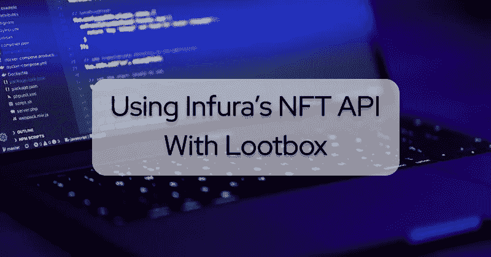
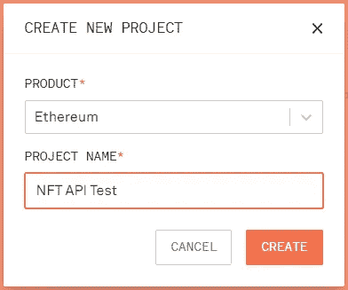
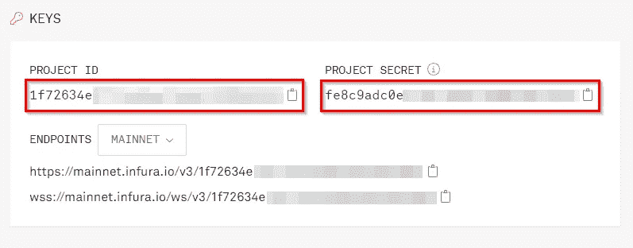
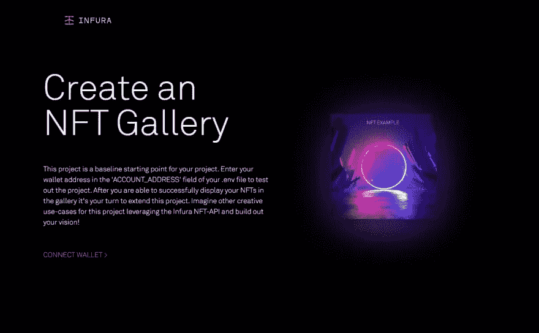
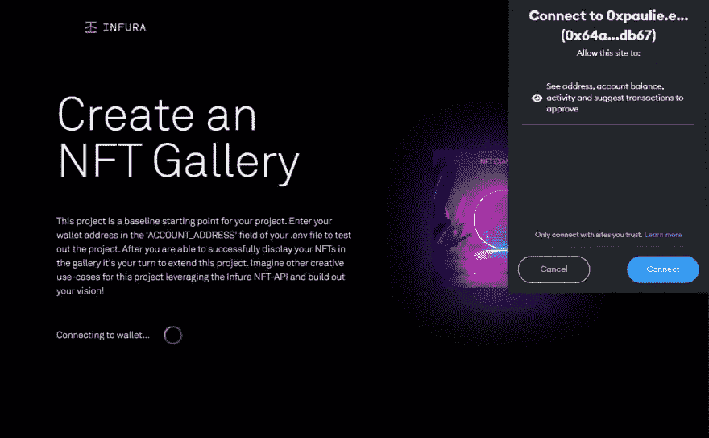
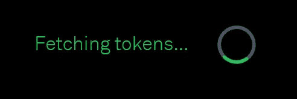
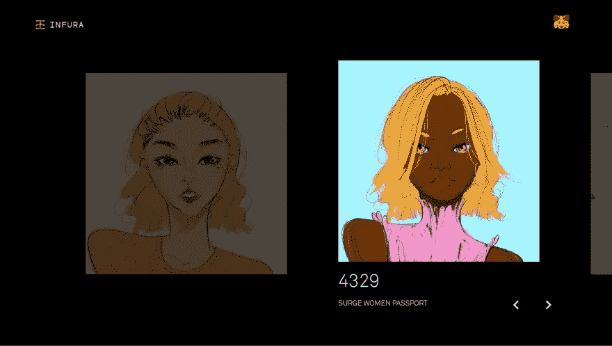

# 使用 Infura 的 NFT API 在没有智能合约的情况下构建 NFTs 并与之交互

> 原文：<https://betterprogramming.pub/build-and-interact-with-nfts-without-smart-contracts-using-infuras-nft-api-eda68de6a10d>

## 通过 Lootbox 使用 Infura 的 NFT API



# 介绍

我加入 Web3 才一年左右，但我可以诚实地说，非功能性测试对我来说是最令人兴奋的方面。然而，我说的不是猿或朋克。PFP(个人资料图片)项目和艺术，尽管对这项技术来说是很酷很简单的概念证明，但不会创造一个更好的世界。

相反，我对 NFTs 的实际效用感到兴奋。允许游戏玩家拥有他们的资产，向音乐家和艺术家提供公平的版税佣金，以及在提供甜蜜的数字纪念品的同时使音乐会门票无法出售，这些都是我觉得有趣的一些用例。

然而，构建 NFT 并与之交互并不总是最容易的事情。作为开发人员，为了给用户更好的体验，我们需要清晰的资源来有效地构建项目。

我最近听说了 Infura 的 NFT API 的私人测试版，所以我想我应该去看看，看看它如何改进我的开发工作流程。在本文中，我将探索 Infura 的 NFT API 的功能，并使用来自 Infura 的 Github 的 Lootbox NFT 样本项目进行测试。

# 什么是 NFT 空气污染指数？

根据[在 Infura 网站上的这篇博客文章](https://blog.infura.io/post/introducing-the-infura-nft-api-beta-release)，NFT API 将帮助我“加速实现价值的时间”,并允许我通过一个方便的 SDK 与任何与 NFTs 相关的东西进行交互。此外，我可以构建和验证我的 NFT，创建元数据模板并轻松地创建 NFT。所以我的第一印象是，我可以开始使用 API 端点创建 NFT 并与之交互，而不是构建智能契约并部署它们。

听起来很有用！我完全支持测试任何有助于改进我的开发过程的工具。Infura 的 NFT API 套件似乎对任何从 Web2 过渡的开发人员都有帮助，因为您可以在没有 Solidity 的情况下运行 API 端点。

现在让我们更深入地研究一下，看看这个 NFT API 能够做些什么。

# Infura NFT API 功能

快速浏览一下 Infura 网站上的 [NFT API 文档](https://docs.infura.io/infura/features/nft-sdk)，证明我的第一印象是正确的。我将能够使用 Infura 的 API 端点在我的 NFT 契约上部署和调用方法，而不必实际编写智能契约代码。这是一个巨大的时间节省！

[部署合同](https://docs.infura.io/infura/features/nft-sdk/how-to/deploy-a-contract)非常简单。我创建 JSON 格式的 NFT 元数据，[将元数据上传到另一个 Infura 项目中的 IPFS](https://docs.infura.io/infura/networks/ipfs/how-to/make-requests) ，然后创建一个简单的部署脚本并使用 node 运行它。我还必须创建一个`.env`文件来保存一些环境变量。我的部署脚本最终看起来像这样:

```
import { config as loadEnv } from 'dotenv';
import { SDK, Auth, TEMPLATES } from '@infura/sdk';loadEnv();const auth = new Auth({
      projectId: process.env.INFURA_PROJECT_ID,
      secretId: process.env.INFURA_PROJECT_SECRET,
      privateKey: process.env.WALLET_PRIVATE_KEY,
      chainId: 4,
    });const sdk = new SDK(auth);const myNFTContract = await sdk.deploy({
   template: TEMPLATES.ERC721Mintable,
   params: {
     name: 'My NFT Contract',
     symbol: 'MYNFT',
     contractURI: 'https://MY_NFT_METADATA_URL',
   },
 });
console.log(`Contract address is: ${myNFTContract.contractAddress}`);
```

然后，我用 Node 运行它。Infura 为我创建智能合约，并在后台上传到以太坊。在那之后，我只需要确保我在代码中指定的任何一个`chainId`都有一些令牌。在这种情况下，Rinkeby testnet (chainId: 4)。从这里，我可以从这个契约中[生成 NFT](https://docs.infura.io/infura/features/nft-sdk/how-to/mint-an-nft)或者收集契约元数据。

这是一个比我自己编写和部署 Solidity 代码更容易的创建 NFT 契约的方法！

NFT API 还提供了从钱包中收集 NFT 信息的方法，从一个钱包向另一个钱包传输 NFT 的方法，以及许多其他的 NFT 方法。这些包括[添加地址到 minter 列表](https://docs.infura.io/infura/features/nft-sdk/apis/javascript-api/templates/erc721mintable-methods/addminter)，[设置版税信息](https://docs.infura.io/infura/features/nft-sdk/apis/javascript-api/templates/erc721mintable-methods/setroyalties)，以及[更改合同 URI](https://docs.infura.io/infura/features/nft-sdk/apis/javascript-api/templates/erc721mintable-methods/setcontracturi) 。

总的来说，看起来 Infura 的 NFT API 确实有助于改进我的开发工作流程。将构建 NFT 和与之交互的所有必要功能打包在一个易于使用的 SDK 中非常方便！

但是关于它能做什么已经足够了，让我们看看这个 API 是如何工作的！

# Lootbox 项目

除了 NFT API，Infura 还在 Github 上发布了一个 [NFT 画廊项目来展示它的能力。我所要做的就是输入一个 Infura 项目 ID 和密码，然后将我的 MetaMask 钱包连接到 dapp 前端。然后 dapp 使用 API 获取我的所有 NFT，并在前端很好地显示。因此，为了打破这一点，我需要这个项目的以下内容:](https://github.com/INFURA/nft-api-lootbox-gallery-app)

*   一个 [Infura 账户](https://infura.io/)
*   Infura 项目 ID 和机密
*   一个包含 NFTs 的[元掩码钱包扩展](https://metamask.io/)

我们开始吧！

## 步骤 Infura 项目 ID 和密码

在启动 Lootbox 项目之前，我想收集必要的物品。所以首先，我将前往 [infura.io](https://infura.io/) ，登录并创建一个新项目。然后，我可以抓取**项目 ID** 和**项目秘密**以备后用。



## 步骤 2 —元蒙版

这一步会很快，因为我已经在浏览器中安装了扩展。然而，如果有人不理解这篇文章，请前往 [metamask.io](https://metamask.io/) 和[下载](https://metamask.io/download/)您特定浏览器的扩展。然后按照步骤创建一个新帐户。

接下来，我将登录并将帐户切换到保存我的 NFTs 的钱包地址。如果你需要一个 NFT，你可以去你最喜欢的市场买一个或者试着用 NFT API 自己创建一个😉。不管怎样，你的钱包里都需要一些 ETH。

## 步骤 3 —设置项目

随着所有准备工作的进行，我可以开始构建项目了。接下来，我将把项目 repo 克隆到我的本地机器上。我将首先导航到我要使用的文件夹，然后键入以下命令:

```
git clone [https://github.com/INFURA/nft-api-lootbox-gallery-app.git](https://github.com/INFURA/nft-api-lootbox-gallery-app.git)
```

接下来，我将把目录更改到项目文件夹中，并使用 [yarn](https://classic.yarnpkg.com/lang/en/docs/install/#windows-stable) 安装依赖项:

```
cd nft-api-lootbox-gallery-app
yarn
```

安装好所有东西后，我需要做的最后一件事是创建一个`.env`文件来存储我的环境变量和秘密。我只是复制已经存在的文件，并向其中添加我的变量。

```
cp .env .env.local
```

现在，我将打开项目，并从我最近创建的 Infura 项目中添加我的**项目 ID** 和**项目秘密**。还有一个选项，输入任何钱包的帐户地址来查看他们的 NFT，但我有我自己的，我想在 Lootbox NFT 画廊看到。

随着所有设置的完成，我终于可以运行 Lootbox 项目了。但是首先，我想浏览一下代码，看看到底发生了什么。

## 第 4 步——工具箱代码

基于 Lootbox 项目的[自述文件](https://github.com/INFURA/nft-api-lootbox-gallery-app#readme)，最重要的组件在`pages/index.tsx`、`hooks/useWallet.ts`和`pages/api/assets.ts`文件中。所以我要浏览一下，看看我是否能弄清楚这个项目是如何使用 Infura NFT API 的。

浏览完这些文件后，我可以看到`pages/index.tsx`文件包含显示项目前端的代码。如果`showGallery`状态变量为真，那么它应该显示我的 NFTs。如果为假，则应显示带有**连接钱包**按钮的欢迎文本。这个 Connect Wallet 按钮连接到`hooks/useWallet.ts`文件中的一些函数，所以接下来我将检查那里。

在`hooks/useWallet.ts`文件中，我可以看到应该抓取我的 NFTs 的函数。具体来说就是`getTokens`功能。

```
const getTokens = async (accountAddress: string) => {
    try {
      const { data } = await axios.post('/api/assets', { accountAddress });
      return data.assets;
    } catch (error) {
      setTimeout(() => {
        setErrorMessage('Error getting tokens');
      }, 2000);
      return;
    }
  };
```

这个函数似乎使用来自`/api/assets`文件的参数发出 POST 请求，并返回带有我的资产的结果。所以查看`pages/api/assets.ts`文件，我可以看到 NFT API 在哪里被使用。

```
try {
    const { data } = await axios.get(  `https://nft.api.infura.io/networks/1/accounts/${accountAddress}/assets/nfts`,
      {
        headers: {},
        auth: {
          username: `${process.env.INFURA_PROJECT_ID}`,
          password: `${process.env.INFURA_PROJECT_SECRET}`
        }
      }
    ); return res.status(200).json({
      assets: data.assets,
    });
```

这段代码调用 NFT API 的 [get 函数，使用 my `Infura Project ID`和`Project Secret`访问我的账户，并在 JSON 对象中返回我的 NFTs。沿着返回到`pages/index.tsx`文件的路径，如果`hooks/useWallet.ts`的`getTokens`函数没有超时，它将返回我的 NFTs，将`setGallery`状态变量切换到`true`，并在页面上显示我的 NFTs。](https://docs.infura.io/infura/features/nft-sdk/apis/javascript-api/sdk/getnfts)

酷！所以我已经知道它是如何工作的了，让我们看看它是如何工作的吧！

## 步骤 5 —运行 Lootbox 项目

要在本地运行项目，我只需要输入:

```
yarn dev
```

导航到 [http://localhost:3000/](http://localhost:3000/) 后，我可以看到 Lootbox 项目的一个漂亮的前端。



点击**连接钱包**会弹出我的 MetaMask 钱包来批准连接请求。



连接后，它立即开始获取我的令牌。这是我现在知道 dapp 正在使用 NFT API 的地方。



一旦获取成功，它会在一个漂亮的图库中显示我的 NFT，允许我浏览并选择每一个以更好地查看它们。整洁！



# 结论

我对 Infura NFT API 的结论是，它是一个减少我开发时间的工具，我可以用它做很多事情。从一个易于使用的 API 构建、创建 NFT 并与之交互非常方便。尽管我更熟悉用 Solidity 构建 NFT 契约，用 Truffle 部署它们，但我可以很容易地看到这将如何帮助 Web2 dev 平稳地过渡到 Web3。对于许多 Web2 开发者来说，使用 JavaScript 而不是编写智能合同将会节省大量时间。

我建议你自己试试 NFT API。它仍然处于私人测试阶段，但是任何人都可以[注册](https://infura.io/resources/apis/nft-api-beta-signup)。有关其功能的更多信息，您可以查看这个 YouTube 演示或 [Infura 文档](https://docs.infura.io/infura/features/nft-sdk)。