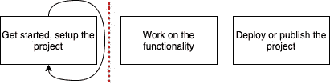
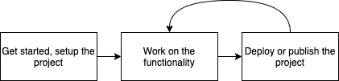

# 在几分钟内构建并发布 NPM 包

> 原文：<https://betterprogramming.pub/build-and-publish-npm-packages-in-a-few-minutes-17494a30a51f>

## 专注于 npm 软件包的功能，而不必费力进行设置或配置


由来自 [Pexels](https://www.pexels.com/photo/white-generator-set-near-industrial-machines-1468390/?utm_content=attributionCopyText&utm_medium=referral&utm_source=pexels) 的 [Markus Bürkle](https://www.pexels.com/@doozydoom?utm_content=attributionCopyText&utm_medium=referral&utm_source=pexels) 拍摄。

# 快速开始的需要

当你突然有了一个灵感来建立一个项目，或者你需要为工作建立一个项目时，通常会有一些摩擦来启动事情。您可以多花几分钟到一个小时来设置开发环境，查找一些教程，然后根据您的需要进行调整。接下来你知道，你遇到了一个问题，失去了灵感，直到你意识到你不再想继续下去。

最重要的是，即使在开发了功能之后，将项目交付给用户也需要一些重复性的工作。

这一点都不理想。你不想被困在样板代码的重复工作中。您希望通过致力于功能来专注于解决实际问题。



停留在入门阶段。

如果有方法可以让你快速开始并部署你的项目，那么你可以测试更多你的想法。谁知道呢？你的一个想法可能会成为一个有影响力的开源项目或改变生活的产品。

这将是理想的情况:



尽早完成端到端流程。处理功能，部署，然后重复。

拥有一个可以解决“入门”和“部署或发布”阶段的现成的 cookiecutter 模板可以帮助您走向成功。

# 逐步指南

在本文中，我想分享一个我用来构建和发布 npm 包的 cookiecutter 模板。

打开 IDE 和终端。我们开始吧！

## 规范

*   我已经在 npm 6.13.4 和 Node v10.19.0 上测试过了。
*   起始代码在 TypeScript 中。

## 开始— Cookiecutter

[Cookiecutter](https://cookiecutter.readthedocs.io/en/1.7.0/README.html) 是一个用于创建项目模板的 Python 命令行工具。它支持配置，允许您设置在项目中使用的值和其他方便的功能，如钩子。

*先决条件:Python 已经安装并设置好。如果还没有，参考* [*本指南*](https://cookiecutter.readthedocs.io/en/1.7.0/installation.html) *。*

要安装它，只需运行:

```
pip install cookiecutter
```

“Cookie-cut”NPM 包模板:

```
cookiecutter [git@github.com](mailto:git@github.com):ardydedase/cookiecutter-npm-package.git
```

系统将提示您输入以下值:

*   `github_username` : GitHub 用户名或您想要创建存储库的组织。
*   `project_name`:你想怎么称呼你的项目。`project_slug`的默认值将基于此。
*   `project_slug`:默认为虚线框`project_name`。这将被用作包名，所以请确保您选择的包名还没有被使用。你可以在[npmjs.com](https://www.npmjs.com/)上查看。
*   `project_short_description` : 默认情况下将在生成的项目自述文件中使用的简短描述。
*   `version`:NPM 包的版本号。

这些都有默认值，您可以在`[cookiecutter.json](https://github.com/ardydedase/cookiecutter-npm-package/blob/master/cookiecutter.json)` [文件](https://github.com/ardydedase/cookiecutter-npm-package/blob/master/cookiecutter.json)中找到，这使得测试和 [CI 构建](https://github.com/ardydedase/cookiecutter-npm-package/blob/master/.github/workflows/main.yml#L39)非常方便。它将在命令行中这样提示，其中`github_username` 的默认值将是`ardydedase`，您需要用自己的值替换它:

```
github_username [ardydedase]:
```

在 cookie-cut 之后，它将生成一个以`project_slug` 值命名的文件夹。将当前工作目录更改为生成的文件夹。

我们的 cookiecutter 生成了一个样例参考包，你可以参考 GitHub 上的[。我使用这个](https://github.com/ardydedase/reference-package)[一步一步的指南](https://itnext.io/step-by-step-building-and-publishing-an-npm-typescript-package-44fe7164964c)来构建这个包，并根据我自己的喜好做了一些调整。

```
cd *<replace with your project_slug>*
```

现在我们有了 npm 包的起始代码，让我们开始开发吧。

## 开发—国家预防机制包

这将涵盖我们需要运行的命令，以启动并运行我们的项目。如果您以前做过一些 Node.js 开发，这一部分应该很容易。

安装 npm 依赖项:

```
npm install
```

运行我们的构建。这将在`dist`文件夹中生成带有类型定义的编译代码:

```
npm run build
```

格式和林挺:

```
npm run lint
npm run format
```

运行测试:

```
npm test
```

在这个阶段，您可以在`src`文件夹中的 starter 示例之上开始构建您的域功能，这是一个返回 GitHub repos 列表的简单函数。或者，您可以将软件包的初始版本发布到 npmjs.com。

## 发布您的 npm 包

如果您没有 npm 帐户，[创建一个](https://www.npmjs.com/signup)或运行命令`npm adduser`。

如果您已经有一个帐户，请通过运行以下命令登录，并输入您的登录详细信息:

```
npm login
```

成功登录后，发布包:

```
npm publish
```

你现在应该可以`npm install`你发布的包了。有一个名为[的 npm 包引用包](https://www.npmjs.com/package/reference-package)就是从这个 cookiecutter 生成的。 [example/index.js](https://github.com/ardydedase/cookiecutter-npm-package/blob/master/example/index.js) 上有一个使用示例。

# 下一步是什么

你可以在 GitHub 上了解更多关于这个 cookiecutter 模板[的信息。](https://github.com/ardydedase/cookiecutter-npm-package)