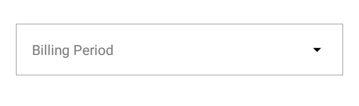
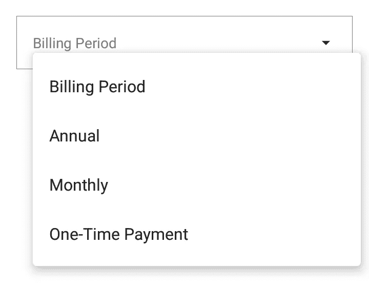
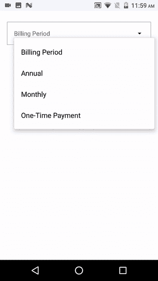

# 在 Jetpack Compose 中构建 Android 下拉菜单

> 原文：<https://betterprogramming.pub/build-android-dropdownmenu-in-jetpack-compose-25512fe08068>

## 创建弹出窗口变得简单多了


克里斯汀·休姆在 [Unsplash](https://unsplash.com?utm_source=medium&utm_medium=referral) 上拍摄的照片

在本文中，我们将学习如何在 Jetpack compose 中构建下拉菜单。我们将构建一个可重用的通用可组合组件。我们将要构建的类似于传统的下拉菜单。

# 介绍

Jetpack Compose 是谷歌最近试图让 Android 开发者轻松构建 UI 的尝试之一。

> *“Jetpack Compose 是一个用于构建原生 Android UI 的现代工具包。Jetpack Compose 以更少的代码、强大的工具和直观的 Kotlin APIs 简化并加速了 Android 上的 UI 开发。”—* [*安卓开发者*](https://developer.android.com/jetpack/compose/tutorial)

Jetpack Compose 的稳定版本 1.0 最近发布，这意味着它的生产就绪。因此，这将是学习如何使用下一代 UI 套件进行 Android 开发的大好时机。

您需要安装 Android Studio —北极狐(2020.3.1) 版本才能使用 Jetpack Compose。

# 先决条件

在进一步学习之前，您必须具备如何使用 Jetpack Compose 的基本知识。如果你是作曲新手，我强烈推荐阅读以下文章:

*   " [Jetpack 构成组件(第 1 部分)](/jetpack-compose-components-part-1-a80717dbfb59)"
*   [“探索 Jetpack Compose 中的 Android 底部表单”](/explore-android-bottom-sheets-in-jetpack-compose-50eff0257231)
*   "[在 JetPack Compose 中构建 Android 布局](/build-android-layouts-in-jetpack-compose-bda2e0837f5e)"
*   [“使用 Jetpack 撰写的 Android 底部导航栏”](/android-bottom-navigation-bar-with-jetpack-compose-8c2aa02b933d)

# 创建下拉视图

首先，我们需要创建一个下拉视图，并测试显示占位符或选定的项目，然后在右端创建一个下拉图标，帮助用户将其识别为下拉视图。看一下代码:

首先，我用`Box` compose 函数画了一个矩形边框。在它里面，我们用`16.dp`填充了`*ConstraintLayout*` *，使它看起来更有吸引力*。*实际的设计现在从分别代表选中文本或占位符文本和下拉图标的`*Text*`和`*Icon*` 组件开始。看一下代码:*



# 菜单参数组合的思考

在 compose 中，UI 用一种叫做`recomposition` 的理论进行更新——通过调用带有不同参数的同一个可组合函数来更新 UI。在 Compose 中，数据沿着从主可组合组件到内部小部件`composables`的线路向下流动，而事件沿着相反的方向流动。

这使得`recomposition`工作完美，因为当事件发生时，数据得到更新，这导致`recomposition`具有新数据。这正是我们的`ComposeMenu`将要工作的方式。

ComposeMenu 函数接受一组输入。看一下代码:

```
@Composable
**fun** Menu(
    menuItems: List<String>,
    menuExpandedState: Boolean,
    seletedIndex : Int,
    updateMenuExpandStatus : () -> Unit,
    onDismissMenuView : () -> Unit,
    onMenuItemclick : (Int) -> Unit,
) {
```

*   menuItems —表示要在菜单中显示的列表。
*   menuExpandedState —表示菜单是否已展开并在用户界面中可见。
*   seletedIndex —表示列表中当前选定的索引；它用于显示占位符中的活动元素。
*   updateMenuExpandStatus —一个简单的 Kotlin 函数，用于将`menuExpandedState`更改为 true，从而通过重新组合显示`ComposeMenu`。
*   onDismissMenuView —当用户请求关闭菜单时调用。
*   onMenuItemclick 以所选索引作为参数的最终 Kotlin 函数。当我们将选中的索引传递给这个函数时，`seletedIndex`参数会得到更新，这又会导致重新组合以在占位符中显示选中的项。

# 设计下拉菜单

这里我们使用了`DropdownMenu`可组合函数。一个`DropdownMenu`的行为类似于一个弹出菜单，它将使用父布局的位置在屏幕上定位自己。在里面，我们将使用`DropdownMenuItem`来设计菜单中的每个项目。看一下代码:

看一下输出:



# 将事情整合在一起

现在我们需要将占位符和`DropdownMenu`添加到单个可组合函数中，以对每个可组合函数上的更改做出反应。看一下代码:

现在我们需要从实际的 compose 函数中调用`ComposeMenu`函数来显示它。看一下代码:

现在只要从你的活动中触发它。代码如下:

看看最终的输出:



# 结论

目前就这些。希望你学到了有用的东西。快乐作曲！

感谢阅读。