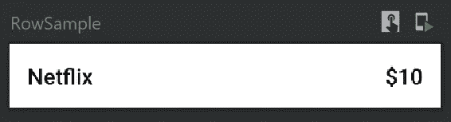
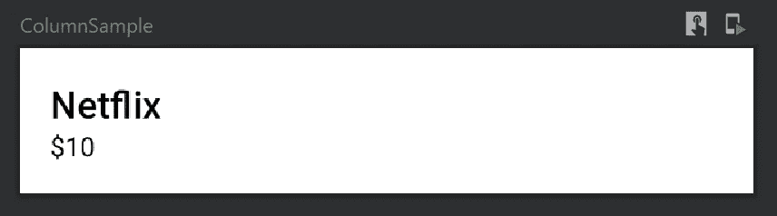
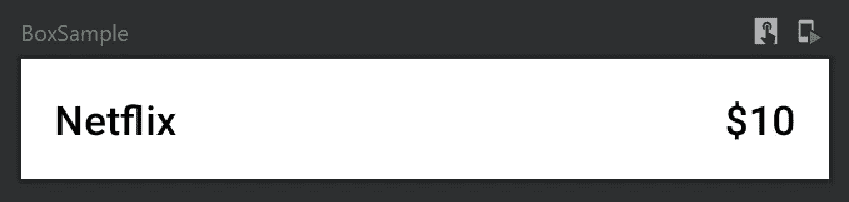
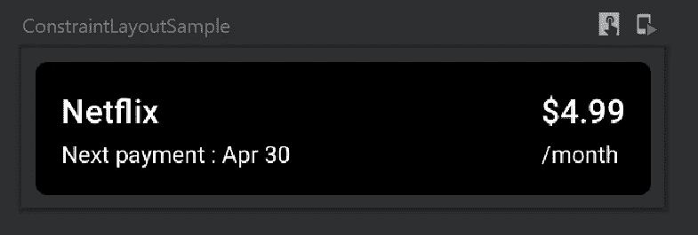

# 在 JetPack Compose 中构建 Android 布局

> 原文：<https://betterprogramming.pub/build-android-layouts-in-jetpack-compose-bda2e0837f5e>

## 行、列、框和约束布局

[HalGatewood.com](https://unsplash.com/@halacious?utm_source=medium&utm_medium=referral)在 [Unsplash](https://unsplash.com?utm_source=medium&utm_medium=referral) 上的照片

你将在 [Jetpack Compose](https://developer.android.com/jetpack/compose) 中学习关于布局的一切，从基础到高级概念。在本文的过程中，您将了解每种布局，并通过实时示例直接复制粘贴到您的 Compose 项目中，以获得实践经验。

**注意:** Jetpack Compose 最近移到了测试版。这意味着 API 结构将不再有任何剧烈的变化。因此，这将是学习如何使用这个下一代 UI 套件进行 Android 开发的大好时机。布局是 UI 的基本组成部分，所以请欣赏这篇文章。

您需要安装 Android Studio Canary，北极狐(2020.3.1) 版本才能使用 Jetpack Compose beta。

# 介绍

布局是设计用户界面的基础。在传统的 Android 开发中，我们有`RelativeLayout`、`LinearLayout`、`FrameLayout`、`ConstraintLayout`等。同样，Jetpack Compose 目前提供四种类型的布局:

1.  `Row`
2.  `Column`
3.  `Box`
4.  `ConstraintLayout`

每种布局都有自己的重要性，我们将在本文的后续部分详细了解每种类型。随着 Compose 的快速发展，将来可能会有新的布局。但是现在，这些是现有的，我们可以用它们构建简单到复杂的布局。

如果您是 Jetpack Compose 的新手，从布局开始是一件好事。话虽如此，没有任何进一步的拖延，让我们开始吧。

# 修饰语

在您了解布局之前，首先您应该了解 Jetpack Compose 中的`Modifier`。顾名思义，`Modifier`是一种修改组件某些方面的方法，这些方面决定了布局在屏幕上的显示方式。

`Modifier`的酷之处在于，我们可以使用一个单独的`Modifier`来装饰每个组件，或者我们可以链接一个单独的`Modifier`来应用于多个组件，这开辟了像相对于其父组件对齐视图这样的可能性。

要了解有关 modifier 的更多信息，请阅读以下文章:

 [## Jetpack 组件(第 3 部分)

### 关于修改器你需要知道的一切

better 编程. pub](/jetpack-compose-components-part-3-ce5ae661f3d6) 

# 排

`Row`用于在屏幕上水平放置组件。`Row`是一个可组合的内联函数，有四个参数:`Modifier`、`horizontalArrangement`、`verticalAlignment`和`content`、*。*除了`content`外，其他所有参数都是可选的。看看`Row`功能:

*   `horizontalArrangement`:指定其子节点的水平对齐方式
*   `verticalAlignment`:指定其子节点的垂直对齐方式
*   `content`:在`Row`范围内显示的可组合函数

默认情况下，由于默认值的原因，对齐方式是行范围的左上角。我们可以根据我们的要求使用`horizontalArrangement`和`verticalAlignment`来改变它。

## 使用

为了理解如何使用`Row`，让我们举一个简单的例子，我们需要在视图的左侧显示订阅名称(网飞),在右侧显示金额(10 美元)。首先，看一下代码:

如果你仔细观察代码，你可能会发现它类似于使用`LinearLayout`的水平方向和重量概念。

在上面这段代码中，首先我们从一个行范围和定义的文本可组合函数开始，以表示名称和数量。`fillMaxWidth` 用于在行上扩大行到屏幕宽度。

接下来是我们使用的文本组件:

*   `textAlign`是定义文本对齐方式的参数。对于名字来说是左，对于金额来说是右。
*   `Modifier`起着关键作用，因为它定义了行内子项的权重。

看一下输出:

行示例

# 圆柱

`Column`用于将组件垂直放置在屏幕上。`Column`是一个可组合的内联函数，有四个参数:`Modifier`、`verticalArrangement`、`horizontalAlignment`和`content`。除了`content`之外，其他所有参数都是可选的。看看`Column`的功能:

*   `verticalArrangement`:指定其子节点的垂直对齐方式
*   `horizontalAlignment`:指定其子节点的水平对齐方式
*   `content`:显示在`Column`范围内的可组合函数

默认情况下，由于默认值的原因，对齐方式是到列范围的左上角。我们可以根据需要使用`verticalArrangement`和`horizontalAlignment`来改变它。

## 使用

为了理解如何使用`Column`，让我们举一个简单的例子，我们需要在名称的底部显示一个订阅名称(网飞)和金额(10 美元)。首先看一下代码:

如果您仔细观察代码，您可能会发现它类似于使用`LinearLayout`的垂直方向和权重概念。

在上面这段代码中，首先我们从一个列范围和定义的文本可组合函数开始，以表示名称和数量。`fillMaxWidth` 用于在列上扩大列到屏幕宽度。然后声明两个简单的文本组合函数。看一下输出:

# 箱子

`Box`里的孩子会互相堆叠。我们必须使用对齐修饰符来指定应该在哪里绘制可组合的内容。这类似于相对布局。当没有为孩子提供关系时，他们会相互堆叠。看看`Box`的功能:

*   `contentAlignment`:默认对齐在`Box`内
*   `propagateMinConstraints` :输入的最小约束是否应传递给`content`
*   `content`:在`Box`范围内显示的可组合函数

## 使用

为了理解如何使用`Box`，让我们举一个简单的例子，我们需要在左上角显示一个订阅名称(网飞),在右端显示一个金额(10 美元),就像我们使用`Row`一样。首先，看一下代码:

在上面这段代码中，首先我们从一个 box 作用域和定义的文本可组合函数开始，以表示名称和数量。`fillMaxWidth` 用于在方框上将其扩展到屏幕宽度。然后声明两个简单的文本组合函数。看一下输出:

文本可组合函数重叠了，因为我们没有提到任何对齐。当使用没有任何关系或框架布局的相对布局时，在传统开发中也会出现这种情况。现在我们需要使用`Modifier`为文本组件定义对齐。看一看:

这里我们使用了`align`修饰符来对齐可组合的组件。这类似于传统开发中的重力。看一下输出:

# 约束布局

一般来说，`ConstraintLayout`被用来设计一个复杂的平面布局，以便优化视图渲染。到目前为止，我们已经使用`Column`、`Row`和`Box`来设计基本布局。但是当涉及到视图之间有严格约束的复杂 UI 时，我们应该选择使用`ConstraintLayout`。

在继续之前，我们应该知道三件事:

1.  `createRefs`:用于为`ConstraintLayout`中的每个可组合组件创建引用。
2.  `constrainAs`:我们将在这里为`ConstraintLayout`中的单个可组合函数定义约束。
3.  `linkTo`:我们将这样定义约束。

## 使用

为了更好地理解`ConstraintLayout`，我们将构建一个有点复杂的基于约束的 UI。该示例基本上有四个可组合的文本函数，分别表示订阅名称、数量、每月状态和下一个账单日期。名称和下一个账单状态文本将显示在左侧，并堆叠在一列中。金额和每月状态将显示在右侧，并堆叠在一列中。看一下代码:

从高层次的角度来看，上面的代码被嵌入到一个 card composable 中，这个 card composable 只不过是一个 card 视图。然后是一个`ConstraintLayout`，它有两列，分别显示名称和下一个账单状态、金额和每月状态。使用`linkTo`功能约束这两列。这里我们使用了`createRefs`来表示我们可以使用`constrainAs`的两列。

看一下输出:

目前就这些。希望你学到了有用的东西。感谢阅读。